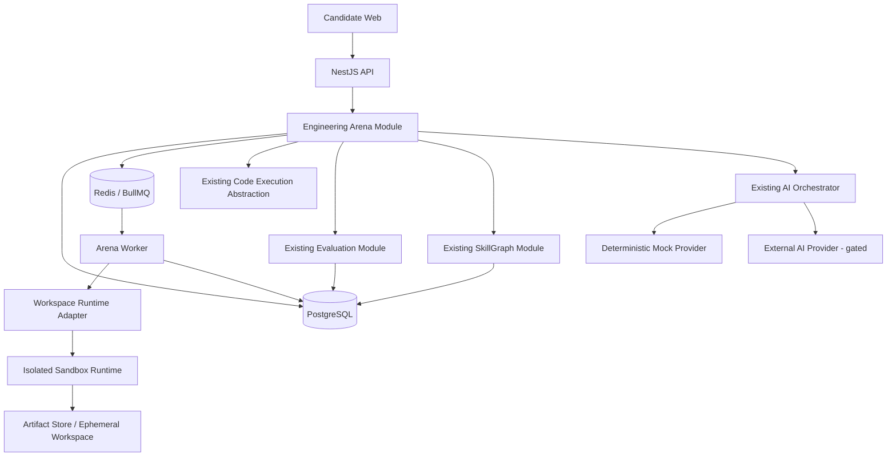
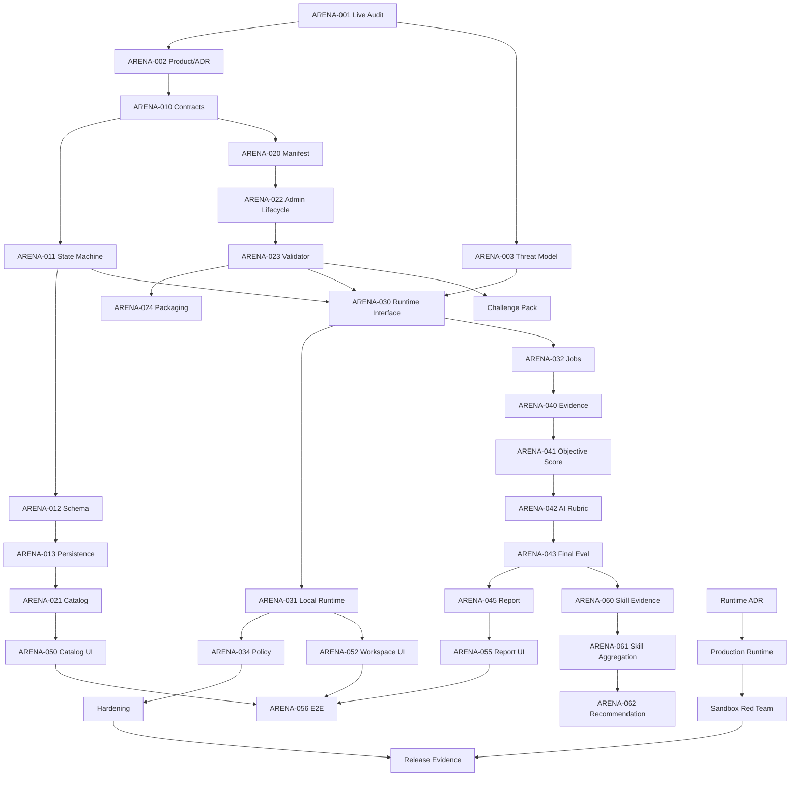

# AnyF Engineering Arena — Master Implementation Plan

> **Document type:** Executable product + architecture + delivery plan for AI coding agents  
> **Project:** AnyF / AI Interview Practice  
> **Feature/program name:** AnyF Engineering Arena  
> **Version:** 1.0  
> **Prepared:** 2026-08-28  
> **Official repository:** `https://github.com/DuongVinh2004/ai-interview-practice.git`  
> **Live `main` observed during planning:** `553080bd952041a29251d73b1a9591acf559dede` (must be re-verified before implementation)  
> **Primary delivery model:** ChatGPT/Codex Control Plane → bounded Antigravity/AI executor → independent verification → local commit gate  
> **Audience:** AI agents, technical lead, reviewers, security reviewers, QA, future contributors  
> **Language:** English technical terminology with Vietnamese operating guidance where useful

---

## 0. How to use this document

This file is intentionally written as an **agent-executable master plan**, not as a loose feature brainstorm.

The implementation agent MUST NOT attempt to implement the whole program in one uncontrolled run. The program is decomposed into bounded tasks with explicit dependencies, risk classes, acceptance criteria, verification requirements and stop conditions.

### 0.1 Required operating contract

Before any implementation task, the Control Plane and executor MUST read and follow the repository/project governance already defined by:

- `AGENTS.md`
- `ai-it-interview-project-kit/00-start-here/PROJECT-CHARTER.md`
- `ai-it-interview-project-kit/00-start-here/REPOSITORY-BASELINE.md`
- `ai-it-interview-project-kit/00-start-here/DECISION-REGISTER.md`
- `ai-it-interview-project-kit/16-codex/CHAT-BOOTSTRAP.md`
- `ai-it-interview-project-kit/16-codex/SUPERVISOR-PROTOCOL.md`
- `ai-it-interview-project-kit/16-codex/IMPLEMENTATION-ORDER.md`
- `ai-it-interview-project-kit/16-codex/state/CURRENT-STATE.yaml`

The live repository is the evidence source for current implementation state. This document is the approved target-state plan for Engineering Arena once adopted. If this document conflicts with an explicit existing decision record, the decision record wins until the conflict is formally resolved.

### 0.2 Non-negotiable agent behavior

For every task:

1. Re-verify official remote, branch, HEAD and working tree.
2. Select **exactly one task ID** from this plan.
3. Confirm task dependencies using live code, not memory.
4. Classify the task `S`, `M` or `H` risk.
5. Read only the repository files needed for that task plus required governance files.
6. Create/use one short-lived task branch; never edit `main` directly.
7. Implement only the defined scope.
8. Add/update tests as part of the same outcome.
9. Run the task-specific verification matrix.
10. Inspect the final diff for scope creep, test weakening, secret leakage and unrelated formatting churn.
11. Return a reproducible handoff.
12. Do **not** commit unless the Control Plane separately authorizes `MODE: COMMIT`.
13. Never push, open/merge PRs, deploy, mutate cloud resources, call a real paid AI provider or alter production data unless separately authorized.

The executor is forbidden from weakening assertions, disabling tests, using `.skip`/`.only`, broadening timeouts without root-cause evidence, hiding errors, or changing acceptance criteria merely to obtain PASS.

---

# 1. Executive summary

## 1.1 Product concept

**AnyF Engineering Arena** is a realistic software-engineering practice environment where a learner receives a repository-shaped engineering problem rather than a single theoretical question.

The learner may need to:

- inspect an unfamiliar codebase;
- reproduce a bug;
- analyze logs/test failures;
- identify root cause;
- modify code;
- add or improve tests;
- execute visible and hidden verification;
- explain trade-offs;
- optionally collaborate with an AI coding assistant;
- prove that the final change works and does not introduce regressions.

AnyF then produces an **evidence-backed engineering report** and updates the learner's Skill Graph.

The primary product statement is:

> **AnyF Engineering Arena measures how a learner solves realistic software-engineering problems, not merely whether they can recall interview answers or produce plausible code.**

## 1.2 Why this is a strong fit for the current AnyF platform

The live project already reports the following implemented capabilities that materially reduce Engineering Arena cost and risk:

- NestJS 11 modular monolith;
- React + TypeScript web application;
- PostgreSQL/Prisma;
- Redis + BullMQ;
- AI provider abstraction and deterministic mock provider;
- AI evaluation and prompt versioning;
- Monaco-based coding UI;
- Judge0 code-execution provider with timeout/language validation;
- Skill Graph;
- System Design module;
- observability with Prometheus/OpenTelemetry/Grafana;
- security scanning and CI;
- ownership, session, idempotency and concurrency hardening.

Therefore, Engineering Arena SHOULD be implemented as a **new bounded context/orchestration layer that reuses existing primitives**, not as a replacement for existing interview, code-execution, SkillGraph or evaluation features.

## 1.3 Program outcome

At completion, a user can:

1. choose an engineering challenge;
2. read a realistic incident/feature brief;
3. receive an isolated versioned challenge workspace;
4. inspect/edit code and run permitted commands;
5. receive objective execution/test evidence;
6. submit a final patch and explanation;
7. receive a structured report showing correctness, diagnosis, testing discipline, reasoning, security/reliability awareness and verification quality;
8. see evidence for every important score;
9. have applicable Skill Graph nodes updated;
10. receive a recommended next challenge based on observed gaps.

---

# 2. Product boundary and ethics

## 2.1 In scope

Engineering Arena is a **learning and practice feature** for individual candidates.

MVP scope includes:

- curated challenge library;
- repository-style challenge packages;
- challenge versioning;
- challenge session state machine;
- isolated execution of trusted challenge commands against untrusted candidate changes;
- visible and hidden tests;
- evidence/event capture;
- objective scoring components;
- rubric-based AI evaluation for non-deterministic dimensions;
- evidence-backed report;
- SkillGraph integration;
- adaptive next-challenge recommendation;
- developer/admin challenge validation tooling;
- local/dev deterministic execution path;
- production-safety gates for any remote untrusted-code execution.

## 2.2 Explicitly out of scope for MVP

The following MUST NOT silently enter scope:

- automatic hiring/rejection decisions;
- employer ranking of real applicants;
- emotional-state inference;
- personality inference from interaction behavior;
- cheating or lie detection;
- webcam analysis;
- voice-based confidence scoring;
- biometric inference;
- unrestricted internet access from candidate workspaces;
- candidate access to production data/secrets;
- arbitrary Docker socket access;
- Kubernetes control-plane access;
- running candidate code directly on the AnyF API host;
- autonomous AI agent with unrestricted write/execute permissions;
- multi-user real-time pair programming;
- persistent cloud IDE as a hard dependency for first MVP;
- automatic generation and publication of challenges without validation;
- B2B assessment or certification claims.

Any future B2B usage requires a separate product/ethics decision because the existing charter defines AnyF as a learning platform, not a hiring-decision system.

## 2.3 AI authority boundary

The AI model MAY:

- summarize observed actions;
- map evidence to a versioned rubric;
- evaluate explanation quality;
- identify plausible reasoning quality;
- generate Socratic follow-up questions;
- generate educational feedback;
- recommend learning resources/next challenge;
- propose candidate challenge drafts for human/admin review.

The AI model MUST NOT be the sole authority for:

- whether code compiles;
- whether hidden tests pass;
- whether a security regression is present when deterministic tests/scanners can establish it;
- whether required files were modified;
- whether the final patch matches the submitted artifact;
- whether a candidate used prohibited network/filesystem capabilities;
- final score caps associated with critical objective failures.

The system MUST preserve the principle:

> **Objective evidence first; AI interpretation second.**

---

# 3. Standards and quality alignment

Engineering Arena should be engineered against recognizable international practices rather than ad-hoc quality claims.

## 3.1 Required alignment targets

### Software quality

Use **ISO/IEC 25010:2023** as the quality-model reference, particularly:

- functional suitability;
- performance efficiency;
- compatibility;
- interaction capability/usability;
- reliability;
- security;
- maintainability;
- flexibility;
- safety.

### Secure SDLC

Use **NIST SP 800-218 SSDF v1.1** as the secure-development reference for:

- preparing the organization;
- protecting software;
- producing well-secured software;
- responding to vulnerabilities.

### Application security verification

Use **OWASP ASVS 5.0.0** as the application-security verification baseline, selecting requirements applicable to authentication, authorization, API security, validation, files, data protection, logging and error handling.

### GenAI security

Use the **current OWASP GenAI/LLM Top 10** at implementation time. As of this plan, OWASP has published the 2026 GenAI LLM Top 10. At minimum, Engineering Arena threat modeling MUST address:

- prompt injection;
- sensitive information disclosure;
- supply-chain risks;
- poisoning/untrusted content;
- excessive agency;
- insecure output handling/action execution;
- unbounded consumption/cost abuse.

### AI risk management

Use **NIST AI RMF 1.0** plus **NIST AI 600-1 Generative AI Profile** as the governance/evaluation reference until the project formally adopts a successor.

### Accessibility

Web UI MUST target **WCAG 2.2 AA**.

### Observability

Use existing OpenTelemetry practices and preserve trace/context propagation across API → worker → execution provider → evaluation pipeline.

## 3.2 Evidence requirement

The project MUST NOT claim compliance/certification simply because this plan references standards. Instead, task/release evidence should map implemented controls/tests to the relevant standard requirement where useful.

---

# 4. North-star outcomes and success metrics

## 4.1 User outcome metrics

Target after MVP stabilization:

| Metric                                                   | Initial target |
| -------------------------------------------------------- | -------------: |
| Challenge start → valid submission completion            |          ≥ 60% |
| Users who open evidence/report after submission          |          ≥ 80% |
| Users who attempt recommended next challenge             |          ≥ 25% |
| Completed challenge with reproducible objective score    |           100% |
| Reports with evidence attached to every scored dimension |           100% |
| Challenge versions with validator PASS before activation |           100% |

Do not optimize completion rate by making challenges artificially easy.

## 4.2 Evaluation quality metrics

| Metric                                                     |                                        Target |
| ---------------------------------------------------------- | --------------------------------------------: |
| Deterministic correctness reproducibility                  |        100% for same pinned challenge/runtime |
| Final result schema validity                               |                                          100% |
| Hidden-test nondisclosure                                  |                                          100% |
| Critical security regression incorrectly scored as success |                                 0 known cases |
| AI rubric regression gate                                  | no material regression vs approved golden set |
| Evidence-to-score traceability                             |                     100% of scored dimensions |
| Evaluation retry idempotency                               |                                          100% |

## 4.3 Reliability/performance targets

MVP local/staging targets:

| Area                                         |                                                                   Target |
| -------------------------------------------- | -----------------------------------------------------------------------: |
| Challenge metadata GET p95                   |                                 < 300 ms excluding cold external storage |
| Session creation API p95                     |                                < 500 ms excluding workspace provisioning |
| Workspace provisioning p95                   |                                 < 10 s for prebuilt local/staging images |
| Test-run queue acknowledgement p95           |                                                                 < 500 ms |
| Visible test result delivery                 |                             p95 < 10 s for standard challenge test suite |
| Evaluation completion after final submission | p95 < 30 s with mock provider; provider-specific SLO separately measured |
| Orphan workspace cleanup                     |                            100% eventually cleaned within configured TTL |

Production targets MUST be calibrated from load tests before release; do not blindly inherit speculative 1,000-concurrent-execution claims from older documents.

---

# 5. Core design principles

1. **Do not rebuild capabilities that already exist.** Reuse CodeExecution, Evaluation, SkillGraph, AI Orchestrator, auth/ownership, BullMQ, observability and shared contracts.
2. **Modular monolith first.** Engineering Arena orchestration remains in `apps/api` unless evidence justifies extraction.
3. **Execution isolation is a security boundary.** Untrusted code execution must never share the API process trust boundary.
4. **Challenge definition is versioned and immutable after activation.** Editing a challenge creates a new version.
5. **Every final score is evidence-backed.** The report must point to test outcomes, artifacts, events or rubric evidence.
6. **Deterministic evidence dominates AI opinion.** AI cannot overrule objective failure caps.
7. **No surveillance theater.** Do not infer competence merely from keystroke speed, hesitation, window switching or other weak behavioral proxies.
8. **Reproducibility over novelty.** Pin challenge source, runtime image, toolchain, test suite and evaluator/rubric versions.
9. **Least privilege.** Workspace, AI tools and APIs receive only capabilities required for the challenge.
10. **Fail closed for security-sensitive execution.** If isolation policy cannot be established, remote execution must refuse to start.
11. **Recoverable asynchronous flows.** Provisioning, execution and evaluation are idempotent and resumable.
12. **No hidden scope expansion.** Browser IDE, Firecracker, B2B and agent autonomy are rollout stages, not prerequisites for the first vertical slice.

---

# 6. Recommended architecture

## 6.1 High-level architecture



## 6.2 Module placement

Add a new bounded context:

```text
apps/api/src/modules/engineering-arena/
```

Suggested internal structure:

```text
engineering-arena/
├── engineering-arena.module.ts
├── controllers/
│   ├── arena-challenge.controller.ts
│   ├── arena-session.controller.ts
│   ├── arena-run.controller.ts
│   ├── arena-submission.controller.ts
│   └── arena-admin.controller.ts
├── application/
│   ├── challenge-catalog.service.ts
│   ├── arena-session.service.ts
│   ├── workspace-orchestrator.service.ts
│   ├── evidence-recorder.service.ts
│   ├── arena-evaluation.service.ts
│   ├── arena-report.service.ts
│   ├── challenge-validator.service.ts
│   └── next-challenge.service.ts
├── domain/
│   ├── challenge-manifest.ts
│   ├── arena-session-state.ts
│   ├── evidence-types.ts
│   ├── score-policy.ts
│   └── invariants.ts
├── infrastructure/
│   ├── workspace-runtime/
│   │   ├── workspace-runtime.interface.ts
│   │   ├── local-workspace-runtime.ts
│   │   └── isolated-workspace-runtime.ts
│   ├── artifact-store/
│   ├── queues/
│   └── repositories/
├── dto/
├── policies/
├── prompts/
└── __tests__/
```

`packages/contracts` should contain public shared schemas/types only; it must not become a business-logic dumping ground.

## 6.3 Runtime decomposition decision

### MVP

Keep:

- API orchestration inside NestJS modular monolith;
- BullMQ worker as existing separate runtime process;
- challenge runtime behind an adapter;
- deterministic/local workspace runtime available for CI;
- remote untrusted execution disabled unless isolation gate passes.

### Extract only when justified

A dedicated `arena-runner` service may be extracted later if one or more are evidenced:

- execution workloads require independent horizontal scaling;
- security isolation is materially improved by a separate network/account boundary;
- release cadence differs from main API;
- worker saturation impacts interview workloads;
- specialized compute/image pools are required.

Do not create microservices merely for architectural appearance.

---

# 7. Challenge domain model

## 7.1 Challenge taxonomy

Initial challenge categories:

```text
BUG_FIX
DEBUGGING
PERFORMANCE
SECURITY
FEATURE_CHANGE
REFACTORING
RELIABILITY
TESTING
DEVOPS
DATA_CONSISTENCY
```

Initial technical domains:

```text
BACKEND
FRONTEND
DATABASE
DEVOPS
SECURITY
DISTRIBUTED_SYSTEMS
TESTING
```

Initial difficulty:

```text
FOUNDATIONAL
JUNIOR
JUNIOR_PLUS
MID
ADVANCED
```

Do not infer seniority from completion time alone.

## 7.2 Challenge lifecycle

```text
DRAFT
  ↓
VALIDATING
  ↓
READY_FOR_REVIEW
  ↓
ACTIVE
  ↓
DEPRECATED
  ↓
RETIRED
```

Rules:

- only `ACTIVE` versions can create normal user sessions;
- activated versions are immutable;
- material edits create a new version;
- `DEPRECATED` versions remain reproducible for historical sessions;
- hidden test artifacts never appear in candidate-readable APIs;
- runtime image digest is pinned per version;
- rubric and score-policy version are pinned per version.

## 7.3 Challenge manifest

Each version requires a machine-validated manifest.

Recommended conceptual format:

```yaml
schemaVersion: 1
id: arena-backend-race-001
version: 1.0.0
title: Prevent duplicate purchase under concurrency
category: DATA_CONSISTENCY
domain: BACKEND
difficulty: JUNIOR_PLUS
estimatedMinutes: 45

brief:
  summary: >
    During flash-sale traffic, inventory can be oversold.
  userVisibleSymptoms:
    - 'Occasional duplicate successful purchase when stock is nearly exhausted'
  constraints:
    - 'Do not change the public API contract'
    - 'Preserve existing authorization behavior'
    - 'Add regression coverage'

workspace:
  sourceRef: 'challenge-repo@<immutable-sha>'
  runtimeImage: 'ghcr.io/anyf/arena-node-postgres@sha256:<digest>'
  workingDirectory: '/workspace'
  networkPolicy: 'DENY_ALL'
  cpuLimit: '1'
  memoryMb: 512
  pidsLimit: 128
  diskMb: 512
  sessionTtlMinutes: 90

commands:
  allowed:
    - id: unit
      argv: ['pnpm', 'test', '--', '--runInBand']
    - id: lint
      argv: ['pnpm', 'lint']
  forbiddenPatterns:
    - 'docker'
    - 'kubectl'

verification:
  visibleSuites:
    - id: existing-unit
      commandId: unit
  hiddenSuites:
    - id: concurrent-purchase
      runnerRef: 'hidden-tests/concurrent-purchase@<sha>'
  requiredChecks:
    - compile
    - visible-tests
    - hidden-tests

scorePolicy:
  id: 'engineering-default-v1'
  weights:
    correctness: 35
    diagnosis: 20
    testing: 15
    reasoning: 15
    securityReliability: 10
    communication: 5
  caps:
    hiddenCriticalFailure: 59
    securityRegression: 49

skills:
  - key: 'database.transactions'
    weight: 0.35
  - key: 'backend.concurrency'
    weight: 0.35
  - key: 'testing.regression'
    weight: 0.30

ai:
  allowed: true
  evaluationRubricVersion: 'arena-rubric-v1'
  feedbackPromptVersion: 'arena-feedback-v1'
```

The actual implementation may use JSON/Zod rather than YAML, but semantics must remain explicit and versioned.

## 7.4 Challenge validation requirements

Before activation, validator MUST prove:

- manifest schema valid;
- source reference immutable/resolvable;
- runtime image pinned by digest;
- visible tests start from expected baseline state;
- intended defect is reproducible;
- canonical/reference solution passes all checks;
- hidden tests fail on the intentionally broken baseline where applicable;
- hidden tests pass on reference fix;
- scoring policy totals correctly;
- required SkillGraph keys exist;
- no secrets exist in challenge files;
- no production endpoints/credentials are referenced;
- challenge does not require internet unless explicitly approved;
- candidate-visible archive excludes hidden tests/solutions;
- cleanup succeeds;
- challenge run is deterministic within documented tolerance.

Activation is forbidden if any MUST validation fails.

---

# 8. Arena session lifecycle

## 8.1 Session state machine

```text
CREATED
   ↓
PROVISIONING
   ↓
READY
   ↓
ACTIVE
   ↓
SUBMITTING
   ↓
EVALUATING
   ↓
COMPLETED

Terminal/exception states:
CANCELLED
FAILED
EXPIRED
```

Allowed transitions MUST be centrally defined and unit-tested.

### Transition rules

- `CREATED → PROVISIONING`: after ownership/quota/challenge validation.
- `PROVISIONING → READY`: only after workspace runtime returns a verified workspace handle.
- `READY → ACTIVE`: explicit user start or first permitted interaction.
- `ACTIVE → SUBMITTING`: final submission command with idempotency key.
- `SUBMITTING → EVALUATING`: final artifact snapshot persisted and final test execution accepted.
- `EVALUATING → COMPLETED`: objective and rubric evaluation persisted atomically/recoverably.
- any nonterminal state → `CANCELLED`: user cancellation if safe.
- any temporary operational fault → retry where idempotent; otherwise `FAILED` with recoverable reason.
- active session exceeding TTL → `EXPIRED`, followed by workspace cleanup.

No worker may resurrect `CANCELLED`, `EXPIRED` or `COMPLETED` sessions.

## 8.2 Idempotency

Idempotency is required for:

- session creation when client retries;
- workspace provisioning jobs;
- command execution request submission;
- final submission;
- evaluation enqueue;
- evaluation persistence;
- SkillGraph evidence application.

Use existing project idempotency patterns rather than inventing a second incompatible system.

---

# 9. Data model

The exact Prisma schema must be designed against the live schema during implementation. The following is the required conceptual model.

## 9.1 `EngineeringChallenge`

Purpose: stable challenge identity.

Required fields:

- `id`
- `slug` unique
- `title`
- `domain`
- `category`
- `status`
- `createdBy`
- timestamps

## 9.2 `EngineeringChallengeVersion`

Purpose: immutable execution/evaluation definition.

Required fields:

- `id`
- `challengeId`
- semantic/integer version
- manifest JSON
- manifest schema version
- source artifact reference + hash/SHA
- runtime image digest
- rubric version
- score policy version
- validator status
- validation evidence summary
- activatedAt / deprecatedAt

Unique constraint on `(challengeId, version)`.

## 9.3 `ArenaSession`

Required fields:

- `id`
- `userId`
- `challengeVersionId`
- `state`
- `workspaceHandle` opaque, never candidate-controllable
- `startedAt`
- `submittedAt`
- `completedAt`
- `expiresAt`
- `sandboxMode`
- `aiAssistanceMode`
- `tenantId?` only if future existing tenancy integration is intentionally enabled
- version/cas field if needed for optimistic transitions

Ownership is mandatory on every candidate-facing read/write.

## 9.4 `ArenaActionEvent`

Stores **meaningful engineering evidence**, not indiscriminate surveillance.

Examples:

- challenge opened;
- allowed command requested;
- test run completed;
- file set changed/snapshot created;
- AI question sent;
- AI response accepted/rejected where explicitly represented;
- final submission created;
- explanation submitted.

Avoid collecting raw keystrokes, clipboard contents, unrelated browsing history or camera/audio unless a future separately consented feature requires them.

Recommended fields:

- `id`
- `sessionId`
- `eventType`
- `occurredAt`
- `sequence`
- `metadata` sanitized JSON
- `artifactRef?`
- `traceId?`

Use monotonic sequence or database ordering semantics to reconstruct session evidence reliably.

## 9.5 `ArenaExecutionRun`

Required fields:

- `id`
- `sessionId`
- `requestId/idempotencyKey`
- `commandId`
- status
- start/end timestamps
- exit code
- CPU/memory/time metrics
- sanitized stdout/stderr reference
- runtime policy version
- workspace snapshot hash
- provider/runtime type
- failure code

Candidate input MUST NOT be interpolated into shell strings. Commands are selected from pre-approved manifest command IDs and executed using argv-style process APIs.

## 9.6 `ArenaSubmission`

Required fields:

- `id`
- `sessionId`
- final workspace snapshot hash
- patch/diff artifact reference
- candidate explanation
- createdAt
- submission version

Final submission must be immutable.

## 9.7 `ArenaEvaluation`

Required fields:

- `id`
- `submissionId`
- objective score components JSON
- AI rubric components JSON
- final score
- score cap applied + reason
- rubric version
- evaluator prompt version
- AI provider/model metadata when real provider used
- confidence/uncertainty where applicable
- evaluation evidence list
- createdAt
- supersedesEvaluationId? for explicit re-evaluation

Re-evaluation creates a new row; it does not overwrite history.

## 9.8 `ArenaSkillEvidence`

Required fields:

- `id`
- `evaluationId`
- `userId`
- skill taxonomy key
- evidence type
- score contribution
- confidence
- source artifact/test/evaluation reference
- appliedToSkillGraphAt

SkillGraph updates must be idempotent.

---

# 10. Workspace and sandbox security architecture

This is the highest-risk part of the program.

## 10.1 Threat statement

Candidate-controlled code is **hostile by default**. Assume attempts may include:

- reading host files;
- reading environment variables;
- accessing metadata services;
- scanning internal networks;
- opening reverse shells;
- fork bombs;
- CPU/memory/disk exhaustion;
- symlink/path traversal;
- escaping container restrictions;
- executing package lifecycle scripts;
- dependency confusion/download abuse;
- exfiltrating hidden tests;
- poisoning logs/output;
- accessing Docker socket;
- exploiting compiler/runtime vulnerabilities.

## 10.2 MVP security posture

For development/CI:

- use deterministic local fixtures;
- use trusted challenge repositories;
- candidate code remains synthetic/test-controlled;
- never run arbitrary public-user submissions on CI host without a hardened sandbox.

For remote public execution:

- feature flag defaults OFF until sandbox security gate passes;
- runtime must be isolated from API/database/Redis networks;
- no production secrets may exist in the runtime environment;
- network egress deny-all by default;
- hidden tests mounted/injected only at verification time with least-readable exposure;
- workspace destroyed after TTL/finalization.

## 10.3 Minimum runtime policy

Any remote candidate workspace MUST enforce:

- non-root UID/GID;
- no privileged mode;
- all Linux capabilities dropped unless proven necessary;
- no Docker/Podman socket;
- no host PID/network namespace;
- no host filesystem mounts except explicitly scoped immutable assets;
- read-only root filesystem where feasible;
- writable ephemeral workspace only;
- seccomp/AppArmor/SELinux profile as applicable;
- PID limit;
- CPU quota;
- memory hard limit;
- disk quota;
- wall-clock timeout;
- process cleanup after timeout;
- deny-all egress;
- ingress only through controlled runner channel;
- ephemeral credentials with no platform-level authority;
- runtime image digest pinning;
- runtime image vulnerability scanning;
- artifact size limits;
- stdout/stderr size limits/truncation;
- no shell interpolation of candidate strings;
- deterministic cleanup after crash/restart.

## 10.4 Isolation technology decision gate

Do not casually claim ordinary Docker is a perfect hostile multi-tenant boundary.

Recommended progression:

### Stage A — local/CI deterministic adapter

Used only with trusted test fixtures.

### Stage B — hardened isolated runner for limited pilot

Possible technologies to evaluate:

- self-hosted Judge0 isolation if capable of repository workflows;
- rootless container runtime with strong sandbox profile;
- gVisor;
- Kata Containers;
- Firecracker microVMs.

### Stage C — public multi-tenant execution

Requires a documented threat model, isolation benchmark, breakout/adversarial tests, network policy evidence, cleanup tests and operational runbook.

The agent MUST NOT select Firecracker/gVisor/Kata solely because this document lists them. Selection is an architecture/security decision requiring evidence and an ADR.

---

# 11. Evidence model

## 11.1 Evidence categories

### Objective execution evidence

- compile result;
- visible test results;
- hidden test results;
- static analysis results;
- security tests;
- performance benchmark results;
- file/patch scope;
- runtime policy violations;
- command exit codes;
- deterministic resource metrics.

### Process evidence

- reproduced failing behavior before fix;
- ran targeted tests;
- added regression test;
- ran broader regression suite;
- verified final diff;
- articulated hypotheses;
- compared alternatives;
- explicitly checked a risk.

Process evidence should be derived from meaningful events and submitted explanation, not speculative behavioral psychology.

### Explanation evidence

- root-cause explanation;
- why the fix works;
- trade-offs;
- residual risk;
- rollback/alternative where relevant.

## 11.2 Evidence object

Every reportable evidence item should have a stable structure such as:

```json
{
  "type": "HIDDEN_TEST_SUITE",
  "sourceId": "run_123",
  "claim": "Concurrent purchase invariant is preserved",
  "result": "PASS",
  "severity": "CRITICAL",
  "timestamp": "...",
  "artifactRef": "..."
}
```

AI-generated evidence summaries MUST reference underlying evidence IDs rather than fabricate untraceable claims.

---

# 12. Scoring architecture

## 12.1 Default dimensions

Recommended default rubric (challenge may override with versioned policy):

| Dimension              | Default weight | Primary authority                 |
| ---------------------- | -------------: | --------------------------------- |
| Correctness            |            35% | deterministic tests/build/runtime |
| Diagnosis / root cause |            20% | evidence + rubric evaluator       |
| Testing discipline     |            15% | deterministic/process evidence    |
| Engineering reasoning  |            15% | versioned rubric evaluator        |
| Security & reliability |            10% | deterministic checks + rubric     |
| Communication          |             5% | rubric evaluator                  |

Weights MUST be challenge-versioned and sum to 100.

## 12.2 Hard score caps

A polished explanation must not hide a broken solution.

Example policy:

- critical hidden correctness suite fails → overall score max 59/100;
- introduced critical authorization/security regression → max 49/100;
- submission does not compile where compilation is mandatory → correctness 0 and overall max 39/100;
- no final artifact matches evaluated workspace → evaluation invalid, not merely low score;
- prohibited runtime policy violation → session may be terminated and scored according to challenge policy, with transparent reason.

Caps MUST be deterministic and versioned.

## 12.3 Avoid invalid scoring signals

Do NOT score based on:

- typing speed;
- number of backspaces;
- mouse movement;
- raw time spent reading;
- use of AI by itself;
- accent or writing style;
- whether the solution matches the reference implementation exactly.

Time can be reported as context but should not become a competence score without validated evidence.

## 12.4 AI evaluation contract

AI evaluator receives:

- sanitized challenge brief;
- pinned rubric;
- final candidate explanation;
- final patch/diff;
- selected objective evidence summaries;
- selected process evidence;
- explicit instruction that objective failures cannot be overridden;
- schema for structured output.

AI does **not** receive hidden expected outputs when not needed for explanation generation, reducing leakage risk.

All AI output MUST pass existing structured-output validation and security filters.

---

# 13. AI collaboration mode

## 13.1 Product stance

Engineering Arena should not treat AI usage as cheating. The skill to assess is:

> **Can the learner use AI as an engineering tool while preserving understanding, verification and accountability?**

## 13.2 Modes

Suggested modes:

```text
AI_DISABLED
AI_READ_ONLY_ASSIST
AI_CODING_ASSIST
```

MVP can support `AI_DISABLED` and `AI_READ_ONLY_ASSIST` first.

## 13.3 Read-only assistant capabilities

Allowed:

- search candidate-visible repository;
- summarize files;
- explain errors/logs;
- propose hypotheses;
- propose patch text without applying;
- propose tests;
- explain trade-offs.

Forbidden by default:

- direct host shell access;
- unrestricted network;
- reading hidden tests;
- reading secrets;
- changing files without user-confirmed action;
- submitting final solution autonomously.

## 13.4 AI collaboration evaluation

Do not reward fancy prompting. Evidence should focus on whether the learner:

- asks for evidence before changing code;
- validates AI claims;
- reviews AI-proposed changes;
- runs tests after accepting changes;
- detects an incorrect AI suggestion;
- can explain the final solution.

This dimension should initially be reported separately or lightly weighted until a golden evaluation set validates it.

---

# 14. API surface

All exact paths must follow existing repository API conventions and versioning. Conceptual endpoints:

## 14.1 Candidate challenge catalog

```http
GET /api/v1/engineering-arena/challenges
GET /api/v1/engineering-arena/challenges/:slug
```

Filters:

- domain;
- category;
- difficulty;
- skill;
- estimated time;
- completion status.

Candidate response MUST NOT contain hidden tests, reference solutions, internal validator artifacts or privileged runtime configuration.

## 14.2 Sessions

```http
POST /api/v1/engineering-arena/sessions
GET  /api/v1/engineering-arena/sessions/:id
POST /api/v1/engineering-arena/sessions/:id/start
POST /api/v1/engineering-arena/sessions/:id/cancel
```

Every endpoint requires ownership validation.

## 14.3 Workspace commands/tests

```http
POST /api/v1/engineering-arena/sessions/:id/runs
GET  /api/v1/engineering-arena/sessions/:id/runs/:runId
```

Request references an allowed `commandId`, not arbitrary shell.

Example:

```json
{
  "commandId": "unit"
}
```

## 14.4 File/artifact synchronization

MVP options:

- patch upload;
- controlled file-set upload;
- browser workspace synchronization.

Conceptual endpoint:

```http
PUT /api/v1/engineering-arena/sessions/:id/workspace
```

Requirements:

- strict size limits;
- path traversal protection;
- ownership;
- allowed-path rules;
- artifact hash verification;
- archive bomb protection if archives are accepted.

## 14.5 Final submission

```http
POST /api/v1/engineering-arena/sessions/:id/submissions
GET  /api/v1/engineering-arena/sessions/:id/report
```

Final submission requires idempotency key.

## 14.6 Admin challenge lifecycle

```http
POST /api/v1/admin/engineering-arena/challenges
POST /api/v1/admin/engineering-arena/challenges/:id/versions
POST /api/v1/admin/engineering-arena/challenge-versions/:id/validate
POST /api/v1/admin/engineering-arena/challenge-versions/:id/activate
POST /api/v1/admin/engineering-arena/challenge-versions/:id/deprecate
```

Activation should require admin privilege/MFA step-up consistent with current high-impact admin operations if adopted by existing policy.

---

# 15. Frontend UX

## 15.1 MVP screens

### Challenge catalog

Must show:

- title;
- category;
- difficulty;
- estimated time;
- skills practiced;
- completion status;
- whether AI assistance is allowed;
- whether challenge requires a coding workspace.

### Challenge briefing page

Sections:

- scenario;
- symptoms;
- task objective;
- constraints;
- success criteria visible to learner;
- environment/tooling;
- AI assistance mode;
- privacy/evidence notice;
- Start button.

Do not reveal hidden-test specifics.

### Arena workspace

Recommended layout:

```text
┌──────────────────────────────────────────────────────────────┐
│ Challenge title | session state | timer context | actions   │
├──────────────┬───────────────────────────┬───────────────────┤
│ Brief/Files  │ Editor                    │ AI Assistant      │
│              │                           │ optional          │
│              │                           │                   │
├──────────────┴───────────────────────────┴───────────────────┤
│ Test / Command output                                       │
└──────────────────────────────────────────────────────────────┘
```

Reuse Monaco-related primitives where suitable rather than starting another editor implementation.

### Final explanation dialog/page

Prompts:

1. What was the root cause?
2. What did you change and why?
3. How did you verify the fix?
4. What trade-offs or residual risks remain?

These questions are challenge-versioned/configurable.

### Report page

Must contain:

- overall score;
- dimension breakdown;
- explicit score caps if applied;
- objective tests;
- evidence list;
- strengths;
- improvement areas;
- important misconception/warning;
- SkillGraph changes;
- recommended next challenge;
- ability to inspect final patch;
- evaluator version metadata in an advanced/details section.

## 15.2 Accessibility

Target WCAG 2.2 AA:

- keyboard-operable workspace;
- visible focus;
- no drag-only required interaction;
- resizable panels with keyboard alternative;
- accessible test result summaries;
- terminal/output exposed to assistive tech in usable form;
- status changes announced via appropriate live regions without spam;
- color not sole status signal;
- minimum target sizes;
- no inaccessible authentication flows.

Monaco accessibility mode must be reviewed rather than assumed sufficient.

---

# 16. SkillGraph integration

## 16.1 Evidence-to-skill mapping

Challenge versions declare skill mappings. Example:

```text
backend.concurrency             0.35
database.transactions          0.35
testing.regression             0.20
engineering.root_cause         0.10
```

The mapping must reference existing canonical taxonomy keys.

## 16.2 Update policy

SkillGraph MUST NOT simply set a skill equal to one Arena score.

Use existing SkillGraph aggregation/decay concepts and treat Arena evaluation as one evidence source with:

- source type `ENGINEERING_ARENA`;
- challenge difficulty;
- evidence count;
- confidence;
- rubric/evaluator version;
- objective evidence weight.

## 16.3 Recommendation engine

Recommended next challenge should consider:

- weak or under-evidenced skills;
- prerequisite graph;
- recent challenge repetition;
- difficulty progression;
- challenge diversity;
- user-selected target role/JD if available;
- avoid repeatedly attacking only the lowest skill.

Initial implementation should be deterministic/rule-based. AI may explain the recommendation but should not be required to choose it.

---

# 17. Initial challenge pack

Do not launch with dozens of weak challenges. Build **five deeply validated challenges**.

## Challenge A — Broken Object-Level Authorization

**ID:** `ARENA-BE-SEC-001`  
**Category:** SECURITY  
**Goal:** find and fix authenticated cross-user data access.  
**Evidence:** ownership integration tests, authorization regression, no broad admin regression.  
**Skills:** API authorization, ownership/BOLA, testing.  
**Critical cap:** if cross-user access still succeeds, overall max 49.

## Challenge B — N+1 Query / Performance Regression

**ID:** `ARENA-DB-PERF-001`  
**Category:** PERFORMANCE  
**Goal:** diagnose query amplification and improve request performance without changing output contract.  
**Evidence:** query-count test/benchmark, correctness suite, explain plan evidence if implemented.  
**Skills:** ORM/query efficiency, indexing/query planning, performance verification.

## Challenge C — Concurrent Inventory Race

**ID:** `ARENA-BE-CONC-001`  
**Category:** DATA_CONSISTENCY  
**Goal:** prevent oversell under concurrent requests.  
**Evidence:** concurrency hidden test, transaction invariant, regression tests.  
**Skills:** concurrency, atomicity, transaction isolation, testing.

## Challenge D — JWT/Session Security Regression

**ID:** `ARENA-AUTH-001`  
**Category:** SECURITY  
**Goal:** repair a deliberately weakened token/session flow without breaking valid refresh behavior.  
**Evidence:** replay/invalid token/expiry tests.  
**Skills:** authentication, token lifecycle, security testing.

## Challenge E — Queue Idempotency / Duplicate Processing

**ID:** `ARENA-REL-QUEUE-001`  
**Category:** RELIABILITY  
**Goal:** make duplicate delivery safe and preserve final state invariants.  
**Evidence:** repeated-delivery hidden test, retry test, state machine invariant.  
**Skills:** idempotency, queues, retries, distributed reliability.

### Challenge authoring rule

Prefer small repositories/fixtures specifically created for the Arena. Do not expose or clone the full AnyF source with real project secrets/configuration into a candidate sandbox merely to make challenges look realistic.

---

# 18. Testing strategy

## 18.1 Unit tests

Mandatory areas:

- challenge manifest validation;
- lifecycle transitions;
- score policy/caps;
- evidence normalization;
- path validation;
- command allowlist;
- recommendation rules;
- ownership helpers;
- idempotency behavior;
- sanitization/truncation.

## 18.2 Contract tests

- Zod/request/response compatibility;
- no hidden fields in candidate DTOs;
- score schema stable/versioned;
- API error codes documented;
- event payload versions.

## 18.3 Integration tests

At minimum:

- create session → provision → ready;
- ownership prevents cross-user access;
- run allowed command → result persisted;
- arbitrary command rejected;
- final submission idempotent;
- evaluation retry does not duplicate SkillGraph evidence;
- cancellation prevents worker resurrection;
- expiration triggers cleanup;
- challenge version immutability enforced;
- admin activation requires validated version;
- hidden test data never appears in normal candidate response.

## 18.4 End-to-end tests

Use deterministic runtime/mock provider:

1. candidate logs in;
2. opens challenge;
3. starts session;
4. receives workspace;
5. runs a visible test;
6. uploads/applies known patch fixture;
7. submits explanation;
8. receives report;
9. verifies evidence and SkillGraph update.

Have at least one failure-path E2E.

## 18.5 Sandbox adversarial tests

Must include representative attempts to:

- read `/etc/passwd` or sensitive host path;
- read environment secrets;
- access internal AnyF API/database/Redis by network;
- call external internet endpoint;
- fork bomb/process explosion;
- allocate excessive memory;
- write excessive disk;
- run beyond timeout;
- traverse upload path with `../`;
- symlink escape;
- inject shell metacharacters through user-controlled fields;
- access hidden tests;
- access Docker socket;
- persist process after workspace cleanup.

A real public execution rollout is BLOCKED until applicable attacks are proven contained.

## 18.6 AI evaluation tests

Golden set must include:

- excellent fix + excellent explanation;
- correct fix + weak explanation;
- wrong fix + persuasive explanation;
- partial fix;
- fix that passes visible tests but fails hidden critical test;
- security regression hidden inside otherwise correct patch;
- AI-assisted solution with explicit verification;
- AI-assisted solution accepted blindly and failing hidden test;
- prompt injection inside code comments/README/candidate explanation;
- attempt to instruct evaluator to award full score;
- extremely verbose irrelevant explanation;
- Vietnamese explanation;
- mixed Vietnamese/English explanation.

The evaluator must never allow injected repository text to redefine system rubric or score caps.

## 18.7 Performance tests

Measure:

- API catalog/session load;
- queue throughput;
- concurrent workspace provisioning;
- concurrent test executions;
- log/output size handling;
- cleanup under worker crash;
- DB/index behavior on event volume;
- report query latency.

Define production concurrency from evidence, not marketing assumptions.

---

# 19. Observability and operational telemetry

## 19.1 Required metrics

### Product

- `arena_sessions_created_total`
- `arena_sessions_completed_total`
- `arena_sessions_failed_total`
- completion duration histogram
- challenge completion by version
- recommendation follow-through

### Runtime

- workspace provision duration;
- active workspace gauge;
- execution queue depth;
- run duration;
- timeout count;
- OOM count;
- policy violation count;
- cleanup failure count;
- orphan workspace count.

### Evaluation

- evaluation duration;
- AI provider failures;
- schema validation failures;
- score cap frequency by reason;
- evaluator version distribution;
- re-evaluation count;
- AI token/cost usage if applicable.

## 19.2 Logging

Structured logs MUST:

- include session/run IDs and trace IDs;
- exclude source code by default unless explicitly required and privacy-reviewed;
- never log secrets/tokens;
- redact candidate PII;
- cap stdout/stderr payloads;
- distinguish runtime policy violation from ordinary compile/test failure.

## 19.3 Tracing

Trace:

```text
HTTP request
→ Arena application service
→ queue enqueue
→ worker
→ workspace runtime
→ execution result
→ evaluation
→ SkillGraph update
```

External AI provider spans must follow existing telemetry/redaction policy.

## 19.4 Alerts

Initial operational alerts:

- cleanup failure rate threshold;
- orphan workspaces > 0 beyond grace period;
- execution timeout spike;
- runtime policy violation spike;
- queue backlog age;
- evaluation failure rate;
- hidden-test artifact access anomaly;
- daily AI cost/budget breach using existing governance.

---

# 20. Security and privacy controls

## 20.1 Authorization

- every session resource is owner-scoped;
- admin challenge mutation requires appropriate admin guard;
- tenant context must never default ambiguously if future tenancy integration is enabled;
- artifact download URLs/tokens must be short-lived and ownership-scoped;
- workspace handles are opaque server-issued identifiers.

## 20.2 Input/file security

- strict MIME/content validation where uploads exist;
- archive entry count/size/decompression limits;
- canonicalized paths;
- reject absolute paths and traversal;
- no candidate-defined executable command line;
- source file total size cap;
- candidate explanation length cap;
- stdout/stderr cap;
- structured parser fail-closed.

## 20.3 Secret management

Candidate runtime receives **zero platform secrets**.

Never expose:

- database URL;
- Redis URL;
- JWT secrets;
- AI provider keys;
- cloud credentials;
- GitHub tokens;
- Stripe keys;
- SMTP credentials;
- observability credentials with write/control authority.

## 20.4 Data retention

Define retention before production rollout:

- final submission artifact;
- source patch;
- command output;
- AI transcripts;
- event evidence;
- derived report.

Candidate must be able to exercise existing data export/deletion rights where applicable. Do not retain ephemeral workspace disks indefinitely.

## 20.5 Prompt-injection isolation

Repository source, README, comments and candidate explanation are **untrusted model input**.

Prompt design MUST label them as data, never instructions. AI tool authority remains fixed outside candidate content. Tool calls, if introduced, must be allowlisted and policy checked server-side.

---

# 21. CI/CD and release gates

## 21.1 Pull-request gates

Applicable Engineering Arena changes MUST pass:

```text
format
lint
type-check
unit
integration
relevant e2e
build
security scanning
secret scanning
AI eval regression when evaluator/prompt/rubric changes
challenge validator when challenge manifests/artifacts change
```

## 21.2 Challenge content gate

Changing/adding a challenge MUST trigger:

- manifest validation;
- baseline defect reproduction;
- reference solution run;
- visible tests;
- hidden tests;
- security scan of fixture/container image;
- hidden artifact separation test;
- determinism check where feasible.

## 21.3 Release blockers

Block release if:

- critical/high unresolved sandbox escape path exists;
- hidden tests are accessible through candidate API/artifacts;
- candidate code can reach platform internal network;
- candidate runtime contains platform secrets;
- ownership/BOLA test fails;
- challenge reference solution no longer passes;
- evaluator can override objective critical caps;
- evaluation output is not reproducible/auditable enough to explain the result;
- cleanup leaks workspaces systematically;
- score/report contract incompatible without migration/version strategy.

---

# 22. Target repository layout

Preferred incremental target:

```text
ai-interview-practice/
├── apps/
│   ├── api/
│   │   └── src/modules/engineering-arena/
│   └── web/
│       └── src/features/engineering-arena/
│
├── packages/
│   └── contracts/
│       └── src/engineering-arena/
│
├── challenges/
│   ├── README.md
│   ├── schemas/
│   ├── backend/
│   │   ├── bola-001/
│   │   ├── n-plus-one-001/
│   │   ├── concurrency-001/
│   │   ├── auth-session-001/
│   │   └── queue-idempotency-001/
│   └── tooling/
│
├── docs/
│   ├── features/
│   │   └── F015-ENGINEERING-ARENA.md
│   ├── adr/
│   │   └── ADR-XXXX-arena-workspace-runtime.md
│   └── runbooks/
│       └── engineering-arena-runtime.md
│
└── ai-it-interview-project-kit/
    └── ... governance/evidence updates as applicable
```

Before creating a new top-level `challenges/` directory, the agent must inspect existing repository conventions and choose the smallest consistent placement. Do not rearrange the monorepo merely to match this diagram.

---

# 23. Delivery roadmap overview

The program is divided into 10 phases.

```text
P0  Live audit + architecture decisions
P1  Contracts + domain + schema foundation
P2  Challenge authoring/validation framework
P3  Workspace runtime + execution safety vertical slice
P4  Evidence + deterministic scoring + evaluation
P5  Candidate web experience
P6  SkillGraph + adaptive recommendation
P7  Initial five production-quality challenges
P8  Security/reliability/performance hardening
P9  AI collaboration mode
P10 Release evidence + staged rollout
```

No phase is considered complete solely because code exists. Each phase has a defined exit gate.

---

# 24. Detailed executable backlog

Risk classes:

- `S` — scoped/localized;
- `M` — cross-module;
- `H` — security/AI authority/concurrency/migration/execution critical.

The executor MUST NOT batch unrelated task IDs on one branch.

## Phase P0 — live discovery and decisions

### ARENA-001 — Verify live repository readiness

**Risk:** S  
**Goal:** establish exact current state before any Arena edits.

**Inspect:**

- remote;
- branch/HEAD;
- working tree;
- package scripts;
- Prisma schema/migrations;
- existing `code-execution` implementation/providers;
- SkillGraph implementation;
- Evaluation and AI orchestrator contracts;
- BullMQ infrastructure;
- web Monaco components;
- auth/ownership helpers;
- current feature/docs conventions;
- CI workflows.

**Deliverable:** read-only readiness report mapping “reuse / extend / missing / decision needed”.

**Acceptance:**

- live evidence includes file paths and commands;
- no implementation edits;
- discrepancies with `PROJECT-STATUS.md` are called out;
- exact `main` SHA recorded.

**Verify:** `git status --short --branch`, `git remote -v`, `git log -1 --oneline`, read-only repo commands.

---

### ARENA-002 — Create Engineering Arena product/architecture decision record

**Risk:** M  
**Depends:** ARENA-001

**Goal:** formally record that Arena is a learning feature, modular-monolith orchestration, and sandbox is a separate trust boundary.

**Deliverables:**

- feature specification draft;
- ADR or decision-register entry(s) for workspace runtime boundary;
- explicit MVP/non-goals;
- reference to current product charter.

**Acceptance:**

- does not redefine AnyF as hiring-decision software;
- execution isolation decision is explicit;
- extraction to microservice remains evidence-driven;
- decision gates for production runtime technology and real AI provider remain unresolved unless already approved.

---

### ARENA-003 — Threat model Engineering Arena

**Risk:** H  
**Depends:** ARENA-001

**Goal:** create a threat model before remote candidate-code execution.

**Threats must cover:**

- untrusted code;
- artifact/path attacks;
- network exfiltration;
- hidden test leakage;
- resource exhaustion;
- session ownership;
- prompt injection from repository content;
- AI excessive agency;
- supply-chain/runtime images;
- queue replay/duplicate execution;
- artifact tampering;
- logging/PII leakage;
- cleanup failure.

**Acceptance:**

- each high-risk threat has prevention/detection/recovery controls;
- public remote execution marked BLOCKED until required controls have evidence;
- security test cases linked.

---

## Phase P1 — domain, contracts and persistence

### ARENA-010 — Define shared Engineering Arena contracts

**Risk:** M  
**Depends:** ARENA-002

**Goal:** add versioned Zod contracts/enums for candidate/admin API surfaces without business logic in shared package.

**Required contracts:**

- challenge summary/detail;
- arena session;
- session state;
- run request/result;
- submission;
- evaluation/report;
- evidence item;
- error codes;
- admin manifest validation result.

**Acceptance:**

- hidden/internal fields absent from candidate schemas;
- schemas have unit tests;
- public discriminated unions are exhaustive;
- contract naming follows repo conventions.

---

### ARENA-011 — Implement Arena domain state machine

**Risk:** H  
**Depends:** ARENA-010

**Goal:** implement pure transition rules and invariants before controllers/workers.

**Acceptance:**

- every legal transition tested;
- illegal terminal-state resurrection tested;
- same-state retry semantics explicit;
- transition function is deterministic;
- no database side effects in pure state machine.

---

### ARENA-012 — Add persistence schema and migration

**Risk:** H  
**Depends:** ARENA-010, ARENA-011

**Goal:** create the minimum Prisma models for Challenge, ChallengeVersion, ArenaSession, ArenaExecutionRun, ArenaSubmission, ArenaEvaluation, ArenaSkillEvidence and optionally ActionEvent if approved in the same migration design.

**Migration requirements:**

- expand-only/backward-compatible;
- indexes for owner/session/state queries;
- unique/idempotency constraints;
- immutable-version strategy;
- cascade behavior reviewed explicitly;
- no destructive migration.

**Acceptance:**

- migration applies from clean database;
- existing test suite passes;
- relevant rollback/recovery approach documented;
- query/index rationale documented.

---

### ARENA-013 — Implement persistence repositories/services

**Risk:** M  
**Depends:** ARENA-012

**Goal:** encapsulate persistence and ownership-safe lookups.

**Acceptance:**

- no candidate lookup returns another user's session;
- repository methods expose only needed data;
- cross-module access follows existing application-service conventions;
- transaction boundaries documented.

---

## Phase P2 — challenge specification and validator

### ARENA-020 — Implement manifest schema v1

**Risk:** M  
**Depends:** ARENA-010

**Goal:** machine-validate challenge manifests.

**Acceptance:**

- strict schema rejects unknown security-sensitive fields where appropriate;
- weights sum to 100;
- command IDs unique;
- hidden/visible suite IDs unique;
- runtime limits bounded by platform maxima;
- skill keys validated later through service dependency, not free text in activation path.

---

### ARENA-021 — Implement challenge catalog service

**Risk:** S/M  
**Depends:** ARENA-013, ARENA-020

**Goal:** candidate-safe catalog/read APIs.

**Acceptance:**

- only active challenge versions exposed;
- hidden/ref solution data impossible to serialize through candidate DTO;
- filters/pagination follow existing API guidelines;
- ownership not needed for public catalog but auth/product rules remain consistent.

---

### ARENA-022 — Implement admin challenge version lifecycle

**Risk:** H  
**Depends:** ARENA-013, ARENA-020

**Goal:** draft → validate → activate → deprecate lifecycle.

**Acceptance:**

- active version immutable;
- activation rejected unless latest validator PASS attached;
- admin authorization enforced;
- high-impact activation audit event recorded;
- MFA step-up applied if consistent with existing admin high-risk policy.

---

### ARENA-023 — Build challenge validator framework

**Risk:** H  
**Depends:** ARENA-020, ARENA-022

**Goal:** deterministic validator pipeline.

**Validator stages:**

1. schema;
2. source/artifact integrity;
3. secrets scan;
4. runtime image digest check;
5. baseline boot;
6. intended failure reproduction;
7. reference patch/application;
8. visible suite;
9. hidden suite;
10. candidate artifact separation;
11. cleanup;
12. evidence report.

**Acceptance:** validator emits structured PASS/FAIL/NOT_RUN per stage and never claims full PASS if a required stage did not run.

---

### ARENA-024 — Add challenge fixture packaging convention

**Risk:** M  
**Depends:** ARENA-023

**Goal:** standardize source, hidden tests and reference solution separation.

**Required separation:**

```text
candidate-visible/
validator-only/
  hidden-tests/
  reference-solution/
```

or an equivalent implementation with stronger isolation.

**Acceptance:** packaging test proves candidate-visible bundle cannot enumerate hidden assets.

---

## Phase P3 — workspace runtime and execution

### ARENA-030 — Define `WorkspaceRuntime` interface

**Risk:** H  
**Depends:** ARENA-003, ARENA-011, ARENA-023

**Goal:** abstract workspace provision/run/snapshot/destroy.

**Interface capabilities:**

- `provision(challengeVersion, session)`;
- `syncArtifact(...)` or equivalent;
- `runAllowedCommand(commandId)`;
- `snapshot()`;
- `destroy()`;
- `health()`;
- runtime policy metadata.

**Acceptance:** domain/application layer does not import Docker/Firecracker/Judge0 SDK directly.

---

### ARENA-031 — Implement deterministic local runtime adapter

**Risk:** H  
**Depends:** ARENA-030

**Goal:** support CI/dev vertical slice using trusted fixtures only.

**Acceptance:**

- clearly refuses untrusted/public mode;
- uses temporary isolated directory;
- command allowlist only;
- cleanup on success/failure;
- path traversal blocked;
- runtime is deterministic enough for CI.

This adapter MUST be labeled non-production for hostile code unless security review explicitly proves otherwise.

---

### ARENA-032 — Implement workspace orchestration jobs

**Risk:** H  
**Depends:** ARENA-011, ARENA-030, existing BullMQ patterns

**Goal:** provisioning, command execution and cleanup through idempotent workers.

**Acceptance:**

- deterministic job IDs/idempotency;
- cancellation/expiry CAS checks before side effects;
- retry policy does not duplicate final runs;
- failure reason persisted;
- cleanup job safe to rerun.

---

### ARENA-033 — Integrate/extend existing CodeExecution where appropriate

**Risk:** H  
**Depends:** ARENA-001, ARENA-030

**Goal:** reuse current Judge0/code-execution capabilities rather than duplicate snippet execution logic.

**Decision:** after live code inspection, choose one:

- call existing CodeExecution for compatible command/test workloads;
- share provider primitives;
- keep repository workspace runner separate but reuse result normalization/security utilities.

**Acceptance:** no duplicate provider abstraction without documented reason.

---

### ARENA-034 — Runtime policy enforcement and command allowlist

**Risk:** H  
**Depends:** ARENA-030

**Goal:** enforce resource/network/path/command constraints in server-side policy.

**Acceptance:**

- candidate cannot submit arbitrary shell;
- argv execution only;
- platform maximum limits override challenge manifest;
- output truncation safe;
- timeouts kill descendants;
- policy violation has explicit error/event.

---

### ARENA-035 — Remote sandbox technology evaluation/ADR

**Risk:** H / decision gate  
**Depends:** ARENA-003, ARENA-031..034

**Goal:** benchmark and select remote isolation approach for public pilot.

**Evaluate:** isolation, startup latency, operational burden, repository workflow support, network policy, resource enforcement, cleanup, Windows development compatibility, CI portability, cost.

**Acceptance:** ADR contains alternatives and evidence. No production selection by intuition.

---

### ARENA-036 — Implement approved isolated runtime adapter

**Risk:** H  
**Depends:** ARENA-035 approved decision

**Goal:** production-capable adapter.

**Acceptance:** all controls in Section 10 plus adversarial test suite pass.

---

## Phase P4 — evidence, scoring and evaluation

### ARENA-040 — Implement evidence recorder

**Risk:** M  
**Depends:** ARENA-013, ARENA-032

**Goal:** persist meaningful ordered engineering evidence.

**Acceptance:**

- event schema versioned;
- no raw keystroke surveillance;
- sensitive output sanitized;
- events tied to session/run/artifact IDs;
- replay/retry does not create misleading duplicate semantic events.

---

### ARENA-041 — Implement deterministic scoring engine v1

**Risk:** H  
**Depends:** ARENA-020, ARENA-040

**Goal:** compute objective score dimensions and hard caps independent of LLM.

**Acceptance:**

- pure/testable score policy;
- score caps deterministic;
- no AI call required;
- exact evidence IDs included in score output;
- challenge-specific overrides versioned.

---

### ARENA-042 — Implement Arena AI rubric contract

**Risk:** H  
**Depends:** ARENA-041, existing AI evaluation architecture

**Goal:** versioned structured evaluator for diagnosis/reasoning/communication.

**Acceptance:**

- repository content explicitly treated as untrusted data;
- output schema strict;
- evaluator cannot modify objective score/caps;
- mock provider deterministic;
- real provider call remains gated.

---

### ARENA-043 — Implement combined final evaluation pipeline

**Risk:** H  
**Depends:** ARENA-041, ARENA-042

**Pipeline:**

```text
final immutable snapshot
→ final deterministic checks
→ objective score/caps
→ AI rubric evaluation
→ combine under versioned policy
→ evidence completeness check
→ persist immutable evaluation
→ generate report
```

**Acceptance:** retry is idempotent, historical evaluations immutable, failure recoverable.

---

### ARENA-044 — Build Arena golden evaluation set

**Risk:** H  
**Depends:** ARENA-042

**Goal:** benchmark AI scoring on realistic patches/explanations.

**Minimum cases:** those listed in Section 18.6, with expected score ranges and critical invariants.

**Acceptance:** evaluator changes have a regression command/report.

---

### ARENA-045 — Report generation service

**Risk:** M  
**Depends:** ARENA-043

**Goal:** produce user-safe evidence-backed report.

**Acceptance:**

- no hidden test expected values leak;
- cap reason visible;
- every scored dimension has evidence/reference;
- uncertainty displayed where appropriate;
- report remains readable if AI evaluation unavailable (objective partial report + clear status).

---

## Phase P5 — candidate web experience

### ARENA-050 — Challenge catalog UI

**Risk:** S/M  
**Depends:** ARENA-021

**Acceptance:** accessible filters/cards, loading/error/empty states, no hidden metadata.

---

### ARENA-051 — Challenge briefing/start flow

**Risk:** M  
**Depends:** ARENA-021, Arena session APIs

**Acceptance:** shows constraints, AI mode, evidence/privacy notice, session state recovery after refresh.

---

### ARENA-052 — Workspace shell using existing Monaco primitives

**Risk:** M/H  
**Depends:** ARENA-031/036 path, existing coding UI

**Goal:** reuse existing editor where possible.

**Acceptance:** file tree/editor/test panel; autosave/sync semantics explicit; browser refresh recovery; keyboard accessibility.

---

### ARENA-053 — Run/test UX

**Risk:** M  
**Depends:** ARENA-032, ARENA-052

**Acceptance:** pending/running/completed states; output truncation UX; timeout/OOM distinction; retry behavior; no arbitrary command input.

---

### ARENA-054 — Final submission and explanation UX

**Risk:** M  
**Depends:** ARENA-043

**Acceptance:** idempotent submission; warns if checks stale relative to final workspace; captures required explanation fields; clear immutable-submit semantics.

---

### ARENA-055 — Evidence-backed report UI

**Risk:** M  
**Depends:** ARENA-045

**Acceptance:** score breakdown, evidence, cap reasons, patch, SkillGraph delta placeholder/integration, accessible alternative to charts.

---

### ARENA-056 — E2E vertical slice

**Risk:** M  
**Depends:** ARENA-050..055

**Goal:** full deterministic local challenge completion through browser.

**Acceptance:** Playwright happy path + failure path pass in CI-safe mode.

---

## Phase P6 — SkillGraph and adaptation

### ARENA-060 — Add `ENGINEERING_ARENA` evidence source to SkillGraph

**Risk:** H  
**Depends:** ARENA-043, live SkillGraph implementation

**Acceptance:** no double application; taxonomy keys validated; historical evidence remains traceable.

---

### ARENA-061 — Apply Arena evidence to SkillGraph aggregation

**Risk:** H  
**Depends:** ARENA-060

**Acceptance:** version normalization/weighting reviewed; one challenge does not overwrite established profile; confidence/evidence threshold respected.

---

### ARENA-062 — Deterministic next-challenge recommendation

**Risk:** M  
**Depends:** ARENA-061

**Acceptance:** tests cover prerequisite gaps, repetition avoidance, difficulty progression and user target role context.

---

### ARENA-063 — Report SkillGraph delta and next challenge

**Risk:** S/M  
**Depends:** ARENA-062

**Acceptance:** report explains what evidence caused the update; no false precision.

---

## Phase P7 — five high-quality challenges

Each challenge is its own task/branch and must pass validator.

### ARENA-070 — Author BOLA challenge

**Risk:** H  
**Acceptance:** intended vulnerability reproducible; reference fix; hidden ownership tests; no real PII/secrets.

### ARENA-071 — Author N+1 performance challenge

**Risk:** M/H  
**Acceptance:** reproducible query amplification; benchmark stable enough; correctness preserved by reference fix.

### ARENA-072 — Author concurrency/oversell challenge

**Risk:** H  
**Acceptance:** concurrency failure reproducible; deterministic invariant test; reference fix safe.

### ARENA-073 — Author JWT/session security challenge

**Risk:** H  
**Acceptance:** security regression scoped to fixture; replay/expiry/valid-path hidden tests.

### ARENA-074 — Author queue idempotency challenge

**Risk:** H  
**Acceptance:** duplicate delivery reproducible; retry behavior; final state invariant.

### ARENA-075 — Validate and calibrate challenge difficulty

**Risk:** M  
**Depends:** ARENA-070..074

**Goal:** run reference/broken/partial solutions through the pack.

**Acceptance:** each challenge has known baseline, reference, at least one plausible partial solution and expected score bands.

---

## Phase P8 — hardening

### ARENA-080 — Authorization/BOLA adversarial review

**Risk:** H

### ARENA-081 — Sandbox breakout/resource-abuse test suite

**Risk:** H

### ARENA-082 — Hidden-test leakage red-team

**Risk:** H

### ARENA-083 — Prompt injection/evaluator red-team

**Risk:** H

### ARENA-084 — Queue retry/cancellation/cleanup chaos tests

**Risk:** H

### ARENA-085 — Load/performance characterization

**Risk:** M/H

### ARENA-086 — Privacy/retention/export/delete integration

**Risk:** H

### ARENA-087 — Accessibility audit WCAG 2.2 AA

**Risk:** M

### ARENA-088 — Observability dashboards and SLOs

**Risk:** M

Each hardening task must output test evidence, not only documentation.

---

## Phase P9 — AI collaboration

### ARENA-090 — Define AI collaboration policy and contracts

**Risk:** H

### ARENA-091 — Read-only repository assistant

**Risk:** H

### ARENA-092 — AI interaction evidence capture

**Risk:** H

### ARENA-093 — AI verification-quality rubric experiment

**Risk:** H

### ARENA-094 — Golden set for AI-assisted engineering behavior

**Risk:** H

### ARENA-095 — Optional controlled patch proposal workflow

**Risk:** H

Do not let the AI assistant access hidden tests or runtime secrets.

---

## Phase P10 — release and rollout

### ARENA-100 — Release evidence packet

**Risk:** M/H

Must contain:

- requirements traceability;
- test matrix;
- security findings/status;
- threat-model closure;
- sandbox evidence;
- AI eval report;
- performance report;
- accessibility report;
- migration evidence;
- rollback/feature flag plan;
- known residual risks.

### ARENA-101 — Internal/local dogfood rollout

Remote hostile execution not required. Gather challenge quality feedback.

### ARENA-102 — Limited staging pilot

Requires approved isolation runtime and no critical/high unresolved findings.

### ARENA-103 — Production feature-flag rollout

Use staged percentage/cohort rollout where platform supports it.

### ARENA-104 — Post-rollout review

Review incidents, completion, evaluation drift, cost, runtime saturation and challenge calibration.

---

# 25. Phase exit gates

## P0 exit

- live readiness verified;
- product boundary accepted;
- threat model exists;
- runtime-selection gate recognized.

## P1 exit

- contracts/state machine/schema merged locally/approved per governance;
- migration and ownership tests pass.

## P2 exit

- challenge manifest/lifecycle/validator exists;
- no challenge can activate without validator PASS.

## P3 exit

- deterministic local vertical execution works;
- candidate cannot submit arbitrary shell;
- cleanup/idempotency proven;
- remote public execution remains off unless hardened runtime gate passes.

## P4 exit

- objective scoring + caps;
- versioned AI rubric;
- golden eval;
- immutable report pipeline.

## P5 exit

- browser user can complete deterministic challenge end to end.

## P6 exit

- SkillGraph update is idempotent/evidence-backed;
- recommendation deterministic and tested.

## P7 exit

- five challenge versions validator PASS;
- difficulty/score calibration fixtures exist.

## P8 exit

- no unresolved critical/high security defect;
- accessibility/performance/reliability evidence complete for target rollout.

## P9 exit

- AI assistant permissions bounded;
- prompt-injection tests pass;
- AI-assistance scoring proven useful before meaningful weighting.

## P10 exit

- release evidence accepted;
- staged rollout completed with rollback capability;
- post-release metrics healthy.

---

# 26. Definition of Ready for every task

A task is Ready only if:

- exact task ID and outcome selected;
- dependencies verified from live repo;
- acceptance criteria understood;
- no unresolved decision gate blocks implementation;
- branch/base identified;
- relevant contracts/invariants loaded;
- required test environment is available;
- prohibited actions clear.

If not Ready, return `BLOCKED`/`DECISION_REQUIRED`; do not guess.

---

# 27. Definition of Done for every task

A task is Done only if all applicable conditions hold:

- requested behavior implemented;
- acceptance criteria evidenced;
- targeted tests pass;
- broader regression tests required by change pass;
- lint/type-check/build pass as applicable;
- no meaningful test weakened/disabled;
- security/ownership/privacy review complete where relevant;
- migration/concurrency/idempotency review complete where relevant;
- AI changes include eval/safety/cost evidence where relevant;
- final diff contains no unrelated scope;
- docs/contracts updated when behavior changed;
- residual risks recorded;
- Control Plane independently reviewed the handoff/diff.

Only then may a separate local commit gate be authorized.

---

# 28. Verification command strategy

The AI executor MUST inspect actual repository scripts first. Do not assume commands blindly.

Likely repository-level checks include forms of:

```bash
pnpm format:check
pnpm lint
pnpm type-check
pnpm test
pnpm build
```

Task-scoped execution should use workspace filters where supported to save time and quota, followed by required repository-level gates before completion.

Recommended progression:

```text
1. focused unit tests
2. focused module integration tests
3. affected package typecheck/lint
4. affected package build
5. relevant e2e
6. repository-wide gates when required by completion/release
```

Do not rerun the full monorepo after every tiny edit if focused evidence can drive convergence; do run broader gates before final acceptance when cross-cutting risk warrants it.

---

# 29. AI-agent optimization strategy

This section exists specifically to maximize implementation quality while minimizing agent-token/tool waste.

## 29.1 Context minimization

For each task, load:

1. governance bootstrap;
2. task definition from this file;
3. exact live source files involved;
4. directly relevant tests;
5. relevant contract/schema;
6. one or two relevant architecture/security docs.

Do not dump the whole repository into context.

## 29.2 Evidence-first execution

Before editing, the agent should identify:

- existing implementation it can reuse;
- current tests proving behavior;
- missing invariant;
- smallest change set.

This avoids building parallel systems.

## 29.3 Small branches, large program

The program is large, but branches remain small. Prefer:

```text
feat/ARENA-010-contracts
feat/ARENA-011-state-machine
feat/ARENA-020-manifest-schema
...
```

rather than `feat/engineering-arena-everything`.

## 29.4 Self-repair budget

Within one executor run, allow at most two bounded repair cycles for failures clearly caused by current task changes and not requiring a decision. After that, return a diagnostic packet.

## 29.5 No speculative refactor

If the agent finds adjacent debt:

- record it as follow-up;
- do not “clean up while here” unless directly required for correctness/security of the selected task.

## 29.6 Test-driven high-risk work

For state, ownership, security, score caps, idempotency and concurrency:

1. establish/reproduce failure or invariant test;
2. implement minimum fix;
3. rerun targeted tests;
4. add adversarial regression;
5. broaden verification.

## 29.7 Mock first for AI/external runtime

Use deterministic mock provider and deterministic local runtime for CI. Real AI/sandbox provider integrations are explicit gates.

---

# 30. Standard Antigravity/AI executor prompt envelope

The Control Plane should generate a task-specific prompt using this structure.

```text
MODE: EXECUTE
TASK_ID: ARENA-XXX
TITLE: <exact task title>
RISK_CLASS: S|M|H

ROLE
You are the bounded local executor for AnyF. The Control Plane owns task selection and final approval.

AUTHORITATIVE INPUTS
- live repository state
- AGENTS.md
- ai-it-interview-project-kit governance files
- ANYF-ENGINEERING-ARENA-MASTER-IMPLEMENTATION-PLAN.md, task ARENA-XXX

PREFLIGHT — READ ONLY FIRST
1. pwd
2. git remote -v
3. git status --short --branch
4. git log -1 --oneline
5. verify expected dependency files/implementation
6. report any mismatch before broad edits

OUTCOME
<copy exact goal>

IN SCOPE
<exact files/modules/types of changes allowed>

OUT OF SCOPE
- unrelated refactors
- push/PR/merge/deploy
- real provider calls
- cloud mutation
- Jira writes
- destructive migrations
- weakening tests

INVARIANTS
<task-specific security/state/contract rules>

IMPLEMENTATION REQUIREMENTS
<task-specific requirements>

ACCEPTANCE CRITERIA
<copy exact acceptance criteria>

VERIFICATION
<exact targeted commands selected after inspecting package scripts>

SELF-REVIEW
- inspect git diff
- confirm no unrelated files
- confirm no test weakening
- confirm no secrets
- confirm applicable ownership/security/concurrency/AI gates

HANDOFF
Return:
STATUS: PASS|FAIL|BLOCKED
TASK_ID:
BRANCH:
BASE_SHA:
HEAD_SHA:
CHANGED_FILES:
IMPLEMENTED:
VERIFICATION_COMMANDS_AND_RESULTS:
ACCEPTANCE_EVIDENCE:
SECURITY_OR_RISK_REVIEW:
RESIDUAL_RISKS:
BLOCKERS:
RECOMMENDED_NEXT_ACTION:

DO NOT COMMIT unless this prompt is MODE: COMMIT and explicitly authorizes it.
```

---

# 31. First execution prompt recommended after adopting this plan

The **first task should be ARENA-001, read-only**. Do not immediately tell an agent to build the Arena.

Recommended prompt:

```text
MODE: VERIFY
TASK_ID: ARENA-001
TITLE: Verify live repository readiness for AnyF Engineering Arena
RISK_CLASS: S

Operate as a bounded read-only repository inspector. Do not edit, create, delete, stage, commit, push, merge, rebase, reset or stash anything.

Authoritative target plan:
ANYF-ENGINEERING-ARENA-MASTER-IMPLEMENTATION-PLAN.md

Before analysis, read:
- AGENTS.md
- ai-it-interview-project-kit/00-start-here/PROJECT-CHARTER.md
- ai-it-interview-project-kit/00-start-here/REPOSITORY-BASELINE.md
- ai-it-interview-project-kit/00-start-here/DECISION-REGISTER.md
- ai-it-interview-project-kit/16-codex/SUPERVISOR-PROTOCOL.md
- ai-it-interview-project-kit/16-codex/state/CURRENT-STATE.yaml

Verify with live evidence:
1. official remote, current branch, HEAD, clean/dirty worktree;
2. actual package scripts/toolchain;
3. Prisma models/migrations relevant to code execution, SkillGraph, evaluation, session/event/audit;
4. code-execution module, its providers, security controls and tests;
5. current Monaco/web coding components;
6. SkillGraph actual implementation and persistence;
7. evaluation/AI provider/rubric versioning implementation;
8. BullMQ queues/worker patterns and idempotency helpers;
9. auth ownership/admin/MFA utilities reusable by Arena;
10. observability and CI hooks reusable by Arena;
11. repository conventions for docs, ADRs and feature modules.

Produce a readiness matrix:
CAPABILITY | LIVE FILES | VERIFIED BEHAVIOR | REUSE/EXTEND/MISSING | RISK | NOTES

Then identify the smallest safe implementation path for ARENA-002/003/010 without making changes.

Explicitly flag any claim in PROJECT-STATUS.md that live code does not substantiate.

Return the standard handoff with STATUS PASS only if the read-only audit actually completed. No implementation and no commit.
```

---

# 32. Risk register

| ID   | Risk                                                 |    Severity | Primary mitigation                                                 | Release gate |
| ---- | ---------------------------------------------------- | ----------: | ------------------------------------------------------------------ | ------------ |
| R-01 | sandbox escape                                       |    Critical | isolated runtime, deny network, least privilege, adversarial tests | P8           |
| R-02 | platform secret exposure to workspace                |    Critical | zero-secret runtime, env allowlist, secret scan                    | P8           |
| R-03 | candidate sees hidden tests/reference fix            |        High | artifact separation, signed/versioned packaging, leakage tests     | P7/P8        |
| R-04 | AI gives high score to broken solution               |        High | deterministic score caps + golden eval                             | P4           |
| R-05 | prompt injection in repo/comments                    |        High | treat content as data, tool allowlist, red-team                    | P4/P8        |
| R-06 | cross-user session/artifact access                   |    Critical | ownership guard + BOLA tests                                       | P1/P8        |
| R-07 | duplicate worker jobs corrupt state                  |        High | idempotency + CAS + deterministic job IDs                          | P3           |
| R-08 | cancelled session resurrected                        |        High | terminal-state CAS guards                                          | P3           |
| R-09 | orphan workspaces cost resources                     |        High | TTL, cleanup worker, reconciliation scanner, alerts                | P3/P8        |
| R-10 | challenge becomes nondeterministic/flaky             |        High | validator, pinned runtime, calibration fixtures                    | P2/P7        |
| R-11 | challenge dependency download requires internet      | Medium/High | prebuilt images/vendor dependencies, egress deny                   | P3/P7        |
| R-12 | stdout/log storage DoS                               |        High | size limits/truncation                                             | P3           |
| R-13 | false precision in SkillGraph                        |      Medium | evidence threshold, confidence, aggregation                        | P6           |
| R-14 | AI collaboration becomes autonomous excessive agency |        High | read-only first, explicit permission model                         | P9           |
| R-15 | scope explosion into cloud IDE                       |        High | staged roadmap/non-goal until P5 baseline works                    | continuous   |
| R-16 | expensive remote execution/AI costs                  |      Medium | quotas, queue limits, mock/semantic cache, metrics                 | P8/P10       |
| R-17 | accessibility degraded by IDE layout                 |      Medium | WCAG review, keyboard alternatives                                 | P5/P8        |
| R-18 | user behavior telemetry becomes surveillance         |        High | minimal event model, no raw keystrokes, privacy review             | P4/P8        |

---

# 33. Failure and recovery design

## 33.1 Provisioning failure

- persist failure code;
- no transition to READY;
- cleanup partial workspace;
- retry only idempotent/transient failures;
- user sees actionable retry/status.

## 33.2 Execution timeout/OOM

- terminate full process tree;
- persist partial sanitized output;
- mark run terminal;
- keep session usable unless policy violation/TTL.

## 33.3 Queue outage

- source of truth remains PostgreSQL;
- enqueue failure must not falsely claim run started;
- recovery scanner/outbox pattern should be evaluated against existing platform design.

## 33.4 Evaluation provider outage

- objective result remains available;
- evaluation state clearly indicates pending/partial;
- retry does not duplicate final submission or SkillGraph evidence;
- mock provider remains for dev/CI.

## 33.5 Worker crash after side effect

- job replay safe;
- workspace/runtime calls use idempotent external IDs where possible;
- state transition CAS prevents duplicate completion.

## 33.6 Cleanup failure

- record orphan handle;
- reconciliation worker retries;
- alert if older than threshold;
- operator runbook supports safe forced cleanup.

---

# 34. Challenge calibration methodology

For each challenge version, maintain at least:

1. broken baseline;
2. canonical/reference fix;
3. plausible partial fix A;
4. plausible partial fix B;
5. unsafe shortcut fix;
6. overfitted visible-test fix where feasible.

Run all through the validator/evaluator.

Expected behavior example:

```text
Reference fix                90–100
Correct alternative          85–100
Partial concurrency fix      45–70
Visible-test overfit         <= 59 if hidden critical fails
Security-regression fix      <= 49
No meaningful fix            0–30
```

These are challenge-specific calibration bands, not universal truths.

Difficulty should be based on:

- prerequisite knowledge;
- number of interacting components;
- ambiguity of symptoms;
- depth of root cause;
- verification complexity;
- realistic pilot completion evidence.

Do not calibrate solely by “minutes taken”.

---

# 35. Data and privacy minimization

Recommended default retention policy for MVP design review:

| Data                               | Default intent                                            |
| ---------------------------------- | --------------------------------------------------------- |
| final patch/submission             | retained with user's learning history                     |
| final report/evaluation            | retained                                                  |
| objective test summary             | retained                                                  |
| full command stdout/stderr         | short retention or size-limited; review need              |
| ephemeral workspace                | delete after completion/TTL                               |
| AI assistant transcript            | retain only if needed for learning/evidence and disclosed |
| raw keystrokes                     | do not collect                                            |
| unrelated browsing/window activity | do not collect                                            |

Exact retention values must follow existing project privacy/retention policy and be formally configured before production.

---

# 36. Cost-control strategy

## 36.1 Compute

- prebuild challenge runtime images;
- keep challenge repos small;
- CPU/memory quotas;
- terminate idle workspaces;
- no always-on workspace for inactive sessions;
- queue fairness and per-user concurrency limit;
- use local/mock execution for CI where safe.

## 36.2 AI

- deterministic objective evaluation first;
- AI called only after final submission for full rubric unless user explicitly uses assistant;
- reuse existing model router/budget/caching architecture;
- cap transcript/context size;
- summarize evidence before evaluator prompt;
- version/token metrics;
- no real provider in CI.

## 36.3 Storage

- store patch/diff where possible instead of entire duplicate repository history;
- compressed immutable artifacts;
- output truncation;
- lifecycle cleanup.

---

# 37. Future extensions — explicitly after MVP

These are not part of the initial critical path.

## 37.1 JD → Engineering Challenge

Use existing JD/resume analysis:

```text
JD skill requirements
→ SkillGraph gaps
→ choose matching Arena challenge
```

## 37.2 GitHub Repo → Personalized Engineering Interview

Read a user-authorized public repo, build a safe RAG/index and generate questions/challenges about architectural decisions. Do not execute arbitrary imported repositories inside Arena without a separate sanitization/supply-chain gate.

## 37.3 Incident simulator

Add synthetic logs/metrics/traces/deploy timeline and investigation tools.

## 37.4 System Design escalation

After repository fix, inject scale/failure requirements and link to existing System Design module.

## 37.5 VS Code extension

Allow user to solve Arena session from local IDE using scoped session token and patch synchronization.

## 37.6 Challenge authoring assistant

AI can draft challenge manifests/tests but cannot auto-activate. Validator + admin review remain mandatory.

## 37.7 B2B assessment

Requires separate decision record, legal/ethics review, fairness/appeal/oversight design and potentially a different product boundary. Do not inherit learning scores as employment decisions.

---

# 38. Demonstration scenario for final MVP

A polished demo should use `ARENA-BE-CONC-001`.

## Step 1 — Catalog

User sees:

```text
Concurrent Inventory Incident
Backend • Junior+ • ~45 min
Skills: Transactions, Concurrency, Regression Testing
```

## Step 2 — Brief

```text
During flash-sale traffic, the order service occasionally accepts
more purchases than remaining stock.

Constraints:
- preserve public API
- preserve existing authorization
- add regression coverage
```

## Step 3 — Baseline

User runs visible tests. Ordinary tests pass, symptom remains hard to reproduce.

## Step 4 — Investigation

User inspects service/repository and identifies read-modify-write race.

## Step 5 — Fix

User implements a safe transaction/atomic update approach and adds a concurrency regression test.

## Step 6 — Final verification

Visible tests pass. Hidden 50-concurrent-request invariant passes.

## Step 7 — Explanation

User explains root cause, chosen strategy and trade-off.

## Step 8 — Report

```text
Overall                         88/100
Correctness                     35/35
Diagnosis                       18/20
Testing                         14/15
Reasoning                       13/15
Security & Reliability           6/10
Communication                    2/5

Evidence
✓ reproduced relevant failure condition
✓ added regression test
✓ hidden concurrent-purchase suite passed
✓ full suite passed

Improve
△ explain isolation/locking trade-offs more clearly
```

## Step 9 — SkillGraph

```text
backend.concurrency      42 → 58
database.transactions   51 → 62
testing.regression      70 → 75
```

## Step 10 — Recommendation

```text
Next: Queue Idempotency & Duplicate Delivery
Reason: reliability evidence remains limited.
```

This demo proves the product concept far better than a static screenshot or AI-generated score.

---

# 39. Acceptance checklist for the complete program

## Product

- [ ] Five validated challenges available.
- [ ] Candidate can complete a full Arena session.
- [ ] Final report is evidence-backed.
- [ ] SkillGraph integration works.
- [ ] Next challenge recommendation works.

## Architecture

- [ ] No duplicate replacement of CodeExecution/SkillGraph/Evaluation.
- [ ] Arena is a coherent bounded context.
- [ ] runtime provider is abstracted.
- [ ] modular monolith preserved unless ADR approves extraction.

## Security

- [ ] BOLA tests pass.
- [ ] candidate runtime contains no platform secrets.
- [ ] arbitrary shell rejected.
- [ ] network egress denied in production runtime.
- [ ] resource limits enforced.
- [ ] hidden tests protected.
- [ ] sandbox adversarial suite passes.
- [ ] prompt-injection tests pass.
- [ ] no critical/high unresolved finding for rollout scope.

## Evaluation

- [ ] deterministic score/caps implemented.
- [ ] AI cannot override caps.
- [ ] golden evaluation suite exists.
- [ ] evaluator/rubric versioned.
- [ ] re-evaluation immutable.
- [ ] every scored dimension has evidence.

## Reliability

- [ ] retries idempotent.
- [ ] terminal state cannot resurrect.
- [ ] workspace cleanup reconciled.
- [ ] queue failures recoverable.
- [ ] provider failure gives truthful status.

## Quality

- [ ] lint/typecheck/build pass.
- [ ] unit/integration/E2E pass.
- [ ] performance evidence recorded.
- [ ] WCAG 2.2 AA audit completed for Arena flows.
- [ ] observability dashboard/alerts active for rollout scope.

## Governance

- [ ] threat model updated.
- [ ] ADR/runtime decision approved.
- [ ] release evidence packet accepted.
- [ ] residual risk documented.
- [ ] no unsupported “production-grade” claim.

---

# 40. Final implementation directive to AI agents

The Engineering Arena is a **program**, not a single task.

The optimization objective is not “generate the most code quickly”. The optimization objective is:

> **Deliver the smallest sequence of verifiable changes that produces a secure, reproducible, evidence-backed engineering simulation while maximally reusing AnyF's current platform.**

An AI agent executing this plan must therefore prefer:

- live verification over assumptions;
- reuse over duplication;
- explicit invariants over implicit behavior;
- deterministic tests over AI judgment;
- immutable versioning over mutable history;
- least privilege over convenience;
- bounded tasks over giant patches;
- evidence over self-reported PASS;
- security gates over demo shortcuts;
- accessible, explainable reports over opaque scores.

The first implementation action after this plan is adopted is **ARENA-001 — Verify live repository readiness**, using the read-only prompt in Section 31.

---

# Appendix A — International reference baseline

The implementation team should verify current editions at execution/release time.

- ISO/IEC 25010:2023 — Systems and software Quality Requirements and Evaluation (SQuaRE), Product quality model  
  `https://www.iso.org/standard/78176.html`
- NIST SP 800-218 — Secure Software Development Framework (SSDF) Version 1.1  
  `https://csrc.nist.gov/pubs/sp/800/218/final`
- OWASP Application Security Verification Standard (ASVS) 5.0.0  
  `https://owasp.org/www-project-application-security-verification-standard/`
- NIST AI Risk Management Framework 1.0  
  `https://www.nist.gov/itl/ai-risk-management-framework`
- NIST AI 600-1 — Generative Artificial Intelligence Profile  
  `https://www.nist.gov/publications/artificial-intelligence-risk-management-framework-generative-artificial-intelligence`
- OWASP GenAI Security Project / current Top 10 for LLM & GenAI  
  `https://genai.owasp.org/initiatives/top-10-for-llm-and-genai/`
- WCAG 2.2  
  `https://www.w3.org/TR/WCAG22/`
- OpenTelemetry  
  `https://opentelemetry.io/`

---

# Appendix B — Current AnyF reuse map to verify live

| Arena need     | Expected current AnyF asset               | Agent action                               |
| -------------- | ----------------------------------------- | ------------------------------------------ |
| code editor    | Monaco/live coding feature                | reuse components where compatible          |
| code execution | `code-execution` module + Judge0 provider | inspect and extend/share; do not duplicate |
| async jobs     | BullMQ worker infrastructure              | reuse idempotent patterns                  |
| persistence    | PostgreSQL + Prisma                       | add backward-compatible models             |
| AI             | `ai-orchestrator` provider abstraction    | reuse structured/provider policies         |
| evaluation     | evaluation module                         | reuse versioning/evidence patterns         |
| skills         | SkillGraph module                         | add Arena evidence source                  |
| auth           | existing JWT/MFA/RBAC/ownership           | reuse guards/policies                      |
| telemetry      | Prometheus + OTel + Grafana               | add Arena signals                          |
| CI             | current GitHub Actions/security scans     | add challenge/eval gates                   |
| system design  | existing SystemDesign module              | future escalation integration              |
| JD/CV          | existing document/JD blueprint capability | future JD → challenge selection            |

Every row must be validated against live code before implementation.

---

# Appendix C — Standard task handoff template

```text
=== ANYF ENGINEERING ARENA HANDOFF ===

STATUS: PASS | FAIL | BLOCKED
TASK_ID: ARENA-XXX
TITLE:
RISK_CLASS:

REPOSITORY
remote:
branch:
base_sha:
head_sha:
working_tree:

SCOPE
requested:
implemented:
not_implemented:
changed_files:

KEY DECISIONS
- ...

ACCEPTANCE EVIDENCE
- AC1: PASS/FAIL/NOT_RUN — evidence
- AC2: PASS/FAIL/NOT_RUN — evidence

VERIFICATION
- command: ...
  result: PASS/FAIL
  summary: ...

TEST INTEGRITY
- skipped/disabled tests introduced: NO
- assertions weakened: NO
- unrelated test deletion: NO

SECURITY / PRIVACY / OWNERSHIP
- review performed: YES/NO/N/A
- findings:

MIGRATION / CONCURRENCY / IDEMPOTENCY
- review performed: YES/NO/N/A
- findings:

AI / EVALUATION
- review performed: YES/NO/N/A
- eval evidence:

DIFF REVIEW
- unrelated scope: NONE / list
- secrets detected: NO / details

RESIDUAL RISKS
- ...

BLOCKERS
- ...

RECOMMENDED NEXT ACTION
- VERIFY / CORRECT / COMMIT_GATE / DECISION_REQUIRED

No hidden chain-of-thought. Report observed facts, concise rationale and reproducible evidence only.
```

---

# Appendix D — Recommended program sequencing dependency graph



---

**END OF MASTER PLAN**
