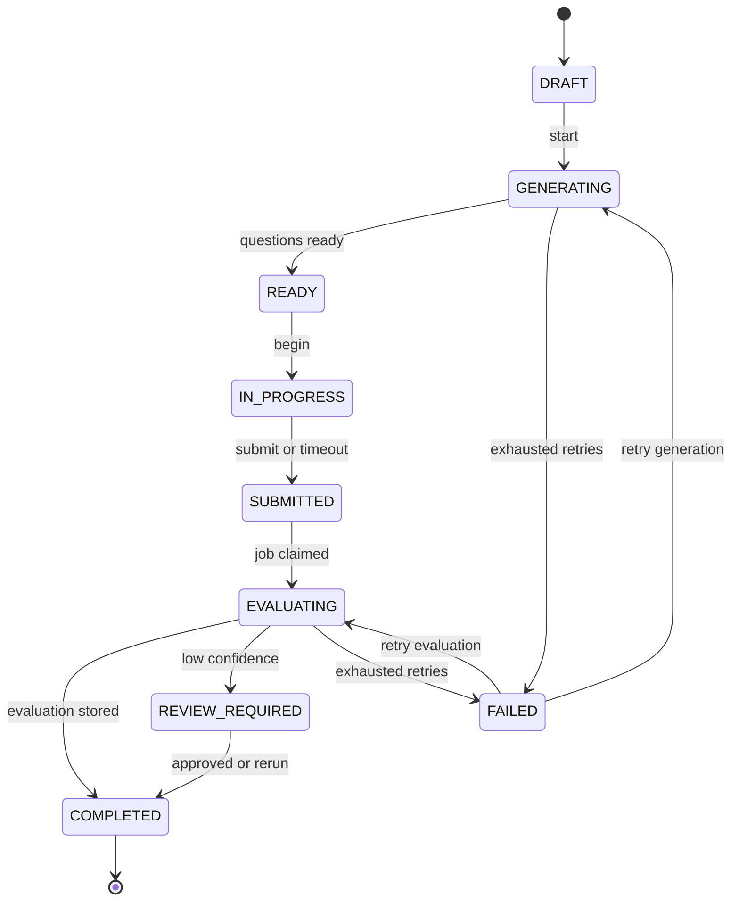

# Interview lifecycle

## State machine mục tiêu

## Invariants

- Mọi transition là conditional update theo current state và version.
- `submit` idempotent; cùng idempotency key trả cùng kết quả.
- Question và rubric được snapshot vào session để lịch sử không đổi khi content cập nhật.
- Candidate chỉ đọc/ghi session mình sở hữu.
- Evaluation không sửa attempt gốc.
- Retry không tạo duplicate question, evaluation hoặc quota charge.
- Timeout phải dùng server time và audit reason.
