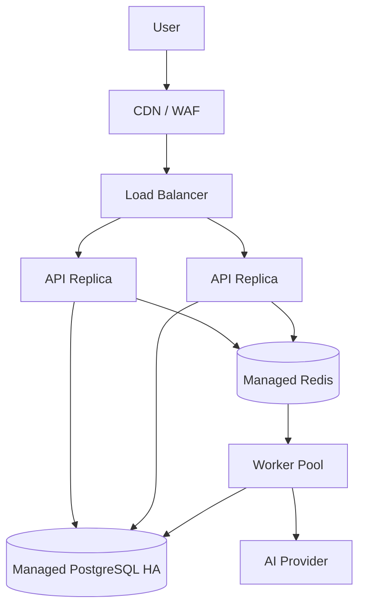

# Deployment topology

## Environments

- Local: Docker Compose hiện có.
- CI: ephemeral PostgreSQL/Redis và mock AI.
- Staging: production-like, synthetic data, external provider sandbox/limited quota.
- Production: multi-AZ managed PostgreSQL/Redis, ít nhất hai API replicas và worker autoscaling.

## Production logical topology

## Constraints

- Session state không nằm trong memory API.
- SSE cần reconnect token/last event strategy; không giả định sticky session là correctness mechanism.
- Database migration chạy một lần qua release job.
- Worker deploy tương thích với job payload cũ còn trong queue.
- Secrets đến runtime qua secret manager, không bake vào image.
