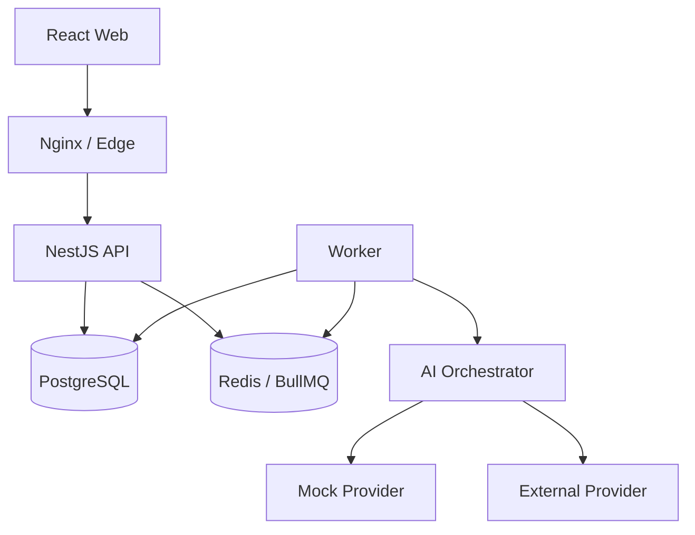

# Target architecture

## Kiểu kiến trúc

Tiếp tục **NestJS modular monolith** trong `apps/api`, tách runtime thành API process và BullMQ worker process. PostgreSQL là source of truth; Redis dùng queue, cache và ephemeral coordination; React SPA dùng REST + SSE với polling fallback.

## Module rules

- `auth`, `profile`, `taxonomy`, `interview`, `evaluation`, `learning-path`, `history-report`, `admin`, `ai-orchestrator`, `platform` giữ ownership rõ.
- Shared `packages/contracts` chỉ chứa contract/enums/schema; không chứa business orchestration.
- Module không truy cập table của module khác nếu thiếu application service hoặc documented contract.
- Worker handler idempotent và có job version.
- External provider chỉ xuất hiện sau `AiProvider`; domain không import SDK provider.

## Reliability pattern

- Persist answer trước enqueue như ADR 0004.
- Bổ sung recovery scanner/outbox để phát hiện row đã persist nhưng enqueue thất bại.
- Job ID deterministic, handler upsert/compare-and-set.
- SSE là optimization; REST status là recovery path.
- Feature flag và canary cho model/prompt/provider mới.
