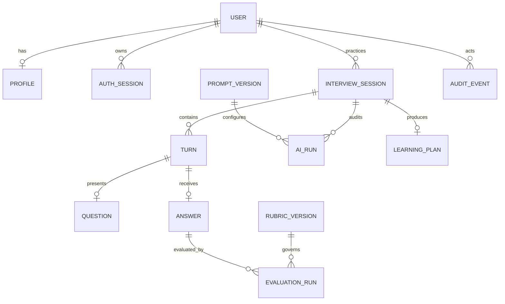

# Conceptual ERD

```mermaid
erDiagram
    USER ||--o| PROFILE : has
    USER ||--o{ AUTH_SESSION : owns
    USER ||--o{ INTERVIEW_SESSION : practices
    INTERVIEW_SESSION ||--o{ TURN : contains
    TURN ||--o| QUESTION : presents
    TURN ||--o| ANSWER : receives
    ANSWER ||--o{ EVALUATION_RUN : evaluated_by
    RUBRIC_VERSION ||--o{ EVALUATION_RUN : governs
    PROMPT_VERSION ||--o{ AI_RUN : configures
    INTERVIEW_SESSION ||--o{ AI_RUN : audits
    INTERVIEW_SESSION ||--o| LEARNING_PLAN : produces
    USER ||--o{ AUDIT_EVENT : acts
```

Repo hiện có nhiều entity tương ứng nhưng target cần tách refresh token thành auth session/family và evaluation thành immutable runs.
