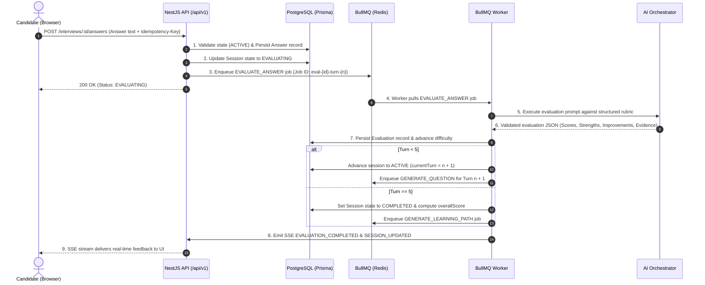

# System Architecture & Technical Specifications

## 1. High-Level Architecture Overview

**AI Interview Practice** is engineered as a **Modular Monolith** in TypeScript, orchestrating asynchronous technical interview generation, structured answer evaluation, and personalized learning path roadmaps.

```mermaid
graph TD
    Client[React + Vite Frontend (SPA)] -->|REST / SSE| Nginx[Nginx Reverse Proxy / Load Balancer]
    Nginx -->|/api/v1| API[NestJS Modular Monolith API]
    Nginx -->|/| Web[Static Web Assets]
    API -->|Read/Write| Postgres[(PostgreSQL 16)]
    API -->|Enqueue Jobs / SSE PubSub| Redis[(Redis 7)]
    Worker[BullMQ Worker Process] -->|Consume Jobs| Redis
    Worker -->|Read Context / Persist State| Postgres
    Worker -->|Inference| AIOrch[AI Orchestrator]
    AIOrch -->|Provider Strategy| MockAI[MockAiProvider / ExternalAiProvider]
```

---

## 2. Asynchronous Turn Processing Sequence



---

## 3. Session & Learning Path State Machines

### 3.1 Interview Session State Machine

- `CREATED`: Session initiated with chosen taxonomy; 1st question generation job enqueued.
- `ACTIVE`: Current turn question is ready and awaiting candidate answer submission.
- `EVALUATING`: Answer submitted and persisted; evaluation job processing in BullMQ.
- `COMPLETED`: All 5 turns successfully answered and evaluated; overall score computed.
- `FAILED`: AI generation or evaluation failed after maximum retries. Answer remains persisted.
- `CANCELLED`: Session terminated prematurely.

### 3.2 Learning Path State Machine (Independent)

- `PENDING`: Enqueued or regenerating.
- `READY`: Generated successfully and persisted with structured gap analysis and search keywords.
- `FAILED`: Failed to generate; does **not** erase or alter completed session scores.

---

## 4. Adding a New AI Provider

To add a new AI provider (e.g. Google Gemini, Mistral, Local Ollama):

1. Implement the `AiProvider` interface in `apps/api/src/modules/ai-orchestrator/interfaces/ai-provider.interface.ts`.
2. Create `apps/api/src/modules/ai-orchestrator/providers/<provider-name>.provider.ts`.
3. Register the provider in `apps/api/src/modules/ai-orchestrator/ai-orchestrator.module.ts`.
4. Add the provider selection logic in `apps/api/src/modules/ai-orchestrator/ai-orchestrator.service.ts`.
5. **No business modules (interview, evaluation, learning-path) require any code changes.**
