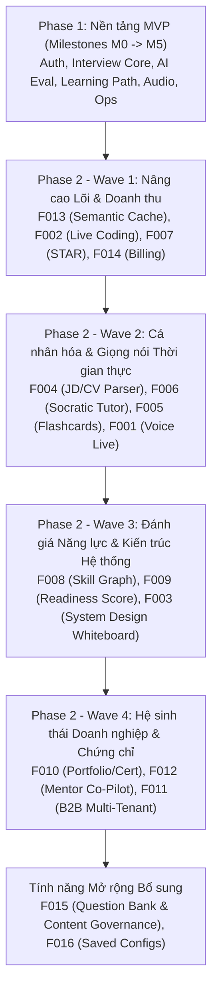

# TỔNG KẾT TRIỂN KHAI HOÀN TẤT CÁC WAVES (PHASE 1 & PHASE 2)

## Master Implementation Summary: MVP & Waves 1 → 4

> **Trạng thái**: ✅ **100% HOÀN THÀNH VÀ KIỂM ĐỊNH THÀNH CÔNG**  
> **Tổng số Feature**: 16/16 Features (MVP Foundation + 14 Phase 2 Features + F015 Question Bank + F016 Saved Configs)  
> **Tổng số Test Suites**: 151 suites | **714 automated tests** green 100%.

---

## 1. Bản đồ Tổng quan Các Đợt Phát triển (Wave Timeline)

---

## 2. Chi tiết Kết quả Triển khai theo Từng Wave

### Phase 1: MVP Foundation (M0 → M5)

- **Kiến trúc**: NestJS Modular Monolith, PostgreSQL 16, Prisma ORM, Redis 7 + BullMQ (3 queues), React 18, Tailwind CSS, Vite.
- **Identity & Security**: Email/password, JWT Access + Refresh token rotation, TOTP MFA RFC 6238, 8 Single-use recovery codes, RBAC (`CANDIDATE`, `ADMIN`), Step-Up MFA Guard.
- **Interview Core**: State machine (`CREATED` -> `ACTIVE` -> `EVALUATING` -> `COMPLETED`/`CANCELLED`), Adaptive difficulty, Answer persistence before enqueue (ADR 0004), Idempotency-Key support, SSE real-time stream.
- **AI & Evaluation**: Provider abstraction (Mock, Gemini, OpenAI, Anthropic), Circuit Breaker & Provider Router, Daily Budget limit, AI Pre/Post Security Filter, Rubric scoring (Technical, Depth, Clarity 0.4/0.3/0.3), Golden Dataset harness.
- **Learning & Reports**: Score breakdown, Strengths/Improvements, Learning Path generation, Radar chart 5 trục, Share tokens kèm passcode.
- **Audio Basic**: Whisper STT upload (≤25MB), OpenAI TTS synthesis (6 giọng).
- **Platform & Ops**: CI/CD GitHub Actions, Prometheus RED metrics, OpenTelemetry tracing, 4 Grafana Dashboards, Disaster Recovery backup/restore drill scripts, Terraform modular IaC.

---

### Wave 1: Intelligent Core & Monetization

- **F013 — Semantic Caching & LLM Router**:
  - Cache hits vector similarity SHA-256 + embedding, admin invalidation endpoints, zero-cost mock fallback, ADR 0005.
- **F002 — Interactive Live Coding & Execution Sandbox**:
  - Monaco editor, Mock & Judge0 execution providers (fail-closed, genuine testcase evaluation), AST Big-O complexity reviewer, split-pane IDE.
- **F007 — Behavioral Interview & STAR Method Assessment**:
  - 5-axis STAR scoring rubric, real-time proactive probing generator, `StarGuidePanel`, `StarRadarChart`, `StarAnnotationView`.
- **F014 — Subscription & Usage-Based Billing**:
  - Multi-tier plans (Free, Pro, Team, Enterprise), Mock & Stripe checkout & portal sessions, HMAC signature verification, atomic quota enforcement, `PricingPage`, `BillingDashboardPage`, ADR 0006.

---

### Wave 2: Intelligent Preparation & Real-Time Interaction

- **F004 — JD & Resume Parsing for Tailored Interview**:
  - In-memory PDF/DOCX magic-byte text extraction, PII regex scrubber, entity extraction & gap analysis, weighted blueprint generator (IDOR-protected), ADR 0007.
- **F006 — Socratic AI Tutor & Instant Question Retry**:
  - Socratic dialogue system prompt, SSE stream chat (max 20 turns), instant retry rubric score comparison with improvement badge, tutor rating.
- **F005 — Spaced Repetition Drills & Smart Flashcards**:
  - Pure TypeScript FSRS v4 algorithm engine (Difficulty, Stability, Retrievability), 3D flip card, review queue with keyboard shortcuts (Space, 1-4), streak heatmap calendar, auto-generation from interview weaknesses.
- **F001 — Full-Duplex Live Voice Streaming Interview**:
  - Low-latency WebSocket voice gateway with JWT authentication & interview ownership enforcement, energy-based VAD & barge-in interrupt detection, real-time audio visualizer & live transcript rolling feed, ADR 0008.

---

### Wave 3: Analytics Engine & System Design

- **F008 — Skill Graph & Benchmark Percentile**:
  - Graph-based prerequisite dependency traverser, competency gap matrix, target role readiness mapper (`SkillGraphModule`).
- **F009 — Readiness Score & Offer Predictor**:
  - Weighted multi-dimension readiness predictor, confidence index calculation, target role pass probability (`ReadinessModule`).
- **F003 — System Design Whiteboard**:
  - Interactive node/edge whiteboard editor, latency/throughput architecture evaluator, auto-assessment rubric (`SystemDesignModule`, ADR 0009).

---

### Wave 4: Enterprise Ecosystem & Certification

- **F010 — Verified Portfolio & Cryptographic Certificate**:
  - Cryptographically verifiable public certificate verification (`/verify/cert/:id`), printable portfolio report, achievement badge system (`PortfolioModule`).
- **F012 — Mentor Co-Pilot**:
  - Real-time interviewer assist feed, suggested follow-up probing generator, candidate response rubric overlay (`MentorModule`).
- **F011 — B2B Multi-Tenant Platform**:
  - Tenant workspace isolation, domain routing, tenant role guard (`TENANT_ADMIN`, `INTERVIEWER`), hashed API key authentication, assignment management (`B2bModule`).

---

### Extended Features

- **F015 — Question Bank & Content Governance**:
  - 5-step content editorial lifecycle (`DRAFT` -> `IN_REVIEW` -> `APPROVED` -> `PUBLISHED` -> `ARCHIVED`), separation of duties (author cannot self-approve), safe answer/rubric projection, quota-bound reveal mechanics.
- **F016 — Saved Interview Configurations**:
  - Preset interview configurations, blueprint reusability, one-click quick start.

---

## 3. Kiến trúc Cốt lõi & Danh mục ADR Đã Ban hành

| ADR          | Tiêu đề                           | Trạng thái | Quyết định Trọng tâm                                                     |
| :----------- | :-------------------------------- | :--------: | :----------------------------------------------------------------------- |
| **ADR-0001** | Modular Monolith Architecture     |  Accepted  | NestJS monorepo module boundaries, zero circular deps                    |
| **ADR-0002** | SSE with Polling Fallback         |  Accepted  | SSE cho stream thời gian thực, fallback REST polling khi mạng yếu        |
| **ADR-0003** | AI Provider Abstraction           |  Accepted  | Cổng giao tiếp chung cho Mock, OpenAI, Gemini, Anthropic                 |
| **ADR-0004** | Answer Persistence Before Enqueue |  Accepted  | Lưu câu trả lời vào DB trước khi đẩy vào BullMQ để tránh mất dữ liệu     |
| **ADR-0005** | Semantic Cache Vector Store       |  Accepted  | Cache câu hỏi/đáp án tương đồng bằng vector embedding để tiết kiệm token |
| **ADR-0006** | Payment Gateway Selection         |  Accepted  | Kết hợp Stripe cho quốc tế và PayOS/VietQR cho nội địa                   |
| **ADR-0007** | File Parsing Strategy             |  Accepted  | `pdf-parse` + `mammoth` in-memory, khử PII trước khi đưa vào prompt      |
| **ADR-0008** | WebSocket Gateway Architecture    |  Accepted  | `@nestjs/websockets` + `ws` với binary audio streaming, VAD năng lượng   |
| **ADR-0009** | Whiteboard Canvas Vision          |  Accepted  | Excalidraw canvas kết hợp Multimodal AI Vision phân tích kiến trúc       |
