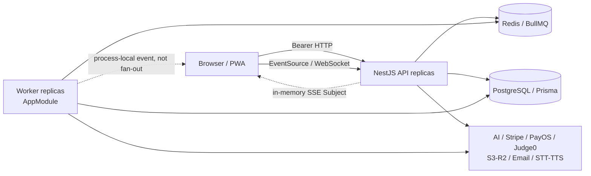

# 01 — System Map and Critical Flows

## Kiến trúc quan sát được

NestJS API và worker đều bootstrap `AppModule` (`apps/api/src/main.ts:12`; `apps/api/src/worker.ts:9`). PostgreSQL/Prisma giữ authoritative domain state; Redis/BullMQ điều phối question/evaluation/learning-path/email; web React/Vite dùng Bearer tokens và React Query; voice dùng WebSocket; storage dùng presigned URLs; AI/payment/code/media là external providers. Terraform dự định chạy 2 API + 2 worker ở production (`infra/terraform/modules/compute/main.tf:237`, `:262`).

## Critical flows

### Auth, refresh, MFA và logout

HTTP JWT strategy reloads status/role/tokenVersion và rejects MFA challenge (`apps/api/src/modules/auth/strategies/jwt.strategy.ts:25`). Refresh family rotation/revocation tồn tại (`apps/api/src/modules/auth/auth.service.ts:181`, `:281`). Hai divergence phá invariant: voice gateway chỉ gọi raw `JwtService.verify` (`voice-streaming.gateway.ts:95`), và frontend logout chỉ xóa local entries (`apps/web/src/stores/auth.store.ts:81`) thay vì gọi server endpoint (`auth.controller.ts:57`).

### Interview answer → evaluation → learning path

`submitAnswer` transaction tạo answer, đặt turn `ANSWER_SUBMITTED` và session `EVALUATING` trước khi queue add (`interview.service.ts:365`). Queue failure bị swallow với claim “background recovery” nhưng không có reconciler (`:399-420`). Evaluation processor cập nhật authoritative score, phát SSE và enqueue next work (`evaluation.processor.ts:306`, `:348`). Final path đặt session `COMPLETED` trước learning-path enqueue (`:226-250`, `:371-439`), nên retry terminal guard có thể bỏ mất downstream work.

### Billing

Stripe production missing-key path fail closed (VERIFIED_FIXED, `billing.service.ts:37`). PayOS lại fallback sang mock khi credentials thiếu/SDK init lỗi (`payos.provider.ts:33-60`) và “verify” unsigned body (`:114-122`). Public callback (`webhook.controller.ts:27`) sau đó active subscription/mark invoice paid (`billing.service.ts:467-539`). Pending invoice lookup là control tốt nhưng không thay chữ ký, amount/state/idempotency binding.

### Provider authority

Text-AI production chain loại mock trừ explicit override (`provider-router.service.ts:81`) và personalized learning path không dùng shared semantic cache (VERIFIED_FIXED). Storage và vision không dùng policy đó: storage default mock (`storage.module.ts:26`) và unknown key vẫn có metadata (`mock-storage.provider.ts:38`); vision default mock (`system-design.module.ts:29`) trả fixed score rồi persist (`design-evaluation.service.ts:64-89`).

### Storage, documents và privacy lifecycle

Presign upload tạo user/UUID key nhưng không persist intent (`storage.service.ts:28`). Ownership chỉ được kiểm tra nếu `FileAsset` đã tồn tại; unregistered key vẫn có thể được sign/delete (`:113-152`). CV có `expiresAt +30d` (`document-parser.service.ts:46`) nhưng reads không filter expiry (`:197-221`) và không có purge. Voice transcript schema không có TTL (`apps/api/prisma/schema.prisma:1077`). Profile export tồn tại (`profile.controller.ts:35`) nhưng deletion claim không có endpoint.

### Browser cache boundary

Một process-global `QueryClient` có `staleTime=5s` (`apps/web/src/App.tsx:40`). Workbox cache authenticated flashcards theo URL trong shared cache 7 ngày (`apps/web/vite.config.ts:50`). Query keys/user URLs không partition theo user (`apps/web/src/hooks/useFlashcards.ts:24`), và logout không clear QueryClient/CacheStorage; shared browser account switch có thể tái dùng dữ liệu cũ.

## Trust và ownership boundaries

| Boundary                    | Control hiện có                                      | Gap chính                                                             |
| --------------------------- | ---------------------------------------------------- | --------------------------------------------------------------------- |
| Anonymous → HTTP            | global JWT, `@Public` explicit (`app.module.ts:77`)  | PayOS public unsigned fallback                                        |
| JWT → current user          | `JwtStrategy` DB revalidation (`jwt.strategy.ts:25`) | voice bypass; logout không revoke                                     |
| User → object               | service ownership predicates                         | behavioral answer IDOR; unregistered storage keys                     |
| Mentor → evaluation         | mentor/candidate relationship                        | không bind exact interview/evaluation (`live-session.service.ts:156`) |
| Admin → privileged mutation | RolesGuard, selected MFA step-up                     | unenrolled normal session; inconsistent step-up                       |
| Provider → authoritative DB | schemas/transactions/circuit breakers                | non-text mocks và partial async handoffs                              |
| Worker → browser            | DB + process-local SSE                               | auth contract sai; không distributed fan-out                          |
| Browser account A → B       | local logout                                         | Query/PWA caches không partition/evict                                |

## Unknown deployment controls

Ingress TLS/WAF, real secret injection, DB backup/PITR, S3/R2 encryption/lifecycle, Redis TLS/auth client wiring, log access/redaction downstream, provider data retention và production feature flags không được xác lập bằng current source. Không suy diễn chúng là absent; chúng là release evidence cần owner cung cấp.
