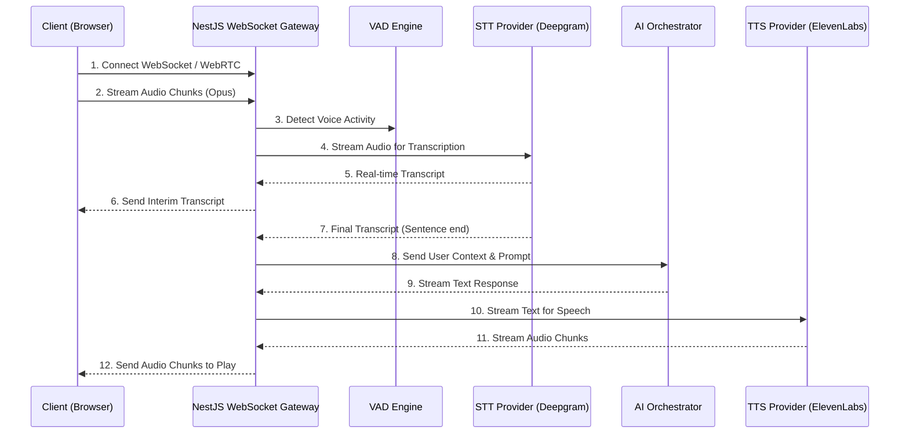

# F001 — Full-Duplex Live Voice Streaming Interview

## 1. Tổng quan (Overview)

### Mô tả tính năng chi tiết
Tính năng Full-Duplex Live Voice Streaming Interview cung cấp trải nghiệm phỏng vấn bằng giọng nói theo thời gian thực với AI. Thay vì tương tác text-based truyền thống, người dùng có thể trò chuyện trực tiếp với AI Interviewer. Hệ thống hỗ trợ khả năng full-duplex, nghĩa là cả hai bên (người dùng và AI) có thể nói và nghe cùng một lúc, với khả năng turn detection (nhận diện lượt lời) và interruption handling (xử lý ngắt lời) thông minh.

### Vấn đề giải quyết (Problem Statement)
- Phỏng vấn text-based không phản ánh đúng áp lực và kỹ năng giao tiếp thực tế của ứng viên.
- Khó đánh giá khả năng phản xạ, ngữ điệu, và sự tự tin của ứng viên thông qua văn bản.
- Trải nghiệm người dùng thiếu tự nhiên và không mô phỏng được môi trường phỏng vấn thực.

### Giá trị mang lại (Value Proposition)
- **Realism**: Tạo ra một môi trường phỏng vấn chân thực nhất có thể.
- **Comprehensive Evaluation**: Đánh giá cả soft skills (kỹ năng giao tiếp, phản xạ) bên cạnh hard skills.
- **Engagement**: Tăng tính tương tác và hứng thú cho ứng viên trong quá trình luyện tập.

### Personas thụ hưởng
- **Ứng viên (Candidates)**: Cần môi trường thực hành phỏng vấn sát với thực tế để giảm bớt căng thẳng.
- **Nhà tuyển dụng / Mentor (Recruiters/Mentors)**: Xem lại bản ghi (audio và transcript) để đánh giá toàn diện ứng viên.

---

## 2. Yêu cầu chức năng (Functional Requirements)

| ID | Yêu cầu | Mô tả chi tiết |
|---|---|---|
| FR-VOI-001 | WebRTC/WebSocket Audio Streaming | Thiết lập kết nối hai chiều độ trễ thấp để truyền tải audio từ browser đến server và ngược lại. |
| FR-VOI-002 | Real-time STT Integration | Tích hợp các STT provider (Whisper, Deepgram) để chuyển đổi giọng nói ứng viên thành văn bản theo thời gian thực (streaming transcription). |
| FR-VOI-003 | Real-time TTS for AI | Chuyển đổi phản hồi của AI thành giọng nói (OpenAI TTS, ElevenLabs) và stream về client theo từng chunk. |
| FR-VOI-004 | Turn Detection & Interruption | Nhận diện khi ứng viên ngắt lời AI. Tự động dừng audio playback từ AI và xử lý context mới. |
| FR-VOI-005 | Audio Recording & Playback | Ghi âm toàn bộ buổi phỏng vấn và cung cấp tính năng phát lại sau khi kết thúc. |
| FR-VOI-006 | Transcript Generation & Sync | Hiển thị transcript đồng bộ với luồng âm thanh theo thời gian thực. |
| FR-VOI-007 | Voice Activity Detection (VAD) | Phát hiện có tiếng nói hay không để tối ưu hóa việc truyền data và phát hiện ngắt lời. |
| FR-VOI-008 | Noise Cancellation | Áp dụng bộ lọc khử nhiễu (noise suppression/cancellation) tại client-side trước khi gửi audio. |
| FR-VOI-009 | Graceful Degradation | Tự động chuyển về text mode nếu kết nối mạng yếu hoặc microphone gặp sự cố. |
| FR-VOI-010 | Browser Permission Handling | Yêu cầu và xử lý quyền truy cập microphone từ trình duyệt một cách mượt mà (UI/UX). |
| FR-VOI-011 | Connection Quality Indicator | Hiển thị trạng thái kết nối mạng và chất lượng cuộc gọi (Ping/Latency/Jitter). |

---

## 3. Yêu cầu phi chức năng (Non-Functional Requirements)

| ID | Yêu cầu | Tiêu chuẩn / Metric |
|---|---|---|
| NFR-VOI-001 | Latency Targets | End-to-end latency (từ lúc user nói xong đến khi AI bắt đầu phản hồi) < 500ms. |
| NFR-VOI-002 | Audio Quality | Sample rate: 16kHz hoặc 48kHz, Codec: Opus. |
| NFR-VOI-003 | Browser Compatibility | Hỗ trợ Chrome (90+), Firefox (88+), Safari (14+), Edge (90+). |
| NFR-VOI-004 | Bandwidth Requirements | Tối thiểu 128 kbps (up/down) cho luồng âm thanh ổn định. |
| NFR-VOI-005 | Concurrent Capacity | Hệ thống (Gateway) xử lý được tối thiểu 5,000 voice sessions đồng thời. |
| NFR-VOI-006 | Accessibility | Đạt chuẩn WCAG 2.2 AA (Cung cấp Captions, Live Transcript, hỗ trợ screen reader). |

---

## 4. Thiết kế Kiến trúc (Architecture Design)

### Sequence Diagram: Voice Flow


### Data Flow Diagram & Component Architecture
- **Browser MediaStream**: Lấy dữ liệu từ microphone, áp dụng Web Audio API cho Noise Cancellation.
- **WebSocket/WebRTC**: Giao thức truyền tải.
- **NestJS Gateway**: Xử lý routing, quản lý session, rate limiting, authentication.
- **VoiceProvider Interface**: Cung cấp abstraction cho STT và TTS để dễ dàng switch provider.

```typescript
export interface VoiceProvider {
  streamSTT(audioStream: ReadableStream): AsyncIterableIterator<TranscriptChunk>;
  streamTTS(textStream: AsyncIterableIterator<string>): ReadableStream;
}
```

---

## 5. Thiết kế Database Schema

### Prisma Schema Additions

```prisma
model VoiceSession {
  id              String           @id @default(uuid())
  interviewId     String           @unique
  interview       Interview        @relation(fields: [interviewId], references: [id])
  status          SessionStatus    @default(ACTIVE)
  startedAt       DateTime         @default(now())
  endedAt         DateTime?
  audioUrl        String?          // URL tới file ghi âm trên S3
  transcripts     Transcript[]
  metrics         SessionMetric?
}

model Transcript {
  id              String        @id @default(uuid())
  voiceSessionId  String
  voiceSession    VoiceSession  @relation(fields: [voiceSessionId], references: [id])
  speaker         SpeakerRole   // USER or AI
  text            String
  startTime       Float         // in seconds
  endTime         Float         // in seconds
  createdAt       DateTime      @default(now())
}

model SessionMetric {
  id              String        @id @default(uuid())
  voiceSessionId  String        @unique
  voiceSession    VoiceSession  @relation(fields: [voiceSessionId], references: [id])
  avgLatencyMs    Int
  packetLossRate  Float
  interruptions   Int           @default(0)
}

enum SessionStatus {
  ACTIVE
  COMPLETED
  FAILED
}

enum SpeakerRole {
  USER
  AI
}
```

---

## 6. API Specification

### REST Endpoints
- `POST /api/v1/voice-sessions` — Initialize a new voice session for an interview.
- `GET /api/v1/voice-sessions/:id/recordings` — Get pre-signed S3 URL for audio playback.

### WebSocket Events (Namespace: `/voice`)
| Event | Direction | Payload | Description |
|---|---|---|---|
| `connect` | Client -> Server | `{ token, interviewId }` | Authenticate and join session room. |
| `audio_chunk` | Client -> Server | `ArrayBuffer` | Raw or Opus encoded audio chunk. |
| `transcript_update` | Server -> Client | `{ text, isFinal, speaker }` | Real-time transcript sync. |
| `ai_audio_chunk` | Server -> Client | `ArrayBuffer` | Audio response from AI. |
| `interrupt` | Client -> Server | `{ timestamp }` | Triggered when user interrupts AI. |
| `disconnect` | Both | - | Session ended or connection lost. |

---

## 7. Thiết kế Frontend

### React Components
- **VoiceInterviewRoom**: Main container component.
- **AudioVisualizer**: Sử dụng Web Audio API `AnalyserNode` vẽ waveform (canvas hoặc CSS).
- **ControlPanel**: Các nút Mute/Unmute, End Interview, Switch to Text.
- **LiveTranscript**: Hiển thị text cuộn (auto-scroll) với màu sắc phân biệt AI và User.
- **NetworkIndicator**: Biểu tượng hiển thị chất lượng kết nối (Xanh/Vàng/Đỏ).

### State Management (Zustand)
```typescript
interface VoiceStore {
  isMuted: boolean;
  isAiSpeaking: boolean;
  isUserSpeaking: boolean;
  connectionState: 'connecting' | 'connected' | 'reconnecting' | 'disconnected';
  transcripts: TranscriptItem[];
  toggleMute: () => void;
  // ...
}
```

---

## 8. Xử lý Lỗi & Edge Cases

- **Network Disconnection**: Tự động re-connect với exponential backoff. Hiển thị thông báo. Queue audio chunk nếu ngắn, hoặc bỏ qua nếu mất quá lâu.
- **Browser Tab Switch/Minimize**: Sử dụng Web Worker để giữ WebSocket connection sống và duy trì audio processing.
- **Microphone Access Denied**: Hiển thị modal hướng dẫn cụ thể cách mở quyền trong setting của trình duyệt, fallback sang text mode.
- **Provider Failover**: Nếu Deepgram (STT) lỗi, tự động fallback sang Google STT hoặc Whisper API.
- **Rate Limiting**: Giới hạn thời gian kết nối tối đa mỗi session (vd: 60 phút) để tránh abuse.

---

## 9. Bảo mật & Quyền riêng tư

- **Data in Transit**: Toàn bộ stream qua WSS (WebSocket Secure) hoặc WebRTC (DTLS/SRTP).
- **Data at Rest**: Audio file lưu trữ trên S3 được mã hóa (SSE-S3 hoặc SSE-KMS).
- **Explicit Consent**: Hiển thị thông báo yêu cầu đồng ý ghi âm trước khi bắt đầu phỏng vấn.
- **Retention Policy**: Audio và Transcript tự động bị xóa sau 30 ngày (cron job / TTL). Tuân thủ GDPR (hỗ trợ hard delete user data).

---

## 10. Chiến lược Testing

- **Unit Tests**: Test logic VAD, Text chunking cho TTS, Web Audio API context mock.
- **Integration Tests**: WebSocket connection establishment, event routing, provider API mocks.
- **E2E Tests**: Cypress / Playwright test quyền mic, UI state khi đang thu âm, phát lại.
- **Load Testing**: Sử dụng Artillery hoặc K6 mô phỏng 5000 concurrent websocket connections stream audio liên tục.

---

## 11. Kế hoạch Triển khai (Rollout Plan)

- **Phase 1 (Alpha)**: Internal team (Mock AI provider) để tune VAD và latency.
- **Phase 2 (Beta)**: Bật qua Feature Flag cho 5% user. Monitor error rates, latency (Datadog/NewRelic).
- **Phase 3 (GA)**: Bật cho toàn bộ user. Thiết lập cảnh báo (Alerts) khi latency > 1000ms hoặc STT provider lỗi > 5%.

---

## 12. Ước lượng (Estimates)

- **Development Effort**:
  - Backend (Gateway, Providers, VAD): 3 tuần.
  - Frontend (Web Audio, UI, WebSocket client): 2.5 tuần.
  - QA & Load Testing: 1.5 tuần.
- **Infrastructure Cost (Estimate per 10k sessions/month)**:
  - Deepgram STT: ~$200.
  - ElevenLabs TTS (Optimized): ~$500.
  - S3 Storage & Bandwidth: ~$50.
- **Dependencies**: Cần account ElevenLabs, Deepgram. Cấu hình WAF để cho phép WebSocket.
