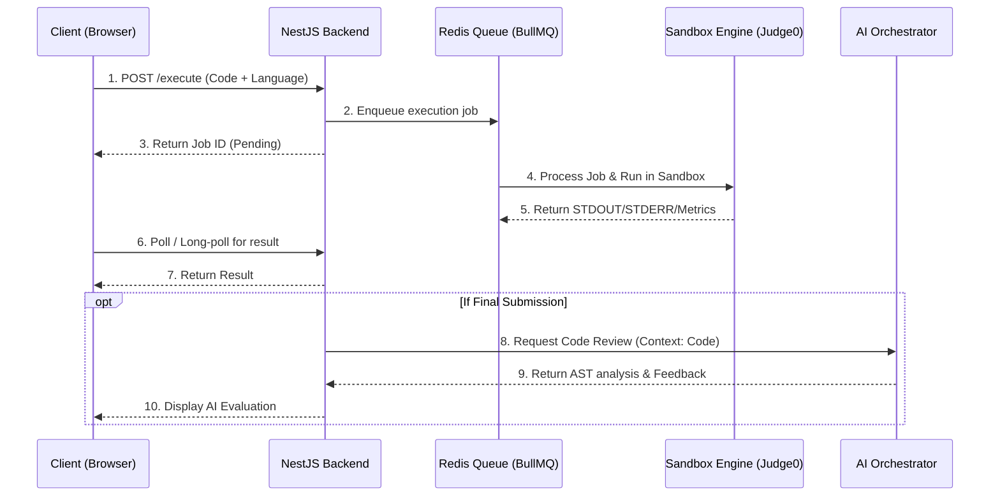

# F002 — Interactive Live Coding & Code Execution Sandbox

## 1. Tổng quan (Overview)

### Mô tả tính năng chi tiết

Interactive Live Coding & Code Execution Sandbox là môi trường lập trình trực tuyến được tích hợp trực tiếp vào phòng phỏng vấn. Nó cho phép ứng viên viết, chạy thử, và submit code theo thời gian thực. Hệ thống đi kèm với khả năng biên dịch/thực thi mã an toàn (sandbox) và tích hợp AI để tự động đánh giá chất lượng mã nguồn, phân tích độ phức tạp thuật toán và đưa ra gợi ý tối ưu.

### Vấn đề giải quyết (Problem Statement)

- Phỏng vấn kỹ thuật truyền thống thường dùng Google Docs hoặc bảng trắng, không kiểm tra được lỗi cú pháp hay logic thực tế.
- Khó đánh giá chính xác độ phức tạp thời gian/không gian nếu không có bộ test case chạy thực tế.
- Việc review code thủ công tốn nhiều thời gian của người phỏng vấn.

### Giá trị mang lại (Value Proposition)

- **Hands-on Assessment**: Đánh giá khả năng code thực tế của ứng viên thông qua việc pass các test cases.
- **Instant AI Feedback**: AI review code ngay lập tức (Clean Code, Time/Space Complexity).
- **Seamless Experience**: Ứng viên không cần cài đặt môi trường, code ngay trên trình duyệt với đầy đủ tính năng của IDE.

### Personas thụ hưởng

- **Ứng viên (Candidates)**: Trải nghiệm code tương tự IDE quen thuộc (VSCode).
- **Nhà tuyển dụng / Developer (Recruiters/Devs)**: Tiết kiệm thời gian chấm bài, nhận được báo cáo đánh giá code chi tiết từ AI.

---

## 2. Yêu cầu chức năng (Functional Requirements)

| ID         | Yêu cầu                     | Mô tả chi tiết                                                                                                            |
| ---------- | --------------------------- | ------------------------------------------------------------------------------------------------------------------------- |
| FR-COD-001 | Monaco Editor Integration   | Tích hợp Monaco Editor hỗ trợ syntax highlighting, auto-completion, và phím tắt chuẩn.                                    |
| FR-COD-002 | Multi-language Support      | Hỗ trợ JavaScript, TypeScript, Python, Java, C++, Go.                                                                     |
| FR-COD-003 | Code Execution Sandbox      | Thực thi code an toàn qua Judge0 API hoặc WebContainers. Không cho phép truy cập filesystem/network từ code của ứng viên. |
| FR-COD-004 | Test Case Runner            | Chạy code với các test case định sẵn (Hidden/Public) hoặc test case tùy chỉnh của ứng viên.                               |
| FR-COD-005 | Code Submission & Auto-save | Tự động lưu bản nháp (draft) mỗi 5s. Submit phiên bản cuối cùng để chấm điểm.                                             |
| FR-COD-006 | AI Code Review - Complexity | AI phân tích độ phức tạp Big O (Time & Space Complexity) của đoạn code submit.                                            |
| FR-COD-007 | AI Code Review - Quality    | AI đánh giá code dựa trên Clean Code principles, phát hiện code smells.                                                   |
| FR-COD-008 | Split-Pane UI               | Layout chia đôi màn hình có thể resize: Trái (Đề bài), Phải (Editor + Console).                                           |
| FR-COD-009 | Console Output Panel        | Hiển thị STDOUT, STDERR, và kết quả test case chi tiết.                                                                   |
| FR-COD-010 | Execution Resource Limits   | Giới hạn thời gian chạy (Timeout) và bộ nhớ (Memory Limit) cho mỗi lần execution.                                         |

---

## 3. Yêu cầu phi chức năng (Non-Functional Requirements)

| ID          | Yêu cầu              | Tiêu chuẩn / Metric                                                                                |
| ----------- | -------------------- | -------------------------------------------------------------------------------------------------- |
| NFR-COD-001 | Execution Latency    | Thời gian trả về kết quả chạy code < 5s đối với các ngôn ngữ biên dịch nhanh hoặc thông dịch.      |
| NFR-COD-002 | Sandbox Isolation    | 100% code thực thi trong môi trường isolated, chặn toàn bộ syscalls nguy hiểm, network egress = 0. |
| NFR-COD-003 | Resource Constraints | Max execution time: 2s (C++), 5s (Python/Java). Max memory: 256MB/execution.                       |
| NFR-COD-004 | Concurrency          | Xử lý ít nhất 1,000 code executions đồng thời (thông qua message queue).                           |

---

## 4. Thiết kế Kiến trúc (Architecture Design)

### Sequence Diagram: Code Execution Flow



### Component Architecture

- **Frontend**: React + Monaco Editor + Xterm.js (Console).
- **Backend**: NestJS, cung cấp REST/SSE cho client.
- **Queue**: Redis + BullMQ để buffer request chạy code, tránh overload Sandbox.
- **Sandbox**: Triển khai cụm Judge0 (Docker based) hoặc Firecracker microVMs để cô lập tiến trình.
- **AI Orchestrator**: Tạo prompt chứa mã nguồn và abstract syntax context để LLM (GPT-4o) review.

---

## 5. Thiết kế Database Schema

### Prisma Schema Additions

```prisma
model CodeSubmission {
  id              String         @id @default(uuid())
  interviewId     String
  interview       Interview      @relation(fields: [interviewId], references: [id])
  language        String
  sourceCode      String         @db.Text
  status          SubmissionStatus
  timeComplexity  String?        // e.g., "O(n)"
  spaceComplexity String?        // e.g., "O(1)"
  aiFeedback      String?        @db.Text
  executionTimeMs Int?
  memoryUsageKb   Int?
  createdAt       DateTime       @default(now())
  testResults     TestResult[]
}

model TestCase {
  id              String         @id @default(uuid())
  questionId      String         // Liên kết với Question Bank
  input           String         @db.Text
  expectedOutput  String         @db.Text
  isHidden        Boolean        @default(false)
  results         TestResult[]
}

model TestResult {
  id               String          @id @default(uuid())
  submissionId     String
  submission       CodeSubmission  @relation(fields: [submissionId], references: [id])
  testCaseId       String
  testCase         TestCase        @relation(fields: [testCaseId], references: [id])
  actualOutput     String?         @db.Text
  passed           Boolean
  errorMsg         String?         @db.Text
}

enum SubmissionStatus {
  PENDING
  RUNNING
  COMPLETED
  FAILED
  COMPILE_ERROR
  TIMEOUT
}
```

---

## 6. API Specification

### REST Endpoints

- `POST /api/v1/interviews/:id/code/execute`
  - Body: `{ language: "python", sourceCode: "...", testCaseIds: [...] }`
  - Response: `{ jobId: "..." }`
- `GET /api/v1/interviews/:id/code/results/:jobId`
  - Response: `{ status: "COMPLETED", stdout: "...", time: 45, memory: 12048, results: [...] }`
- `POST /api/v1/interviews/:id/code/submit`
  - Đánh dấu hoàn thành, kích hoạt luồng AI Review.

---

## 7. Thiết kế Frontend

### React Components

- **CodeEditor**: Bọc Monaco Editor component, khởi tạo language server client.
- **SplitPane**: Hỗ trợ drag resize giữa panel đề bài và panel code.
- **TestCasesPanel**: Danh sách tabs cho các test cases. Textarea cho input/output.
- **ExecutionConsole**: Terminal-like component hiển thị logs.
- **AIFeedbackModal**: Trình bày báo cáo của AI (Complexity, Suggestions).

---

## 8. Xử lý Lỗi & Edge Cases

- **Infinite Loops**: Sandbox (Judge0) bắt buộc giới hạn CPU Time Limit. Quá giờ -> Kill tiến trình, trả về `TIMEOUT`.
- **Memory Overflow**: Giới hạn cgroups RAM, trả về `OOM (Out Of Memory)`.
- **Malicious Code**: Network access block by iptables/namespace. Chặn fork bomb qua pids limit.
- **Compilation Errors**: Trả về `STDERR` chi tiết với line number map đúng với editor.
- **Network Timeout / Disconnect**: Draft được lưu tại localStorage (client-side) và debounce sync lên server.

---

## 9. Bảo mật & Quyền riêng tư

- **Sandboxing Strategy**: Sử dụng Docker rootless hoặc Firecracker. Chạy code bằng user non-root.
- **Code Injection**: Escape toàn bộ input, tránh shell injection khi ghép lệnh biên dịch.
- **Rate Limiting**: Giới hạn số lần execute/phút của một ứng viên để tránh DDoSing hệ thống sandbox.

---

## 10. Chiến lược Testing

- **Unit Tests**: Parser kết quả trả về từ Judge0, Logic map test cases.
- **Integration Tests**: Submit code -> Queue -> Sandbox -> Update DB -> Trả kết quả.
- **Security Tests (Penetration Test)**: Thử chạy các script độc hại (đọc `/etc/passwd`, fork bomb, ping ra ngoài) để đảm bảo Sandbox an toàn.

---

## 11. Kế hoạch Triển khai (Rollout Plan)

- **Phase 1**: Hỗ trợ 2 ngôn ngữ cơ bản (JavaScript, Python). Sử dụng Judge0 public API (trong dev).
- **Phase 2**: Host Judge0 cluster riêng. Thêm Java/C++. Bật AI Code Review.
- **Phase 3**: Triển khai WebContainers (fallback cho frontend execution) giảm tải backend.

---

## 12. Ước lượng (Estimates)

- **Development Effort**:
  - Backend & Sandbox setup: 3 tuần.
  - Frontend (Monaco & UI): 2 tuần.
  - AI Prompt Engineering (Review Logic): 1 tuần.
- **Infrastructure Cost (Estimate per 1000 users)**:
  - EC2 Instances cho Sandbox (Compute Heavy): ~$300/tháng.
  - LLM API (Code Review): ~$100/tháng.
- **Dependencies**: Judge0 setup trên k8s/docker-compose. OpenAI API.
