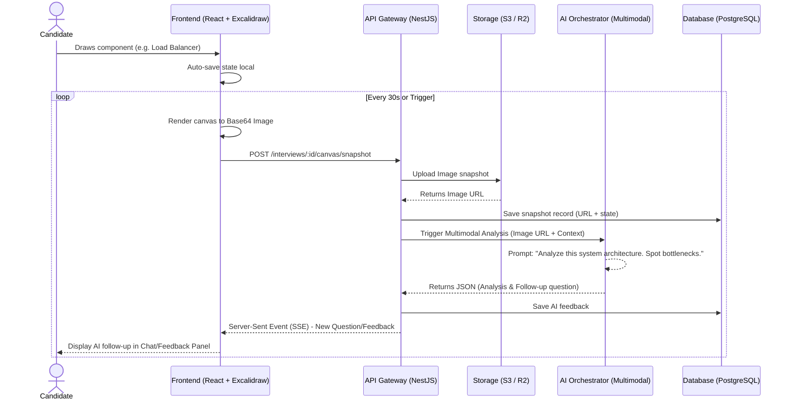

# F003 — System Design Interactive Whiteboard

## 1. Tổng quan (Overview)

Tính năng **System Design Interactive Whiteboard** cung cấp một công cụ thiết kế hệ thống tương tác dựa trên canvas. Tính năng này nhúng Excalidraw hoặc Tldraw làm bảng trắng trực tuyến, kết hợp sức mạnh của Multimodal AI (như GPT-4o hoặc Gemini Pro Vision) để "nhìn" và phân tích các sơ đồ kiến trúc mà ứng viên vẽ theo thời gian thực. Thông qua đó, AI có thể đưa ra các câu hỏi, phản biện về quyết định thiết kế, kiểm tra tính mở rộng và khả năng chịu lỗi.

**Mục tiêu cốt lõi:**

- Tạo môi trường System Design chân thực như khi phỏng vấn trực tiếp.
- Đánh giá khả năng thiết kế kiến trúc phần mềm, lựa chọn component và đánh đổi (trade-offs).
- Phản hồi tức thì và tương tác hai chiều thông qua phân tích hình ảnh AI.

## 2. Yêu cầu chức năng (Functional Requirements)

| ID             | Tên tính năng                 | Mô tả chi tiết                                                                                                                              |
| -------------- | ----------------------------- | ------------------------------------------------------------------------------------------------------------------------------------------- |
| **FR-SYS-001** | Whiteboard Embedding          | Tích hợp Excalidraw/Tldraw vào Interview Room, hỗ trợ vẽ biểu đồ tự do.                                                                     |
| **FR-SYS-002** | Component Palette             | Cung cấp thư viện component chuẩn: Load Balancer, API Gateway, CDN, Message Queue, Cache, Database, Microservice, Client... hỗ trợ kéo thả. |
| **FR-SYS-003** | Connection Tools              | Hỗ trợ vẽ đường nối với nhãn dán: HTTP, gRPC, async, pub/sub, TCP.                                                                          |
| **FR-SYS-004** | AI Canvas Capture             | Hệ thống tự động chụp ảnh canvas theo chu kỳ (mặc định 30s) hoặc khi ứng viên bấm nút (On-demand).                                          |
| **FR-SYS-005** | Multimodal Vision Analysis    | AI (Multimodal) đọc và phân tích cấu trúc, nhận diện các component và kết nối từ hình ảnh canvas.                                           |
| **FR-SYS-006** | Real-time AI Follow-up        | Dựa trên sơ đồ hiện tại, AI tạo các câu hỏi tiếp nối tập trung vào: Scalability, Fault Tolerance, Data Consistency, Bottleneck Analysis.    |
| **FR-SYS-007** | Diagram Export                | Cho phép người dùng xuất thiết kế ra định dạng PNG, SVG hoặc JSON.                                                                          |
| **FR-SYS-008** | Diagram Versioning & Playback | Lưu trữ trạng thái sơ đồ theo thời gian (time-lapse) để xem lại tiến trình thiết kế của ứng viên.                                           |
| **FR-SYS-009** | Collaborative Annotations     | (Mentor Mode) Cho phép người đánh giá hoặc AI đánh dấu/chú thích trực tiếp lên bản vẽ.                                                      |
| **FR-SYS-010** | System Design Rubric          | Chấm điểm dựa trên: Requirements clarification, High-level design, Component detail, Scalability & trade-offs, Data model.                  |

## 3. Yêu cầu phi chức năng (Non-Functional Requirements)

| ID              | Yêu cầu              | Metric / Mức độ mong muốn                                                                                        |
| --------------- | -------------------- | ---------------------------------------------------------------------------------------------------------------- |
| **NFR-SYS-001** | Canvas Performance   | Render mượt mà < 16ms mỗi frame (60fps), hỗ trợ canvas lớn không lag.                                            |
| **NFR-SYS-002** | AI Analysis Latency  | Toàn bộ quá trình chụp ảnh -> nén -> phân tích AI -> phản hồi phải hoàn tất < 10s.                               |
| **NFR-SYS-003** | State Persistence    | Trạng thái canvas phải được lưu liên tục (auto-save) mỗi thay đổi, tránh mất dữ liệu khi mất kết nối.            |
| **NFR-SYS-004** | Cross-Browser        | Hoạt động tốt trên Chrome, Firefox, Edge, Safari phiên bản mới nhất. Khuyến cáo dùng PC/Laptop.                  |
| **NFR-SYS-005** | Payload Optimization | Kích thước ảnh gửi lên AI phải được tối ưu, độ phân giải vừa đủ rõ nét các ký tự (max 2048x2048, JPEG compress). |

## 4. Thiết kế Kiến trúc (Architecture Design)

Hệ thống sẽ thêm một flow mới trong module `interview` và `ai-orchestrator`.
Chúng ta sẽ định nghĩa một `SystemDesignProvider` kế thừa từ `AiProvider` interface để xử lý ảnh (Multimodal).

### Diagram: Real-time Snapshot & AI Challenge Flow



## 5. Database Schema

Schema cần bổ sung để hỗ trợ tính năng System Design (sử dụng Prisma).

```prisma
// schema.prisma

model SystemDesignSession {
  id              String   @id @default(uuid())
  interviewId     String   @unique
  interview       Interview @relation(fields: [interviewId], references: [id])
  initialPrompt   String?
  finalCanvasUrl  String?
  snapshots       CanvasSnapshot[]
  evaluations     DesignEvaluation[]
  createdAt       DateTime @default(now())
  updatedAt       DateTime @updatedAt
}

model CanvasSnapshot {
  id              String   @id @default(uuid())
  sessionId       String
  session         SystemDesignSession @relation(fields: [sessionId], references: [id])
  imageUrl        String   // S3 URL
  canvasStateJson Json?    // Raw Excalidraw state for playback
  timestamp       Int      // Elapsed time in seconds
  aiAnalysis      Json?    // Multimodal insights
  createdAt       DateTime @default(now())
}

model DesignEvaluation {
  id                    String   @id @default(uuid())
  sessionId             String
  session               SystemDesignSession @relation(fields: [sessionId], references: [id])
  requirementsScore     Float?
  highLevelDesignScore  Float?
  componentDetailScore  Float?
  scalabilityScore      Float?
  dataModelScore        Float?
  overallFeedback       String?
  createdAt             DateTime @default(now())
}
```

## 6. API Specification

### 6.1. Save Canvas Snapshot & Trigger Analysis

`POST /api/v1/interviews/:id/canvas/snapshot`

**Request:**

```json
{
  "imageBase64": "data:image/jpeg;base64,/9j/4AAQSk...",
  "canvasState": {/* Excalidraw raw elements JSON */},
  "timestamp": 120,
  "triggerAi": true
}
```

**Response (200 OK):**

```json
{
  "snapshotId": "snap-123",
  "imageUrl": "https://s3.bucket/interviews/id/snap-123.jpg",
  "status": "processing_ai"
}
```

_(Nếu `triggerAi = true`, AI response sẽ được trả về qua SSE/WebSocket connection của Interview room)_

### 6.2. On-demand AI Analyze

`POST /api/v1/interviews/:id/canvas/analyze`

Yêu cầu AI đánh giá ngay sơ đồ hiện tại và đặt câu hỏi.
**Request:**

```json
{
  "focusArea": "scalability" // Enum: scalability, fault_tolerance, database, general
}
```

### 6.3. Get Canvas History for Playback

`GET /api/v1/interviews/:id/canvas/history`

**Response (200 OK):**

```json
{
  "snapshots": [
    {
      "id": "snap-1",
      "timestamp": 30,
      "canvasState": {...}
    },
    {
      "id": "snap-2",
      "timestamp": 60,
      "canvasState": {...}
    }
  ]
}
```

## 7. Frontend Design

**Giao diện chia làm 3 vùng chính (3-column/panel layout):**

1. **Left Panel (15%): Component Palette**
   - Chứa các icon kéo thả: AWS/GCP/Azure icons, DB, Queue, Cache.
   - Các công cụ vẽ cơ bản (Pen, Text, Arrow).
2. **Center Panel (65%): Excalidraw Canvas**
   - Vùng thiết kế rộng rãi, có grid, zoom, pan.
   - Nút "Submit Design" hoặc "Ask AI for hints".
3. **Right Panel (20%): AI Chat & Feedback**
   - Khung chat hiển thị câu hỏi từ AI Bot (VD: _"Bạn sử dụng Redis cho cache, điều gì xảy ra nếu Redis node bị sập?"_).
   - Ô nhập liệu cho ứng viên giải thích quyết định của mình (Voice or Text).
   - Design evolution timeline ở phía dưới.

## 8. Error Handling

- **Image too large / parsing error**: Cảnh báo user thu nhỏ sơ đồ hoặc bỏ bớt ảnh bitmap trên canvas.
- **AI Timeout**: Fallback về các câu hỏi system design chung chung (static bank) nếu API AI provider gặp sự cố.
- **Sync Conflict**: Canvas state conflict khi mentor và candidate cùng vẽ -> Xử lý bằng CRDT hoặc ưu tiên thao tác cuối (Excalidraw collaboration server).

## 9. Security

- URL ảnh (S3) phải là Pre-signed URL có thời hạn ngắn, không public bucket.
- Dữ liệu canvas state phải được sanitize tránh XSS injection trong JSON.
- Phân quyền: Chỉ Candidate và Mentor được cấp quyền vào Session ID tương ứng.

## 10. Testing

- **Unit Tests**: Logic tính điểm Evaluation Rubric, mapping component thư viện.
- **Integration Tests**: Upload luồng S3, trigger AI service trả về định dạng chuẩn.
- **E2E Tests**: Tự động mở browser, dùng Playwright kéo thả Excalidraw elements, mock AI vision payload và kiểm tra câu hỏi xuất hiện trên UI.

## 11. Rollout Strategy

- **Phase 1 (Beta)**: Hỗ trợ canvas vẽ tự do, snapshot bằng tay (On-demand), dùng text/voice chat.
- **Phase 2**: Tích hợp Component Palette chuẩn và Auto-capture 30s.
- **Phase 3**: Đánh giá toàn diện dựa trên Rubric và Playback video.

## 12. Estimates

- Backend (NestJS + S3 + Prisma): 5 MD
- Frontend (React + Excalidraw): 7 MD
- AI Prompting & Orchestrator Vision: 4 MD
- QA & E2E Testing: 3 MD
- **Total:** ~19 MD (Man-Days)
