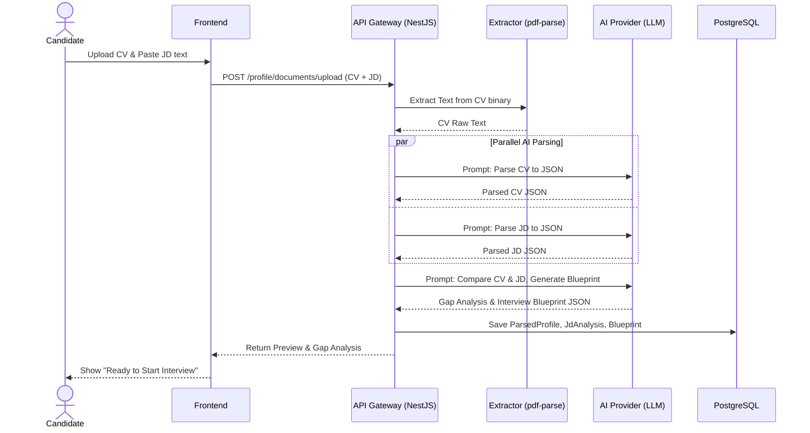

# F004 — JD & Resume Parsing for Tailored Interview

## 1. Tổng quan (Overview)
Tính năng **JD & Resume Parsing for Tailored Interview Experience** cho phép hệ thống cá nhân hóa hoàn toàn buổi phỏng vấn bằng cách dựa trên hai yếu tố: Hồ sơ cá nhân (CV/Resume) của ứng viên và Mô tả công việc (Job Description - JD) của vị trí ứng tuyển.
AI sẽ đóng vai trò như một Hiring Manager hoặc Tech Lead thực thụ của công ty mục tiêu, xoáy sâu vào các kinh nghiệm, dự án thực tế của ứng viên và đối chiếu với yêu cầu của JD để đánh giá sự phù hợp.

**Mục tiêu cốt lõi:**
- Cá nhân hóa bộ câu hỏi phỏng vấn, không dùng template tĩnh.
- Tìm ra "Gap" (khoảng cách) giữa kỹ năng hiện có và yêu cầu của JD.
- Đánh giá kinh nghiệm thực tế qua việc chất vấn sâu các dự án trên CV.

## 2. Yêu cầu chức năng (Functional Requirements)

| ID | Tên tính năng | Mô tả chi tiết |
|---|---|---|
| **FR-JDR-001** | Resume Upload | Hỗ trợ tải lên file PDF, DOCX (tối đa 5MB) tại bước Setup Interview. |
| **FR-JDR-002** | Resume Text Extraction | Trích xuất văn bản từ file (sử dụng pdf-parse cho PDF, mammoth cho DOCX). |
| **FR-JDR-003** | JD Input | Cho phép paste trực tiếp đoạn text JD hoặc nhập URL (hệ thống tự crawl text). |
| **FR-JDR-004** | AI CV Parsing | Dùng LLM (JSON format) để bóc tách: Personal info, Skills, Work timeline, Projects (vai trò, tech stack), Education. |
| **FR-JDR-005** | AI JD Parsing | Bóc tách JD: Required skills, Responsibilities, Seniority level, Domain/Company context. |
| **FR-JDR-006** | Gap Analysis | Phân tích và highlight: Skills matches (kỹ năng phù hợp) và Skills gap (kỹ năng còn thiếu/chưa rõ trên CV). |
| **FR-JDR-007** | Blueprint Generation | Dựa trên phân tích, tạo ra kịch bản phỏng vấn (Blueprint) gồm các chủ đề và tỷ trọng thời gian. |
| **FR-JDR-008** | Tailored Questioning | Sinh câu hỏi trong phiên phỏng vấn có trích dẫn trực tiếp từ CV. (VD: "Tôi thấy bạn dùng Kafka trong dự án X, bạn đã xử lý message ordering thế nào?"). |
| **FR-JDR-009** | Role-play Persona | Prompt cho AI đóng vai phỏng vấn viên phù hợp văn hóa công ty (nếu JD có đề cập) hoặc theo cấp bậc (Senior/Lead). |
| **FR-JDR-010** | Metadata Linking | Gắn metadata vào session phỏng vấn để truy xuất nguồn tài liệu trong report cuối cùng. |

## 3. Yêu cầu phi chức năng (Non-Functional Requirements)

| ID | Yêu cầu | Metric / Mức độ mong muốn |
|---|---|---|
| **NFR-JDR-001** | Processing Time | Quá trình parse CV + JD và tạo Blueprint phải hoàn tất < 10 giây để giữ trải nghiệm UX mượt mà. |
| **NFR-JDR-002** | Privacy & PII | Các thông tin nhạy cảm (SĐT, Email, Địa chỉ) phải được che (mask) hoặc không đưa vào context của AI phỏng vấn (Data minimization). |
| **NFR-JDR-003** | Retention Policy | File CV gốc sẽ tự động bị xóa (hard delete) khỏi hệ thống lưu trữ sau 30 ngày (hoặc ngay sau khi parse xong nếu không cần lưu). |
| **NFR-JDR-004** | File Support | Chỉ hỗ trợ PDF và DOCX thuần văn bản. PDF ảnh (scan) sẽ yêu cầu OCR (Phase sau). |

## 4. Thiết kế Kiến trúc (Architecture Design)

Hệ thống xử lý document sẽ được tách biệt thành một pipeline xử lý bất đồng bộ kết hợp xử lý đồng bộ để phản hồi cho giao diện.

### Diagram: Document Processing Pipeline



## 5. Database Schema

Mở rộng DB để lưu trữ thông tin parse từ CV và JD.

```prisma
// schema.prisma

model UserDocument {
  id              String   @id @default(uuid())
  userId          String
  user            User     @relation(fields: [userId], references: [id])
  fileName        String
  fileUrl         String   // Temp S3 URL (Optional)
  fileType        String   // PDF, DOCX
  rawText         String   @db.Text
  parsedProfile   ParsedProfile?
  createdAt       DateTime @default(now())
}

model ParsedProfile {
  id              String   @id @default(uuid())
  documentId      String   @unique
  document        UserDocument @relation(fields: [documentId], references: [id])
  skills          Json     // Array of strings
  experience      Json     // Array of objects (company, role, duration, projects)
  education       Json
  createdAt       DateTime @default(now())
}

model JdAnalysis {
  id              String   @id @default(uuid())
  rawJdText       String   @db.Text
  companyName     String?
  roleTitle       String?
  requiredSkills  Json     // Array of strings
  seniority       String?
  context         String?  @db.Text
  blueprints      InterviewBlueprint[]
  createdAt       DateTime @default(now())
}

model InterviewBlueprint {
  id              String   @id @default(uuid())
  interviewId     String   @unique
  jdAnalysisId    String
  jdAnalysis      JdAnalysis @relation(fields: [jdAnalysisId], references: [id])
  parsedProfileId String
  matchedSkills   Json     // Array of skills
  gapSkills       Json     // Array of skills missing in CV
  focusAreas      Json     // Array of generated topics/projects to focus
  createdAt       DateTime @default(now())
}
```

## 6. API Specification

### 6.1. Upload and Parse CV
`POST /api/v1/profile/documents/parse` (Multipart/form-data)

**Request:**
- `file`: (Binary file)
- `jdText`: (String, Optional) Mảng text mô tả JD.

**Response (200 OK):**
```json
{
  "documentId": "doc-123",
  "parsedProfile": {
    "skills": ["React", "Node.js", "AWS"],
    "experience": [
      {
         "role": "Backend Developer",
         "projects": ["Built e-commerce microservices..."]
      }
    ]
  },
  "jdAnalysis": {
    "roleTitle": "Senior Backend Engineer",
    "requiredSkills": ["Node.js", "Kafka", "AWS"]
  },
  "gapAnalysis": {
    "matches": ["Node.js", "AWS"],
    "gaps": ["Kafka"]
  }
}
```

### 6.2. Setup Interview from Blueprint
`POST /api/v1/interviews/setup/from-blueprint`

**Request:**
```json
{
  "documentId": "doc-123",
  "jdAnalysisId": "jd-456",
  "interviewDuration": 45,
  "difficulty": "HARD"
}
```

**Response:**
Returns `InterviewSession` id.

## 7. Frontend Design
- **Setup Flow Update**: Thay vì chỉ chọn form tĩnh (Ngôn ngữ, Framework), UI cung cấp màn hình "Tailor your interview".
- **Dropzone UI**: Khu vực upload CV lớn, hỗ trợ kéo thả.
- **JD Input**: Tabs cho phép dán Text hoặc URL.
- **Review Screen (Pre-interview)**:
  - Hiển thị Radar chart so sánh kỹ năng CV vs JD.
  - Hiển thị các chủ đề AI sẽ tập trung hỏi (Focus Areas).
  - Cho phép ứng viên loại bỏ/sửa lại thông tin AI parse sai trước khi bắt đầu.

## 8. Error Handling
- **Parse Failure**: Báo lỗi "Không thể đọc nội dung file" nếu file bị mã hóa, hỏng hoặc là ảnh scan. Gợi ý điền form thủ công.
- **JD Too Short/Ambiguous**: Báo AI không thể phân tích đủ yêu cầu công việc. Bắt buộc nhập ít nhất 100 từ.
- **Rate Limiting**: Giới hạn mỗi User chỉ được parse tối đa 10 tài liệu/ngày để chống spam API LLM.

## 9. Security
- API parse CV phải xác thực bằng Access Token.
- Trích xuất dữ liệu thực hiện In-memory, hạn chế lưu raw file vào disk nếu không cần thiết.
- Scrubbing logic: Xóa các thông tin cá nhân (PII) từ `parsedProfile` truyền vào context của AI phỏng vấn viên.

## 10. Testing
- **Unit Tests**: Kiểm thử các text extractor logic, xử lý dấu câu, format text.
- **AI Prompt Tests**: Dùng các bộ CV/JD mẫu đa dạng (Vietnamese/English, nhiều format) để đánh giá độ chính xác của JSON output từ AI.
- **Load Testing**: Xử lý 100 concurrent requests upload file lớn.

## 11. Rollout Strategy
- **Phase 1**: Hỗ trợ dán trực tiếp CV Text và JD Text (bỏ qua bước parse file phức tạp).
- **Phase 2**: Bổ sung PDF/DOCX Parser và UI trực quan báo cáo Gap Analysis.
- **Phase 3**: Hỗ trợ Crawl JD trực tiếp từ Link (LinkedIn, ITviec, TopCV).

## 12. Estimates
- Backend Parsing Pipeline: 4 MD
- AI Prompt Engineering & Evaluation: 3 MD
- Frontend Setup Flow & UI Components: 5 MD
- Testing & Security Audits: 2 MD
- **Total:** ~14 MD (Man-Days)
