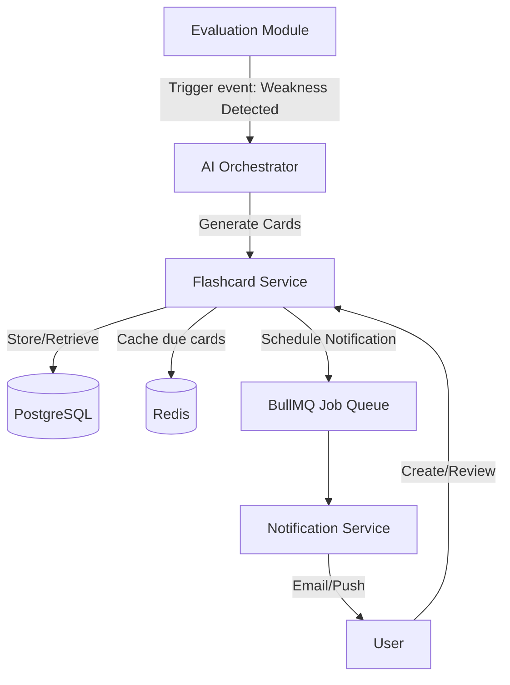

# F005 — Spaced Repetition Drills & Smart Flashcards

## 1. Tổng quan
Module Spaced Repetition Drills & Smart Flashcards (Thẻ ghi nhớ thông minh & Lặp lại ngắt quãng) đóng vai trò then chốt trong việc giúp ứng viên củng cố kiến thức và khắc phục điểm yếu sau các phiên phỏng vấn. Bằng cách tự động chuyển đổi các lỗ hổng kiến thức từ kết quả đánh giá thành thẻ ghi nhớ, kết hợp thuật toán FSRS (Free Spaced Repetition Scheduler), hệ thống đảm bảo việc ôn tập đạt hiệu quả cao nhất với thời gian tối thiểu. Module này sẽ tích hợp sâu vào hệ sinh thái hiện tại của nền tảng (LearningPath, Evaluation) để tạo ra vòng lặp học tập liên tục.

## 2. Yêu cầu chức năng

| ID | Tên chức năng | Mô tả chi tiết | Mức độ |
|---|---|---|---|
| FR-SRS-001 | Tự động tạo Flashcard | Tự động trích xuất các điểm yếu (weaknesses) từ module Đánh giá (Evaluation) để tạo flashcard. | Cao |
| FR-SRS-002 | Tạo Flashcard thủ công | Hỗ trợ người dùng tự tạo flashcard tuỳ chỉnh (Concept, Code snippet, MCQ). | Trung bình |
| FR-SRS-003 | Lên lịch ôn tập bằng FSRS | Áp dụng thuật toán FSRS tính toán thời điểm ôn tập tiếp theo dựa trên (Difficulty, Stability, Retrievability). | Cao |
| FR-SRS-004 | Quản lý Bộ bài (Deck) | Tổ chức flashcard thành các Deck theo từng lĩnh vực (Core Java, System Design, etc.). | Cao |
| FR-SRS-005 | Phiên ôn tập (Review Session) | Giao diện hiển thị flashcard lật mặt, với các lựa chọn đánh giá: Again (1), Hard (2), Good (3), Easy (4). | Cao |
| FR-SRS-006 | Gamification & Streak | Theo dõi chuỗi ngày học liên tục (Streak), thống kê dưới dạng Heatmap calendar. | Trung bình |
| FR-SRS-007 | Export/Import | Hỗ trợ xuất/nhập dữ liệu flashcard tương thích định dạng Anki. | Thấp |
| FR-SRS-008 | Thông báo nhắc nhở | Gửi Email Digest & Push Notification hằng ngày với danh sách "Due cards". | Cao |

## 3. Yêu cầu phi chức năng
| ID | Yêu cầu | Chỉ số mục tiêu (SLO) |
|---|---|---|
| NFR-SRS-001 | Hiệu năng phiên ôn tập | Thời gian tải thẻ kế tiếp < 200ms (P95). |
| NFR-SRS-002 | Khả năng Offline | Hỗ trợ ôn tập Offline qua PWA (Service Worker) và đồng bộ khi Online. |
| NFR-SRS-003 | Độ trễ tạo thẻ tự động | Thời gian AI generate < 5s cho mỗi thẻ. |
| NFR-SRS-004 | Khả năng mở rộng | Chịu tải tối thiểu 10,000 phiên ôn tập đồng thời. |

## 4. Thiết kế Kiến trúc

### Thuật toán FSRS
Hệ thống sử dụng FSRS v4, quản lý trạng thái của từng thẻ qua 3 tham số chính:
- **Difficulty (D):** Độ khó nội tại của thẻ (1-10).
- **Stability (S):** Độ ổn định của trí nhớ (thời gian trước khi khả năng nhớ tụt xuống 90%).
- **Retrievability (R):** Xác suất nhớ lại thông tin thành công ở hiện tại.

### System Diagram


## 5. Thiết kế CSDL (Prisma Schema)

```prisma
model FlashcardDeck {
  id          String   @id @default(uuid())
  userId      String
  name        String
  description String?
  tags        String[]
  createdAt   DateTime @default(now())
  updatedAt   DateTime @updatedAt

  flashcards  Flashcard[]
}

enum CardType {
  CONCEPT
  CODE_SNIPPET
  SCENARIO
  MCQ
}

model Flashcard {
  id             String        @id @default(uuid())
  deckId         String
  deck           FlashcardDeck @relation(fields: [deckId], references: [id])
  type           CardType
  frontContent   String        @db.Text
  backContent    String        @db.Text
  metadata       Json?         // Source interview ID, AI metadata
  
  // FSRS State
  due            DateTime      @default(now())
  stability      Float         @default(0)
  difficulty     Float         @default(0)
  elapsedDays    Int           @default(0)
  scheduledDays  Int           @default(0)
  reps           Int           @default(0)
  lapses         Int           @default(0)
  state          CardState     @default(NEW)
  lastReview     DateTime?

  createdAt      DateTime      @default(now())
  updatedAt      DateTime      @updatedAt

  reviewLogs     ReviewLog[]
}

enum CardState {
  NEW
  LEARNING
  REVIEW
  RELEARNING
}

model ReviewLog {
  id           String    @id @default(uuid())
  flashcardId  String
  flashcard    Flashcard @relation(fields: [flashcardId], references: [id])
  rating       Int       // 1: Again, 2: Hard, 3: Good, 4: Easy
  state        CardState
  due          DateTime
  stability    Float
  difficulty   Float
  elapsedDays  Int
  lastElapsed  Int
  scheduledDays Int
  reviewTime   DateTime  @default(now())
  durationMs   Int
}
```

## 6. Đặc tả API

### `GET /api/v1/flashcards/due`
Lấy danh sách các thẻ cần ôn tập hôm nay cho một Deck cụ thể.
**Query:** `?deckId={id}&limit=50`
**Response (200 OK):**
```json
{
  "data": [
    {
      "id": "card-123",
      "type": "CONCEPT",
      "frontContent": "Giải thích khái niệm Event Loop trong Node.js",
      "backContent": "Event Loop là cơ chế...",
      "due": "2023-11-01T00:00:00Z"
    }
  ],
  "meta": {
    "totalDue": 120
  }
}
```

### `POST /api/v1/flashcards/:id/review`
Ghi nhận kết quả ôn tập một thẻ và cập nhật trạng thái FSRS.
**Request Body:**
```json
{
  "rating": 3, 
  "durationMs": 4500
}
```

### `GET /api/v1/flashcards/stats`
Lấy dữ liệu thống kê heatmap và streak.

## 7. Thiết kế Frontend
- **Công nghệ:** React, Zustand (state), Framer Motion (animation), TanStack Query.
- **UI Components:**
  - `FlashcardReviewSession`: Quản lý luồng lật thẻ, hiển thị Progress Bar.
  - `FlipCard`: Component 3D dùng CSS Transform để lật mặt thẻ.
  - `HeatmapCalendar`: Dùng `react-calendar-heatmap` để hiển thị chuỗi ngày học.
- **Offline Mode:** Tích hợp `workbox` tạo Service Worker. Sync queue lưu tạm các request `/review` trong IndexedDB khi mất mạng và đẩy lên server khi có kết nối lại.

## 8. Quản lý trạng thái (State Management)
- **Zustand Store:** `useFlashcardStore` quản lý trạng thái phiên học hiện tại (số thẻ còn lại, số thẻ đã học, bộ đếm thời gian).
- **TanStack Query:** Caching danh sách Decks và History, tự động invalidate sau mỗi phiên học kết thúc.

## 9. Bảo mật & Phân quyền
- API Endpoints đều yêu cầu JWT Token (Guard: `JwtAuthGuard`).
- **Data Isolation:** `deckId` và `flashcardId` phải thuộc về `userId` của người đang gửi request (xác minh ở Service layer, chặn IDOR).
- **Rate Limiting:** `/review` endpoint giới hạn 100 requests/phút/user tránh abuse spam.

## 10. Luồng xử lý lỗi (Error Handling)
- **AI Generation Failure:** Trả về HTTP 503 cho client kèm message "Hệ thống AI đang quá tải, vui lòng thử lại tạo tự động sau".
- **Offline Review Sync Error:** Giữ lại logs trong IndexedDB với trạng thái `FAILED`, có nút cho user trigger thủ công.

## 11. Số liệu & Đánh giá (Metrics & Monitoring)
- Theo dõi `flashcard.generation_time` qua Prometheus.
- Theo dõi `review.daily_active_users` (DAU) trên module học tập.
- Chỉ số Business: Tỉ lệ chuyển đổi từ Interview Result -> Tạo thẻ -> Ôn tập.

## 12. Kế hoạch triển khai
- **Phase 1 (Tuần 1-2):** Xây dựng CRUD API, Prisma schema, FSRS logic (backend).
- **Phase 2 (Tuần 3-4):** Tích hợp AI tạo flashcard tự động từ Evaluation Module.
- **Phase 3 (Tuần 5-6):** Xây dựng Frontend PWA, animation và Heatmap.
- **Phase 4 (Tuần 7):** Beta Testing nội bộ, fix bug Offline Mode. Release ra môi trường Production.
