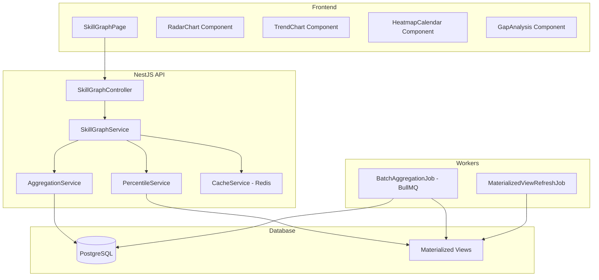
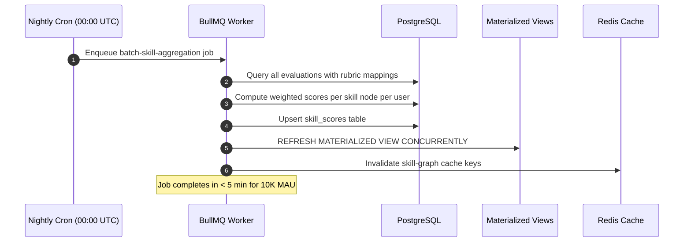
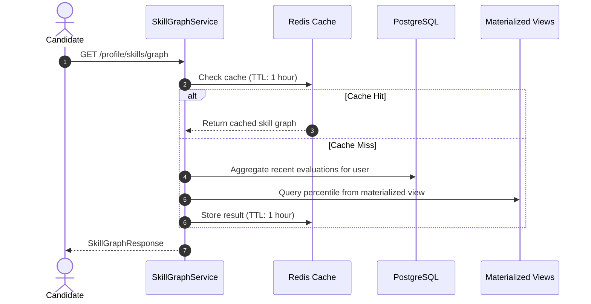

# F008 — Skill Graph & Candidate Benchmark Percentile

> **Phiên bản**: 1.0  
> **Trạng thái**: Draft  
> **Ngày tạo**: 2026-08-24  
> **Bounded Context**: Analytics, Learning, Profile  
> **Ưu tiên**: P3 — Phase 2  
> **Phụ thuộc**: Evaluation module (hiện có), Taxonomy module (hiện có)

---

## 1. Tổng quan (Overview)

### 1.1. Mô tả tính năng

Skill Graph & Candidate Benchmark xây dựng một **đồ thị năng lực đa chiều (Multi-dimensional Knowledge Graph)** cho mỗi ứng viên, tổng hợp điểm số từ nhiều phiên phỏng vấn theo cây phân cấp: **Competency Area → Sub-competency → Topic**. Hệ thống tính toán **phần trăm xếp hạng (Percentile Ranking)** so sánh năng lực ứng viên với cộng đồng theo từng role và seniority level, đồng thời cung cấp **biểu đồ radar đa trục**, **biểu đồ xu hướng theo thời gian**, và **báo cáo gap analysis** giữa năng lực hiện tại và yêu cầu vị trí mục tiêu.

### 1.2. Vấn đề giải quyết (Problem Statement)

- Ứng viên hiện chỉ thấy điểm số theo từng session riêng lẻ, **không có bức tranh tổng thể** về năng lực kỹ thuật.
- Không có cơ chế **so sánh với cộng đồng** để biết mình đang ở đâu.
- Thiếu **xu hướng tiến bộ** (progress trend) theo thời gian giúp đo lường hiệu quả luyện tập.
- Không có công cụ **gap analysis** giữa skill hiện tại và yêu cầu của vị trí mục tiêu.

### 1.3. Giá trị mang lại (Value Proposition)

| Giá trị | Mô tả |
|---|---|
| **Tự nhận thức** | Ứng viên hiểu rõ điểm mạnh/yếu trên bản đồ năng lực toàn diện |
| **Động lực luyện tập** | So sánh percentile tạo mục tiêu cụ thể: "Đạt top 20% System Design" |
| **Quyết định dựa trên dữ liệu** | Gap analysis giúp chọn đúng kỹ năng cần ưu tiên cải thiện |
| **Đo lường hiệu quả** | Biểu đồ trend cho thấy tốc độ tiến bộ sau mỗi tuần luyện tập |
| **B2B Analytics** | Cơ sở dữ liệu benchmark phục vụ tính năng B2B cohort analytics (F011) |

### 1.4. Personas thụ hưởng

- **Candidate**: Xem skill graph cá nhân, percentile ranking, và gap analysis.
- **Platform Admin**: Truy cập aggregated benchmark data để giám sát chất lượng.
- **Tenant Instructor** (Phase 2 — F011): Xem skill graph cohort trung bình.

---

## 2. Yêu cầu chức năng (Functional Requirements)

### 2.1. Skill Taxonomy Tree

| ID | Yêu cầu | Độ ưu tiên |
|---|---|---|
| `FR-SKG-001` | Định nghĩa cây phân cấp kỹ năng 3 cấp: **CompetencyArea → SubCompetency → Topic** | MUST |
| `FR-SKG-002` | Mỗi `CompetencyArea` tương ứng với enum hiện có: `SYSTEM_DESIGN`, `LANGUAGE_CORE`, `DATABASE_CONCURRENCY`, `ARCHITECTURE_PATTERNS`, `RESILIENCE_SECURITY` | MUST |
| `FR-SKG-003` | Mỗi `SubCompetency` có weight mặc định và có thể cấu hình bởi Admin | SHOULD |
| `FR-SKG-004` | Admin có thể thêm/sửa/deactivate topic trong cây mà không ảnh hưởng dữ liệu lịch sử | MUST |

### 2.2. Score Aggregation

| ID | Yêu cầu | Độ ưu tiên |
|---|---|---|
| `FR-SKG-005` | Tổng hợp điểm trung bình có trọng số (weighted average) theo cây skill từ evaluation rubric scores | MUST |
| `FR-SKG-006` | Chỉ tổng hợp evaluation có cùng rubric version hoặc đã được normalize | MUST |
| `FR-SKG-007` | Yêu cầu **tối thiểu 3 evaluations** trên một skill node trước khi hiển thị percentile (minimum evidence threshold) | MUST |
| `FR-SKG-008` | Áp dụng **exponential decay** cho điểm cũ: điểm gần đây có trọng số cao hơn | SHOULD |
| `FR-SKG-009` | Recalculation chạy batch mỗi đêm (00:00 UTC) và on-demand khi user xem | MUST |

**Công thức Exponential Decay Score:**

$$S_{\text{weighted}} = \frac{\sum_{i=1}^{n} s_i \cdot e^{-\lambda \cdot \Delta t_i}}{\sum_{i=1}^{n} e^{-\lambda \cdot \Delta t_i}}$$

Trong đó:
- $s_i$ = điểm evaluation thứ $i$
- $\Delta t_i$ = số ngày từ evaluation $i$ đến hiện tại
- $\lambda$ = decay rate (mặc định `0.01`, cấu hình qua `SKILL_DECAY_RATE`)

### 2.3. Percentile Calculation Engine

| ID | Yêu cầu | Độ ưu tiên |
|---|---|---|
| `FR-SKG-010` | Tính percentile ranking cho mỗi skill node theo **cùng role + level** | MUST |
| `FR-SKG-011` | Tính percentile tổng (overall) không phân biệt role/level | SHOULD |
| `FR-SKG-012` | Sử dụng **approximate percentile** (t-digest hoặc percentile_cont) trên PostgreSQL | MUST |
| `FR-SKG-013` | Cache percentile kết quả vào materialized view, refresh mỗi 6 giờ | MUST |
| `FR-SKG-014` | Không hiển thị percentile khi tổng số user trong cohort < 30 (statistical significance) | MUST |
| `FR-SKG-015` | Anonymize: không bao giờ tiết lộ danh tính user khác trong dữ liệu benchmark | MUST |

**Công thức Percentile:**

$$P_k = \frac{|\{x_i \in S : x_i < v\}|}{|S|} \times 100$$

Trong đó $S$ là tập điểm của tất cả user trong cùng cohort (role + level), $v$ là điểm của user hiện tại.

### 2.4. Visualization

| ID | Yêu cầu | Độ ưu tiên |
|---|---|---|
| `FR-SKG-016` | **Radar Chart** (Spider Chart) hiển thị 5 trục competency area với nhãn và giá trị | MUST |
| `FR-SKG-017` | Overlay radar: so sánh profile hiện tại vs target role requirement | SHOULD |
| `FR-SKG-018` | **Time-series Line Chart**: xu hướng điểm theo tuần/tháng cho mỗi competency | MUST |
| `FR-SKG-019` | **Heatmap Calendar**: ngày luyện tập và cường độ (số session) theo kiểu GitHub contribution graph | SHOULD |
| `FR-SKG-020` | Mọi chart phải có text/table alternative cho accessibility (WCAG 2.2 AA) | MUST |

### 2.5. Gap Analysis & Recommendations

| ID | Yêu cầu | Độ ưu tiên |
|---|---|---|
| `FR-SKG-021` | So sánh skill profile hiện tại với yêu cầu tối thiểu của target role | MUST |
| `FR-SKG-022` | Hiển thị top 3 kỹ năng cần cải thiện nhiều nhất (largest gap) | MUST |
| `FR-SKG-023` | Link đến Focused Remediation mode (hiện có) cho mỗi gap | SHOULD |
| `FR-SKG-024` | Weekly/monthly progress email digest (opt-in) | COULD |

### 2.6. Export & Reporting

| ID | Yêu cầu | Độ ưu tiên |
|---|---|---|
| `FR-SKG-025` | Xuất skill report dạng PDF bao gồm radar chart, percentile, gap analysis | SHOULD |
| `FR-SKG-026` | Export dữ liệu skill graph dạng JSON (GDPR compliance) | MUST |

---

## 3. Yêu cầu phi chức năng (Non-Functional Requirements)

| ID | Yêu cầu | Target |
|---|---|---|
| `NFR-SKG-001` | Thời gian load trang Skill Graph (bao gồm radar + percentile) | p95 < 500ms |
| `NFR-SKG-002` | Percentile batch recalculation cho 10.000 MAU | < 5 phút |
| `NFR-SKG-003` | On-demand recalculation cho một user | < 2 giây |
| `NFR-SKG-004` | Materialized view refresh (incremental) | < 30 giây |
| `NFR-SKG-005` | Privacy: tất cả benchmark data phải anonymized, aggregated | 100% |
| `NFR-SKG-006` | Statistical significance: không hiển thị percentile nếu cohort < 30 users | Enforced |
| `NFR-SKG-007` | Chart rendering performance (client-side) | < 100ms |
| `NFR-SKG-008` | Accessibility: mọi visualization có screen reader alternative | WCAG 2.2 AA |

---

## 4. Thiết kế Kiến trúc (Architecture Design)

### 4.1. Component Overview



### 4.2. Aggregation Pipeline



### 4.3. On-Demand Calculation Flow



---

## 5. Thiết kế Database Schema

### 5.1. Prisma Schema Additions

```prisma
// ============================================================
// Skill Graph & Benchmark Models
// ============================================================

model SkillNode {
  id            String         @id @default(uuid()) @db.Uuid
  parentId      String?        @map("parent_id") @db.Uuid
  competencyArea CompetencyArea? @map("competency_area")
  slug          String         @unique @db.VarChar(100)
  name          String         @db.VarChar(200)
  nameVi        String?        @map("name_vi") @db.VarChar(200)
  description   String?        @db.Text
  level         Int            @default(1) // 1=area, 2=sub, 3=topic
  weight        Float          @default(1.0)
  isActive      Boolean        @default(true) @map("is_active")
  order         Int            @default(0)
  createdAt     DateTime       @default(now()) @map("created_at")
  updatedAt     DateTime       @updatedAt @map("updated_at")

  parent        SkillNode?     @relation("SkillHierarchy", fields: [parentId], references: [id])
  children      SkillNode[]    @relation("SkillHierarchy")
  skillScores   SkillScore[]

  @@index([parentId])
  @@index([competencyArea])
  @@index([level, isActive])
  @@map("skill_nodes")
}

model SkillScore {
  id              String    @id @default(uuid()) @db.Uuid
  userId          String    @map("user_id") @db.Uuid
  skillNodeId     String    @map("skill_node_id") @db.Uuid
  rawScore        Float     @map("raw_score")        // Unweighted average
  weightedScore   Float     @map("weighted_score")   // Exponential decay weighted
  evidenceCount   Int       @map("evidence_count")   // Number of evaluations
  lastEvaluatedAt DateTime  @map("last_evaluated_at")
  rubricVersion   String    @map("rubric_version") @db.VarChar(50)
  calculatedAt    DateTime  @default(now()) @map("calculated_at")

  user            User      @relation(fields: [userId], references: [id], onDelete: Cascade)
  skillNode       SkillNode @relation(fields: [skillNodeId], references: [id], onDelete: Cascade)

  @@unique([userId, skillNodeId])
  @@index([userId])
  @@index([skillNodeId])
  @@index([weightedScore])
  @@map("skill_scores")
}

model BenchmarkSnapshot {
  id              String         @id @default(uuid()) @db.Uuid
  skillNodeId     String         @map("skill_node_id") @db.Uuid
  jobRoleSlug     String?        @map("job_role_slug") @db.VarChar(50)
  senioritySlug   String?        @map("seniority_slug") @db.VarChar(50)
  cohortSize      Int            @map("cohort_size")
  p25             Float          // 25th percentile score
  p50             Float          // Median
  p75             Float          // 75th percentile score
  p90             Float          // 90th percentile score
  mean            Float
  stdDev          Float          @map("std_dev")
  calculatedAt    DateTime       @default(now()) @map("calculated_at")

  @@unique([skillNodeId, jobRoleSlug, senioritySlug])
  @@index([skillNodeId])
  @@index([calculatedAt])
  @@map("benchmark_snapshots")
}
```

### 5.2. Materialized View (SQL)

```sql
-- Materialized view cho percentile calculation
CREATE MATERIALIZED VIEW IF NOT EXISTS mv_skill_percentiles AS
SELECT
  ss.skill_node_id,
  jr.slug AS job_role_slug,
  sl.slug AS seniority_slug,
  COUNT(DISTINCT ss.user_id) AS cohort_size,
  PERCENTILE_CONT(0.25) WITHIN GROUP (ORDER BY ss.weighted_score) AS p25,
  PERCENTILE_CONT(0.50) WITHIN GROUP (ORDER BY ss.weighted_score) AS p50,
  PERCENTILE_CONT(0.75) WITHIN GROUP (ORDER BY ss.weighted_score) AS p75,
  PERCENTILE_CONT(0.90) WITHIN GROUP (ORDER BY ss.weighted_score) AS p90,
  AVG(ss.weighted_score) AS mean,
  STDDEV(ss.weighted_score) AS std_dev
FROM skill_scores ss
JOIN users u ON u.id = ss.user_id
JOIN user_profiles up ON up.user_id = u.id
LEFT JOIN job_roles jr ON jr.id = (
  SELECT is2.job_role_id FROM interview_sessions is2
  WHERE is2.user_id = u.id
  ORDER BY is2.created_at DESC LIMIT 1
)
LEFT JOIN seniority_levels sl ON sl.id = (
  SELECT is3.seniority_level_id FROM interview_sessions is3
  WHERE is3.user_id = u.id
  ORDER BY is3.created_at DESC LIMIT 1
)
WHERE ss.evidence_count >= 3
GROUP BY ss.skill_node_id, jr.slug, sl.slug
HAVING COUNT(DISTINCT ss.user_id) >= 30;

CREATE UNIQUE INDEX idx_mv_skill_percentiles
ON mv_skill_percentiles (skill_node_id, job_role_slug, seniority_slug);
```

### 5.3. Migration Strategy

1. Tạo migration thêm bảng `skill_nodes`, `skill_scores`, `benchmark_snapshots`.
2. Seed dữ liệu `skill_nodes` mặc định (5 areas × 4 sub-competencies × 5 topics = 105 nodes).
3. Chạy batch job backfill `skill_scores` từ evaluations hiện có.
4. Tạo materialized view sau khi có đủ dữ liệu.

---

## 6. API Specification

### 6.1. Endpoints

#### `GET /api/v1/profile/skills/graph`

Trả về skill graph đầy đủ cho user hiện tại.

**Response 200:**
```json
{
  "data": {
    "userId": "uuid",
    "calculatedAt": "2026-08-24T00:00:00Z",
    "totalSessions": 15,
    "totalEvaluations": 42,
    "competencies": [
      {
        "area": "SYSTEM_DESIGN",
        "name": "System Design",
        "nameVi": "Thiết kế Hệ thống",
        "weightedScore": 7.2,
        "rawScore": 6.8,
        "evidenceCount": 12,
        "trend": "IMPROVING",
        "trendDelta": 0.8,
        "subCompetencies": [
          {
            "slug": "scalability",
            "name": "Scalability",
            "weightedScore": 8.1,
            "evidenceCount": 5,
            "topics": [
              {
                "slug": "horizontal-scaling",
                "name": "Horizontal Scaling",
                "weightedScore": 7.5,
                "evidenceCount": 3
              }
            ]
          }
        ]
      }
    ],
    "overallScore": 6.5,
    "strengths": ["ARCHITECTURE_PATTERNS", "LANGUAGE_CORE"],
    "growthAreas": ["DATABASE_CONCURRENCY", "RESILIENCE_SECURITY"]
  }
}
```

#### `GET /api/v1/profile/skills/benchmark`

**Query Parameters:**
- `jobRole` (optional): Filter cohort by job role slug
- `seniorityLevel` (optional): Filter cohort by seniority slug

**Response 200:**
```json
{
  "data": {
    "userId": "uuid",
    "cohort": {
      "jobRole": "backend-engineer",
      "seniorityLevel": "mid",
      "cohortSize": 245
    },
    "competencies": [
      {
        "area": "SYSTEM_DESIGN",
        "userScore": 7.2,
        "percentile": 72,
        "benchmarks": {
          "p25": 4.5,
          "p50": 6.0,
          "p75": 7.8,
          "p90": 8.9,
          "mean": 6.2,
          "stdDev": 1.8
        }
      }
    ],
    "overallPercentile": 65,
    "lastUpdated": "2026-08-24T06:00:00Z"
  }
}
```

#### `GET /api/v1/profile/skills/progress`

**Query Parameters:**
- `period`: `7d`, `30d`, `90d`, `180d`, `365d` (default: `30d`)
- `competency` (optional): Filter by specific competency area

**Response 200:**
```json
{
  "data": {
    "period": "30d",
    "dataPoints": [
      {
        "date": "2026-07-25",
        "scores": {
          "SYSTEM_DESIGN": 6.5,
          "LANGUAGE_CORE": 7.0,
          "DATABASE_CONCURRENCY": 5.2,
          "ARCHITECTURE_PATTERNS": 7.8,
          "RESILIENCE_SECURITY": 4.9
        },
        "sessionsCompleted": 2
      }
    ],
    "velocity": {
      "SYSTEM_DESIGN": { "delta": 0.7, "trend": "IMPROVING" },
      "DATABASE_CONCURRENCY": { "delta": -0.3, "trend": "DECLINING" }
    }
  }
}
```

#### `GET /api/v1/profile/skills/gaps`

**Response 200:**
```json
{
  "data": {
    "targetRole": "backend-engineer",
    "targetLevel": "senior",
    "gaps": [
      {
        "competency": "RESILIENCE_SECURITY",
        "currentScore": 4.9,
        "targetMinScore": 7.0,
        "gap": 2.1,
        "priority": "HIGH",
        "suggestedActions": [
          {
            "type": "FOCUSED_REMEDIATION",
            "description": "Luyện 3 session Focused Remediation về Security Patterns",
            "link": "/interviews/new?mode=FOCUSED_REMEDIATION&competency=RESILIENCE_SECURITY"
          }
        ]
      }
    ]
  }
}
```

#### `GET /api/v1/admin/benchmarks/overview`

**Response 200** (Admin only):
```json
{
  "data": {
    "totalUsersWithScores": 2450,
    "cohorts": [
      {
        "jobRole": "backend-engineer",
        "seniorityLevel": "mid",
        "userCount": 245,
        "meanOverallScore": 6.2,
        "scoreTrend": "STABLE"
      }
    ],
    "lastRefreshed": "2026-08-24T06:00:00Z"
  }
}
```

---

## 7. Thiết kế Frontend

### 7.1. Pages & Components

| Component | Mô tả | Vị trí |
|---|---|---|
| `SkillGraphPage` | Trang chính hiển thị toàn bộ skill graph | `features/skills/SkillGraphPage.tsx` |
| `CompetencyRadarOverlay` | Radar chart với overlay so sánh (user vs target) | `components/analytics/CompetencyRadarOverlay.tsx` |
| `SkillTreeView` | Tree view expand/collapse hiển thị chi tiết skill nodes | `components/analytics/SkillTreeView.tsx` |
| `ProgressTrendChart` | Line chart xu hướng theo thời gian (Recharts) | `components/analytics/ProgressTrendChart.tsx` (enhance) |
| `HeatmapCalendar` | Calendar heatmap kiểu GitHub contribution | `components/analytics/HeatmapCalendar.tsx` |
| `GapAnalysisCard` | Card hiển thị gap với action links | `components/analytics/GapAnalysisCard.tsx` |
| `PercentileBadge` | Badge hiển thị "Top 15% Senior Backend" | `components/analytics/PercentileBadge.tsx` |

### 7.2. State Management

```typescript
// stores/skillGraphStore.ts
interface SkillGraphState {
  skillGraph: SkillGraphResponse | null;
  benchmark: BenchmarkResponse | null;
  progress: ProgressResponse | null;
  selectedPeriod: '7d' | '30d' | '90d' | '180d' | '365d';
  selectedCompetency: CompetencyArea | null;
  isLoading: boolean;
}
```

### 7.3. Chart Library

- **Radar Chart**: Mở rộng `CompetencyRadarChart.tsx` hiện có (SVG custom) với overlay capability.
- **Line Chart**: Sử dụng **Recharts** (`recharts`) cho time-series.
- **Heatmap**: Custom SVG component hoặc `react-activity-calendar`.
- **Tree View**: Custom collapsible tree với Tailwind.

---

## 8. Xử lý Lỗi & Edge Cases

| Tình huống | Xử lý |
|---|---|
| User chưa có đủ 3 evaluations trên một skill | Hiển thị "Chưa đủ dữ liệu" với badge, ẩn percentile |
| Cohort < 30 users | Ẩn percentile, hiển thị "Chưa đủ dữ liệu cộng đồng" |
| Rubric version thay đổi | Chỉ aggregate cùng version, cảnh báo nếu có mixed versions |
| Materialized view đang refresh | Serve stale data từ cache, không block user |
| Batch job thất bại | Retry 3 lần, alert Admin, serve cached data |
| Lỗ hổng privacy: percentile leak | Không bao giờ trả về raw scores của user khác |

---

## 9. Bảo mật & Quyền riêng tư

| Yêu cầu | Giải pháp |
|---|---|
| **Anonymization** | Benchmark data chỉ chứa aggregated statistics, không bao giờ chứa userId |
| **Access Control** | User chỉ xem skill graph của mình; Admin xem overview aggregated |
| **Data Minimization** | Percentile tính từ aggregated view, không query raw evaluations của user khác |
| **GDPR Export** | Skill scores nằm trong GDPR export (`/profile/export`) |
| **Deletion** | Xóa user cascade xóa `skill_scores`; benchmark view tự điều chỉnh khi refresh |
| **Audit** | Mọi batch recalculation ghi AuditLog |

---

## 10. Chiến lược Testing

### 10.1. Unit Tests

- `SkillAggregationService`: Test exponential decay calculation với various $\lambda$ values.
- `PercentileService`: Test percentile calculation với known datasets.
- `SkillTreeBuilder`: Test tree construction từ flat list.

### 10.2. Integration Tests

- API endpoint tests cho `/profile/skills/graph`, `/profile/skills/benchmark`.
- Test materialized view refresh cycle.
- Test cache invalidation flow.

### 10.3. Performance Tests

- Benchmark batch aggregation job với 10K+ users.
- Load test API endpoint với concurrent requests.

### 10.4. Data Quality Tests

- Verify percentile accuracy against manual calculation on golden dataset.
- Test rubric version normalization.
- Verify anonymization: no PII in benchmark responses.

---

## 11. Kế hoạch Triển khai (Rollout Plan)

### Phase 1: Skill Score Aggregation (2 ngày)
- Tạo database tables và migration.
- Implement `SkillAggregationService`.
- Backfill historical evaluations.

### Phase 2: Percentile Engine (2 ngày)
- Tạo materialized views.
- Implement `PercentileService`.
- Setup batch cron job.

### Phase 3: API & Frontend (3 ngày)
- Build REST endpoints.
- Build frontend components (radar, trend, heatmap).
- Integrate with existing ProfilePage.

### Feature Flag: `FEATURE_SKILL_GRAPH` (default: `false`)

### Monitoring
- Alert khi batch job > 10 phút.
- Alert khi cache miss rate > 50%.
- Dashboard: cohort size distribution, avg calculation time.

---

## 12. Ước lượng (Estimates)

### Development Effort

| Task | Ước lượng |
|---|---|
| Database schema & migration | 1 ngày |
| Skill aggregation service + batch job | 2 ngày |
| Percentile engine + materialized views | 2 ngày |
| REST API endpoints | 1 ngày |
| Frontend: Radar overlay, trend chart, heatmap | 3 ngày |
| Gap analysis component | 1 ngày |
| Testing (unit, integration, perf) | 2 ngày |
| **Tổng** | **12 ngày** |

### Infrastructure Cost

| Resource | Chi phí ước tính |
|---|---|
| PostgreSQL materialized view refresh | Negligible (existing DB) |
| Redis cache for skill graphs | ~50MB additional |
| BullMQ batch job (nightly) | < 1 min CPU |
| **Tổng bổ sung** | **~\$0/tháng** (sử dụng hạ tầng hiện có) |

### Dependencies & Prerequisites

- Evaluation module hiện có (đang hoạt động) ✅
- Taxonomy module hiện có (đang hoạt động) ✅
- CompetencyRadarChart component hiện có ✅
- Redis cache hiện có ✅
- BullMQ worker hiện có ✅
