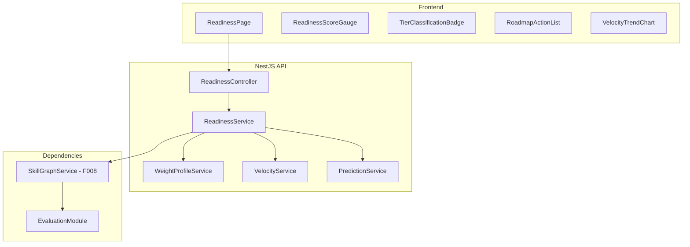
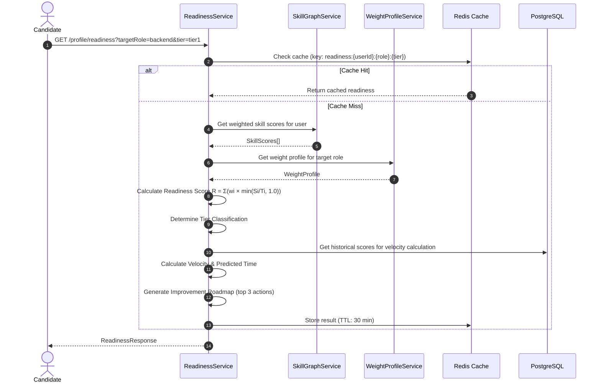

# F009 — AI Interview Readiness Score & Offer Predictor

> **Phiên bản**: 1.0  
> **Trạng thái**: Draft  
> **Ngày tạo**: 2026-08-24  
> **Bounded Context**: Analytics, Learning, Profile  
> **Ưu tiên**: P3 — Phase 2  
> **Phụ thuộc**: F008 Skill Graph (bắt buộc), Evaluation module (hiện có)

---

## 1. Tổng quan (Overview)

### 1.1. Mô tả tính năng

AI Interview Readiness Score là một **chỉ số tổng hợp (0–100%)** đánh giá mức độ sẵn sàng của ứng viên cho một vị trí mục tiêu cụ thể. Hệ thống tính toán readiness dựa trên **trọng số năng lực theo từng dimension**, phân loại ứng viên vào các **tier công ty** (Big Tech / Tier-2 / Startup), cung cấp **dự báo thời gian cần thiết** để đạt mức sẵn sàng, và đề xuất **lộ trình cải thiện ưu tiên**.

### 1.2. Vấn đề giải quyết (Problem Statement)

- Ứng viên **không biết mình đã sẵn sàng chưa** cho vị trí mục tiêu, dẫn đến tâm lý lo lắng hoặc tự tin thái quá.
- Thiếu **tiêu chí khách quan** để quyết định thời điểm nộp đơn ứng tuyển.
- Không có công cụ **so sánh mức yêu cầu** giữa các tier công ty.
- Thiếu **dự báo dựa trên dữ liệu** về tốc độ tiến bộ và thời gian cần thiết.

### 1.3. Giá trị mang lại (Value Proposition)

| Giá trị | Mô tả |
|---|---|
| **Rõ ràng mục tiêu** | Ứng viên biết chính xác mình cần cải thiện gì để đạt mức sẵn sàng |
| **Tối ưu thời gian** | Dự báo giúp lên kế hoạch luyện tập hiệu quả |
| **Tự tin ứng tuyển** | Readiness Score 85%+ tạo confidence để nộp đơn |
| **Động lực liên tục** | Milestones và celebrations tạo engagement loop |
| **B2B Value** | Trường/Bootcamp dùng để đánh giá sinh viên trước khi giới thiệu đến nhà tuyển dụng |

### 1.4. Personas thụ hưởng

- **Candidate**: Xem readiness score, tier classification, improvement roadmap.
- **Mentor** (Phase 2): Tham khảo readiness để đánh giá sinh viên.
- **Tenant Instructor** (F011): Theo dõi readiness cohort trước khi kết thúc khóa học.

---

## 2. Yêu cầu chức năng (Functional Requirements)

### 2.1. Readiness Score Calculation

| ID | Yêu cầu | Độ ưu tiên |
|---|---|---|
| `FR-RDY-001` | Tính Readiness Score (0–100%) dựa trên weighted skill scores từ F008 | MUST |
| `FR-RDY-002` | Weights khác nhau theo từng target role (Backend: System Design 30%, Language Core 25%, ...) | MUST |
| `FR-RDY-003` | Yêu cầu **tối thiểu 5 completed sessions** trước khi generate score | MUST |
| `FR-RDY-004` | Hiển thị **confidence interval** ($\pm$ range) dựa trên evidence count | MUST |
| `FR-RDY-005` | Readiness score recalculate on-demand khi user hoàn thành session mới | MUST |

**Công thức Readiness Score:**

$$R = \sum_{i=1}^{k} w_i \cdot \min\left(\frac{S_i}{T_i}, 1.0\right) \times 100\%$$

Trong đó:
- $k$ = số competency areas (hiện tại: 5)
- $w_i$ = trọng số của competency $i$ cho target role ($\sum w_i = 1.0$)
- $S_i$ = weighted score hiện tại của user cho competency $i$ (từ F008)
- $T_i$ = target score tối thiểu cho tier mục tiêu

**Confidence Interval:**

$$CI = R \pm z_{\alpha/2} \cdot \frac{\sigma}{\sqrt{n}}$$

Trong đó $n$ = evidence count, $\sigma$ = standard deviation của scores, $z_{\alpha/2} = 1.96$ (95% CI).

### 2.2. Company Tier Classification

| ID | Yêu cầu | Độ ưu tiên |
|---|---|---|
| `FR-RDY-006` | Định nghĩa 3 tier mục tiêu với target scores khác nhau | MUST |
| `FR-RDY-007` | Mỗi tier có label rõ ràng, không mang tính xúc phạm | MUST |
| `FR-RDY-008` | Admin có thể cấu hình tier thresholds | SHOULD |

**Default Tier Configuration:**

| Tier | Label | Label (VI) | Yêu cầu tối thiểu |
|---|---|---|---|
| **Tier 1** | Big Tech Ready | Sẵn sàng Big Tech | Readiness ≥ 85%, mọi competency ≥ 7.0 |
| **Tier 2** | Competitive Ready | Sẵn sàng Doanh nghiệp lớn | Readiness ≥ 70%, mọi competency ≥ 5.5 |
| **Tier 3** | Growing | Đang phát triển | Readiness ≥ 50% |
| **Below** | Needs Practice | Cần luyện tập thêm | Readiness < 50% |

### 2.3. Role-Specific Weight Profiles

| ID | Yêu cầu | Độ ưu tiên |
|---|---|---|
| `FR-RDY-009` | Cung cấp weight profiles mặc định cho các role phổ biến | MUST |
| `FR-RDY-010` | Admin có thể tạo custom weight profiles | SHOULD |

**Default Weight Profiles:**

| Competency | Backend | Frontend | Fullstack | DevOps | QA |
|---|---|---|---|---|---|
| System Design | 0.30 | 0.15 | 0.25 | 0.25 | 0.10 |
| Language Core | 0.25 | 0.30 | 0.25 | 0.15 | 0.20 |
| Database & Concurrency | 0.20 | 0.10 | 0.15 | 0.15 | 0.15 |
| Architecture Patterns | 0.15 | 0.25 | 0.20 | 0.20 | 0.20 |
| Resilience & Security | 0.10 | 0.20 | 0.15 | 0.25 | 0.35 |

### 2.4. Improvement Velocity & Prediction

| ID | Yêu cầu | Độ ưu tiên |
|---|---|---|
| `FR-RDY-011` | Tính **improvement velocity** (điểm cải thiện / tuần) cho mỗi competency | MUST |
| `FR-RDY-012` | Dự báo **estimated time** để đạt target readiness dựa trên velocity | SHOULD |
| `FR-RDY-013` | Cảnh báo nếu velocity âm (đang giảm) hoặc stagnant (không tiến bộ > 2 tuần) | SHOULD |

**Công thức Velocity:**

$$V_i = \frac{S_i(t) - S_i(t - \Delta t)}{\Delta t \text{ (weeks)}}$$

**Estimated Time to Target:**

$$T_{\text{est}} = \frac{T_i - S_i}{V_i} \text{ weeks}$$

Nếu $V_i \leq 0$: hiển thị "Không thể dự báo — cần thay đổi chiến lược luyện tập".

### 2.5. Comparison & History

| ID | Yêu cầu | Độ ưu tiên |
|---|---|---|
| `FR-RDY-014` | So sánh readiness score giữa các target roles (Backend vs Fullstack) | SHOULD |
| `FR-RDY-015` | Lưu lịch sử readiness score snapshots hàng tuần | MUST |
| `FR-RDY-016` | Hiển thị trend chart cho readiness score theo thời gian | MUST |

### 2.6. Milestones & Celebrations

| ID | Yêu cầu | Độ ưu tiên |
|---|---|---|
| `FR-RDY-017` | Định nghĩa milestones tại các mốc: 25%, 50%, 75%, 85%, 95%, 100% | SHOULD |
| `FR-RDY-018` | Hiển thị celebration animation khi đạt milestone mới | COULD |
| `FR-RDY-019` | Gửi email congratulation khi đạt Tier 1 lần đầu | COULD |

### 2.7. Improvement Roadmap

| ID | Yêu cầu | Độ ưu tiên |
|---|---|---|
| `FR-RDY-020` | Đề xuất **top 3 actions** có impact cao nhất lên readiness score | MUST |
| `FR-RDY-021` | Mỗi action link đến interview mode phù hợp (Focused Remediation, Quick Practice) | MUST |
| `FR-RDY-022` | Ưu tiên actions theo: (target_score - current_score) × weight | MUST |

**Công thức Priority:**

$$\text{Priority}_i = (T_i - S_i) \times w_i$$

Sắp xếp theo Priority giảm dần → Top 3 = actions có impact cao nhất.

---

## 3. Yêu cầu phi chức năng (Non-Functional Requirements)

| ID | Yêu cầu | Target |
|---|---|---|
| `NFR-RDY-001` | Thời gian tính readiness score (on-demand) | p95 < 1s |
| `NFR-RDY-002` | Velocity prediction accuracy (backtested) | ≥ 75% within ±2 weeks |
| `NFR-RDY-003` | Readiness page load time (SSR/CSR) | p95 < 800ms |
| `NFR-RDY-004` | Không suy luận khả năng nghề nghiệp dài hạn | Enforced |
| `NFR-RDY-005` | Tier labels không mang tính xúc phạm hoặc phân biệt | Reviewed |
| `NFR-RDY-006` | Disclaimer: "Chỉ số dựa trên luyện tập, không phải đánh giá tuyển dụng" | Hiển thị luôn |

---

## 4. Thiết kế Kiến trúc (Architecture Design)

### 4.1. Component Diagram



### 4.2. Calculation Flow



---

## 5. Thiết kế Database Schema

### 5.1. Prisma Schema Additions

```prisma
// ============================================================
// Readiness Score & Prediction Models
// ============================================================

model ReadinessWeightProfile {
  id              String   @id @default(uuid()) @db.Uuid
  jobRoleSlug     String   @map("job_role_slug") @db.VarChar(50)
  competencyArea  CompetencyArea @map("competency_area")
  weight          Float    // Sum of all weights for a role = 1.0
  isActive        Boolean  @default(true) @map("is_active")
  createdAt       DateTime @default(now()) @map("created_at")
  updatedAt       DateTime @updatedAt @map("updated_at")

  @@unique([jobRoleSlug, competencyArea])
  @@map("readiness_weight_profiles")
}

model TierDefinition {
  id                String   @id @default(uuid()) @db.Uuid
  slug              String   @unique @db.VarChar(50) // tier-1, tier-2, tier-3
  name              String   @db.VarChar(100)        // "Big Tech Ready"
  nameVi            String   @map("name_vi") @db.VarChar(100) // "Sẵn sàng Big Tech"
  minReadinessScore Float    @map("min_readiness_score") // 0.85
  minCompetencyScore Float   @map("min_competency_score") // 7.0 (mỗi competency >= giá trị này)
  order             Int      @default(0)
  isActive          Boolean  @default(true) @map("is_active")
  createdAt         DateTime @default(now()) @map("created_at")
  updatedAt         DateTime @updatedAt @map("updated_at")

  @@map("tier_definitions")
}

model ReadinessSnapshot {
  id              String   @id @default(uuid()) @db.Uuid
  userId          String   @map("user_id") @db.Uuid
  jobRoleSlug     String   @map("job_role_slug") @db.VarChar(50)
  readinessScore  Float    @map("readiness_score")  // 0.0 - 1.0
  tierSlug        String   @map("tier_slug") @db.VarChar(50)
  confidenceLow   Float    @map("confidence_low")   // CI lower bound
  confidenceHigh  Float    @map("confidence_high")  // CI upper bound
  competencyScores Json    @map("competency_scores") // { area: score }
  velocityData    Json?    @map("velocity_data")     // { area: velocity }
  evidenceCount   Int      @map("evidence_count")
  snapshotDate    DateTime @default(now()) @map("snapshot_date")

  user            User     @relation(fields: [userId], references: [id], onDelete: Cascade)

  @@index([userId, jobRoleSlug, snapshotDate(sort: Desc)])
  @@map("readiness_snapshots")
}

model ReadinessMilestone {
  id              String   @id @default(uuid()) @db.Uuid
  userId          String   @map("user_id") @db.Uuid
  jobRoleSlug     String   @map("job_role_slug") @db.VarChar(50)
  milestoneType   String   @map("milestone_type") @db.VarChar(20) // "25%", "50%", "75%", "85%", "95%", "100%"
  achievedAt      DateTime @default(now()) @map("achieved_at")
  readinessScore  Float    @map("readiness_score")

  user            User     @relation(fields: [userId], references: [id], onDelete: Cascade)

  @@unique([userId, jobRoleSlug, milestoneType])
  @@index([userId])
  @@map("readiness_milestones")
}
```

---

## 6. API Specification

### 6.1. Endpoints

#### `GET /api/v1/profile/readiness`

**Query Parameters:**
- `targetRole` (required): Job role slug (e.g., `backend-engineer`)
- `targetTier` (optional): Tier slug to compare against (default: `tier-1`)

**Response 200:**
```json
{
  "data": {
    "readinessScore": 0.72,
    "readinessPercent": 72,
    "tier": {
      "slug": "tier-2",
      "name": "Competitive Ready",
      "nameVi": "Sẵn sàng Doanh nghiệp lớn"
    },
    "targetTier": {
      "slug": "tier-1",
      "name": "Big Tech Ready",
      "minReadinessScore": 0.85
    },
    "confidence": {
      "low": 0.67,
      "high": 0.77,
      "evidenceCount": 18
    },
    "competencyBreakdown": [
      {
        "area": "SYSTEM_DESIGN",
        "weight": 0.30,
        "currentScore": 7.2,
        "targetScore": 8.0,
        "fulfillment": 0.90,
        "status": "NEAR_TARGET"
      },
      {
        "area": "RESILIENCE_SECURITY",
        "weight": 0.10,
        "currentScore": 4.9,
        "targetScore": 7.0,
        "fulfillment": 0.70,
        "status": "NEEDS_IMPROVEMENT"
      }
    ],
    "velocity": {
      "weeklyImprovement": 0.015,
      "estimatedWeeksToTarget": 9,
      "trend": "IMPROVING"
    },
    "roadmap": [
      {
        "rank": 1,
        "competency": "DATABASE_CONCURRENCY",
        "priority": 0.34,
        "currentScore": 5.2,
        "targetScore": 7.0,
        "gap": 1.8,
        "action": {
          "type": "FOCUSED_REMEDIATION",
          "label": "Luyện 4 session Database & Concurrency",
          "link": "/interviews/new?mode=FOCUSED_REMEDIATION&competency=DATABASE_CONCURRENCY"
        }
      }
    ],
    "milestones": {
      "achieved": ["25%", "50%"],
      "next": { "type": "75%", "scoreNeeded": 0.75 }
    },
    "disclaimer": "Chỉ số dựa trên kết quả luyện tập, không phải đánh giá tuyển dụng chính thức."
  }
}
```

#### `GET /api/v1/profile/readiness/history`

**Query Parameters:**
- `targetRole` (required): Job role slug
- `period`: `30d`, `90d`, `180d`, `365d` (default: `90d`)

**Response 200:**
```json
{
  "data": {
    "snapshots": [
      {
        "date": "2026-07-28",
        "readinessScore": 0.58,
        "tier": "tier-3",
        "competencyScores": {
          "SYSTEM_DESIGN": 6.0,
          "LANGUAGE_CORE": 6.5,
          "DATABASE_CONCURRENCY": 4.5,
          "ARCHITECTURE_PATTERNS": 7.0,
          "RESILIENCE_SECURITY": 4.2
        }
      }
    ]
  }
}
```

#### `GET /api/v1/profile/readiness/compare`

**Query Parameters:**
- `roles`: Comma-separated role slugs (e.g., `backend-engineer,fullstack-engineer`)

**Response 200:**
```json
{
  "data": {
    "comparisons": [
      {
        "role": "backend-engineer",
        "readinessScore": 0.72,
        "tier": "tier-2"
      },
      {
        "role": "fullstack-engineer",
        "readinessScore": 0.65,
        "tier": "tier-3"
      }
    ]
  }
}
```

---

## 7. Thiết kế Frontend

### 7.1. Components

| Component | Mô tả |
|---|---|
| `ReadinessPage` | Trang chính hiển thị readiness dashboard |
| `ReadinessGauge` | Circular progress gauge (0–100%) với animation |
| `TierBadge` | Badge hiển thị tier classification với màu sắc |
| `CompetencyBreakdownTable` | Bảng chi tiết fulfillment từng competency |
| `VelocityIndicator` | Arrow indicator (↑ improving, → stable, ↓ declining) |
| `TimeEstimateCard` | Card "Ước tính 9 tuần nữa đạt Big Tech Ready" |
| `RoadmapActionList` | Danh sách 3 actions ưu tiên với progress bars |
| `MilestoneTimeline` | Timeline hiển thị milestones đã đạt và tiếp theo |
| `RoleComparisonChart` | Bar chart so sánh readiness giữa các roles |
| `ReadinessTrendChart` | Line chart readiness score theo thời gian |

### 7.2. UI Layout

```
┌─────────────────────────────────────────────────┐
│  Readiness Score          Target: Big Tech Ready │
│  ┌──────────┐                                   │
│  │   72%    │  Tier: Competitive Ready ⭐⭐      │
│  │  (gauge) │  CI: 67% – 77% (18 evaluations)   │
│  └──────────┘                                   │
│                                                 │
│  ⏱ Ước tính: 9 tuần nữa đạt Big Tech Ready     │
│  📈 Tốc độ cải thiện: +1.5%/tuần                │
├─────────────────────────────────────────────────┤
│  Competency Breakdown                           │
│  ┌──────────────────────┬───────┬───────┐       │
│  │ System Design   30%  │  7.2  │ ███░░ │       │
│  │ Language Core   25%  │  7.0  │ ███░░ │       │
│  │ DB/Concurrency  20%  │  5.2  │ ██░░░ │  ←gap│
│  │ Architecture    15%  │  7.8  │ ████░ │       │
│  │ Security        10%  │  4.9  │ █░░░░ │  ←gap│
│  └──────────────────────┴───────┴───────┘       │
├─────────────────────────────────────────────────┤
│  🎯 Top 3 Actions                               │
│  1. Luyện Database & Concurrency (impact: ★★★)  │
│  2. Luyện Resilience & Security (impact: ★★☆)   │
│  3. Luyện System Design nâng cao (impact: ★☆☆)  │
├─────────────────────────────────────────────────┤
│  📊 Readiness Trend (90 ngày)                   │
│  [line chart]                                   │
├─────────────────────────────────────────────────┤
│  🏆 Milestones: ✅25% ✅50% ⬜75% ⬜85% ⬜100% │
└─────────────────────────────────────────────────┘
```

---

## 8. Xử lý Lỗi & Edge Cases

| Tình huống | Xử lý |
|---|---|
| User < 5 completed sessions | Hiển thị "Hoàn thành thêm X session để xem Readiness Score" |
| Evidence count thấp (< 10) | Mở rộng confidence interval, hiển thị cảnh báo "Độ chính xác hạn chế" |
| Velocity = 0 hoặc âm | Hiển thị "Không thể dự báo — hãy thay đổi chiến lược luyện tập" |
| Target role không có weight profile | Sử dụng weight profile mặc định (uniform weights) |
| Skill graph chưa có dữ liệu cho competency | Competency đó tính fulfillment = 0, hiển thị "Chưa đánh giá" |
| Cache stale sau session mới | Invalidate cache key khi evaluation completed event fired |

---

## 9. Bảo mật & Quyền riêng tư

| Yêu cầu | Giải pháp |
|---|---|
| **Tone trung lập** | Không dùng từ "yếu", "kém", "thất bại". Dùng "Cần luyện tập thêm", "Đang phát triển" |
| **Disclaimer bắt buộc** | Mọi trang readiness phải hiển thị: "Chỉ dựa trên luyện tập, không phải đánh giá tuyển dụng" |
| **Không suy luận dài hạn** | Tuân thủ learning-path domain rule: không claim khả năng nghề nghiệp dài hạn |
| **Access control** | User chỉ xem readiness của mình |
| **GDPR** | Readiness snapshots nằm trong data export |

---

## 10. Chiến lược Testing

### 10.1. Unit Tests
- `ReadinessService.calculateReadiness()`: Test với known weights và scores.
- `VelocityService.calculateVelocity()`: Test increasing, decreasing, và flat trends.
- `PredictionService.estimateTime()`: Test edge cases (velocity = 0, already at target).
- `TierClassificationService`: Test boundary conditions (exactly at threshold).

### 10.2. Integration Tests
- Full readiness calculation with real skill scores from F008.
- Historical snapshot creation and retrieval.
- Role comparison across multiple profiles.

### 10.3. Regression Tests
- Verify readiness score consistency khi rubric version thay đổi.
- Verify tier classification boundaries.

---

## 11. Kế hoạch Triển khai (Rollout Plan)

### Phase 1: Core Readiness Engine (2 ngày)
- Database schema & migration.
- `ReadinessService` với weight profiles.
- Tier classification logic.

### Phase 2: Velocity & Prediction (2 ngày)
- Historical snapshot batch job.
- Velocity calculation.
- Time-to-target prediction.

### Phase 3: API & Frontend (3 ngày)
- REST endpoints.
- Readiness dashboard UI (gauge, breakdown, roadmap, trend).
- Milestone celebrations.

### Feature Flag: `FEATURE_READINESS_SCORE` (default: `false`)

---

## 12. Ước lượng (Estimates)

### Development Effort

| Task | Ước lượng |
|---|---|
| Database schema & migration | 0.5 ngày |
| Weight profile service & seed data | 0.5 ngày |
| Readiness calculation engine | 1.5 ngày |
| Velocity & prediction service | 1.5 ngày |
| REST API endpoints | 1 ngày |
| Frontend: Gauge, breakdown, roadmap, trend | 2.5 ngày |
| Milestone & celebration system | 0.5 ngày |
| Testing | 2 ngày |
| **Tổng** | **10 ngày** |

### Dependencies

- **F008 Skill Graph** (bắt buộc): Cung cấp weighted skill scores
- Evaluation module (hiện có) ✅
- Taxonomy module (hiện có) ✅
