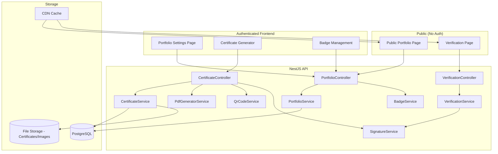
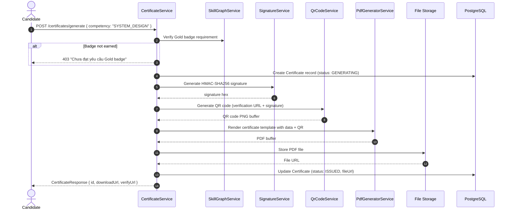
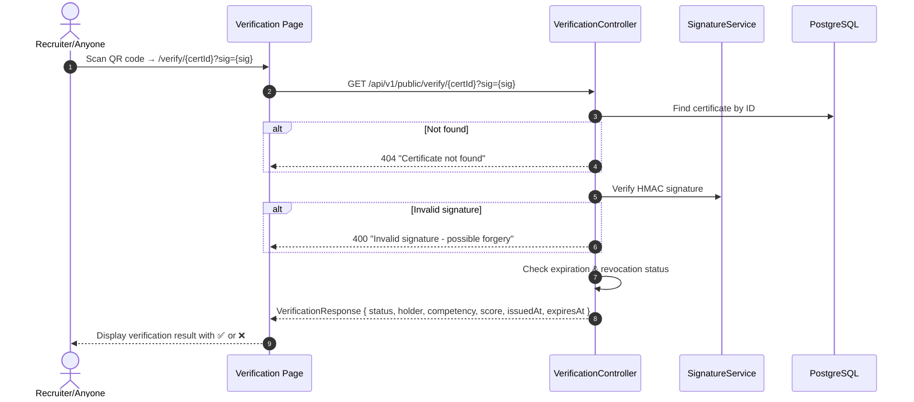

# F010 — Verified Public Portfolio & Shareable Certificate

> **Phiên bản**: 1.0  
> **Trạng thái**: Draft  
> **Ngày tạo**: 2026-08-24  
> **Bounded Context**: Profile, Reporting, Identity  
> **Ưu tiên**: P3 — Phase 2  
> **Phụ thuộc**: F008 Skill Graph, F009 Readiness Score, Evaluation module (hiện có)

---

## 1. Tổng quan (Overview)

### 1.1. Mô tả tính năng

Verified Public Portfolio & Shareable Certificate cung cấp cho ứng viên khả năng **xuất chứng chỉ năng lực kỹ thuật có chữ ký số (HMAC-signed)**, tạo **trang portfolio công khai** để showcase kỹ năng, và chia sẻ **skill badges** lên LinkedIn, CV, và các nền tảng tuyển dụng. Mỗi chứng chỉ có **mã QR xác thực** cho phép bất kỳ ai cũng có thể verify tính xác thực trực tuyến.

### 1.2. Vấn đề giải quyết (Problem Statement)

- Kết quả luyện tập của ứng viên **không thể chứng minh** cho nhà tuyển dụng hoặc đồng nghiệp.
- Thiếu **portfolio công khai** để showcase năng lực kỹ thuật bên cạnh GitHub profile.
- Chưa có cơ chế **xác thực** rằng kết quả là thật (chống giả mạo).
- Không có hệ thống **badges/achievements** tạo động lực luyện tập dài hạn.

### 1.3. Giá trị mang lại (Value Proposition)

| Giá trị                    | Mô tả                                                          |
| -------------------------- | -------------------------------------------------------------- |
| **Chứng minh năng lực**    | Ứng viên gắn link portfolio/certificate vào CV, LinkedIn       |
| **Xác thực chống giả mạo** | QR code + HMAC signature → bất kỳ ai cũng verify được          |
| **Branding cá nhân**       | Public portfolio page với custom URL (/u/username)             |
| **Gamification**           | Badge system tạo động lực hoàn thành milestones                |
| **B2B Value**              | Trường học cấp chứng chỉ cho sinh viên hoàn thành chương trình |

### 1.4. Personas thụ hưởng

- **Candidate**: Tạo portfolio, xuất certificate, chia sẻ lên LinkedIn.
- **Recruiter/Employer**: Verify certificate qua QR code hoặc URL.
- **Mentor**: Xem portfolio của mentee.
- **Tenant Instructor** (F011): Cấp certificate cho cohort sinh viên.

---

## 2. Yêu cầu chức năng (Functional Requirements)

### 2.1. Public Portfolio Page

| ID           | Yêu cầu                                                                                        | Độ ưu tiên |
| ------------ | ---------------------------------------------------------------------------------------------- | ---------- |
| `FR-CRT-001` | User có thể tạo public portfolio page tại URL `/u/{username}`                                  | MUST       |
| `FR-CRT-002` | Username unique, alphanumeric + hyphens, 3–30 ký tự                                            | MUST       |
| `FR-CRT-003` | Portfolio hiển thị: avatar/initials, bio, target role, skill radar chart, badges, certificates | MUST       |
| `FR-CRT-004` | User có thể toggle visibility cho từng phần (skills, badges, certificates, history)            | MUST       |
| `FR-CRT-005` | Portfolio page có proper SEO metadata (OG tags, Twitter cards) cho social sharing              | MUST       |
| `FR-CRT-006` | Portfolio accessible mà không cần đăng nhập (public endpoint)                                  | MUST       |
| `FR-CRT-007` | Rate limiting cho public portfolio views (100 req/min per IP)                                  | MUST       |

### 2.2. Skill Badges & Achievements

| ID           | Yêu cầu                                                                                                                  | Độ ưu tiên |
| ------------ | ------------------------------------------------------------------------------------------------------------------------ | ---------- |
| `FR-CRT-008` | Định nghĩa hệ thống badge 4 levels: **Bronze** (score ≥ 5.0), **Silver** (≥ 6.5), **Gold** (≥ 8.0), **Platinum** (≥ 9.0) | MUST       |
| `FR-CRT-009` | Badge cho mỗi CompetencyArea (5 areas × 4 levels = 20 badges)                                                            | MUST       |
| `FR-CRT-010` | Achievement badges cho milestones: "First Interview", "10 Sessions", "50 Sessions", "All Gold", "Big Tech Ready"         | SHOULD     |
| `FR-CRT-011` | Badge unlock animation và notification khi đạt level mới                                                                 | SHOULD     |
| `FR-CRT-012` | Badge có icon, description, earned date, và shareable image                                                              | MUST       |
| `FR-CRT-013` | Badge requirements yêu cầu minimum evidence count (≥ 3 evaluations)                                                      | MUST       |

**Badge Level Matrix:**

| Level    | Điểm tối thiểu | Icon Color | Evidence tối thiểu |
| -------- | -------------- | ---------- | ------------------ |
| Bronze   | ≥ 5.0          | `#CD7F32`  | 3 evaluations      |
| Silver   | ≥ 6.5          | `#C0C0C0`  | 5 evaluations      |
| Gold     | ≥ 8.0          | `#FFD700`  | 8 evaluations      |
| Platinum | ≥ 9.0          | `#E5E4E2`  | 12 evaluations     |

### 2.3. Certificate Generation

| ID           | Yêu cầu                                                                                          | Độ ưu tiên |
| ------------ | ------------------------------------------------------------------------------------------------ | ---------- |
| `FR-CRT-014` | User có thể generate certificate PDF cho một competency area hoặc overall                        | MUST       |
| `FR-CRT-015` | Certificate bao gồm: tên user, competency, score, tier (F009), ngày cấp, QR code, certificate ID | MUST       |
| `FR-CRT-016` | Certificate có **HMAC-SHA256 digital signature** cho integrity verification                      | MUST       |
| `FR-CRT-017` | Certificate PDF rendering sử dụng template server-side (Puppeteer hoặc @react-pdf/renderer)      | MUST       |
| `FR-CRT-018` | Mỗi certificate có unique ID (UUID) và expiration date (default: 1 năm)                          | MUST       |
| `FR-CRT-019` | User có thể revoke certificate (ví dụ khi score giảm)                                            | SHOULD     |
| `FR-CRT-020` | Certificate chỉ cấp khi user đạt minimum Gold badge trên competency đó                           | MUST       |

**HMAC Signature Generation:**

```typescript
// Certificate verification signature
const payload = `${certificateId}:${userId}:${competency}:${score}:${issuedAt}`;
const signature = crypto
  .createHmac('sha256', process.env.CERTIFICATE_SECRET)
  .update(payload)
  .digest('hex');
// QR Code contains: https://domain.com/verify/{certificateId}?sig={signature_short}
```

### 2.4. Verification System

| ID           | Yêu cầu                                                                                                     | Độ ưu tiên |
| ------------ | ----------------------------------------------------------------------------------------------------------- | ---------- |
| `FR-CRT-021` | Public verification endpoint `GET /verify/{certificateId}` không cần auth                                   | MUST       |
| `FR-CRT-022` | QR code trong certificate link đến verification page                                                        | MUST       |
| `FR-CRT-023` | Verification page hiển thị: tên user, competency, score, tier, ngày cấp, trạng thái (valid/revoked/expired) | MUST       |
| `FR-CRT-024` | Verification không tiết lộ thông tin cá nhân ngoài những gì user cho phép                                   | MUST       |
| `FR-CRT-025` | Rate limiting verification endpoint (50 req/min per IP)                                                     | MUST       |

### 2.5. Social Sharing & LinkedIn Integration

| ID           | Yêu cầu                                                                     | Độ ưu tiên |
| ------------ | --------------------------------------------------------------------------- | ---------- |
| `FR-CRT-026` | Share buttons cho LinkedIn, Twitter, Facebook trên portfolio và certificate | SHOULD     |
| `FR-CRT-027` | Open Graph metadata cho rich previews khi share link                        | MUST       |
| `FR-CRT-028` | LinkedIn Add to Profile integration cho certificates                        | COULD      |
| `FR-CRT-029` | Shareable badge image (PNG, 800×800) cho social media                       | SHOULD     |
| `FR-CRT-030` | Custom OG image generation per user (skill radar + badges)                  | COULD      |

### 2.6. Privacy Controls

| ID           | Yêu cầu                                                                                        | Độ ưu tiên |
| ------------ | ---------------------------------------------------------------------------------------------- | ---------- |
| `FR-CRT-031` | User có thể enable/disable public portfolio bất kỳ lúc nào                                     | MUST       |
| `FR-CRT-032` | Granular visibility: cho phép toggle từng section (bio, skills, badges, certificates, history) | MUST       |
| `FR-CRT-033` | User có thể chọn hiển thị tên thật hoặc anonymous                                              | SHOULD     |
| `FR-CRT-034` | Portfolio deletion cascade xóa tất cả public data                                              | MUST       |

---

## 3. Yêu cầu phi chức năng (Non-Functional Requirements)

| ID            | Yêu cầu                                          | Target           |
| ------------- | ------------------------------------------------ | ---------------- |
| `NFR-CRT-001` | Certificate PDF generation time                  | p95 < 5 giây     |
| `NFR-CRT-002` | Portfolio page load time (public, uncached)      | p95 < 1 giây     |
| `NFR-CRT-003` | Portfolio page load time (cached)                | p95 < 200ms      |
| `NFR-CRT-004` | QR code generation time                          | < 100ms          |
| `NFR-CRT-005` | Verification endpoint response time              | p95 < 200ms      |
| `NFR-CRT-006` | Certificate PDF file size                        | < 2MB            |
| `NFR-CRT-007` | Public pages: CDN cacheable, no auth required    | Enforced         |
| `NFR-CRT-008` | SEO: proper meta tags, structured data (JSON-LD) | All public pages |
| `NFR-CRT-009` | OG image generation time                         | < 3 giây         |

---

## 4. Thiết kế Kiến trúc (Architecture Design)

### 4.1. Component Overview



### 4.2. Certificate Generation Flow



### 4.3. Verification Flow



---

## 5. Thiết kế Database Schema

### 5.1. Prisma Schema Additions

```prisma
// ============================================================
// Portfolio, Badges & Certificate Models
// ============================================================

model PublicPortfolio {
  id              String    @id @default(uuid()) @db.Uuid
  userId          String    @unique @map("user_id") @db.Uuid
  username        String    @unique @db.VarChar(30)
  isPublic        Boolean   @default(false) @map("is_public")
  displayName     String?   @map("display_name") @db.VarChar(100)
  showRealName    Boolean   @default(true) @map("show_real_name")
  showBio         Boolean   @default(true) @map("show_bio")
  showSkills      Boolean   @default(true) @map("show_skills")
  showBadges      Boolean   @default(true) @map("show_badges")
  showCertificates Boolean  @default(true) @map("show_certificates")
  showHistory     Boolean   @default(false) @map("show_history")
  customBio       String?   @map("custom_bio") @db.Text
  ogImageUrl      String?   @map("og_image_url") @db.VarChar(500)
  viewCount       Int       @default(0) @map("view_count")
  createdAt       DateTime  @default(now()) @map("created_at")
  updatedAt       DateTime  @updatedAt @map("updated_at")

  user            User      @relation(fields: [userId], references: [id], onDelete: Cascade)

  @@index([username])
  @@index([isPublic])
  @@map("public_portfolios")
}

enum BadgeLevel {
  BRONZE
  SILVER
  GOLD
  PLATINUM
}

model UserBadge {
  id              String         @id @default(uuid()) @db.Uuid
  userId          String         @map("user_id") @db.Uuid
  competencyArea  CompetencyArea @map("competency_area")
  level           BadgeLevel
  score           Float          // Score at time of earning
  evidenceCount   Int            @map("evidence_count")
  earnedAt        DateTime       @default(now()) @map("earned_at")

  user            User           @relation(fields: [userId], references: [id], onDelete: Cascade)

  @@unique([userId, competencyArea, level])
  @@index([userId])
  @@map("user_badges")
}

model AchievementBadge {
  id              String   @id @default(uuid()) @db.Uuid
  slug            String   @unique @db.VarChar(50)
  name            String   @db.VarChar(100)
  nameVi          String   @map("name_vi") @db.VarChar(100)
  description     String   @db.Text
  descriptionVi   String   @map("description_vi") @db.Text
  iconUrl         String   @map("icon_url") @db.VarChar(500)
  criteria        Json     // Machine-readable criteria for auto-check
  isActive        Boolean  @default(true) @map("is_active")
  createdAt       DateTime @default(now()) @map("created_at")

  userAchievements UserAchievement[]

  @@map("achievement_badges")
}

model UserAchievement {
  id                String           @id @default(uuid()) @db.Uuid
  userId            String           @map("user_id") @db.Uuid
  achievementBadgeId String          @map("achievement_badge_id") @db.Uuid
  earnedAt          DateTime         @default(now()) @map("earned_at")

  user              User             @relation(fields: [userId], references: [id], onDelete: Cascade)
  achievementBadge  AchievementBadge @relation(fields: [achievementBadgeId], references: [id], onDelete: Cascade)

  @@unique([userId, achievementBadgeId])
  @@index([userId])
  @@map("user_achievements")
}

enum CertificateStatus {
  GENERATING
  ISSUED
  REVOKED
  EXPIRED
}

model Certificate {
  id              String             @id @default(uuid()) @db.Uuid
  userId          String             @map("user_id") @db.Uuid
  competencyArea  CompetencyArea?    @map("competency_area") // null = overall
  type            String             @db.VarChar(20) // "COMPETENCY" | "OVERALL" | "TIER"
  score           Float
  tierSlug        String?            @map("tier_slug") @db.VarChar(50)
  status          CertificateStatus  @default(GENERATING)
  signatureHash   String             @map("signature_hash") @db.VarChar(128)
  fileUrl         String?            @map("file_url") @db.VarChar(500)
  qrCodeUrl       String?            @map("qr_code_url") @db.VarChar(500)
  issuedAt        DateTime?          @map("issued_at")
  expiresAt       DateTime?          @map("expires_at") // Default: 1 year from issuedAt
  revokedAt       DateTime?          @map("revoked_at")
  revokeReason    String?            @map("revoke_reason") @db.VarChar(255)
  downloadCount   Int                @default(0) @map("download_count")
  verifyCount     Int                @default(0) @map("verify_count")
  createdAt       DateTime           @default(now()) @map("created_at")

  user            User               @relation(fields: [userId], references: [id], onDelete: Cascade)

  @@index([userId])
  @@index([status])
  @@map("certificates")
}
```

---

## 6. API Specification

### 6.1. Portfolio Endpoints

#### `GET /api/v1/public/portfolio/:username`

Public endpoint — no auth required.

**Response 200:**

```json
{
  "data": {
    "username": "duongvinh",
    "displayName": "Duong Vinh",
    "bio": "Backend Engineer passionate about distributed systems",
    "targetRole": "Senior Backend Engineer",
    "skills": {
      "competencies": [
        { "area": "SYSTEM_DESIGN", "score": 8.2, "badge": "GOLD" },
        { "area": "LANGUAGE_CORE", "score": 7.5, "badge": "SILVER" }
      ],
      "radarData": [8.2, 7.5, 6.0, 7.8, 5.5]
    },
    "badges": [
      {
        "competency": "SYSTEM_DESIGN",
        "level": "GOLD",
        "earnedAt": "2026-08-15T00:00:00Z",
        "iconUrl": "/badges/system-design-gold.svg"
      }
    ],
    "achievements": [
      {
        "slug": "first-interview",
        "name": "First Interview",
        "earnedAt": "2026-06-01T00:00:00Z"
      }
    ],
    "certificates": [
      {
        "id": "uuid",
        "competency": "SYSTEM_DESIGN",
        "score": 8.2,
        "tier": "Big Tech Ready",
        "issuedAt": "2026-08-15T00:00:00Z",
        "verifyUrl": "/verify/uuid"
      }
    ],
    "stats": {
      "totalSessions": 42,
      "memberSince": "2026-06-01"
    }
  }
}
```

#### `PUT /api/v1/portfolio/settings`

**Request:**

```json
{
  "username": "duongvinh",
  "isPublic": true,
  "showRealName": true,
  "showBio": true,
  "showSkills": true,
  "showBadges": true,
  "showCertificates": true,
  "showHistory": false,
  "customBio": "Backend Engineer passionate about distributed systems"
}
```

### 6.2. Certificate Endpoints

#### `POST /api/v1/certificates/generate`

**Request:**

```json
{
  "type": "COMPETENCY",
  "competencyArea": "SYSTEM_DESIGN"
}
```

**Response 201:**

```json
{
  "data": {
    "id": "uuid",
    "status": "ISSUED",
    "competency": "SYSTEM_DESIGN",
    "score": 8.2,
    "tier": "Big Tech Ready",
    "downloadUrl": "/api/v1/certificates/uuid/download",
    "verifyUrl": "https://domain.com/verify/uuid",
    "issuedAt": "2026-08-24T00:00:00Z",
    "expiresAt": "2027-08-24T00:00:00Z"
  }
}
```

#### `GET /api/v1/certificates/uuid/download`

Returns PDF binary with `Content-Type: application/pdf`.

#### `DELETE /api/v1/certificates/uuid`

Revokes the certificate.

### 6.3. Verification Endpoint

#### `GET /api/v1/public/verify/:certificateId`

**Response 200:**

```json
{
  "data": {
    "status": "VALID",
    "holder": "Duong Vinh",
    "competency": "System Design",
    "score": 8.2,
    "tier": "Big Tech Ready",
    "issuedAt": "2026-08-24T00:00:00Z",
    "expiresAt": "2027-08-24T00:00:00Z",
    "issuedBy": "AI Interview Practice Platform"
  }
}
```

**Status values:** `VALID`, `REVOKED`, `EXPIRED`, `NOT_FOUND`, `INVALID_SIGNATURE`.

### 6.4. Badge Endpoints

#### `GET /api/v1/profile/badges`

```json
{
  "data": {
    "competencyBadges": [
      {
        "competency": "SYSTEM_DESIGN",
        "level": "GOLD",
        "score": 8.2,
        "evidenceCount": 12,
        "earnedAt": "2026-08-15T00:00:00Z",
        "nextLevel": {
          "level": "PLATINUM",
          "requiredScore": 9.0,
          "currentScore": 8.2,
          "gap": 0.8
        }
      }
    ],
    "achievements": [
      {
        "slug": "first-interview",
        "name": "First Interview",
        "nameVi": "Phỏng vấn đầu tiên",
        "description": "Complete your first mock interview",
        "earnedAt": "2026-06-01T00:00:00Z"
      }
    ],
    "totalBadges": 8,
    "totalAchievements": 3
  }
}
```

---

## 7. Thiết kế Frontend

### 7.1. Pages & Components

| Component                   | Mô tả                                     | Vị trí                                                 |
| --------------------------- | ----------------------------------------- | ------------------------------------------------------ |
| `PublicPortfolioPage`       | Public portfolio (SSR-friendly, no auth)  | `features/portfolio/PublicPortfolioPage.tsx`           |
| `PortfolioSettingsPage`     | Private settings to configure portfolio   | `features/portfolio/PortfolioSettingsPage.tsx`         |
| `CertificateGeneratorModal` | Modal to generate & download certificate  | `components/certificate/CertificateGeneratorModal.tsx` |
| `BadgeGrid`                 | Grid hiển thị tất cả badges đã đạt        | `components/badges/BadgeGrid.tsx`                      |
| `BadgeCard`                 | Card cho một badge (icon, level, date)    | `components/badges/BadgeCard.tsx`                      |
| `BadgeUnlockAnimation`      | Confetti + animation khi unlock badge mới | `components/badges/BadgeUnlockAnimation.tsx`           |
| `VerificationPage`          | Public verification page cho certificates | `features/verify/VerificationPage.tsx`                 |
| `ShareButtons`              | LinkedIn, Twitter, Facebook share buttons | `components/share/ShareButtons.tsx`                    |
| `QrCodeDisplay`             | QR code renderer component                | `components/ui/QrCodeDisplay.tsx`                      |

### 7.2. Certificate PDF Template

```
┌─────────────────────────────────────────────────────────┐
│                                                         │
│          🏆 Certificate of Technical Proficiency        │
│          ─────────────────────────────────────          │
│                                                         │
│  This certifies that                                    │
│                                                         │
│              ** DUONG VINH **                            │
│                                                         │
│  has demonstrated Gold-level proficiency in              │
│                                                         │
│           ⭐ System Design ⭐                            │
│                                                         │
│  Score: 8.2 / 10.0                                      │
│  Tier: Big Tech Ready                                   │
│  Based on: 12 evaluated assessments                     │
│                                                         │
│  ┌────────┐                                             │
│  │ QR     │  Certificate ID: a1b2c3d4-...               │
│  │ Code   │  Issued: August 24, 2026                    │
│  │        │  Expires: August 24, 2027                   │
│  └────────┘  Verify: https://domain.com/verify/a1b2...  │
│                                                         │
│  Issued by AI Interview Practice Platform               │
│  Signature: 4f7a2e... (HMAC-SHA256)                     │
│                                                         │
└─────────────────────────────────────────────────────────┘
```

### 7.3. Libraries

| Library                                        | Purpose                                  |
| ---------------------------------------------- | ---------------------------------------- |
| `qrcode`                                       | QR code generation (server-side Node.js) |
| `@react-pdf/renderer` hoặc `puppeteer`         | PDF generation                           |
| `canvas-confetti`                              | Badge unlock celebration animation       |
| `react-share`                                  | Social sharing buttons                   |
| `next-seo` (nếu SSR) hoặc `react-helmet-async` | OG tags management                       |

---

## 8. Xử lý Lỗi & Edge Cases

| Tình huống                                         | Xử lý                                                     |
| -------------------------------------------------- | --------------------------------------------------------- |
| Username đã tồn tại                                | 409 Conflict "Username đã được sử dụng"                   |
| User chưa đạt Gold badge nhưng yêu cầu certificate | 403 "Cần đạt Gold badge trước khi tạo certificate"        |
| Certificate expired                                | Verification trả về status: EXPIRED, hiển thị rõ ràng     |
| Certificate revoked                                | Verification trả về status: REVOKED với reason            |
| PDF generation timeout                             | Retry 2 lần, fallback HTML-to-PDF, notify user            |
| QR code scan bị lỗi URL                            | Fallback manual entry: hiển thị certificate ID            |
| Portfolio disabled sau khi đã share link           | Trả 404 cho public portfolio, certificates vẫn verifiable |
| High traffic vào portfolio viral                   | CDN cache (TTL 5 min), rate limiting                      |

---

## 9. Bảo mật & Quyền riêng tư

| Yêu cầu                   | Giải pháp                                                                         |
| ------------------------- | --------------------------------------------------------------------------------- |
| **Certificate Integrity** | HMAC-SHA256 signature bằng server-side secret, không thể giả mạo                  |
| **Secret Key Management** | `CERTIFICATE_SECRET` trong env, rotate hàng năm, backward-compatible verification |
| **PII Control**           | User tùy chọn hiển thị tên thật hoặc display name                                 |
| **Data Minimization**     | Public portfolio chỉ chứa opt-in data, không bao giờ leak email/password          |
| **Rate Limiting**         | Portfolio: 100 req/min/IP, Verification: 50 req/min/IP                            |
| **GDPR**                  | Portfolio deletion cascade xóa tất cả public data                                 |
| **Audit**                 | Certificate generation và revocation ghi AuditLog                                 |
| **Certificate File**      | PDF stored encrypted at rest, signed URL for download (TTL 15 min)                |

---

## 10. Chiến lược Testing

### 10.1. Unit Tests

- `SignatureService`: Test HMAC generation và verification.
- `BadgeService`: Test badge level calculation với boundary scores.
- `CertificateService`: Test generation flow, revocation, expiration.
- `PortfolioService`: Test visibility toggles, username validation.

### 10.2. Integration Tests

- Full certificate generation → download → verify flow.
- Public portfolio endpoint với various visibility configs.
- Badge auto-calculation khi evaluation completes.

### 10.3. Security Tests

- Certificate forgery attempt (modified signature).
- Username enumeration via portfolio endpoint.
- Rate limiting verification.
- PDF injection attempts.

### 10.4. E2E Tests

- Complete flow: earn Gold badge → generate certificate → scan QR → verify.
- Portfolio setup → share on social media → public view.

---

## 11. Kế hoạch Triển khai (Rollout Plan)

### Phase 1: Badge System (2 ngày)

- Database schema.
- `BadgeService` + auto-calculation hook.
- Badge UI (grid, card, unlock animation).

### Phase 2: Public Portfolio (3 ngày)

- Portfolio settings page.
- Public portfolio page.
- SEO metadata + OG tags.
- Username registration.

### Phase 3: Certificate System (3 ngày)

- Certificate generation (HMAC, QR, PDF).
- Verification endpoint + page.
- File storage setup.

### Phase 4: Social Sharing (1 ngày)

- Share buttons.
- OG image generation.
- LinkedIn integration.

### Feature Flag: `FEATURE_PORTFOLIO_CERTIFICATES` (default: `false`)

### Monitoring

- Certificate generation success rate.
- Verification request volume.
- Portfolio page views.
- Badge unlock events.

---

## 12. Ước lượng (Estimates)

### Development Effort

| Task                                       | Ước lượng   |
| ------------------------------------------ | ----------- |
| Database schema & migration                | 1 ngày      |
| Badge system (service + auto-calculation)  | 2 ngày      |
| Portfolio page (public + settings)         | 2 ngày      |
| Certificate generation (HMAC, QR, PDF)     | 2.5 ngày    |
| Verification system                        | 1 ngày      |
| Social sharing (OG tags, share buttons)    | 1 ngày      |
| Testing (unit, integration, security, E2E) | 2.5 ngày    |
| **Tổng**                                   | **12 ngày** |

### Infrastructure Cost

| Resource                                     | Chi phí ước tính                             |
| -------------------------------------------- | -------------------------------------------- |
| File storage (certificates PDF, ~500KB/cert) | ~\$1/month per 2000 certificates             |
| QR code generation                           | CPU only, negligible                         |
| CDN for public portfolio pages               | ~\$5/month (CloudFlare free tier sufficient) |
| PDF rendering (Puppeteer)                    | Existing server resources                    |
| **Tổng bổ sung**                             | **~\$6/tháng**                               |

### Dependencies

- **F008 Skill Graph** (bắt buộc): Cung cấp skill scores cho badges ✅
- **F009 Readiness Score** (tùy chọn): Tier classification cho certificates
- Evaluation module (hiện có) ✅
- File storage setup (S3 hoặc local volume)
