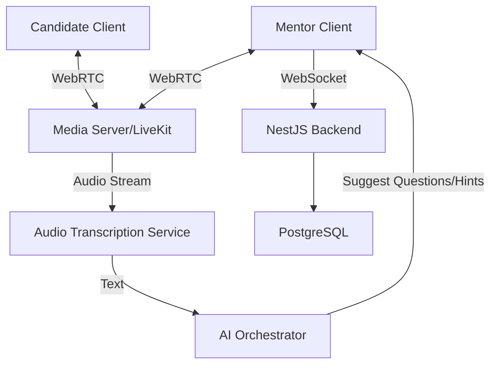

# F012 — Human-in-the-Loop Mentor Co-Pilot

## 1. Tổng quan
Tính năng Mentor Co-Pilot mang con người (Human-in-the-Loop) vào quá trình phỏng vấn và đánh giá. Thay vì hoàn toàn phụ thuộc vào AI, ứng viên có thể được phỏng vấn bởi các mentor thật trong môi trường Live 1-on-1 (WebRTC). AI đóng vai trò như một Co-Pilot đắc lực hỗ trợ mentor trong thời gian thực bằng cách: gợi ý câu hỏi tiếp theo, tự động chép lời (transcription), ghi chú và đưa ra các gợi ý chấm điểm theo rubric. Tính năng cũng hỗ trợ mentor đánh giá lại các phiên AI-only, ghi âm nhận xét (voice notes) và điều chỉnh điểm số.

## 2. Yêu cầu chức năng (FR-MNT-NNN)

| ID | Feature | Mô tả chi tiết |
|---|---|---|
| FR-MNT-001 | Mentor Profile | Cấu hình hồ sơ mentor, chuyên môn (expertise areas), kinh nghiệm. |
| FR-MNT-002 | Mentor Invitation | Luồng mời mentor qua hệ thống token/share link bảo mật. |
| FR-MNT-003 | Voice Notes | Hỗ trợ mentor ghi âm nhận xét trực tiếp trên bảng đánh giá ứng viên. |
| FR-MNT-004 | Score Override | Ghi đè điểm AI với yêu cầu điền lý do (justification) để tạo audit trail. |
| FR-MNT-005 | Live 1-on-1 Room | Phòng phỏng vấn trực tuyến tích hợp WebRTC cho mentor và candidate. |
| FR-MNT-006 | AI Question Suggestion | AI sidebar phân tích bối cảnh và gợi ý câu hỏi follow-up theo thời gian thực. |
| FR-MNT-007 | Live Transcription | Tự động chuyển đổi giọng nói thành văn bản (Speech-to-Text) trong buổi phỏng vấn. |
| FR-MNT-008 | Real-time Rubric Hints | AI phân tích câu trả lời và highlight các điểm đạt/không đạt so với rubric. |
| FR-MNT-009 | Collaborative Notes | Panel cho mentor ghi chú trong lúc phỏng vấn, sync với dashboard. |
| FR-MNT-010 | Hybrid Evaluation | Báo cáo đánh giá tổng hợp: AI score + Mentor override + Mentor notes. |
| FR-MNT-011 | Mentor Feedback | Mentor có thể rate độ chính xác của AI (giúp fine-tuning models sau này). |
| FR-MNT-012 | Mentor Scheduling | Hệ thống quản lý lịch trống, tích hợp Google Calendar/Outlook. |
| FR-MNT-013 | Session Booking | Học viên/Ứng viên có thể đặt lịch phỏng vấn dựa trên mentor availability. |
| FR-MNT-014 | Mentor Leaderboard | Hệ thống đánh giá mentor từ học viên, hiển thị rating/leaderboard. |

## 3. Non-Functional Requirements (NFR-MNT-NNN)
- **NFR-MNT-001**: WebRTC Latency - Độ trễ cuộc gọi video/audio phải dưới 200ms.
- **NFR-MNT-002**: AI Suggestion Latency - Gợi ý câu hỏi thời gian thực phải xuất hiện dưới 1.5s kể từ khi kết thúc câu nói của ứng viên.
- **NFR-MNT-003**: High Concurrency - Hỗ trợ ít nhất 100 phòng phỏng vấn Live cùng lúc.
- **NFR-MNT-004**: Browser Compatibility - Hỗ trợ WebRTC trên Chrome, Firefox, Safari, Edge phiên bản mới nhất.

## 4. Architecture

Hệ thống kết hợp WebSocket (SSE) và WebRTC (thông qua LiveKit hoặc tự host mediasoup) cho kết nối thời gian thực, kết hợp với AI Orchestrator để xử lý audio stream.



## 5. Database Schema

### Prisma Schema (Trích lược)

```prisma
model MentorProfile {
  id             String   @id @default(uuid())
  userId         String   @unique
  expertiseAreas String[]
  rating         Float    @default(0.0)
  bio            String?
  
  user           User     @relation(fields: [userId], references: [id])
  availabilities MentorAvailability[]
  sessions       LiveSession[]
}

model LiveSession {
  id             String   @id @default(uuid())
  mentorId       String
  candidateId    String
  scheduledAt    DateTime
  status         SessionStatus // SCHEDULED, IN_PROGRESS, COMPLETED, CANCELED
  transcriptUrl  String?
  
  mentor         MentorProfile @relation(fields: [mentorId], references: [id])
  evaluation     Evaluation?
}

model MentorAvailability {
  id             String   @id @default(uuid())
  mentorId       String
  dayOfWeek      Int
  startTime      String   // HH:mm format
  endTime        String
  
  mentor         MentorProfile @relation(fields: [mentorId], references: [id])
}

enum SessionStatus {
  SCHEDULED
  IN_PROGRESS
  COMPLETED
  CANCELED
}
```

## 6. API Specifications

| Method | Endpoint | Mô tả |
|---|---|---|
| POST | `/api/v1/mentor/availability` | Tạo khung giờ rảnh của mentor |
| GET | `/api/v1/mentor/availability` | Lấy lịch trống của mentor để book |
| POST | `/api/v1/sessions/book` | Ứng viên đặt lịch phỏng vấn |
| POST | `/api/v1/sessions/:id/join` | Lấy token WebRTC/LiveKit để join phòng |
| POST | `/api/v1/evaluations/:id/voice-notes` | Upload voice note từ mentor |

## 7. State Machine / Event Flow
*Luồng Live Session:*
1. Ứng viên book lịch (trạng thái: `SCHEDULED`).
2. Tới giờ, mentor và ứng viên gọi API lấy room token.
3. Cả hai connect vào phòng (trạng thái: `IN_PROGRESS`). Audio được stream qua Transcription Service.
4. AI Backend nhận text stream qua WebSocket, phân tích bối cảnh.
5. AI đẩy `CopilotHints` (gợi ý) về cho Mentor Client qua SSE (Server-Sent Events).
6. Kết thúc (trạng thái: `COMPLETED`), transcript được lưu lại, tạo bản Evaluation nháp.

## 8. Security & Compliance
- Ghi âm và transcription phải được sự đồng ý của candidate (Opt-in UI).
- Dữ liệu âm thanh PII phải được scrub trước khi gửi đến External AI Provider.
- Token WebRTC phải hết hạn (expire) ngay sau khi session kết thúc.

## 9. Integration Points
- **LiveKit / Agora**: Quản lý Video/Audio call và Room.
- **Deepgram / OpenAI Whisper**: API xử lý Speech-to-Text streaming tốc độ cao.
- **Google Calendar API**: Hỗ trợ 2-way sync lịch mentor.

## 10. Testing Strategy
- Load test server WebRTC với 500 concurrent connections.
- Mock AI Provider để giả lập độ trễ của luồng nhận diện giọng nói và sinh gợi ý.
- Unit testing cho logic xếp lịch tránh xung đột (overlapping booking).

## 11. Rollout & Deployment
- Cần cung cấp hạ tầng STUN/TURN server nếu tự host WebRTC.
- Phát hành Beta cho nhóm mentor nội bộ trước.

## 12. Appendices
- Định dạng chuẩn cho file transcription.
- Hướng dẫn troubleshooting các lỗi phổ biến về WebRTC (mic/cam bị chặn).
