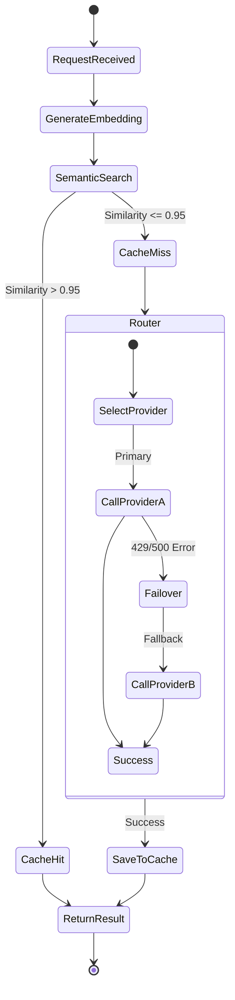

# F013 — Semantic Caching & LLM Fallback Router

## 1. Tổng quan
Tính năng Semantic Caching & LLM Fallback Router nằm tại trung tâm của AI Orchestrator Module. Mục tiêu nhằm giảm chi phí AI từ 40-60% và tăng tính khả dụng (High Availability) bằng hai cơ chế chính:
1. **Semantic Caching:** Sử dụng vector embeddings để tìm kiếm các request (prompt/câu hỏi + câu trả lời) tương tự. Nếu độ tương đồng cao (VD: >95%), hệ thống sẽ trả về kết quả đã được cache thay vì gọi lại API của LLM, tiết kiệm cả token và độ trễ.
2. **LLM Fallback Router:** Một hệ thống định tuyến thông minh kết hợp Circuit Breaker. Tự động chuyển đổi nhà cung cấp AI (OpenAI → Anthropic → Gemini) khi có sự cố, quá tải (rate limit), hoặc tối ưu hóa dựa trên độ phức tạp của bài toán và chi phí.

## 2. Yêu cầu chức năng (FR-LLM-NNN)

| ID | Feature | Mô tả chi tiết |
|---|---|---|
| FR-LLM-001 | Text Embedding | Chuyển đổi input prompt sang dạng vector embeddings (sử dụng text-embedding-3-small hoặc sentence-transformers local). |
| FR-LLM-002 | Vector Search | Lưu trữ và tìm kiếm vector tương đồng trên `pgvector` hoặc Redis Vector. |
| FR-LLM-003 | Cache Threshold | Cấu hình ngưỡng cosine similarity để xác định cache hit (mặc định > 0.95). |
| FR-LLM-004 | Cache Invalidation | Xóa hoặc vô hiệu hóa cache khi rubric đánh giá, context hoặc version prompt thay đổi. |
| FR-LLM-005 | Metrics & Dashboard | Báo cáo tỷ lệ cache hit/miss, ước tính số tiền tiết kiệm được. |
| FR-LLM-006 | Circuit Breaker | Cơ chế tự động ngắt kết nối (Closed → Open → Half-Open) nếu LLM provider trả về lỗi liên tục. |
| FR-LLM-007 | Provider Health Check | Giám sát độ trễ, số lỗi 5xx, 429 Rate Limit của từng provider. |
| FR-LLM-008 | Failover Chain | Chuỗi dự phòng cấu hình được (VD: GPT-4o → Claude-3.5-Sonnet → Gemini 1.5 Pro). |
| FR-LLM-009 | Cost-Aware Routing | Định tuyến động: task đơn giản (chấm ngữ pháp) → LLM rẻ; task phức tạp (System Design) → LLM mạnh/đắt. |
| FR-LLM-010 | Latency-Aware | Ưu tiên provider phản hồi nhanh cho các tính năng realtime (như Live voice interview). |
| FR-LLM-011 | Provider Quota | Cảnh báo ngân sách và giới hạn mức sử dụng (hard limit) trong tháng của từng API Key. |
| FR-LLM-012 | A/B Testing | Hỗ trợ chia tỉ lệ traffic cho các model khác nhau để so sánh chất lượng chấm điểm. |

## 3. Non-Functional Requirements (NFR-LLM-NNN)
- **NFR-LLM-001**: Cache Lookup Latency - Truy vấn semantic cache phải hoàn thành dưới 50ms.
- **NFR-LLM-002**: Failover Speed - Thời gian phát hiện lỗi và chuyển đổi sang model fallback dưới 2 giây.
- **NFR-LLM-003**: Zero Dropped Requests - Không có request bị rớt khi một provider bị sập; retry an toàn.
- **NFR-LLM-004**: Idempotency - Các tác vụ tính toán cost phải hỗ trợ retry an toàn không bị tính trùng.

## 4. Architecture

Cơ chế AI Provider Abstraction được tích hợp Semantic Cache Layer trước khi gọi ra External Provider.



## 5. Database Schema

### Prisma Schema (Trích lược)

```prisma
// Requires pgvector extension in PostgreSQL
model SemanticCache {
  id              String   @id @default(uuid())
  promptHash      String   @unique // Hash cơ bản để check exact match nhanh
  promptText      String
  embedding       Unsupported("vector(1536)")
  responsePayload Json
  metadata        Json?    // version, rubricId,...
  createdAt       DateTime @default(now())
  lastUsedAt      DateTime @default(now())
  hitCount        Int      @default(0)
  
  @@index([embedding]) // HNSW or IVFFlat index
}

model ProviderHealthLog {
  id           String   @id @default(uuid())
  providerName String   // "OPENAI", "ANTHROPIC"
  status       String   // "HEALTHY", "DEGRADED", "DOWN"
  latencyMs    Int
  errorRate    Float
  timestamp    DateTime @default(now())
}

model RoutingDecision {
  id             String   @id @default(uuid())
  requestId      String
  chosenProvider String
  reason         String   // "COST", "LATENCY", "FAILOVER"
  costUsd        Float
  createdAt      DateTime @default(now())
}
```

## 6. API Specifications

Tính năng này chủ yếu hoạt động ở Backend (module `ai-orchestrator`), không public ra REST API ngoài hệ thống, trừ các endpoint dành cho Admin:

| Method | Endpoint | Mô tả |
|---|---|---|
| GET | `/api/v1/admin/llm/health` | Lấy trạng thái của các LLM providers |
| POST | `/api/v1/admin/llm/clear-cache` | Vô hiệu hóa semantic cache thủ công |
| GET | `/api/v1/admin/llm/metrics` | Lấy các chỉ số thống kê (hit rate, cost saved) |

## 7. State Machine / Event Flow
*Circuit Breaker States:*
- `CLOSED`: Normal operation, calls go to provider.
- Tỉ lệ lỗi vượt mức (VD: 5 errors trong 1 phút) → `OPEN`.
- `OPEN`: Fail fast hoặc tự động Fallback sang model khác, không gọi provider chính.
- Sau một khoảng timeout (VD: 60s) → `HALF_OPEN`.
- `HALF_OPEN`: Gửi thử 1 request. Nếu thành công → `CLOSED`. Nếu lỗi → quay lại `OPEN`.

## 8. Security & Compliance
- Không cache các dữ liệu chứa PII nhạy cảm nếu không được che giấu (masking).
- Quản lý API keys an toàn thông qua AWS Secrets Manager hoặc HashiCorp Vault, tuyệt đối không lưu text trong DB.

## 9. Integration Points
- **PostgreSQL (`pgvector`)**: Lưu trữ và tìm kiếm vector nhúng (vector embeddings).
- **Redis**: Phân tán bộ đếm cho Circuit Breaker trong môi trường đa node.
- **AiProvider (Interface)**: Implement các Adapter cho OpenAI, Anthropic, Gemini tuân thủ chặt chẽ Liskov Substitution Principle.

## 10. Testing Strategy
- Unit tests cho thuật toán tính toán Cosine Similarity.
- Integration test cho Circuit Breaker: Mock HTTP errors (429, 500) để kiểm tra luồng fallback hoạt động chính xác.
- Load tests với kịch bản Cache Hit cao để kiểm tra tải của DB khi query HNSW Index.

## 11. Rollout & Deployment
- Triển khai extension `pgvector` trên RDS/PostgreSQL trước.
- Kích hoạt Semantic Caching ở chế độ Dry-Run (chỉ ghi log cache hit, vẫn gọi thực tế) để đo đạc độ tin cậy.

## 12. Appendices
- Công thức tính cost estimation.
- Chi tiết cấu hình HNSW (Hierarchical Navigable Small World) index cho pgvector để tối ưu hiệu năng.
