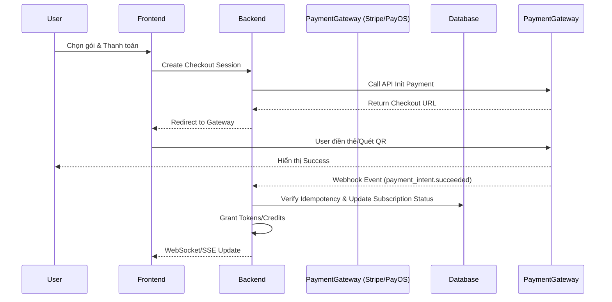

# F014 — Subscription & Usage-Based Billing

## 1. Tổng quan

Hệ thống Subscription & Billing quản lý việc đăng ký gói dịch vụ (tiers) và tính phí dựa trên mức sử dụng thực tế (usage-based) của người dùng và tổ chức (B2C & B2B). Hệ thống hỗ trợ đa cổng thanh toán: Stripe cho thị trường quốc tế và PayOS/VNPay cho thị trường Việt Nam. Nó xử lý vòng đời đăng ký (gia hạn, nâng cấp, hủy), lập hóa đơn, theo dõi hạn mức tín dụng (AI tokens) và xử lý sự cố thanh toán.

## 2. Yêu cầu chức năng (FR-BIL-NNN)

| ID         | Feature                     | Mô tả chi tiết                                                                              |
| ---------- | --------------------------- | ------------------------------------------------------------------------------------------- |
| FR-BIL-001 | Plan Management             | Quản lý định nghĩa các gói dịch vụ (Free, Pro, Team, Enterprise) bao gồm features, limits.  |
| FR-BIL-002 | Payment Gateway Integration | Tích hợp Stripe Checkout (Global) & PayOS/VNPay (Vietnam).                                  |
| FR-BIL-003 | Subscription Lifecycle      | Quản lý vòng đời: Trial, Active, Past_Due, Canceled, Paused.                                |
| FR-BIL-004 | Usage Metering              | Hệ thống đo đếm và theo dõi lượng AI Token và Audio Minute sử dụng (Usage-based).           |
| FR-BIL-005 | Invoice Generation          | Tự động sinh file hóa đơn PDF chuyên nghiệp sau mỗi kỳ thanh toán.                          |
| FR-BIL-006 | Upgrade / Downgrade         | Xử lý proration (tính tiền theo tỉ lệ) khi người dùng đổi gói giữa kỳ.                      |
| FR-BIL-007 | Dunning System              | Xử lý thanh toán lỗi: Tự động retry, gửi email cảnh báo, khóa tài khoản nếu quá hạn.        |
| FR-BIL-008 | Promo Codes                 | Hỗ trợ mã giảm giá (% hoặc số tiền cố định), voucher một lần hoặc dài hạn.                  |
| FR-BIL-009 | Credit Wallet               | Ví tín dụng trả trước: Người dùng mua "Credits" để xài các tính năng nâng cao (Live Voice). |
| FR-BIL-010 | Webhook Handlers            | Xử lý các event bất đồng bộ từ Payment Gateway một cách an toàn và đảm bảo Idempotency.     |
| FR-BIL-011 | Billing Dashboard           | Giao diện cho User xem lịch sử giao dịch, tải hóa đơn, quản lý thẻ, xem usage tháng.        |
| FR-BIL-012 | Refund Policy               | Logic hỗ trợ hoàn tiền (refund) 1 phần hoặc toàn phần do Admin thực hiện.                   |

### Tính năng các gói (Plan Features Matrix)

| Feature           | Free    | Pro    | Team      | Enterprise |
| ----------------- | ------- | ------ | --------- | ---------- |
| Sessions/month    | 5       | 50     | Unlimited | Unlimited  |
| Voice minutes     | 0       | 60     | 300       | Custom     |
| History retention | 30 days | 1 year | 3 years   | Custom     |
| Live coding       | ❌      | ✅     | ✅        | ✅         |
| System design     | ❌      | ✅     | ✅        | ✅         |
| Mentor sharing    | 1       | 10     | Unlimited | Unlimited  |
| Custom rubrics    | ❌      | ❌     | ✅        | ✅         |
| SSO               | ❌      | ❌     | ❌        | ✅         |
| SLA               | ❌      | ❌     | 99.5%     | 99.9%      |

## 3. Non-Functional Requirements (NFR-BIL-NNN)

- **NFR-BIL-001**: Idempotency - Mọi webhook nhận từ Gateway phải có cơ chế Idempotency Key để chống lặp giao dịch.
- **NFR-BIL-002**: Data Accuracy - Tính toán số dư tiền và token phải dùng thư viện xử lý số thập phân chính xác (như `decimal.js`).
- **NFR-BIL-003**: Availability - Tiến trình tính bill có thể chậm, nhưng API cung cấp dịch vụ cho user không bị khóa nếu hệ thống billing đang delay (eventual consistency).

## 4. Architecture

Hệ thống ứng dụng kiến trúc hướng sự kiện (Event-driven Architecture) với webhook xử lý tách biệt.



## 5. Database Schema

### Prisma Schema (Trích lược)

```prisma
model Subscription {
  id              String   @id @default(uuid())
  userId          String?
  tenantId        String?  // B2B Support
  planId          String
  status          SubStatus // ACTIVE, PAST_DUE, CANCELED
  currentPeriodEnd DateTime
  provider        String   // "STRIPE", "PAYOS"
  providerSubId   String   @unique

  user            User?    @relation(fields: [userId], references: [id])
  invoices        Invoice[]
}

model Invoice {
  id              String   @id @default(uuid())
  subscriptionId  String
  amountTotal     Decimal  @db.Decimal(10, 2)
  currency        String   // "USD", "VND"
  status          InvoiceStatus // DRAFT, OPEN, PAID, UNCOLLECTIBLE
  pdfUrl          String?
  createdAt       DateTime @default(now())

  subscription    Subscription @relation(fields: [subscriptionId], references: [id])
}

model UsageRecord {
  id              String   @id @default(uuid())
  userId          String
  actionType      String   // "AI_EVALUATION", "VOICE_MINUTE"
  quantity        Int
  timestamp       DateTime @default(now())
}

enum SubStatus {
  TRIALING
  ACTIVE
  PAST_DUE
  CANCELED
  UNPAID
}

enum InvoiceStatus {
  DRAFT
  OPEN
  PAID
  VOID
  UNCOLLECTIBLE
}
```

## 6. API Specifications

| Method | Endpoint                         | Mô tả                                               |
| ------ | -------------------------------- | --------------------------------------------------- |
| POST   | `/api/v1/billing/checkout`       | Tạo session thanh toán trả về URL redirect          |
| POST   | `/api/v1/billing/webhook/stripe` | Webhook nhận event từ Stripe (cần verify signature) |
| POST   | `/api/v1/billing/webhook/payos`  | Webhook nhận event từ PayOS (Việt Nam)              |
| GET    | `/api/v1/billing/invoices`       | Lấy danh sách hóa đơn của user/tenant               |
| POST   | `/api/v1/billing/cancel`         | Yêu cầu hủy gia hạn gói                             |

## 7. State Machine / Event Flow

_Webhook Webhook Event Handling (Stripe):_

- `checkout.session.completed`: User vừa thanh toán thành công, kích hoạt Sub, tạo Record trong DB.
- `invoice.payment_succeeded`: Hóa đơn định kỳ gia hạn thành công, cập nhật `currentPeriodEnd`.
- `invoice.payment_failed`: Gia hạn thất bại, chuyển trạng thái Sub sang `PAST_DUE`, gửi email dunning.
- `customer.subscription.deleted`: Sub bị hủy (bởi user hoặc hệ thống), revoke quyền truy cập.

## 8. Security & Compliance

- Tuân thủ chuẩn PCI-DSS: Hệ thống tuyệt đối không lưu raw credit card numbers. Tất cả thông tin thẻ lưu ở Stripe Vault.
- Xác thực chữ ký webhook (Webhook Signature Verification) để tránh giả mạo event thanh toán.
- Role-based Access: Dữ liệu hóa đơn của B2B Tenant chỉ Admin tenant mới xem được.

## 9. Integration Points

- **Stripe**: Thanh toán quốc tế, quản lý Subscription lifecycle.
- **PayOS**: Thanh toán nội địa Việt Nam qua QR Code (VietQR) tốc độ cao.
- **SendGrid / AWS SES**: Gửi Email thông báo hóa đơn, nhắc nợ, chào mừng đổi gói.

## 10. Testing Strategy

- Sử dụng Stripe CLI để mock các webhook events cục bộ.
- Unit testing cho logic Idempotency để đảm bảo duplicate webhook không nạp tiền 2 lần.
- Kiểm thử luồng Proration: Nâng cấp từ Pro lên Team giữa tháng đảm bảo số tiền trừ khớp với công thức.

## 11. Rollout & Deployment

- Thiết lập môi trường SandBox (Test Mode) và Production cho Stripe/PayOS riêng biệt dựa vào biến môi trường.
- Triển khai cơ chế retry logic với BullMQ đối với các Webhook chưa xử lý xong do DB lock.

## 12. Appendices

- Bảng ánh xạ mã lỗi Stripe sang hệ thống nội bộ.
- Công thức tính Proration khi nâng/hạ cấp.
