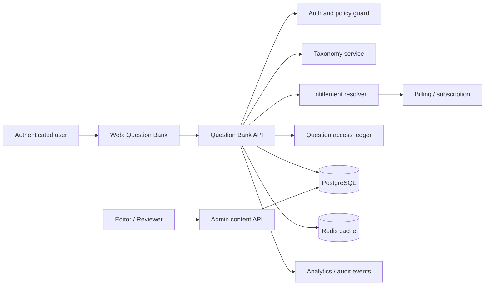
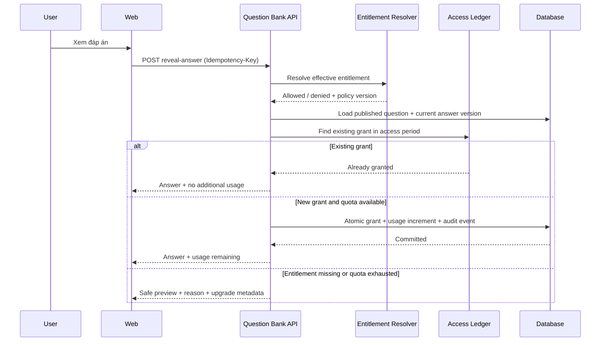
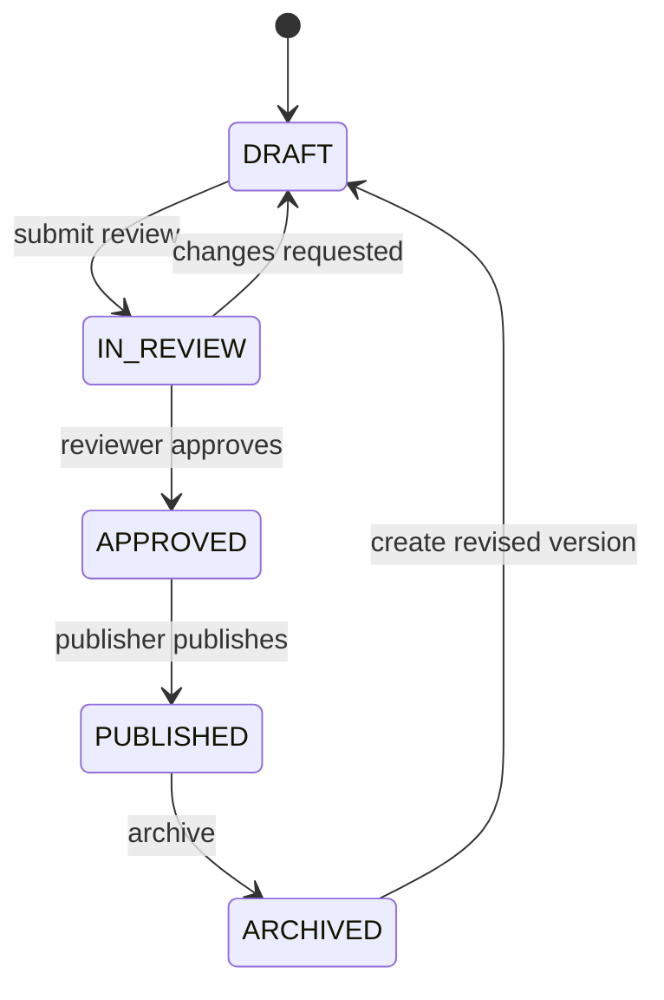

# F015 — Interview Question Bank & Verified Answer Library

> **Trạng thái:** Proposed — sẵn sàng phân rã thành backlog triển khai  
> **Phụ thuộc chính:** F014 Subscription & Usage-Based Billing, Taxonomy, Auth/RBAC, Analytics  
> **Phạm vi phát hành đầu tiên:** B2C; thiết kế entitlement tương thích B2B/tenant từ đầu

---

## 1. Tổng quan

### 1.1 Vấn đề và cơ hội

Người học cần một nơi đáng tin cậy để nghiên cứu câu hỏi phỏng vấn theo vị trí, kỹ năng và cấp độ trước hoặc sau mock interview. Hiện nội dung học thường phân tán, thiếu rubric đánh giá và không liên kết minh bạch với các gói dịch vụ.

Question Bank cung cấp thư viện câu hỏi có kiểm duyệt, đáp án tham khảo, giải thích, rubric và lỗi thường gặp. Đây là một năng lực học tập độc lập, đồng thời tạo đường nâng cấp có giá trị đo được cho các gói trả phí.

### 1.2 Nguyên tắc về chất lượng nội dung

Sản phẩm **không** tuyên bố mọi câu trả lời là “chính xác tuyệt đối”. Với câu hỏi behavioral, system design, kiến trúc hoặc tình huống mở, không tồn tại một câu trả lời duy nhất đúng trong mọi bối cảnh.

Thông điệp chuẩn dùng trong UI, marketing và API metadata là:

> Đáp án tham khảo được biên soạn và kiểm duyệt, đi kèm tiêu chí đánh giá. Người học cần điều chỉnh theo bối cảnh, yêu cầu công việc và kinh nghiệm thực tế.

Mỗi nội dung xuất bản phải nêu loại nguồn, phiên bản, ngày kiểm duyệt và giới hạn áp dụng. Nội dung do AI hỗ trợ sinh không được tự động xuất bản.

### 1.3 Personas

| Persona          | Nhu cầu chính                                | Giá trị nhận được                                                           |
| ---------------- | -------------------------------------------- | --------------------------------------------------------------------------- |
| Ứng viên Free    | Khám phá chủ đề và chất lượng nội dung       | Preview câu hỏi, quota đáp án cơ bản và lời mời nâng cấp minh bạch          |
| Ứng viên Pro     | Luyện có định hướng cho vai trò cụ thể       | Đáp án đầy đủ, rubric, bookmark và bộ lọc nâng cao                          |
| Ứng viên Premium | Ôn luyện chuyên sâu, chuyên biệt             | Thư viện mở rộng, nội dung expert, quota cao/không giới hạn theo chính sách |
| Biên tập viên    | Tạo và cập nhật nội dung đáng tin cậy        | Workflow draft–review–publish, version và audit trail                       |
| Reviewer/SME     | Phê duyệt nội dung chuyên môn                | Rubric review, lịch sử thay đổi và khả năng archive                         |
| Support/Ops      | Điều tra quyền truy cập hoặc khiếu nại quota | Entitlement decision log, usage ledger và dashboard                         |

### 1.4 Mục tiêu và chỉ số thành công

| Mục tiêu               | Chỉ số                              | Mốc trước khi GA                                                |
| ---------------------- | ----------------------------------- | --------------------------------------------------------------- |
| Khám phá hữu ích       | Tỷ lệ search/filter → mở chi tiết   | Baseline sau closed beta                                        |
| Giá trị học tập        | Tỷ lệ người dùng đánh dấu “hữu ích” | Theo dõi theo loại nội dung và version                          |
| Monetization minh bạch | Tỷ lệ paywall impression → upgrade  | Không đo bằng dark pattern                                      |
| Độ tin cậy quota       | Tỷ lệ quyết định entitlement sai    | 0 lỗi confirmed Critical/High; reconciliation có thể giải thích |
| Chất lượng nội dung    | Tỷ lệ report cần sửa/archived       | Có SLA review và owner rõ ràng                                  |
| An toàn dữ liệu        | IDOR/unauthorized answer exposure   | 0 phát hiện tồn đọng trước GA                                   |

### 1.5 Non-goals của MVP

- Không hứa câu hỏi là đề phỏng vấn thật của một công ty nếu không có quyền sử dụng và bằng chứng nguồn.
- Không xuất bản trực tiếp nội dung do AI sinh.
- Không cho export hàng loạt hoặc API công khai cho toàn bộ đáp án premium.
- Không xây dựng marketplace contributor, video course hoặc gamification phức tạp ở MVP.
- Không dùng biện pháp chống copy phía client như một cơ chế kiểm soát truy cập.

---

## 2. Yêu cầu chức năng

| ID        | Yêu cầu            | Mô tả                                                                                                        | Ưu tiên |
| --------- | ------------------ | ------------------------------------------------------------------------------------------------------------ | ------- |
| FR-QB-001 | Browse & search    | Duyệt, tìm kiếm và phân trang câu hỏi đã published.                                                          | P0      |
| FR-QB-002 | Faceted filters    | Lọc theo role, skill, seniority, loại câu hỏi, độ khó và ngôn ngữ.                                           | P0      |
| FR-QB-003 | Question detail    | Hiển thị câu hỏi và metadata công khai; không trả full premium answer trước entitlement check.               | P0      |
| FR-QB-004 | Reveal answer      | Mở đáp án thông qua backend entitlement/quota decision.                                                      | P0      |
| FR-QB-005 | Usage policy       | Tính quota theo entitlement và chu kỳ; một answer đã mở trong cùng chu kỳ không bị tính lại.                 | P0      |
| FR-QB-006 | Upgrade experience | Hiển thị entitlement bị thiếu, usage còn lại và CTA nâng cấp trung thực.                                     | P0      |
| FR-QB-007 | Bookmarks          | Lưu, bỏ lưu và liệt kê câu hỏi đã bookmark.                                                                  | P1      |
| FR-QB-008 | Content lifecycle  | Hỗ trợ draft, in-review, approved, published và archived.                                                    | P0      |
| FR-QB-009 | Editorial review   | Reviewer phê duyệt/từ chối, lưu nhận xét và audit trail.                                                     | P0      |
| FR-QB-010 | Versioning         | Lưu version đáp án; access log luôn tham chiếu version đã cấp.                                               | P0      |
| FR-QB-011 | Content feedback   | Người dùng báo nội dung lỗi/thấp chất lượng; triage bởi editor.                                              | P1      |
| FR-QB-012 | Analytics          | Ghi telemetry cho browse, reveal decision, quota exhaustion, bookmark và content feedback.                   | P0      |
| FR-QB-013 | Admin authoring    | Editor tạo/sửa nội dung và taxonomy mapping có validation.                                                   | P0      |
| FR-QB-014 | Accessibility      | Khả dụng bằng keyboard, screen reader, mobile và không dùng paywall che nội dung bằng cách gây inaccessible. | P0      |

### 2.1 Loại câu hỏi và mô hình đáp án

| Loại                 | Nội dung được phép công bố                                                 |
| -------------------- | -------------------------------------------------------------------------- |
| Factual / MCQ        | Đáp án chuẩn, giải thích và nguồn tham chiếu khi phù hợp                   |
| Coding               | Lời giải tham khảo, test case, complexity, trade-off và edge cases         |
| Technical open-ended | Các luận điểm mong đợi, rubric, red flags và câu hỏi follow-up             |
| System design        | Framework trả lời, assumptions, trade-off; không ghi là đáp án duy nhất    |
| Behavioral / HR      | Khung STAR/CAR, tiêu chí và ví dụ; không chấm một câu trả lời là tuyệt đối |

Mỗi answer phải có trường `answerAuthority`: `CANONICAL`, `REFERENCE`, hoặc `FRAMEWORK`. Chỉ `CANONICAL` được dùng cho nội dung có một đáp án xác định.

### 2.2 Quy tắc entitlement và quota

Entitlement là nguồn quyết định quyền, không phải tên gói. Ví dụ:

| Key                                  | Kiểu                  | Ý nghĩa                                                         |
| ------------------------------------ | --------------------- | --------------------------------------------------------------- |
| `question_bank.browse`               | Boolean               | Có quyền duyệt kho câu hỏi                                      |
| `question_bank.answer_reveals`       | Integer / `unlimited` | Số đáp án đầy đủ được mở trong chu kỳ                           |
| `question_bank.answer_reveal_period` | Enum                  | `daily`, `monthly`, `subscription_period`                       |
| `question_bank.advanced_filters`     | Boolean               | Bộ lọc nâng cao                                                 |
| `question_bank.expert_content`       | Boolean               | Nội dung yêu cầu review chuyên gia                              |
| `question_bank.rubrics`              | Boolean               | Hiển thị rubric chi tiết                                        |
| `question_bank.ai_explanations`      | Integer               | Quota giải thích bổ sung do AI tạo, nếu được triển khai sau MVP |

Quy tắc P0:

1. Quota chỉ bị tiêu khi backend cấp `answerBody` đầy đủ lần đầu cho user trong access period.
2. Refresh, retry hoặc mở nhiều tab không được tiêu thêm quota cho cùng `questionId` và `answerVersion` trong period.
3. Quyết định quyền phải dựa trên subscription có hiệu lực tại server, không dựa vào giá trị từ frontend.
4. Khi subscription downgrade hoặc hết hạn, request mới áp dụng entitlement hiện tại. Nội dung đã nhận về không thể thu hồi từ thiết bị người dùng; UI không được hứa điều ngược lại.
5. Nếu request thất bại trước khi answer được cấp, quota không được tiêu. Nếu outcome không xác định, reconcile bằng idempotency key và ledger trước khi retry.

---

## 3. Yêu cầu phi chức năng

| ID         | Yêu cầu            | Mục tiêu / tiêu chuẩn                                                                                            |
| ---------- | ------------------ | ---------------------------------------------------------------------------------------------------------------- |
| NFR-QB-001 | Authorization      | 100% endpoint có policy server-side; không IDOR/BOLA trên question, answer, bookmark, review và admin resources. |
| NFR-QB-002 | Idempotency        | `reveal-answer` an toàn với retry và concurrent requests.                                                        |
| NFR-QB-003 | Consistency        | Access grant và usage ledger được commit nguyên tử hoặc có cơ chế outbox/reconciliation chứng minh được outcome. |
| NFR-QB-004 | Availability       | Browse/detail vẫn hoạt động khi billing provider chậm, theo entitlement snapshot có thời hạn an toàn.            |
| NFR-QB-005 | Performance        | P95: browse/filter < 500 ms; detail < 400 ms; reveal-answer < 700 ms, không bao gồm cold-start.                  |
| NFR-QB-006 | Accessibility      | Tuân thủ WCAG 2.2 AA cho luồng browse, reveal, paywall và bookmark.                                              |
| NFR-QB-007 | Privacy            | Không log full answer body, token thanh toán, nội dung private hoặc dữ liệu định danh không cần thiết.           |
| NFR-QB-008 | Observability      | Mỗi quyết định entitlement có correlation ID, decision reason, policy version và kết quả meter.                  |
| NFR-QB-009 | Resilience         | Có graceful error state, retry an toàn và không tạo double charge quota.                                         |
| NFR-QB-010 | Content governance | Published content truy vết được tác giả, reviewer, source type và answer version.                                |

---

## 4. Kiến trúc và luồng xử lý

### 4.1 Thành phần



Question Bank là module riêng trong modular monolith, nhưng tái sử dụng Billing cho entitlement, Taxonomy cho filter và Analytics cho event ingestion. Module không gọi payment gateway trực tiếp.

### 4.2 Luồng `reveal-answer`



### 4.3 Ranh giới tin cậy

| Dữ liệu              | Chủ sở hữu    | Có tin cậy từ client?   | Biện pháp                                                |
| -------------------- | ------------- | ----------------------- | -------------------------------------------------------- |
| `questionId`         | Client gửi    | Không                   | Validate UUID/slug; tìm published record server-side     |
| Plan / quota còn lại | Billing       | Không                   | Resolve server-side từ subscription/entitlement          |
| Full answer          | Question Bank | Không được cấp mặc định | Chỉ trả sau policy decision                              |
| Idempotency key      | Client gửi    | Có điều kiện            | Validate format, scope theo user + endpoint, lưu outcome |
| Nội dung authoring   | Editor        | Không tuyệt đối         | RBAC, validation, review trước publish                   |

---

## 5. Thiết kế dữ liệu và migration

### 5.1 Thực thể chính

```prisma
enum QuestionPublicationStatus {
  DRAFT
  IN_REVIEW
  APPROVED
  PUBLISHED
  ARCHIVED
}

enum QuestionAnswerAuthority {
  CANONICAL
  REFERENCE
  FRAMEWORK
}

model QuestionBankQuestion {
  id                String                    @id @default(uuid())
  slug              String                    @unique
  title             String
  questionBody      String                    @db.Text
  questionType      String
  difficulty        String
  language          String                    @default("vi")
  status            QuestionPublicationStatus @default(DRAFT)
  minimumEntitlement String?
  currentAnswerId   String?
  publishedAt       DateTime?
  archivedAt        DateTime?
  createdById       String
  createdAt         DateTime                  @default(now())
  updatedAt         DateTime                  @updatedAt

  answers           QuestionBankAnswer[]
  accessGrants      QuestionAnswerAccessGrant[]
  bookmarks         QuestionBookmark[]

  @@index([status, publishedAt])
  @@index([questionType, difficulty, language])
}

model QuestionBankAnswer {
  id                String                  @id @default(uuid())
  questionId        String
  question          QuestionBankQuestion    @relation(fields: [questionId], references: [id], onDelete: Restrict)
  version           Int
  authority         QuestionAnswerAuthority
  answerBody        String                  @db.Text
  explanationBody   String?                 @db.Text
  rubric            Json?
  commonMistakes    Json?
  sourceType        String
  reviewedById      String?
  reviewedAt        DateTime?
  isPublished       Boolean                 @default(false)
  createdAt         DateTime                @default(now())

  @@unique([questionId, version])
  @@index([questionId, isPublished])
}

model QuestionAnswerAccessGrant {
  id                String   @id @default(uuid())
  userId            String
  questionId        String
  answerId          String
  accessPeriodKey   String
  idempotencyKey    String?
  entitlementKey    String
  policyVersion     String
  grantedAt         DateTime @default(now())
  lastAccessedAt    DateTime @default(now())

  @@unique([userId, questionId, answerId, accessPeriodKey])
  @@unique([userId, idempotencyKey])
  @@index([userId, accessPeriodKey])
}

model QuestionBankUsageLedger {
  id                String   @id @default(uuid())
  userId            String
  entitlementKey    String
  accessPeriodKey   String
  quantity          Int      @default(1)
  grantId           String   @unique
  recordedAt        DateTime @default(now())

  @@index([userId, entitlementKey, accessPeriodKey])
}

model QuestionBookmark {
  userId            String
  questionId        String
  createdAt         DateTime @default(now())

  @@id([userId, questionId])
}
```

Schema trên là logical contract. Khi triển khai cần áp dụng naming convention và relation thực tế của Prisma schema hiện có, thêm foreign key tới `User`, taxonomy và bảng entitlement hiện hữu.

### 5.2 Invariants dữ liệu

- Chỉ question `PUBLISHED` và answer `isPublished=true` mới xuất hiện ở public API.
- Một `QuestionAnswerAccessGrant` đại diện duy nhất cho user + question + answer version + access period.
- Mỗi grant mới tạo đúng một usage ledger record; grant đã tồn tại không tạo usage record khác.
- `currentAnswerId` phải trỏ đến answer đã published của chính question đó.
- Archived content không cấp grant mới, nhưng hành vi với grant cũ cần được quyết định rõ: mặc định trả notice archive, không tiếp tục phân phối nội dung đã bị rút.
- Không hard-delete published question/answer; dùng archive và giữ audit trail.

### 5.3 Kế hoạch migration

1. Khảo sát Taxonomy, Billing subscription và usage-meter schema hiện hữu để tái sử dụng thay vì tạo bảng trùng.
2. Thêm models, enum, indexes và migration có thể rollback theo quy trình database của dự án.
3. Seed taxonomy/question mẫu chỉ vào môi trường development/staging; không seed production không kiểm duyệt.
4. Backfill entitlement keys vào plan definition bằng migration có review của Billing owner.
5. Chạy migration trên staging với dữ liệu production-like; kiểm tra index plan và lock time.
6. Rollout schema trước application code; chỉ bật feature flag sau khi migration và reconciliation checks pass.

---

## 6. API contract

Tất cả endpoint yêu cầu JWT trừ khi chính sách sản phẩm sau này cho phép preview công khai. Response tuân theo API conventions hiện có và không trả full answer trong list/detail payload.

| Method | Endpoint                                                  | Policy                 | Mục đích                                     |
| ------ | --------------------------------------------------------- | ---------------------- | -------------------------------------------- |
| GET    | `/api/v1/question-bank/questions`                         | `question_bank.browse` | Search, filter, pagination                   |
| GET    | `/api/v1/question-bank/questions/:slug`                   | `question_bank.browse` | Chi tiết câu hỏi và answer preview an toàn   |
| POST   | `/api/v1/question-bank/questions/:id/reveal-answer`       | Entitlement + quota    | Cấp quyền và trả full answer nếu được phép   |
| GET    | `/api/v1/question-bank/access-status`                     | Authenticated          | Plan, effective entitlements, quota và reset |
| POST   | `/api/v1/question-bank/questions/:id/bookmark`            | Authenticated          | Idempotent bookmark                          |
| DELETE | `/api/v1/question-bank/questions/:id/bookmark`            | Authenticated          | Bỏ bookmark                                  |
| GET    | `/api/v1/question-bank/bookmarks`                         | Authenticated          | Danh sách bookmark                           |
| POST   | `/api/v1/question-bank/questions/:id/feedback`            | Authenticated          | Báo nội dung lỗi/không phù hợp               |
| POST   | `/api/v1/admin/question-bank/questions`                   | Editor role            | Tạo draft                                    |
| PATCH  | `/api/v1/admin/question-bank/questions/:id`               | Owner/editor role      | Sửa draft hoặc tạo revision                  |
| POST   | `/api/v1/admin/question-bank/questions/:id/submit-review` | Editor role            | Gửi review                                   |
| POST   | `/api/v1/admin/question-bank/questions/:id/review`        | Reviewer role          | Approve/reject                               |
| POST   | `/api/v1/admin/question-bank/questions/:id/publish`       | Publisher role         | Publish approved revision                    |

### 6.1 `POST /reveal-answer`

Headers:

```http
Idempotency-Key: <uuid-idempotency-key>
```

Response thành công:

```json
{
  "data": {
    "questionId": "qbq_123",
    "answerVersion": 3,
    "authority": "REFERENCE",
    "answerBody": "...",
    "explanationBody": "...",
    "rubric": {
      "mustInclude": ["..."],
      "strongSignals": ["..."],
      "redFlags": ["..."]
    }
  },
  "meta": {
    "access": "new_grant",
    "quota": { "limit": 100, "used": 12, "remaining": 88, "resetsAt": "2026-09-01T00:00:00Z" }
  }
}
```

Response khi policy từ chối phải không lộ answer:

```json
{
  "error": {
    "code": "QUESTION_BANK_QUOTA_EXHAUSTED",
    "message": "Bạn đã dùng hết lượt xem đáp án trong kỳ hiện tại."
  },
  "meta": {
    "previewAvailable": true,
    "requiredEntitlement": "question_bank.answer_reveals",
    "resetsAt": "2026-09-01T00:00:00Z",
    "upgradeOptionsAvailable": true
  }
}
```

### 6.2 Error model

| Code                                 | HTTP                             | Ý nghĩa                                                       |
| ------------------------------------ | -------------------------------- | ------------------------------------------------------------- |
| `QUESTION_BANK_NOT_FOUND`            | 404                              | Không tồn tại hoặc không được phép biết resource tồn tại      |
| `QUESTION_BANK_ANSWER_UNAVAILABLE`   | 409                              | Question published nhưng answer chưa sẵn sàng; cần ops triage |
| `QUESTION_BANK_ENTITLEMENT_REQUIRED` | 403                              | Gói không có quyền bắt buộc                                   |
| `QUESTION_BANK_QUOTA_EXHAUSTED`      | 429 hoặc 403 theo API convention | Hết quota có reset time                                       |
| `IDEMPOTENCY_KEY_REUSED`             | 409                              | Cùng key nhưng payload/scope khác                             |
| `CONTENT_NOT_REVIEWED`               | 422                              | Admin cố publish content không đạt điều kiện                  |

---

## 7. Thiết kế frontend và UX

### 7.1 Trang và component

| Màn hình              | Thành phần chính                                                                 |
| --------------------- | -------------------------------------------------------------------------------- |
| Question Bank landing | Search input, filter drawer, category shortcuts, paginated cards                 |
| Question detail       | Question body, metadata, preview, reveal panel, answer/rubric, related questions |
| Access status         | Plan badge, quota remaining, reset time, link billing dashboard                  |
| Bookmark collection   | Filtered bookmarked questions và trạng thái đã xem                               |
| Editorial workspace   | Draft editor, review checklist, version history, publish controls                |

### 7.2 Quy tắc UX

- Card chỉ hiển thị nội dung đủ để người dùng quyết định mở câu hỏi; không gửi answer hidden qua DOM, prefetch hay static payload.
- Paywall phải nêu rõ: quyền bị thiếu, quota còn lại hoặc thời điểm reset, và hành động thay thế hợp lý.
- Không dùng countdown giả, CTA bắt buộc hoặc che toàn bộ câu hỏi để ép nâng cấp.
- Sau reveal thành công, cập nhật quota từ response server, không tự suy ra ở client.
- Bookmarks hoạt động độc lập với việc được reveal answer.
- Nội dung rubric có headings, list semantics và code block có thể đọc bằng screen reader.
- Mọi thao tác reveal/bookmark có loading, error, retry và focus management phù hợp.

### 7.3 Accessibility acceptance criteria

- Có thể hoàn thành browse → filter → open → reveal/paywall → bookmark chỉ bằng keyboard.
- Focus chuyển đến error/confirmation có ý nghĩa sau response.
- Paywall dialog có role, label, focus trap và escape behavior chuẩn.
- Màu badge gói/khóa không là nguồn truyền tải thông tin duy nhất.
- Đáp án code có copy button accessible nhưng không dùng để áp đặt hạn chế giả tạo.

---

## 8. Content operations và governance

### 8.1 State machine



### 8.2 Publication gate

Một answer chỉ được publish khi có đủ:

- taxonomy bắt buộc: role/skill/type/difficulty/language;
- answer authority và source type;
- answer, explanation và rubric phù hợp với loại câu hỏi;
- reviewer khác author, trừ policy ngoại lệ được audit;
- ngày review, review outcome và version;
- disclaimer cho `REFERENCE` và `FRAMEWORK`;
- kiểm tra nội dung không chứa PII, bí mật, đáp án từ nguồn không được cấp quyền hoặc claim sai về nhà tuyển dụng.

### 8.3 Review SLA và ownership

| Hạng mục              | Owner                      | Mục tiêu                                             |
| --------------------- | -------------------------- | ---------------------------------------------------- |
| Authoring             | Content editor             | Draft có metadata đầy đủ                             |
| Accuracy review       | Subject-matter expert      | Review trước publish; định kỳ re-review              |
| Safety / legal review | Content lead hoặc delegate | Nội dung nhạy cảm, employer claims, copyright report |
| Incident response     | Product + Engineering      | Archive nhanh nội dung sai nghiêm trọng              |
| Entitlement policy    | Billing owner              | Versioned policy, approval trước thay đổi quota      |

---

## 9. Bảo mật, quyền riêng tư và chống lạm dụng

### 9.1 Kiểm soát bắt buộc

- Enforce authorization trong service/policy layer trên mọi endpoint, bao gồm admin endpoints.
- Dùng opaque IDs/UUID validation và kiểm tra ownership cho bookmark, feedback, review tasks.
- Không trả `answerBody`, `rubric` premium, signed media URL hoặc draft metadata khi entitlement bị từ chối.
- Áp dụng transaction và unique constraints cho grant/usage; không dựa vào read-then-write không khóa.
- Idempotency key được scope theo authenticated user, endpoint và request fingerprint.
- Rate limit `reveal-answer`, search và admin actions theo user/IP; alert khi có sequential scraping pattern.
- Sanitize/escape rich text, code và content feedback để ngăn XSS; validate upload nếu có media sau MVP.
- Không ghi đáp án đầy đủ vào analytics event, error log hoặc tracing span.
- Verify webhook chữ ký ở Billing; Question Bank chỉ tiêu entitlement đã được Billing xác nhận.

### 9.2 Privacy

- Question Bank không cần lưu câu trả lời phỏng vấn riêng tư của user để hoạt động MVP.
- Access logs chỉ chứa định danh tối thiểu, question/answer version, entitlement decision và thời gian.
- Áp dụng retention policy thống nhất với dữ liệu usage/audit của nền tảng.
- Người dùng phải có thể hiểu dữ liệu usage nào được thu thập và vì sao.

### 9.3 Threat scenarios cần test

| Rủi ro                                 | Kiểm soát                                                             |
| -------------------------------------- | --------------------------------------------------------------------- |
| Sửa `questionId` để lấy premium answer | Policy check + response minimization + integration test hai user/tier |
| Double-click/retry tiêu quota hai lần  | Idempotency + unique grant + transaction                              |
| Subscription cache stale               | Expiry ngắn, source-of-truth fallback, reconciliation                 |
| Scraping tuần tự                       | Rate limit, anomaly detection, pagination limits, audit trail         |
| XSS trong answer/editorial content     | Allowlist sanitizer + CSP + render tests                              |
| Editor publish content chưa review     | State transition guard + reviewer separation + audit log              |

---

## 10. Chiến lược testing và quality gates

### 10.1 Test layers

| Layer           | Phạm vi                                                                                           |
| --------------- | ------------------------------------------------------------------------------------------------- |
| Unit            | Period-key calculation, entitlement resolver, policy/state transitions, response mapping          |
| Integration     | Prisma transaction, unique constraint, usage ledger, billing entitlement contract, authorization  |
| E2E             | Free/Pro/Premium browse-reveal-paywall-bookmark flows, keyboard accessibility, mobile layout      |
| Concurrency     | Multiple tabs, concurrent reveal, timeout-after-commit, retry with same/different idempotency key |
| Security        | IDOR/BOLA, XSS, admin RBAC, unauthorized payload inspection, rate-limit behavior                  |
| Performance     | Search/filter pagination, P95 reveal under representative load, index verification                |
| Content quality | Schema completeness, publication gate, reviewed answer sampling, link/source validation           |

### 10.2 Required regression cases

1. Free user uses final quota then opens the same answer in two tabs: usage count changes once.
2. Same idempotency key is retried after a network timeout: server returns original decision and does not add ledger row.
3. Same idempotency key with different question/payload is rejected.
4. Pro user downgrades during an active browser session: next reveal uses new effective entitlement.
5. `GET question detail` and client cache never expose locked `answerBody`.
6. User A cannot access User B bookmark, usage state, feedback or an admin draft by manipulated ID.
7. Archived answer is not revealable as a new grant.
8. Published question cannot reference an unpublished answer from another question.
9. Billing webhook duplicate event does not create different effective entitlement outcome.
10. Screen-reader and keyboard E2E covers all paywall states.

### 10.3 Definition of Done

- All P0 FR/NFR acceptance criteria implemented and traceable to tests.
- Migration, indexes and rollback/recovery plan reviewed by backend owner.
- Security review verifies no unauthorized answer exposure or duplicate quota charge.
- Content sample is reviewed and approved by designated SME.
- Observability dashboard and alerts exist before external beta.
- Documentation, support playbook and incident owner are published.

---

## 11. Delivery plan, rollout và vận hành

### 11.1 Phased delivery

| Phase                 | Nội dung                                                                            | Exit criteria                                                          |
| --------------------- | ----------------------------------------------------------------------------------- | ---------------------------------------------------------------------- |
| 0. Discovery          | Khảo sát schema Billing/Usage Meter, Taxonomy, RBAC, API conventions và existing UI | ADR/decision log chốt entitlement source of truth và quota period      |
| 1. Foundation         | Prisma migration, module skeleton, policy/entitlement adapter, audit events         | Unit + integration tests pass; no existing billing behavior regression |
| 2. Content operations | Admin authoring, review workflow, versioning, initial reviewed corpus               | Publication gate exercised with real editorial process                 |
| 3. User MVP           | Browse/filter/detail/reveal/paywall/bookmark                                        | E2E happy path + access control + accessibility checks pass            |
| 4. Hardening          | Concurrency, rate limit, performance, analytics dashboard, support tooling          | Load/security test gates pass; rollback runbook reviewed               |
| 5. Closed beta        | Feature flag for selected users/plans                                               | Reconciliation clean; content/UX feedback triaged                      |
| 6. Gradual GA         | Percentage rollout by cohort and plan                                               | Error/denial/usage metrics stable; no P0 incident                      |

### 11.2 Feature flags

| Flag                                      | Mục đích                                            |
| ----------------------------------------- | --------------------------------------------------- |
| `question_bank_enabled`                   | Bật/tắt toàn bộ user experience                     |
| `question_bank_reveal_enabled`            | Giữ browse hoạt động nhưng chặn reveal khi incident |
| `question_bank_paid_entitlements_enabled` | Tách rollout paywall khỏi content beta              |
| `question_bank_editorial_enabled`         | Chỉ mở admin workflow cho internal editors          |
| `question_bank_ai_explanations_enabled`   | Dành cho capability sau MVP                         |

### 11.3 Monitoring và alerting

Theo dõi tối thiểu:

- `question_bank.reveal.requested`, `granted`, `denied`, `idempotency_replayed`, `failed`.
- `question_bank.usage_ledger.created` và reconciliation mismatch.
- P95 latency của search/detail/reveal.
- Tỷ lệ `403/429/5xx`, theo plan và policy version.
- Sequential-access anomaly và rate-limit hits.
- Publish/review/archive events, content feedback rate và content age.

Alert P1 khi có duplicate grant/ledger anomaly, unauthorized access indicator, hoặc 5xx reveal vượt baseline. Có kill-switch dùng `question_bank_reveal_enabled` và runbook để preserve evidence, không xóa usage/audit history.

### 11.4 Rollback và incident response

- Tắt reveal bằng feature flag trước khi rollback application code nếu nghi ngờ entitlement hoặc content leak.
- Không rollback database migration theo cách làm mất grant/ledger/audit history. Dùng forward-fix hoặc migration tương thích.
- Nếu nội dung sai nghiêm trọng, archive answer version, log lý do, đánh giá users đã nhận bản đó và thông báo khi cần.
- Reconcile usage ledger với grants theo scheduled job chỉ đọc; mọi sửa quota phải có audit record và workflow support được phê duyệt.

---

## 12. Backlog khởi tạo và ước lượng

### 12.1 Epics

| Epic                                   | Deliverables                                                  | Phụ thuộc      |
| -------------------------------------- | ------------------------------------------------------------- | -------------- |
| QB-E1: Domain & entitlement foundation | Data model, policies, quota period, migrations, access ledger | F014, Auth     |
| QB-E2: Content governance              | Admin workflow, review state machine, version/audit trail     | RBAC, Taxonomy |
| QB-E3: Learner experience              | Browse/search/filter/detail/reveal/paywall/bookmark           | QB-E1          |
| QB-E4: Assurance & operations          | Test suite, dashboards, alerts, reconciliation, runbooks      | QB-E1–E3       |
| QB-E5: Beta & GA                       | Feature flags, cohort rollout, support process, metric review | QB-E4          |

### 12.2 Indicative effort

Ước lượng để lập kế hoạch, cần hiệu chỉnh sau Phase 0:

| Workstream                                      | Effort ước tính                                    |
| ----------------------------------------------- | -------------------------------------------------- |
| Discovery, ADR, API/data contract               | 3–5 ngày công                                      |
| Backend domain, entitlement, ledger, migrations | 6–9 ngày công                                      |
| Editorial/admin workflow                        | 4–6 ngày công                                      |
| Web learner experience                          | 5–8 ngày công                                      |
| QA, security, performance, observability        | 5–8 ngày công                                      |
| Content corpus và SME review                    | Phụ thuộc quy mô/nội dung; sở hữu bởi Content team |

### 12.3 Quyết định cần chốt trước Phase 1

1. Gói hiện hành, quota từng gói và period reset chính thức.
2. User có được xem lại answer đã mở sau khi quota hết không: đề xuất **có**, trong cùng access period.
3. Nội dung/answer nào là `CANONICAL`, `REFERENCE`, `FRAMEWORK`; ai chịu trách nhiệm review.
4. Cách tích hợp entitlement với `BillingService`/`UsageMeterService` hiện hữu, tránh hai nguồn số liệu.
5. Taxonomy chuẩn cho role, skill, level, question type và bilingual content.
6. Chính sách archive, correction notice, retention access logs và xử lý content report.
7. Phạm vi B2B: entitlement kế thừa từ user, tenant hoặc cả hai; không trì hoãn quyết định data model này đến sau GA.

## 13. Release gate

Feature chỉ được đánh dấu `READY` cho GA khi tất cả điều kiện sau đạt:

- Không còn finding Critical/High về authorization, answer exposure, quota integrity hoặc billing integration.
- `reveal-answer` pass concurrency/idempotency suite và reconciliation report không có mismatch chưa giải thích.
- Không có full premium answer trong browse/detail API payload, cache hoặc HTML trước policy decision.
- Nội dung GA có review record, source type, answer authority, version và owner.
- Accessibility test cho paywall/reveal hoàn thành ở keyboard và screen reader.
- Dashboard, alert, kill-switch, rollback/runbook và support FAQ đã được owner xác nhận.
- Closed beta có thời gian quan sát đủ, không có P0 incident và các metric bất thường đã được triage.

---

## 14. Traceability

| Hạng mục liên quan                                             | Mối quan hệ                                                       |
| -------------------------------------------------------------- | ----------------------------------------------------------------- |
| `docs/features/F014-SUBSCRIPTION-BILLING.md`                   | Nguồn subscription lifecycle, webhook, billing/usage integration  |
| `docs/features/F005-SPACED-REPETITION-FLASHCARDS.md`           | Có thể nhận question/bookmark làm input cho luồng học sau MVP     |
| `docs/api-conventions.md`                                      | Chuẩn response, error, versioning và authentication của API       |
| `docs/architecture.md`                                         | Ràng buộc modular monolith, data, cache và observability          |
| `ai-it-interview-project-kit/02-domain/QUESTION-TAXONOMY.md`   | Taxonomy chuẩn để filter, authoring và reporting                  |
| `ai-it-interview-project-kit/06-data/INDEX-AND-CONCURRENCY.md` | Hướng dẫn index/transaction/concurrency cho grant và usage ledger |
| `ai-it-interview-project-kit/11-delivery/RELEASE-GATES.md`     | Evidence và release governance                                    |
