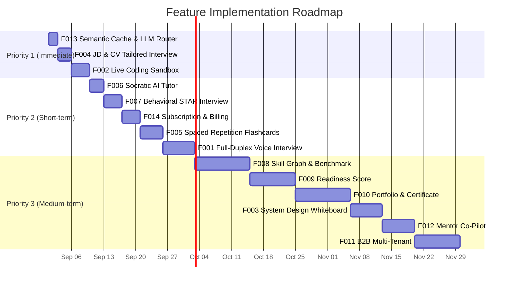
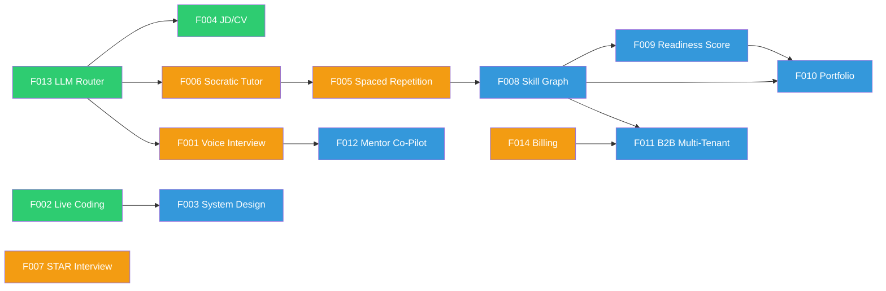

# Feature Roadmap Index — AI Interview Practice Platform

> **Cập nhật**: 2026-08-24  
> **Tổng số Feature Specs**: 14  
> **Trạng thái tổng**: 4/14 hoàn thành (Wave 1: F013, F002, F007, F014)

---

> [!TIP]
> **Bắt đầu từ đâu?** Đọc [IMPLEMENTATION-GUIDE.md](IMPLEMENTATION-GUIDE.md) để biết quy trình chuẩn khi bắt tay vào bất kỳ feature nào.
>
> **Trạng thái tổng thể?** Xem [PROJECT-STATUS.md](../../PROJECT-STATUS.md) để biết cái gì đã làm xong (MVP + Wave 1) và cái gì chưa.

---

## 📋 Tổng quan Tính năng Đề xuất

Tài liệu này là **bảng mục lục tổng hợp (Master Index)** cho toàn bộ 14 đặc tả tính năng nâng cấp dự án AI Interview Practice lên tầm **chuyên nghiệp / SaaS thương mại**. Mỗi tính năng có tài liệu chi tiết riêng trong thư mục `docs/features/`.

### Ký hiệu trạng thái

| Icon | Nghĩa                        |
| ---- | ---------------------------- |
| ⬜   | Chưa bắt đầu — chỉ có đặc tả |
| 🟨   | Đang triển khai              |
| ✅   | Hoàn thành & verified        |

---

## 🗺️ Ma trận Tính năng

### Trụ cột 1: Trải nghiệm Phỏng vấn Thực tế & AI Đột phá

| ID       | Tính năng                                                                                   | File                                   | Status | Effort   | Phụ thuộc                        |
| -------- | ------------------------------------------------------------------------------------------- | -------------------------------------- | ------ | -------- | -------------------------------- |
| **F001** | [Full-Duplex Live Voice Streaming Interview](features/F001-VOICE-REALTIME-INTERVIEW.md)     | `F001-VOICE-REALTIME-INTERVIEW.md`     | ⬜     | 5–7 ngày | WebRTC, STT/TTS providers        |
| **F002** | [Interactive Live Coding & Code Execution Sandbox](features/F002-LIVE-CODING-SANDBOX.md)    | `F002-LIVE-CODING-SANDBOX.md`          | ✅     | 3–4 ngày | Monaco Editor, Judge0 API        |
| **F003** | [System Design Interactive Whiteboard](features/F003-SYSTEM-DESIGN-WHITEBOARD.md)           | `F003-SYSTEM-DESIGN-WHITEBOARD.md`     | ⬜     | 5–7 ngày | Excalidraw, Multimodal AI Vision |
| **F004** | [JD & Resume Parsing for Tailored Interview](features/F004-JD-RESUME-TAILORED-INTERVIEW.md) | `F004-JD-RESUME-TAILORED-INTERVIEW.md` | ⬜     | 2–3 ngày | PDF parser, AI Orchestrator      |

---

### Trụ cột 2: Cá nhân hóa Học tập & Khắc phục Lỗ hổng

| ID       | Tính năng                                                                                    | File                                   | Status | Effort   | Phụ thuộc                            |
| -------- | -------------------------------------------------------------------------------------------- | -------------------------------------- | ------ | -------- | ------------------------------------ |
| **F005** | [Spaced Repetition Drills & Smart Flashcards](features/F005-SPACED-REPETITION-FLASHCARDS.md) | `F005-SPACED-REPETITION-FLASHCARDS.md` | ⬜     | 4–5 ngày | FSRS algorithm, Learning Path module |
| **F006** | [Socratic AI Tutor & Instant Question Retry](features/F006-SOCRATIC-AI-TUTOR.md)             | `F006-SOCRATIC-AI-TUTOR.md`            | ⬜     | 2–3 ngày | AI Orchestrator, Evaluation module   |
| **F007** | [Behavioral Interview & STAR Method Assessment](features/F007-BEHAVIORAL-STAR-INTERVIEW.md)  | `F007-BEHAVIORAL-STAR-INTERVIEW.md`    | ✅     | 3–4 ngày | Taxonomy extension                   |

---

### Trụ cột 3: Đo lường Năng lực & Thị trường

| ID       | Tính năng                                                                                            | File                                     | Status | Effort  | Phụ thuộc           |
| -------- | ---------------------------------------------------------------------------------------------------- | ---------------------------------------- | ------ | ------- | ------------------- |
| **F008** | [Skill Graph & Candidate Benchmark Percentile](features/F008-SKILL-GRAPH-BENCHMARK.md)               | `F008-SKILL-GRAPH-BENCHMARK.md`          | ⬜     | 12 ngày | Evaluation module   |
| **F009** | [AI Interview Readiness Score & Offer Predictor](features/F009-READINESS-SCORE.md)                   | `F009-READINESS-SCORE.md`                | ⬜     | 10 ngày | **F008** (bắt buộc) |
| **F010** | [Verified Public Portfolio & Shareable Certificate](features/F010-VERIFIED-PORTFOLIO-CERTIFICATE.md) | `F010-VERIFIED-PORTFOLIO-CERTIFICATE.md` | ⬜     | 12 ngày | **F008**, F009      |

---

### Trụ cột 4: Doanh nghiệp & Giáo dục (B2B)

| ID       | Tính năng                                                            | File                       | Status | Effort    | Phụ thuộc          |
| -------- | -------------------------------------------------------------------- | -------------------------- | ------ | --------- | ------------------ |
| **F011** | [B2B Multi-Tenant Dashboard](features/F011-B2B-MULTI-TENANT.md)      | `F011-B2B-MULTI-TENANT.md` | ⬜     | 7–10 ngày | F008, F014         |
| **F012** | [Human-in-the-Loop Mentor Co-Pilot](features/F012-MENTOR-COPILOT.md) | `F012-MENTOR-COPILOT.md`   | ⬜     | 5–7 ngày  | Share module, F001 |

---

### Trụ cột 5: Tối ưu Kỹ thuật & SaaS Ops

| ID       | Tính năng                                                                            | File                                | Status | Effort   | Phụ thuộc                              |
| -------- | ------------------------------------------------------------------------------------ | ----------------------------------- | ------ | -------- | -------------------------------------- |
| **F013** | [Semantic Caching & LLM Fallback Router](features/F013-SEMANTIC-CACHE-LLM-ROUTER.md) | `F013-SEMANTIC-CACHE-LLM-ROUTER.md` | ✅     | 1–2 ngày | pgvector/Redis Vector, AI Orchestrator |
| **F014** | [Subscription & Usage-Based Billing](features/F014-SUBSCRIPTION-BILLING.md)          | `F014-SUBSCRIPTION-BILLING.md`      | ✅     | 3–4 ngày | Stripe/PayOS                           |

---

## 🚀 Lộ trình Triển khai Đề xuất (Recommended Roadmap)



---

## 📐 Sơ đồ Phụ thuộc (Dependency Graph)



**Chú thích**: 🟢 P1 (Immediate) | 🟡 P2 (Short-term) | 🔵 P3 (Medium-term)

---

## 📊 Tổng hợp Ước lượng

| Nhóm                 | Features                           | Effort tổng                 |
| -------------------- | ---------------------------------- | --------------------------- |
| **P1 — Immediate**   | F002, F004, F013                   | ~7–9 ngày                   |
| **P2 — Short-term**  | F001, F005, F006, F007, F014       | ~17–23 ngày                 |
| **P3 — Medium-term** | F003, F008, F009, F010, F011, F012 | ~53–65 ngày                 |
| **Tổng**             | 14 features                        | **~77–97 ngày (4–5 tháng)** |

---

## 📁 Cấu trúc Thư mục

```text
docs/
├── features/
│   ├── FEATURE-ROADMAP-INDEX.md          ← Bạn đang đọc file này
│   ├── F001-VOICE-REALTIME-INTERVIEW.md
│   ├── F002-LIVE-CODING-SANDBOX.md
│   ├── F003-SYSTEM-DESIGN-WHITEBOARD.md
│   ├── F004-JD-RESUME-TAILORED-INTERVIEW.md
│   ├── F005-SPACED-REPETITION-FLASHCARDS.md
│   ├── F006-SOCRATIC-AI-TUTOR.md
│   ├── F007-BEHAVIORAL-STAR-INTERVIEW.md
│   ├── F008-SKILL-GRAPH-BENCHMARK.md
│   ├── F009-READINESS-SCORE.md
│   ├── F010-VERIFIED-PORTFOLIO-CERTIFICATE.md
│   ├── F011-B2B-MULTI-TENANT.md
│   ├── F012-MENTOR-COPILOT.md
│   ├── F013-SEMANTIC-CACHE-LLM-ROUTER.md
│   └── F014-SUBSCRIPTION-BILLING.md
├── adr/
├── architecture.md
└── api-conventions.md
```

---

## ✅ Cấu trúc Mỗi Tài liệu Feature

Mỗi tài liệu F001–F014 đều tuân theo cấu trúc 12 sections chuẩn:

1. **Tổng quan** — Problem, Value Proposition, Personas
2. **Yêu cầu chức năng** — Functional Requirements với ID codes
3. **Yêu cầu phi chức năng** — Performance, scalability, accessibility targets
4. **Thiết kế Kiến trúc** — Component diagrams, sequence diagrams (Mermaid)
5. **Database Schema** — Prisma models, migrations, materialized views
6. **API Specification** — Endpoints, request/response payloads, error codes
7. **Thiết kế Frontend** — React components, state management, UI layout
8. **Xử lý Lỗi & Edge Cases** — Error scenarios, graceful degradation
9. **Bảo mật & Quyền riêng tư** — Encryption, access control, GDPR
10. **Chiến lược Testing** — Unit, integration, E2E, security, performance tests
11. **Kế hoạch Triển khai** — Feature flags, phased rollout, monitoring
12. **Ước lượng** — Development effort, infrastructure costs, dependencies

---

## 🔗 Liên kết Liên quan

- [Architecture Decision Records](../adr/)
- [Architecture Spec](../architecture.md)
- [API Conventions](../api-conventions.md)
- [Project Kit](../../ai-it-interview-project-kit/)
