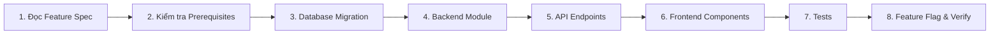

# Implementation Guide — Phase 2+ Features

> **Mục đích**: Tài liệu hướng dẫn thực thi duy nhất. Đọc file này trước khi bắt đầu bất kỳ feature nào trong `docs/features/`.

---

## 🔑 Quy trình Chuẩn — Từ Đặc tả đến Code



### Bước 1: Đọc Feature Spec
```
docs/features/F0XX-FEATURE-NAME.md
```
Đọc toàn bộ 12 sections. Chú ý đặc biệt:
- **Section 2** (Functional Requirements): Danh sách yêu cầu với ID codes
- **Section 4** (Architecture): Mermaid diagrams cho flow chính
- **Section 5** (Database Schema): Prisma models cần thêm
- **Section 6** (API Specification): Endpoints và payloads chính xác

### Bước 2: Kiểm tra Prerequisites
Xem **Section 12 → Dependencies** của feature spec. Ví dụ:
- F009 (Readiness Score) **yêu cầu** F008 (Skill Graph) phải hoàn thành trước.
- F010 (Portfolio) yêu cầu F008 + F009.

Xem dependency graph trong [FEATURE-ROADMAP-INDEX.md](FEATURE-ROADMAP-INDEX.md).

### Bước 3: Database Migration
```bash
# 1. Thêm models vào Prisma schema (từ Section 5 của feature spec)
# File: apps/api/prisma/schema.prisma

# 2. Tạo migration
pnpm --filter api prisma migrate dev --name add_feature_name_tables

# 3. Nếu cần seed data
# File: apps/api/prisma/seed.ts
pnpm db:seed
```

### Bước 4: Backend Module
```
apps/api/src/modules/{feature-name}/
├── {feature-name}.module.ts        # NestJS module
├── {feature-name}.controller.ts    # REST endpoints
├── {feature-name}.service.ts       # Business logic
├── {feature-name}.service.spec.ts  # Unit tests
└── dto/
    └── {feature-name}.dto.ts       # Zod DTOs
```

**Conventions hiện có cần tuân theo:**
- Import Prisma qua `PrismaService` (từ `platform` module)
- Sử dụng `AiOrchestratorService` cho mọi AI calls (không import SDK trực tiếp)
- Queue jobs qua BullMQ `@InjectQueue` pattern
- Guards: `JwtAuthGuard`, `RolesGuard`, `MfaStepUpGuard`
- Error responses theo `docs/api-conventions.md` (envelope format)

### Bước 5: API Endpoints
```typescript
// Thêm contracts vào packages/contracts/src/
// File: packages/contracts/src/{feature}/schemas.ts

// Đăng ký module trong app.module.ts
// File: apps/api/src/app.module.ts
```

### Bước 6: Frontend Components
```
apps/web/src/
├── features/{feature-name}/
│   └── {FeatureName}Page.tsx       # Page component
├── components/{feature-name}/
│   └── {ComponentName}.tsx         # Reusable components
└── hooks/
    └── use{FeatureName}.ts         # TanStack Query hooks
```

**Frontend conventions:**
- API calls qua TanStack Query (`useQuery`, `useMutation`)
- Forms qua React Hook Form + Zod validation
- State management: Zustand (minimal) cho client-only state
- Routing: thêm route trong `App.tsx`
- Styling: Tailwind CSS utility classes

### Bước 7: Tests
```bash
# Unit tests
pnpm test

# Integration tests (backend)
pnpm --filter api test:integration

# Frontend tests
pnpm --filter web test

# E2E
pnpm --filter web test:e2e
```

### Bước 8: Feature Flag & Verify
```typescript
// Thêm feature flag trong config
// apps/api/src/config/features.ts
FEATURE_{FEATURE_NAME}: process.env.FEATURE_{FEATURE_NAME} === 'true'
```

---

## 📁 Quick Reference — Modules & Services Hiện có

### Backend Modules (có thể inject vào feature mới)

| Module | Service chính | Chức năng |
|---|---|---|
| `auth` | `AuthService` | Login, register, JWT, MFA |
| `profile` | `ProfileService` | User profile CRUD, GDPR export |
| `taxonomy` | `TaxonomyService` | Job roles, levels, technologies |
| `interview` | `InterviewService` | Session lifecycle, turns, answers |
| `ai-orchestrator` | `AiOrchestratorService` | AI calls (question, evaluation, learning path) |
| `evaluation` | `EvaluationProcessor` | BullMQ worker for scoring |
| `learning-path` | `LearningPathService` | Learning path CRUD |
| `history-report` | `HistoryService` | Session history, results |
| `admin` | `AdminService` | User mgmt, AI runs, prompts |
| `platform` | `PrismaService`, `MetricsService` | DB client, telemetry, logging |

### Shared Contracts (`packages/contracts/src/`)

| Contract | Nội dung |
|---|---|
| `auth/` | Auth DTOs, login/register schemas |
| `taxonomy/` | Role, level, technology schemas |
| `interview/` | Session, turn, answer schemas, enums (`SessionState`, `SessionMode`) |
| `ai/` | AI request/response schemas |
| `evaluation/` | Evaluation schema, rubric types |
| `learning-path/` | Learning path item schema |
| `admin/` | Admin action DTOs |

### Key Enums (Prisma)

| Enum | Values |
|---|---|
| `UserRole` | `CANDIDATE`, `ADMIN` |
| `SessionState` | `CREATED`, `ACTIVE`, `EVALUATING`, `COMPLETED`, `CANCELLED`, `FAILED` |
| `SessionMode` | `STANDARD`, `FOCUSED_REMEDIATION`, `QUICK_PRACTICE` |
| `CompetencyArea` | `SYSTEM_DESIGN`, `LANGUAGE_CORE`, `DATABASE_CONCURRENCY`, `ARCHITECTURE_PATTERNS`, `RESILIENCE_SECURITY` |

### BullMQ Queues

| Queue | Job | Job ID Pattern |
|---|---|---|
| `question-generation` | `generate-question` | `question-{sessionId}-turn-{n}` |
| `answer-evaluation` | `evaluate-answer` | `eval-{sessionId}-turn-{n}` |
| `learning-path` | `generate-learning-path` | `lp-{sessionId}` |

---

## 🎯 Feature Quick-Start Cards

### 🟢 P1 — Bắt đầu ngay

#### F013: Semantic Cache & LLM Router (1–2 ngày)
```
Đọc:    docs/features/F013-SEMANTIC-CACHE-LLM-ROUTER.md
Sửa:    apps/api/src/modules/ai-orchestrator/
         ├── cache/semantic-cache.service.ts        [NEW]
         ├── router/provider-router.service.ts      [MODIFY - add cache layer]
         └── ai-orchestrator.module.ts              [MODIFY - register cache]
Thêm:   pgvector extension HOẶC Redis Vector module
Test:   Cache hit/miss rates, failover timing
```

#### F004: JD & CV Tailored Interview (2–3 ngày)
```
Đọc:    docs/features/F004-JD-RESUME-TAILORED-INTERVIEW.md
Tạo:    apps/api/src/modules/document-parser/       [NEW MODULE]
Sửa:    apps/api/src/modules/interview/             [MODIFY - blueprint from JD]
        apps/web/src/features/setup/                [MODIFY - add upload UI]
Cài:    pdf-parse, mammoth (npm packages)
DB:     Migration: user_documents, parsed_profiles
```

#### F002: Live Coding Sandbox (3–4 ngày)
```
Đọc:    docs/features/F002-LIVE-CODING-SANDBOX.md
Tạo:    apps/api/src/modules/code-execution/        [NEW MODULE]
Sửa:    apps/web/src/features/interview/            [MODIFY - add Monaco Editor]
Cài:    @monaco-editor/react (frontend), Judge0 API key (backend)
DB:     Migration: code_submissions, test_cases, execution_results
```

### 🟡 P2 — Sau khi P1 xong

#### F006: Socratic AI Tutor (2–3 ngày)
```
Đọc:    docs/features/F006-SOCRATIC-AI-TUTOR.md
Tạo:    apps/api/src/modules/tutor/                 [NEW MODULE]
Sửa:    apps/web/src/features/history/ResultDetailPage.tsx  [ADD chat panel]
        apps/api/src/modules/ai-orchestrator/        [ADD tutor prompt type]
DB:     Migration: tutor_conversations, tutor_messages
```

#### F007: Behavioral STAR Interview (3–4 ngày)
```
Đọc:    docs/features/F007-BEHAVIORAL-STAR-INTERVIEW.md
Sửa:    apps/api/prisma/schema.prisma               [ADD SessionMode.BEHAVIORAL]
        apps/api/src/modules/evaluation/             [ADD STAR rubric]
        apps/web/src/features/setup/                 [ADD behavioral mode]
DB:     Migration: enum addition, behavioral_competencies
```

#### F014: Subscription & Billing (3–4 ngày)
```
Đọc:    docs/features/F014-SUBSCRIPTION-BILLING.md
Tạo:    apps/api/src/modules/billing/               [NEW MODULE]
Cài:    stripe (backend)
Sửa:    apps/web/ (pricing page, billing dashboard)
DB:     Migration: plans, subscriptions, invoices, usage_records
Gate:   Stripe API key required — decision gate
```

#### F005: Spaced Repetition (4–5 ngày)
```
Đọc:    docs/features/F005-SPACED-REPETITION-FLASHCARDS.md
Tạo:    apps/api/src/modules/flashcards/            [NEW MODULE]
        apps/web/src/features/flashcards/            [NEW PAGES]
DB:     Migration: flashcard_decks, flashcards, review_logs
```

#### F001: Full-Duplex Voice (5–7 ngày)
```
Đọc:    docs/features/F001-VOICE-REALTIME-INTERVIEW.md
Tạo:    apps/api/src/modules/voice-gateway/         [NEW MODULE - WebSocket Gateway]
Sửa:    apps/web/src/features/interview/             [MODIFY - voice streaming UI]
Cài:    @nestjs/websockets, ws
Gate:   STT/TTS provider API keys — decision gate
```

### 🔵 P3 — Sau khi P1 + P2 xong

> Xem feature spec riêng. Tóm tắt:
> - **F008 → F009 → F010**: Chain phụ thuộc — phải làm tuần tự
> - **F003**: Cần `@excalidraw/excalidraw` + Multimodal AI provider
> - **F011**: Cần F008 + F014 trước — largest scope (7–10 ngày)
> - **F012**: Cần F001 (voice) + WebRTC

---

## ⚠️ Decision Gates — Cần Resolve Trước khi Implement

| Gate | Feature | Quyết định cần |
|---|---|---|
| **AI Provider Production** | F001, F003, F004, F006 | Chọn STT/TTS provider (Deepgram vs Whisper vs Google STT) |
| **Payment Gateway** | F014 | Chọn Stripe vs PayOS vs VNPay (hoặc nhiều gateway) |
| **Code Execution Sandbox** | F002 | Chọn Judge0 API vs WebContainers vs Docker sandbox |
| **Vector Store** | F013 | Chọn pgvector (PostgreSQL) vs Redis Vector Search |
| **File Storage** | F004, F010 | Chọn S3 vs local volume vs Cloudflare R2 |
| **Whiteboard Library** | F003 | Chọn Excalidraw vs Tldraw |

---

## 📐 Nguyên tắc Bất biến (từ project kit)

Khi implement feature mới, tuân thủ:

1. **Module boundary**: Module mới không truy cập bảng của module khác nếu không có contract
2. **Idempotency**: Mọi mutation quan trọng phải idempotent hoặc có concurrency guard
3. **Provider abstraction**: Không import SDK provider trực tiếp — phải qua abstraction layer
4. **Evidence-based evaluation**: AI chỉ đề xuất, rubric + evidence kiểm soát kết luận
5. **Data minimization**: Không gửi dữ liệu vượt mục đích vào AI prompt
6. **Accessibility**: WCAG 2.2 AA target, mọi chart có text alternative
7. **Bilingual**: UI, content, error, AI output hỗ trợ Việt–Anh
8. **Feature flags**: Mọi feature mới phải có feature flag (default: off)
9. **ADR required**: Thêm dependency/runtime/database/queue/provider mới cần ADR
10. **Mock first**: Dev/CI dùng mock provider; real provider chỉ sau decision gate
