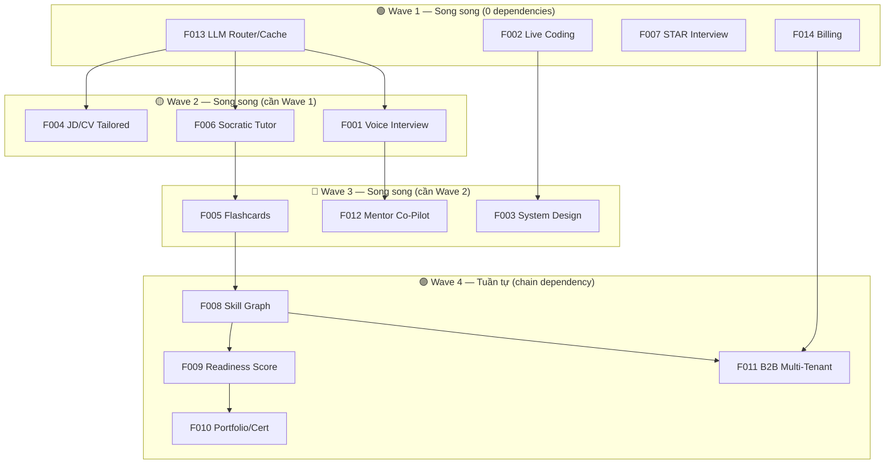

# Parallel Execution Prompts — Phase 2 Features

> **Mục đích**: Copy-paste từng prompt vào Antigravity session riêng biệt để chạy song song.  
> **Quy tắc**: Chỉ chạy song song các features trong cùng Wave. Chờ Wave trước hoàn thành trước khi bắt Wave tiếp.

---

## Dependency Graph & Wave Strategy



| Wave       | Features (song song)      | Tổng effort | Thời gian thực (song song)      |
| ---------- | ------------------------- | ----------- | ------------------------------- |
| **Wave 1** | F013, F002, F007, F014    | 11–14 ngày  | **3–4 ngày**                    |
| **Wave 2** | F004, F006, F001          | 9–13 ngày   | **5–7 ngày**                    |
| **Wave 3** | F005, F003, F012          | 14–19 ngày  | **5–7 ngày**                    |
| **Wave 4** | F008 → F009 → F010 + F011 | 41–44 ngày  | **~22 ngày** (chain + parallel) |
| **Tổng**   | 14 features               | 77–97 ngày  | **~35–40 ngày** ⚡              |

---

## 🟢 WAVE 1 — Bắt đầu ngay, chạy song song 4 agents

---

### Prompt 1A: F013 — Semantic Cache & LLM Router

```
Implement feature F013: Semantic Caching & LLM Fallback Router.

## Context
Repository: c:\Users\Duong Vinh\ai-interview-practice (NestJS monorepo, pnpm workspaces)
Feature spec: docs/features/F013-SEMANTIC-CACHE-LLM-ROUTER.md
Implementation guide: docs/features/IMPLEMENTATION-GUIDE.md
Current architecture: docs/architecture.md

## Scope
Thêm Semantic Cache layer và nâng cấp LLM Router trong module ai-orchestrator hiện có.

## Tasks
1. Đọc kỹ docs/features/F013-SEMANTIC-CACHE-LLM-ROUTER.md (toàn bộ 12 sections)
2. Đọc docs/features/IMPLEMENTATION-GUIDE.md để hiểu conventions
3. Đọc code hiện có:
   - apps/api/src/modules/ai-orchestrator/ (toàn bộ module)
   - apps/api/src/modules/ai-orchestrator/router/provider-router.service.ts (circuit breaker hiện có)
   - apps/api/src/modules/ai-orchestrator/interfaces/ai-provider.interface.ts

4. Tạo ADR cho quyết định Vector Store (pgvector vs Redis Vector Search):
   - File: docs/adr/ADR-0005-semantic-cache-vector-store.md
   - Recommendation: pgvector (tận dụng PostgreSQL hiện có, không thêm dependency)

5. Database migration:
   - Thêm pgvector extension
   - Tạo bảng semantic_cache (id, prompt_hash, embedding vector(1536), response jsonb, model, created_at, hit_count, ttl)
   - Tạo index HNSW trên embedding column

6. Backend implementation:
   - apps/api/src/modules/ai-orchestrator/cache/semantic-cache.service.ts [NEW]
     - generateEmbedding(text): vector embedding via text-embedding-3-small
     - findSimilar(embedding, threshold=0.95): cosine similarity search
     - store(promptHash, embedding, response): cache entry
     - invalidate(criteria): cache invalidation
   - apps/api/src/modules/ai-orchestrator/cache/semantic-cache.service.spec.ts [NEW]
   - Modify provider-router.service.ts: wrap AI calls with cache check (check cache → hit? return cached : call provider → store result)
   - Modify ai-orchestrator.module.ts: register SemanticCacheService

7. Cost-aware routing (từ spec FR-LLM-009):
   - Simple tasks (grammar check) → cheap model
   - Complex tasks (system design eval) → powerful model
   - Config trong environment variables

8. Metrics & monitoring:
   - Cache hit/miss counter (Prometheus)
   - Estimated cost savings metric
   - Cache size gauge

9. Feature flag: FEATURE_SEMANTIC_CACHE (default: false)

10. Tests:
    - Unit: cache service (hit, miss, invalidation, TTL)
    - Integration: full flow with mock embeddings
    - Verify cache hit/miss Prometheus metrics

11. Verify:
    - pnpm lint (0 errors)
    - pnpm typecheck (0 errors)
    - pnpm test (all green)
    - pnpm build (success)

## Constraints
- KHÔNG thêm external vector database (dùng pgvector extension trong PostgreSQL hiện có)
- KHÔNG thay đổi AiProvider interface
- GIỮ MockAiProvider hoạt động cho dev/CI
- GIỮ circuit breaker logic hiện có
```

---

### Prompt 1B: F002 — Live Coding & Execution Sandbox

```
Implement feature F002: Interactive Live Coding & Code Execution Sandbox.

## Context
Repository: c:\Users\Duong Vinh\ai-interview-practice (NestJS monorepo, pnpm workspaces)
Feature spec: docs/features/F002-LIVE-CODING-SANDBOX.md
Implementation guide: docs/features/IMPLEMENTATION-GUIDE.md

## Scope
Thêm Monaco Editor vào Interview Room và tạo module code-execution mới cho backend.

## Tasks
1. Đọc kỹ docs/features/F002-LIVE-CODING-SANDBOX.md (toàn bộ 12 sections)
2. Đọc docs/features/IMPLEMENTATION-GUIDE.md để hiểu conventions
3. Đọc code hiện có:
   - apps/web/src/features/interview/InterviewRoomPage.tsx
   - apps/api/src/modules/interview/ (toàn bộ)
   - apps/api/prisma/schema.prisma

4. Database migration:
   - Thêm enum SessionMode.CODING vào Prisma schema
   - Tạo bảng: code_submissions (id, session_id, turn_number, language, source_code, created_at, updated_at)
   - Tạo bảng: code_test_cases (id, submission_id, input, expected_output, is_hidden, order)
   - Tạo bảng: code_execution_results (id, submission_id, status enum, stdout, stderr, time_ms, memory_kb, executed_at)

5. Backend — module code-execution [NEW]:
   - apps/api/src/modules/code-execution/code-execution.module.ts
   - apps/api/src/modules/code-execution/code-execution.controller.ts
     - POST /api/v1/interviews/:id/code/execute (run code)
     - POST /api/v1/interviews/:id/code/submit (final submit)
     - GET /api/v1/interviews/:id/code/results
   - apps/api/src/modules/code-execution/code-execution.service.ts
     - Sandbox execution via Judge0 API (hoặc mock cho dev)
     - Timeout: 10s, Memory limit: 256MB
     - Languages: javascript, typescript, python, java, go
   - apps/api/src/modules/code-execution/sandbox/judge0.provider.ts [NEW]
   - apps/api/src/modules/code-execution/sandbox/mock-sandbox.provider.ts [NEW] (cho dev/CI)
   - Shared contracts: packages/contracts/src/code-execution/schemas.ts

6. Frontend — Monaco Editor integration:
   - Install: pnpm --filter web add @monaco-editor/react
   - apps/web/src/components/code-editor/MonacoCodeEditor.tsx [NEW]
     - Syntax highlighting, IntelliSense
     - Language selector (JS, TS, Python, Java, Go)
     - Theme: VS Dark
   - apps/web/src/components/code-editor/ConsoleOutput.tsx [NEW]
   - apps/web/src/components/code-editor/TestCasePanel.tsx [NEW]
   - Modify InterviewRoomPage.tsx: split-pane layout (question left, editor right) khi mode=CODING
   - apps/web/src/hooks/useCodeExecution.ts [NEW] (TanStack Query mutations)

7. AI Code Review integration:
   - Khi user submit code, gửi qua AiOrchestratorService để review:
     - Time complexity analysis
     - Space complexity analysis
     - Code quality assessment
     - Edge case identification
   - Lưu review vào Evaluation (reuse evaluation flow hiện có)

8. Feature flag: FEATURE_LIVE_CODING (default: false)

9. Tests:
   - Unit: code-execution service, sandbox providers
   - Frontend: MonacoCodeEditor component render test
   - Integration: execute → result flow with mock sandbox

10. Verify: pnpm lint && pnpm typecheck && pnpm test && pnpm build

## Constraints
- Dùng MockSandboxProvider cho dev/CI (trả static result), Judge0Provider cho production
- KHÔNG cho phép code truy cập filesystem hoặc network trong sandbox
- Monaco Editor lazy-load (code splitting) để không tăng initial bundle size
- GIỮ interview flow hiện có cho mode STANDARD không bị ảnh hưởng
```

---

### Prompt 1C: F007 — Behavioral STAR Interview

```
Implement feature F007: Behavioral Interview & STAR Method Assessment.

## Context
Repository: c:\Users\Duong Vinh\ai-interview-practice (NestJS monorepo, pnpm workspaces)
Feature spec: docs/features/F007-BEHAVIORAL-STAR-INTERVIEW.md
Implementation guide: docs/features/IMPLEMENTATION-GUIDE.md

## Scope
Mở rộng interview system hiện có để hỗ trợ Behavioral Interview mode với STAR rubric.

## Tasks
1. Đọc kỹ docs/features/F007-BEHAVIORAL-STAR-INTERVIEW.md
2. Đọc docs/features/IMPLEMENTATION-GUIDE.md
3. Đọc code hiện có:
   - apps/api/prisma/schema.prisma (SessionMode enum, Evaluation model)
   - apps/api/src/modules/interview/ (session creation, turn flow)
   - apps/api/src/modules/evaluation/ (rubric scoring)
   - apps/api/src/modules/ai-orchestrator/ (prompt generation)
   - packages/contracts/src/interview/ (shared schemas)

4. Database migration:
   - Thêm SessionMode.BEHAVIORAL vào enum
   - Tạo bảng: behavioral_competencies (id, slug, name, name_vi, description, category enum[LEADERSHIP, TEAMWORK, PROBLEM_SOLVING, COMMUNICATION, ADAPTABILITY], is_active, order)
   - Tạo bảng: behavioral_question_templates (id, competency_id, template_text, follow_up_prompts jsonb, difficulty)
   - Seed data: 5 categories × 4 competencies × 3 templates = 60 question templates

5. Backend:
   - Modify interview.service.ts: handle SessionMode.BEHAVIORAL
     - Chọn competency set khi tạo session
     - Generate behavioral questions từ templates + AI customization
   - Tạo STAR rubric mới trong evaluation module:
     - apps/api/src/modules/evaluation/rubrics/star-rubric.ts [NEW]
     - 4 dimensions: Situation (context clarity), Task (responsibility clarity), Action (specific actions taken), Result (measurable outcomes)
     - Mỗi dimension scored 0-10
     - Overall behavioral score = weighted average
   - Modify evaluation processor: detect BEHAVIORAL mode → use STAR rubric
   - Modify AI prompts: behavioral-specific evaluation prompt
   - Shared contracts: packages/contracts/src/interview/ — add BEHAVIORAL to SessionMode enum

6. Frontend:
   - Modify SetupInterviewPage: add "Behavioral Interview" mode option
   - Modify InterviewRoomPage: show STAR framework guide panel khi mode=BEHAVIORAL
   - apps/web/src/components/interview/StarGuidePanel.tsx [NEW]
     - Hướng dẫn: "Situation → Task → Action → Result"
     - Highlight từng phần khi user đang trả lời
   - Modify ResultDetailPage: show STAR breakdown (4 dimensions) thay vì technical rubric

7. Feature flag: FEATURE_BEHAVIORAL_INTERVIEW (default: false)

8. Tests:
   - Unit: STAR rubric scoring logic
   - Unit: behavioral question selection
   - Integration: full behavioral session flow (create → answer → evaluate with STAR)
   - Seed data integrity test

9. Verify: pnpm lint && pnpm typecheck && pnpm test && pnpm build

## Constraints
- KHÔNG thay đổi scoring flow cho STANDARD/FOCUSED_REMEDIATION/QUICK_PRACTICE modes
- STAR rubric output schema phải compatible với Evaluation model hiện có (reuse model, thêm rubric type field)
- Behavioral questions phải bilingual (VI/EN) từ seed data
```

---

### Prompt 1D: F014 — Subscription & Billing

```
Implement feature F014: Subscription & Usage-Based Billing.

## Context
Repository: c:\Users\Duong Vinh\ai-interview-practice (NestJS monorepo, pnpm workspaces)
Feature spec: docs/features/F014-SUBSCRIPTION-BILLING.md
Implementation guide: docs/features/IMPLEMENTATION-GUIDE.md

## Scope
Tạo module billing mới quản lý subscription plans, usage metering, và Stripe integration.

## Tasks
1. Đọc kỹ docs/features/F014-SUBSCRIPTION-BILLING.md (toàn bộ 12 sections)
2. Đọc docs/features/IMPLEMENTATION-GUIDE.md

3. Tạo ADR cho Payment Gateway:
   - File: docs/adr/ADR-0006-payment-gateway-selection.md
   - Decision: Stripe (global) + PayOS (VN) — phased rollout, Stripe first

4. Database migration:
   - Tạo bảng: subscription_plans (id, slug, name, name_vi, features jsonb, limits jsonb, price_monthly, price_yearly, stripe_price_id, is_active)
   - Tạo bảng: subscriptions (id, user_id, plan_id, status enum[TRIAL,ACTIVE,PAST_DUE,CANCELED,PAUSED], stripe_subscription_id, current_period_start, current_period_end, canceled_at)
   - Tạo bảng: usage_records (id, user_id, metric enum[AI_TOKEN,AUDIO_MINUTE,SESSION_COUNT], quantity, recorded_at)
   - Tạo bảng: invoices (id, user_id, subscription_id, amount, currency, status, stripe_invoice_id, pdf_url, issued_at, paid_at)
   - Tạo bảng: promo_codes (id, code, discount_type, discount_value, max_uses, used_count, expires_at)
   - Seed 4 plans: Free, Pro ($9.99), Team ($29.99), Enterprise (custom)

5. Backend — module billing [NEW]:
   - apps/api/src/modules/billing/billing.module.ts
   - apps/api/src/modules/billing/billing.controller.ts
     - POST /api/v1/billing/checkout (create Stripe Checkout Session)
     - POST /api/v1/billing/portal (create Stripe Customer Portal)
     - GET /api/v1/billing/subscription (current subscription)
     - GET /api/v1/billing/usage (current period usage)
     - GET /api/v1/billing/invoices (invoice history)
   - apps/api/src/modules/billing/billing.service.ts
   - apps/api/src/modules/billing/stripe.provider.ts (Stripe SDK wrapper)
   - apps/api/src/modules/billing/mock-billing.provider.ts (dev/CI mock)
   - apps/api/src/modules/billing/webhook.controller.ts
     - POST /api/v1/webhooks/stripe (Stripe webhook handler)
     - Events: checkout.session.completed, invoice.paid, invoice.payment_failed, customer.subscription.updated/deleted
     - Idempotency: check IdempotencyRecord trước khi xử lý
   - apps/api/src/modules/billing/usage-meter.service.ts
     - trackUsage(userId, metric, quantity)
     - checkQuota(userId, metric): boolean
     - Hook vào InterviewService và AiOrchestratorService
   - apps/api/src/modules/billing/guards/quota.guard.ts [NEW]
     - Kiểm tra user còn quota trước khi tạo session/gọi AI
   - Shared contracts: packages/contracts/src/billing/schemas.ts

6. Frontend:
   - apps/web/src/features/billing/PricingPage.tsx [NEW] — plan comparison table
   - apps/web/src/features/billing/BillingDashboardPage.tsx [NEW] — current plan, usage, invoices
   - apps/web/src/features/billing/CheckoutSuccessPage.tsx [NEW]
   - Modify App.tsx: add routes /pricing, /billing, /billing/success
   - apps/web/src/hooks/useBilling.ts [NEW]

7. Quota enforcement:
   - Free: 5 sessions/month, 0 voice minutes
   - Pro: 50 sessions/month, 60 voice minutes
   - Khi vượt quota: hiển thị upgrade prompt, block tạo session mới

8. Feature flag: FEATURE_BILLING (default: false)
   - Khi off: tất cả user có unlimited access (hành vi hiện tại)

9. Tests:
   - Unit: billing service, usage meter, quota check
   - Integration: webhook handler idempotency
   - Mock: Stripe API calls via mock provider

10. Verify: pnpm lint && pnpm typecheck && pnpm test && pnpm build

## Constraints
- Dùng MockBillingProvider khi STRIPE_SECRET_KEY chưa set (dev/CI)
- Webhook endpoint KHÔNG yêu cầu JWT auth (Stripe signs webhooks)
- Dùng decimal.js cho mọi tính toán tiền tệ
- KHÔNG lưu card number, chỉ lưu Stripe customer_id và subscription_id
- Khi FEATURE_BILLING=false, QuotaGuard luôn return true (unlimited)
```

---

## 🟡 WAVE 2 — Sau khi Wave 1 hoàn thành, chạy song song 3 agents

---

### Prompt 2A: F004 — JD & CV Tailored Interview

```
Implement feature F004: JD & Resume Parsing for Tailored Interview.

## Context
Repository: c:\Users\Duong Vinh\ai-interview-practice
Feature spec: docs/features/F004-JD-RESUME-TAILORED-INTERVIEW.md
Implementation guide: docs/features/IMPLEMENTATION-GUIDE.md
Prerequisite: F013 (Semantic Cache) đã hoàn thành — dùng cache cho AI parsing calls.

## Scope
Tạo module document-parser mới: upload CV/JD → AI parsing → tailored interview questions.

## Tasks
1. Đọc kỹ docs/features/F004-JD-RESUME-TAILORED-INTERVIEW.md
2. Đọc docs/features/IMPLEMENTATION-GUIDE.md
3. Đọc code hiện có:
   - apps/api/src/modules/interview/interview.service.ts (session creation flow)
   - apps/api/src/modules/ai-orchestrator/ (AI call patterns)
   - apps/web/src/features/setup/SetupInterviewPage.tsx

4. Install dependencies:
   - pnpm --filter api add pdf-parse mammoth
   - (pdf-parse cho PDF, mammoth cho DOCX)

5. Database migration:
   - Tạo bảng: user_documents (id, user_id, type enum[RESUME,JOB_DESCRIPTION], original_filename, mime_type, file_size, storage_path, uploaded_at)
   - Tạo bảng: parsed_profiles (id, document_id, extracted_data jsonb, skills_detected jsonb, experience_years, education jsonb, parsed_at)
   - Tạo bảng: tailored_blueprints (id, session_id, resume_profile_id, jd_profile_id, gap_analysis jsonb, question_focus_areas jsonb, created_at)

6. Backend — module document-parser [NEW]:
   - apps/api/src/modules/document-parser/document-parser.module.ts
   - apps/api/src/modules/document-parser/document-parser.controller.ts
     - POST /api/v1/documents/upload (multipart file upload, max 10MB)
     - GET /api/v1/documents (list user documents)
     - GET /api/v1/documents/:id/parsed (parsed profile)
     - DELETE /api/v1/documents/:id
   - apps/api/src/modules/document-parser/document-parser.service.ts
     - parseResume(file): extract text → AI structured extraction
     - parseJobDescription(file): extract requirements → AI structured extraction
     - generateGapAnalysis(resumeProfile, jdProfile): identify skill gaps
   - apps/api/src/modules/document-parser/extractors/pdf.extractor.ts
   - apps/api/src/modules/document-parser/extractors/docx.extractor.ts
   - apps/api/src/modules/document-parser/extractors/text.extractor.ts

7. Interview integration:
   - Modify interview.service.ts: khi tạo session, nếu có tailored_blueprint thì:
     - Focus questions trên gap areas
     - Include context từ JD requirements
     - Personalize difficulty dựa trên experience years

8. Frontend:
   - Modify SetupInterviewPage: add "Upload CV & JD" section trước khi Start Interview
   - apps/web/src/components/document/FileUploadDropzone.tsx [NEW]
   - apps/web/src/components/document/ParsedProfilePreview.tsx [NEW]
   - apps/web/src/components/document/GapAnalysisCard.tsx [NEW]

9. Privacy:
   - File stored encrypted at rest
   - Auto-delete after 30 days (retention policy)
   - User can delete anytime
   - KHÔNG gửi raw CV text vào AI — chỉ gửi extracted structured data

10. Feature flag: FEATURE_JD_CV_TAILORED (default: false)
11. Tests + Verify: unit, integration, privacy (no PII leak), pnpm lint && typecheck && test && build

## Constraints
- File size limit: 10MB
- Supported formats: PDF, DOCX, TXT
- File storage: local uploads/ folder (Phase 1), S3 migration later
- AI parsing dùng AiOrchestratorService (sẽ tự động cache qua F013)
```

---

### Prompt 2B: F006 — Socratic AI Tutor

```
Implement feature F006: Socratic AI Tutor & Instant Question Retry.

## Context
Repository: c:\Users\Duong Vinh\ai-interview-practice
Feature spec: docs/features/F006-SOCRATIC-AI-TUTOR.md
Implementation guide: docs/features/IMPLEMENTATION-GUIDE.md
Prerequisite: F013 (Semantic Cache) đã hoàn thành.

## Scope
Tạo module tutor mới: sau khi xem kết quả, user có thể chat với AI Tutor để hiểu sâu hơn.

## Tasks
1. Đọc kỹ docs/features/F006-SOCRATIC-AI-TUTOR.md
2. Đọc docs/features/IMPLEMENTATION-GUIDE.md
3. Đọc code hiện có:
   - apps/web/src/features/history/ResultDetailPage.tsx
   - apps/api/src/modules/evaluation/ (evaluation data)
   - apps/api/src/modules/ai-orchestrator/

4. Database migration:
   - Tạo bảng: tutor_conversations (id, user_id, session_id, turn_number, status enum[ACTIVE,CLOSED], started_at, ended_at)
   - Tạo bảng: tutor_messages (id, conversation_id, role enum[USER,TUTOR,SYSTEM], content text, metadata jsonb, created_at)

5. Backend — module tutor [NEW]:
   - apps/api/src/modules/tutor/tutor.module.ts
   - apps/api/src/modules/tutor/tutor.controller.ts
     - POST /api/v1/tutor/conversations (start conversation for a session turn)
     - POST /api/v1/tutor/conversations/:id/messages (send message)
     - GET /api/v1/tutor/conversations/:id/messages (get conversation history)
   - apps/api/src/modules/tutor/tutor.service.ts
     - startConversation(userId, sessionId, turnNumber): create conversation with context
     - sendMessage(conversationId, userMessage): generate Socratic response
     - Socratic method: KHÔNG cho đáp án trực tiếp, dẫn dắt bằng câu hỏi gợi ý
     - Context window: load evaluation + original question + user answer + conversation history
   - AI Prompt design:
     - System: "You are a Socratic tutor. Never give direct answers. Guide through questions."
     - Include: original question, user's answer, evaluation feedback, rubric scores
     - Max 10 messages per conversation

6. Retry mechanism:
   - "Retry Question" button trên ResultDetailPage
   - Khi retry: tạo session mới single-turn với cùng question (hoặc variant)
   - So sánh score retry vs original

7. Frontend:
   - apps/web/src/components/tutor/TutorChatPanel.tsx [NEW]
     - Chat UI (message list, input, send button)
     - Slide-in panel trên ResultDetailPage
     - Show conversation context (original Q&A + evaluation)
   - apps/web/src/components/tutor/RetryQuestionButton.tsx [NEW]
   - Modify ResultDetailPage: add "Ask AI Tutor" và "Retry" buttons per turn
   - apps/web/src/hooks/useTutor.ts [NEW]

8. Feature flag: FEATURE_SOCRATIC_TUTOR (default: false)
9. Tests: unit (Socratic prompt generation), integration (conversation flow), frontend (chat panel render)
10. Verify: pnpm lint && pnpm typecheck && pnpm test && pnpm build

## Constraints
- Max 10 messages per conversation (prevent abuse)
- Tutor KHÔNG bao giờ cho đáp án trực tiếp — chỉ dẫn dắt bằng câu hỏi
- Dùng AiOrchestratorService cho AI calls (tận dụng F013 cache)
- Conversation data thuộc user, nằm trong GDPR export
```

---

### Prompt 2C: F001 — Full-Duplex Voice Interview

```
Implement feature F001: Full-Duplex Live Voice Streaming Interview.

## Context
Repository: c:\Users\Duong Vinh\ai-interview-practice
Feature spec: docs/features/F001-VOICE-REALTIME-INTERVIEW.md
Implementation guide: docs/features/IMPLEMENTATION-GUIDE.md
Prerequisite: F013 (Semantic Cache) đã hoàn thành.
Note: Audio upload + TTS basic đã có (xem apps/api/src/modules/ai-orchestrator/audio/).

## Scope
Nâng cấp từ audio upload sang real-time voice streaming qua WebSocket Gateway.

## Tasks
1. Đọc kỹ docs/features/F001-VOICE-REALTIME-INTERVIEW.md
2. Đọc docs/features/IMPLEMENTATION-GUIDE.md
3. Đọc code hiện có:
   - apps/api/src/modules/ai-orchestrator/audio/ (STT/TTS hiện có)
   - apps/web/src/features/interview/InterviewRoomPage.tsx
   - apps/web/src/components/audio/ (AudioVisualizer, voice controls)

4. Install dependencies:
   - pnpm --filter api add @nestjs/websockets @nestjs/platform-ws ws
   - pnpm --filter api add -D @types/ws

5. Database migration:
   - Tạo bảng: voice_sessions (id, interview_session_id, status, started_at, ended_at, total_duration_ms, recording_url)
   - Tạo bảng: voice_transcripts (id, voice_session_id, turn_number, speaker enum[USER,AI], text, start_ms, end_ms, confidence)

6. Backend — module voice-gateway [NEW]:
   - apps/api/src/modules/voice-gateway/voice.gateway.ts (NestJS @WebSocketGateway)
     - WebSocket events: connect, audio_chunk, transcript_update, ai_response, vad_status, disconnect
     - Audio chunk: receive PCM/Opus from client → forward to STT provider
     - STT result → forward to AiOrchestratorService → TTS response → stream back
   - apps/api/src/modules/voice-gateway/voice.service.ts
     - startVoiceSession(userId, sessionId)
     - processAudioChunk(sessionId, audioBuffer)
     - endVoiceSession(sessionId)
   - apps/api/src/modules/voice-gateway/vad.service.ts (Voice Activity Detection)
   - apps/api/src/modules/voice-gateway/voice.module.ts
   - Provider abstraction:
     - apps/api/src/modules/voice-gateway/providers/stt-provider.interface.ts
     - apps/api/src/modules/voice-gateway/providers/mock-stt.provider.ts (dev/CI)
     - apps/api/src/modules/voice-gateway/providers/whisper-stt.provider.ts

7. Frontend:
   - apps/web/src/hooks/useVoiceStream.ts [NEW]
     - WebSocket connection management
     - MediaStream capture (getUserMedia)
     - Audio encoding (PCM → Opus via AudioWorklet)
     - Playback of AI TTS response
   - Modify InterviewRoomPage: add voice streaming controls khi mode=VOICE
   - apps/web/src/components/voice/VoiceStreamControls.tsx [NEW]
   - apps/web/src/components/voice/ConnectionQualityIndicator.tsx [NEW]
   - apps/web/src/components/voice/LiveTranscript.tsx [NEW]
   - Graceful degradation: nếu WebSocket fail → fallback to text mode (hiện có)

8. Browser permissions:
   - Microphone permission request flow
   - Handle denied: show text mode alternative
   - Connection quality monitoring (latency, jitter)

9. Feature flag: FEATURE_VOICE_STREAMING (default: false)
10. Tests: unit (VAD, voice service), integration (WebSocket connect/disconnect), frontend (permission flow mock)
11. Verify: pnpm lint && pnpm typecheck && pnpm test && pnpm build

## Constraints
- Dùng MockSttProvider cho dev/CI
- Audio data encrypted in transit (WSS) và at rest
- Explicit user consent before recording
- Recording retention: 30 days default, user can delete
- KHÔNG dùng WebRTC (Phase 1 dùng WebSocket, WebRTC Phase 2 nếu cần)
```

---

## 🔵 WAVE 3 — Sau khi Wave 2 hoàn thành, chạy song song 3 agents

---

### Prompt 3A: F005 — Spaced Repetition Flashcards

```
Implement feature F005: Spaced Repetition Drills & Smart Flashcards.

## Context
Repository: c:\Users\Duong Vinh\ai-interview-practice
Feature spec: docs/features/F005-SPACED-REPETITION-FLASHCARDS.md
Implementation guide: docs/features/IMPLEMENTATION-GUIDE.md
Prerequisite: F006 (Socratic Tutor) đã hoàn thành.

## Tasks
1. Đọc kỹ docs/features/F005-SPACED-REPETITION-FLASHCARDS.md
2. Đọc docs/features/IMPLEMENTATION-GUIDE.md
3. Đọc code hiện có:
   - apps/api/src/modules/learning-path/ (learning path items)
   - apps/api/src/modules/evaluation/ (weak areas detection)

4. Database migration:
   - flashcard_decks (id, user_id, name, competency_area, auto_generated, created_at)
   - flashcards (id, deck_id, front_content, back_content, source_session_id, source_turn_number, difficulty, stability, last_review_at, next_review_at, review_count, created_at)
   - flashcard_reviews (id, flashcard_id, rating enum[AGAIN,HARD,GOOD,EASY], response_time_ms, reviewed_at)

5. Backend — module flashcards [NEW]:
   - FSRS algorithm implementation (Free Spaced Repetition Scheduler)
   - Auto-generate flashcards from weak evaluation areas
   - Daily drill endpoint: GET /api/v1/flashcards/daily-drill
   - Review endpoint: POST /api/v1/flashcards/:id/review
   - CRUD endpoints cho decks và cards
   - BullMQ job: generate-flashcards (trigger sau mỗi evaluation)

6. Frontend:
   - apps/web/src/features/flashcards/FlashcardDeckPage.tsx [NEW]
   - apps/web/src/features/flashcards/DailyDrillPage.tsx [NEW]
   - apps/web/src/features/flashcards/FlashcardReviewPage.tsx [NEW]
   - Flip animation, swipe gestures, keyboard shortcuts
   - Heatmap calendar (review streak)

7. Feature flag: FEATURE_FLASHCARDS (default: false)
8. Tests + Verify

## Constraints
- FSRS algorithm: implement core scheduling, không dùng third-party FSRS library
- Auto-generated cards từ evaluation results, user có thể edit/delete
```

---

### Prompt 3B: F003 — System Design Whiteboard

```
Implement feature F003: System Design Interactive Whiteboard with Multimodal AI.

## Context
Repository: c:\Users\Duong Vinh\ai-interview-practice
Feature spec: docs/features/F003-SYSTEM-DESIGN-WHITEBOARD.md
Implementation guide: docs/features/IMPLEMENTATION-GUIDE.md
Prerequisite: F002 (Live Coding) đã hoàn thành — reuse split-pane layout pattern.

## Tasks
1. Đọc kỹ docs/features/F003-SYSTEM-DESIGN-WHITEBOARD.md
2. Đọc code hiện có:
   - apps/web/src/features/interview/InterviewRoomPage.tsx (split-pane từ F002)
   - apps/api/src/modules/ai-orchestrator/

3. Install: pnpm --filter web add @excalidraw/excalidraw

4. Database migration:
   - canvas_snapshots (id, session_id, turn_number, excalidraw_data jsonb, image_url, captured_at)
   - design_evaluations (id, session_id, snapshot_id, ai_analysis jsonb, follow_up_question, created_at)

5. Backend:
   - apps/api/src/modules/system-design/system-design.module.ts [NEW]
   - Canvas snapshot upload & storage
   - Multimodal AI analysis (send canvas image → GPT-4o Vision / Gemini Pro Vision)
   - Follow-up question generation based on architecture analysis
   - System design rubric: Requirements, High-Level Design, Component Detail, Scalability, Data Model

6. Frontend:
   - Excalidraw embedding in interview room (SessionMode.SYSTEM_DESIGN)
   - Component palette (LB, Gateway, Cache, DB, Queue, Service)
   - Periodic canvas capture (every 30s or on-demand)
   - Diagram export (PNG, SVG)

7. Feature flag: FEATURE_SYSTEM_DESIGN (default: false)
8. Tests + Verify

## Constraints
- Excalidraw data stored as JSON (not image) — image generated on-demand for AI
- Mock multimodal provider for dev/CI
```

---

### Prompt 3C: F012 — Mentor Co-Pilot

```
Implement feature F012: Human-in-the-Loop Mentor Co-Pilot.

## Context
Repository: c:\Users\Duong Vinh\ai-interview-practice
Feature spec: docs/features/F012-MENTOR-COPILOT.md
Implementation guide: docs/features/IMPLEMENTATION-GUIDE.md
Prerequisite: F001 (Voice Interview) đã hoàn thành — reuse WebSocket gateway.

## Tasks
1. Đọc kỹ docs/features/F012-MENTOR-COPILOT.md
2. Đọc code hiện có:
   - apps/api/src/modules/voice-gateway/ (WebSocket từ F001)
   - Share module (mentor feedback hiện có)
   - MentorFeedback model trong Prisma schema

3. Database migration:
   - mentor_sessions (id, mentor_user_id, candidate_user_id, interview_session_id, status, started_at, ended_at)
   - mentor_notes (id, mentor_session_id, turn_number, content, visibility enum[PRIVATE, SHARED], created_at)

4. Backend:
   - Extend voice-gateway cho mentor real-time observation
   - Mentor invitation system (invite link, accept/decline)
   - Real-time mentor annotations alongside AI evaluation
   - AI co-pilot: suggest follow-up questions to mentor

5. Frontend:
   - Mentor observation view (read-only interview room + notes panel)
   - Note-taking UI with per-turn annotations
   - Invite flow UI

6. Feature flag: FEATURE_MENTOR_COPILOT (default: false)
7. Tests + Verify

## Constraints
- Mentor KHÔNG thể modify candidate answers hoặc AI evaluations
- Mentor notes default PRIVATE, must explicitly share
- Reuse WebSocket gateway từ F001
```

---

## 🟣 WAVE 4 — Chain dependency, chạy tuần tự (F008 → F009 → F010), F011 song song sau F008

---

### Prompt 4A: F008 — Skill Graph & Benchmark

```
Implement feature F008: Skill Graph & Candidate Benchmark Percentile.

## Context
Repository: c:\Users\Duong Vinh\ai-interview-practice
Feature spec: docs/features/F008-SKILL-GRAPH-BENCHMARK.md
Implementation guide: docs/features/IMPLEMENTATION-GUIDE.md

## Tasks
1. Đọc kỹ docs/features/F008-SKILL-GRAPH-BENCHMARK.md (23KB — đặc biệt chi tiết)
2. Implement theo đúng spec: skill taxonomy tree, score aggregation (exponential decay), percentile engine (materialized views), visualization (radar overlay, trend chart, heatmap), gap analysis
3. Database: skill_nodes, skill_scores, benchmark_snapshots + materialized view mv_skill_percentiles
4. BullMQ batch job: nightly skill aggregation (00:00 UTC)
5. API: /profile/skills/graph, /profile/skills/benchmark, /profile/skills/progress, /profile/skills/gaps
6. Frontend: SkillGraphPage, radar overlay, trend chart (Recharts), heatmap calendar, gap analysis cards
7. Feature flag: FEATURE_SKILL_GRAPH (default: false)
8. Tests + Verify
```

---

### Prompt 4B: F009 — Readiness Score (sau F008)

```
Implement feature F009: AI Interview Readiness Score & Offer Predictor.

## Context
Repository: c:\Users\Duong Vinh\ai-interview-practice
Feature spec: docs/features/F009-READINESS-SCORE.md
Prerequisite: F008 (Skill Graph) ĐÃ HOÀN THÀNH — inject SkillGraphService.

## Tasks
1. Đọc kỹ docs/features/F009-READINESS-SCORE.md (21KB)
2. Implement: readiness formula (weighted skill scores), tier classification (Tier 1/2/3), velocity prediction, improvement roadmap
3. Database: readiness_weight_profiles, tier_definitions, readiness_snapshots, readiness_milestones
4. API: /profile/readiness, /profile/readiness/history, /profile/readiness/compare
5. Frontend: ReadinessPage, gauge, tier badge, competency breakdown, velocity chart, milestone timeline
6. Feature flag: FEATURE_READINESS_SCORE (default: false)
7. Tests + Verify
```

---

### Prompt 4C: F010 — Portfolio & Certificate (sau F009)

```
Implement feature F010: Verified Public Portfolio & Shareable Certificate.

## Context
Repository: c:\Users\Duong Vinh\ai-interview-practice
Feature spec: docs/features/F010-VERIFIED-PORTFOLIO-CERTIFICATE.md
Prerequisites: F008 (Skill Graph) + F009 (Readiness Score) ĐÃ HOÀN THÀNH.

## Tasks
1. Đọc kỹ docs/features/F010-VERIFIED-PORTFOLIO-CERTIFICATE.md (26KB — đặc biệt chi tiết)
2. Implement: public portfolio page (/u/{username}), badge system (Bronze/Silver/Gold/Platinum), HMAC-signed certificates, QR verification
3. Database: public_portfolios, user_badges, achievement_badges, user_achievements, certificates
4. API: public portfolio, certificate CRUD, verification endpoint, badge listing
5. Frontend: PublicPortfolioPage, PortfolioSettingsPage, CertificateGeneratorModal, BadgeGrid, VerificationPage
6. PDF generation (certificate), QR code generation
7. Feature flag: FEATURE_PORTFOLIO_CERTIFICATES (default: false)
8. Tests + Verify
```

---

### Prompt 4D: F011 — B2B Multi-Tenant (sau F008 + F014)

```
Implement feature F011: B2B Multi-Tenant Dashboard.

## Context
Repository: c:\Users\Duong Vinh\ai-interview-practice
Feature spec: docs/features/F011-B2B-MULTI-TENANT.md
Prerequisites: F008 (Skill Graph) + F014 (Billing) ĐÃ HOÀN THÀNH.

## Tasks
1. Đọc kỹ docs/features/F011-B2B-MULTI-TENANT.md
2. Implement: tenant isolation (Row-Level Security), tenant admin dashboard, cohort analytics, member management
3. Database: tenants, tenant_members, tenant_invitations + RLS policies
4. API: tenant CRUD, member management, cohort analytics
5. Frontend: TenantDashboardPage, MemberManagementPage, CohortAnalyticsPage
6. Feature flag: FEATURE_B2B_TENANT (default: false)
7. Tests + Verify
```

---

## Tổng hợp: Cách chạy

| Bước | Hành động                                                                  | Song song   |
| ---- | -------------------------------------------------------------------------- | ----------- |
| 1    | Mở 4 Antigravity sessions → paste Prompt 1A, 1B, 1C, 1D                    | ✅ 4 agents |
| 2    | Chờ tất cả Wave 1 xong. Verify: `pnpm lint && pnpm typecheck && pnpm test` | —           |
| 3    | Mở 3 sessions → paste Prompt 2A, 2B, 2C                                    | ✅ 3 agents |
| 4    | Chờ Wave 2 xong. Verify.                                                   | —           |
| 5    | Mở 3 sessions → paste Prompt 3A, 3B, 3C                                    | ✅ 3 agents |
| 6    | Chờ Wave 3 xong. Verify.                                                   | —           |
| 7    | Paste Prompt 4A (F008). Chờ xong.                                          | 1 agent     |
| 8    | Mở 2 sessions → paste Prompt 4B + 4D song song                             | ✅ 2 agents |
| 9    | Chờ xong. Paste Prompt 4C (F010).                                          | 1 agent     |
| 10   | Done! Cập nhật PROJECT-STATUS.md                                           | —           |
