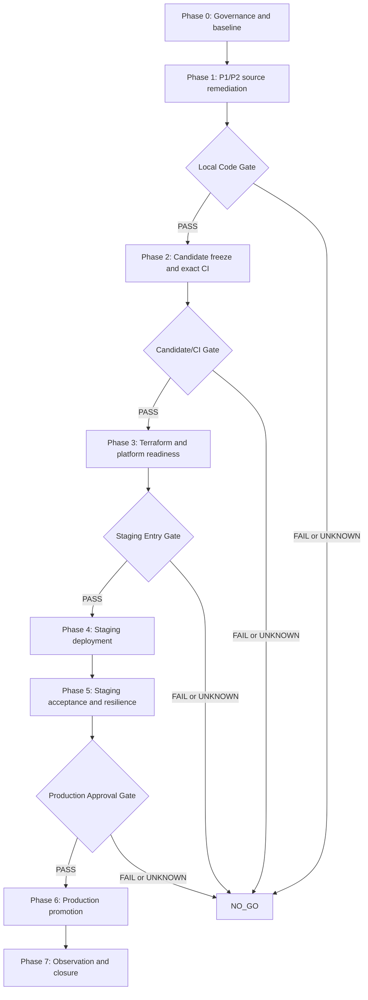

# Production Readiness Execution Plan

| Thuộc tính | Giá trị |
| --- | --- |
| Project | AI Interview Practice |
| Repository | `C:\Users\Duong Vinh\ai-interview-practice` |
| Plan version | `2.0 — TERRA_HIGH_EXECUTION_CONTRACT` |
| Plan status | `DRAFT_FOR_OWNER_APPROVAL` |
| Execution profile | Thiết kế để một coding agent chạy `terra high` thực hiện từng task có kiểm soát; mọi quyết định vượt boundary phải được human owner phê duyệt. |
| Initial audit baseline | branch `main`, HEAD `d0c09cef4f80cf7d4bcbb6c42328a65e55a5d895` |
| Initial audit date | 2026-08-31, Asia/Bangkok |
| Baseline evidence fingerprint | Declared `sha256:7d7f26b1e04923bfe06ca52c5346d5168e779d69ad065b935411117fd31cba24`; recomputed `sha256:703f8b0082f4f2f55e467777c988b22f8d387ca19091af4e5d2ef1e1c3a5927c`; mismatch này là blocker, không phải current release identity. |
| Target outcome | Project chỉ được tuyên bố `PRODUCTION_READY = GO` sau khi toàn bộ definition of done và mandatory evidence trong tài liệu này được hoàn thành trên cùng một immutable release candidate. |

---

## 1. Mục đích và tính chất bắt buộc

Tài liệu này chuyển kết quả Production Deployment Readiness Audit ngày 2026-08-31 thành một kế hoạch thực thi có thể kiểm chứng. Đây không phải danh sách khuyến nghị chung, roadmap sản phẩm hoặc tuyên bố rằng project đã production-ready.

Tài liệu quy định:

1. thứ tự thực hiện bắt buộc;
2. owner chịu trách nhiệm cho từng control;
3. dependency và điều kiện bắt đầu;
4. thay đổi repository dự kiến;
5. acceptance criteria định lượng hoặc có thể kiểm tra;
6. regression test và failure-injection test bắt buộc;
7. evidence cần lưu;
8. stop condition và rollback rule;
9. gate để chuyển từ local code đến candidate, staging và production;
10. definition of done cuối cùng.

Không được dùng việc “đã viết code”, “test từng PASS trước đây”, “workflow nhìn đúng”, “Terraform validate được”, “script backup tồn tại” hoặc “staging đã lên” để thay thế evidence mà gate tương ứng yêu cầu.

## 2. Ngôn ngữ quy chuẩn

Các từ khóa sau mang nghĩa bắt buộc:

- **MUST / PHẢI:** điều kiện bắt buộc. Thiếu evidence tương ứng đồng nghĩa gate không PASS.
- **MUST NOT / KHÔNG ĐƯỢC:** hành vi bị cấm trong quy trình phát hành.
- **SHOULD / NÊN:** control rất nên có; nếu không thực hiện phải có risk acceptance bằng văn bản.
- **MAY / CÓ THỂ:** tùy chọn không ảnh hưởng gate bắt buộc.
- **PASS:** có bằng chứng trực tiếp, tái lập được và gắn đúng immutable candidate.
- **FAIL:** invariant bị vi phạm hoặc test/control cho kết quả không đạt.
- **UNKNOWN:** thiếu evidence, chưa có quyền, chưa có môi trường hoặc chưa chạy đúng scope.
- **N/A:** thật sự không áp dụng và có giải thích được reviewer chấp nhận.
- **BLOCKER:** ngăn chuyển sang gate tiếp theo.

Mọi `UNKNOWN` tại mandatory gate được xử lý như `NO_GO`, không được tự động coi là rủi ro thấp.

### 2.1 Thứ tự ưu tiên nguồn sự thật

Khi hai nguồn thông tin mâu thuẫn, người thực thi PHẢI áp dụng thứ tự sau và dừng để xin quyết định nếu mâu thuẫn có thể đổi thiết kế, dữ liệu hoặc release outcome:

1. yêu cầu trực tiếp mới nhất của user trong task đang chạy;
2. safety policy và `AGENTS.md` đang active trong workspace;
3. repository source, migration, IaC và workflow tại exact snapshot đang được kiểm;
4. evidence thô có checksum và identity đầy đủ;
5. Gate Decision Record đã ký cho đúng candidate;
6. tài liệu kế hoạch này;
7. runbook/readiness document khác;
8. comment, issue, log tóm tắt hoặc memory của agent.

Không được dùng một tài liệu stale để phủ nhận source/evidence mới hơn. Nếu source khác plan, mặc định không tự đổi plan hoặc code để ép khớp; phải ghi deviation, đánh giá impact và áp dụng mục 22.

### 2.2 Task state machine bắt buộc

Mỗi task ID trong tài liệu chỉ được có đúng một trạng thái canonical:

```text
NOT_READY -> READY -> IN_PROGRESS -> IMPLEMENTED -> VERIFIED -> REVIEWED -> CLOSED
                  \-> BLOCKED
                  \-> FAILED
```

Quy tắc chuyển trạng thái:

- `NOT_READY`: còn dependency, input, owner, quyền hoặc safety precondition chưa đủ.
- `READY`: Definition of Ready đã được kiểm và ghi evidence; chưa sửa file hoặc mutate environment.
- `IN_PROGRESS`: đã chụp preflight, exact scope và baseline; chỉ một executor chịu trách nhiệm chính.
- `IMPLEMENTED`: thay đổi trong scope đã hoàn tất nhưng chưa được coi là đáp ứng gate.
- `VERIFIED`: toàn bộ test/evidence bắt buộc cho task PASS trên exact snapshot/environment identity.
- `REVIEWED`: reviewer bắt buộc xác nhận acceptance criteria, diff và evidence.
- `CLOSED`: closure record hoàn chỉnh, finding register/ledger đã cập nhật và không còn condition treo.
- `BLOCKED`: không thể tiếp tục an toàn do thiếu input/quyền/dependency; phải nêu exact blocker và next authority.
- `FAILED`: test hoặc invariant thất bại; không được đổi thành `VERIFIED` chỉ vì rerun PASS nếu chưa có root-cause/flaky disposition.

Không được nhảy từ `IN_PROGRESS` thẳng sang `CLOSED`. `BLOCKED` và `FAILED` giữ nguyên evidence lịch sử; khi tiếp tục phải tạo transition record, không ghi đè failure cũ.

### 2.3 Permission và authorization classes

| Class | Phạm vi | Ví dụ | Quy tắc |
| --- | --- | --- | --- |
| `L0_READ` | Read-only local | đọc source, `git status`, test discovery, diff inspection | Được phép trong task phân tích/thực thi; không đổi state |
| `L1_REPO_WRITE` | Sửa/tạo file bên trong exact workspace | patch source, test, doc, IaC | Chỉ khi task yêu cầu implementation; phải preflight, patch nhỏ, giữ pre-existing work |
| `L2_GIT_RECORD` | Stage/commit/tag local | explicit `git add <paths>`, commit candidate | Cần user authorization trong task hiện tại; cấm broad add, amend hoặc thao tác mất dữ liệu |
| `L3_REMOTE_CHANGE` | Push/PR/GitHub setting | push, tạo PR, sửa environment/protection | Cần user authorization; mọi target phải ghi rõ trước mutation |
| `L4_CLOUD_READ` | Cloud/GitHub read-only | describe ECS/IAM/ECR, xem Terraform state/plan prerequisites | Cần credentials/environment rõ; không đọc secret value; output phải redact |
| `L5_NONPROD_WRITE` | Mutation staging/disposable target | Terraform apply staging, migrate deploy, load/chaos/restore drill | Cần approval của environment/data owner, exact target, rollback/abort plan và preflight |
| `L6_PROD_WRITE` | Mutation production | production apply, migration, ECS promotion/rollback | Chỉ sau G5 PASS và independent production approval; từng lệnh phải map promotion record |

Quyền kỹ thuật hoặc chế độ full access không phải authorization. Task đang ở `L0`/`L1` không được tự nâng lên `L2`–`L6`. Bất kỳ lệnh nào có thể destroy/replace resource, reset/drop/truncate data, xoá untracked/dirty work hoặc discard Git state phải dừng theo safety policy, kể cả khi task mang class cao hơn.

### 2.4 Universal Task Execution Contract

Mỗi task ID PHẢI được thực thi như một work packet độc lập. Nếu task body không ghi lại một field dưới đây, default trong mục này vẫn bắt buộc:

| Field | Nội dung bắt buộc |
| --- | --- |
| `taskId` | ID duy nhất `PRD-NNNN`; không gộp đóng nhiều ID nếu evidence không tách được |
| `objective` | Một outcome có thể kiểm chứng, không dùng từ mơ hồ như “cải thiện” |
| `findingIds` | Finding/gap được đóng; có thể rỗng với task governance/deploy |
| `owner/reviewer` | Người/team accountable và reviewer độc lập khi được yêu cầu |
| `permissionClass` | Mức cao nhất task được phép dùng; nâng mức cần approval mới |
| `dependencies` | Task/gate/input phải `CLOSED`/`PASS`, không chỉ “đã làm” |
| `readScope` | File/evidence/environment cần đọc để xác định hiện trạng |
| `writeScope` | Exact path/resource được phép đổi; ngoài scope phải dừng hoặc mở scope change |
| `forbiddenScope` | Pre-existing unrelated work, protected data và actions bị cấm |
| `designInvariants` | Tính chất phải luôn đúng cả happy path lẫn failure path |
| `implementationSteps` | Thứ tự mutation nhỏ nhất, reviewable, có checkpoint |
| `tests` | Positive, negative, concurrency, restart/failure injection tương ứng risk |
| `evidence` | File/log/JSON/report thô, identity, checksum và nơi lưu |
| `stopConditions` | Condition phải dừng, rollback hoặc escalation |
| `DoR/DoD` | Definition of Ready và Definition of Done theo mục 2.5 |

Một agent chỉ được lấy một task hoặc một nhóm task được ghi rõ là atomic. Nếu phát hiện fix của task A buộc đổi contract của task B, agent phải ghi dependency/scope change; không lặng lẽ mở rộng diff.

### 2.5 Definition of Ready và Definition of Done áp dụng cho mọi task

**Definition of Ready (DoR):** task chỉ chuyển sang `READY` khi tất cả điều kiện sau đúng:

- owner, reviewer và permission class đã xác định;
- dependency đã `CLOSED` hoặc gate đã `PASS` bằng evidence còn hiệu lực;
- exact repository snapshot được ghi bằng branch, HEAD, status summary và candidate fingerprint nếu có;
- toàn bộ file dự kiến sửa đã được đọc; Git status xác nhận pre-existing dirty/staged/untracked/ignored state sẽ không bị ghi đè;
- expected behavior, invariants, acceptance criteria và failure cases không còn mâu thuẫn;
- required toolchain/test service/credentials/environment có sẵn hoặc task được giới hạn rõ ở phần local;
- với migration/IaC/cloud/data: target, account, region, backend/state, reversibility, backup/rollback và approval được xác nhận;
- evidence destination và redaction rule đã biết;
- không có unresolved decision trong mục 31 ảnh hưởng task.

**Definition of Done (DoD):** task chỉ chuyển sang `CLOSED` khi tất cả điều kiện sau đúng:

- diff chỉ chứa exact approved write scope; unrelated user work không bị sửa, stage, restore hoặc xóa;
- mọi design invariant và acceptance criterion có direct evidence;
- mandatory test PASS trên exact post-change fingerprint với retries `0`, hoặc test không thể chạy được ghi `UNKNOWN/BLOCKED` và task không được đóng;
- negative/failure path tương xứng risk đã được kiểm; test mới chứng minh fail trước/fix sau khi khả thi;
- không tạo warning, skipped test, secret/PII leak hoặc security finding chưa triage;
- evidence có metadata/checksum theo mục 7 và chưa bị invalidation theo mục 29;
- reviewer bắt buộc đã review diff/evidence;
- task ledger, finding register, traceability và closure record đã cập nhật;
- nếu thay đổi plan/architecture/contract, ADR hoặc deviation record đã được duyệt;
- executor báo rõ việc chưa làm; không dùng câu “production-ready” cho task local.

### 2.6 Agent operating protocol cho từng work packet

Agent chạy task PHẢI theo vòng lặp sau:

1. **Select:** nhận đúng một `taskId`; đọc task, dependency, gate, decision register và path scope.
2. **Preflight:** đọc `AGENTS.md`, `git status --short`, branch/HEAD, file mục tiêu, test gần nhất; ghi pre-existing state.
3. **Declare:** báo objective, assumption, permission class, files có thể đổi, test dự kiến và stop condition trước mutation.
4. **Inspect:** truy vết source-to-runtime-to-test-to-IaC; không sửa từ tên finding đơn lẻ.
5. **Design:** chọn thay đổi nhỏ nhất giữ invariants; đưa structural choice vào ADR khi mục 2.7 yêu cầu.
6. **Implement:** dùng patch reviewable; không broad rewrite/format; không stage/commit/push/deploy nếu chưa có class tương ứng.
7. **Verify focused:** chạy test trực tiếp của finding, bao gồm negative/failure/concurrency/restart khi yêu cầu.
8. **Verify regression:** chạy mandatory gate phù hợp impact; ghi exact command, version, exit code, timestamp và fingerprint.
9. **Review:** kiểm diff/status, secret/PII, migration/IaC impact, evidence freshness; nhờ reviewer nếu contract yêu cầu.
10. **Record:** cập nhật ledger/finding/closure; nêu `PASS`, `FAIL`, `UNKNOWN` riêng, không pha trộn.
11. **Stop or hand off:** nếu thiếu quyền/input thì dừng ở safe state và dùng prompt mục 32; nếu đạt DoD mới đề nghị `CLOSED`.

Nếu user gửi yêu cầu mới làm thay đổi scope trong khi task đang chạy, agent phải re-evaluate DoR và ghi scope transition trước khi tiếp tục.

### 2.7 Implementation freedom và escalation boundary

Người thực thi được tự chọn chi tiết code cục bộ khi tất cả điều kiện sau đúng: không đổi public contract, data model, trust boundary, persistence topology, provider, SLO, permission model hoặc release protocol; giải pháp là nhỏ nhất; test hiện có và acceptance criteria xác định đủ.

PHẢI tạo ADR ngắn và xin owner/reviewer quyết định trước khi chọn một trong các trường hợp:

- outbox so với explicit deletion state/reconciler nếu ảnh hưởng schema/operational model;
- presigned POST so với upload proxy;
- Redis data model/atomic primitive/TTL semantics cho shared intent;
- CloudWatch so với managed Prometheus/Grafana/external platform;
- thay đổi authentication transport hoặc channel-ticket protocol;
- retry/circuit-breaker/budget algorithm làm đổi user-visible behavior hoặc cost ceiling;
- migration có destructive/contract step;
- IAM boundary, KMS policy hoặc Terraform resource replacement;
- SLO, RPO/RTO, capacity/headroom, retention hoặc risk acceptance.

ADR tối thiểu ghi context, options, decision, rejected options, security/data/operations impact, migration/rollback, owner, reviewer và timestamp. Nếu chưa có decision, trạng thái đúng là `BLOCKED`, không phải tự đoán.

## 3. Baseline audit và trạng thái xuất phát

### 3.1 Git và candidate

| Thuộc tính | Giá trị baseline |
| --- | --- |
| Branch | `main` |
| HEAD | `d0c09cef4f80cf7d4bcbb6c42328a65e55a5d895` |
| Upstream | `origin/main` |
| Ahead/behind | `0/0` |
| Tracked files | 992 |
| Porcelain status entries | 496 |
| Tracked unstaged | 438 |
| Untracked | 58 |
| Staged | 0 |
| Candidate manifest paths | 121 |
| Fingerprinted paths | 120: 90 tracked + 30 untracked |
| Declared fingerprint | `sha256:7d7f26b1e04923bfe06ca52c5346d5168e779d69ad065b935411117fd31cba24` |
| Recomputed fingerprint | `sha256:703f8b0082f4f2f55e467777c988b22f8d387ca19091af4e5d2ef1e1c3a5927c` |

Kết luận baseline:

- candidate manifest đã stale;
- chưa có immutable candidate SHA;
- mọi evidence được ghi cho fingerprint cũ chỉ là historical evidence;
- không có local image ID hoặc CI baseline run nào đại diện cho current candidate;
- cả bốn verdict khởi đầu là `NO_GO`.

### 3.2 Findings phải được đóng

| ID | Mức | Finding | Gate bị chặn |
| --- | --- | --- | --- |
| RLS-001 | P1 BLOCKER | Candidate fingerprint không khớp bytes hiện tại | Candidate |
| DATA-001 | P1 BLOCKER | Xóa DB metadata trước object cloud, có thể tạo orphan không retry được | Local code, staging, production |
| REL-001 | P1 BLOCKER | Upload intent fallback vào process memory trong production multi-replica | Local code, staging, production |
| SEC-001 | P1 / Security Medium | Presigned upload thiếu runtime validation, byte cap và lifecycle đúng prefix | Local code, staging, production |
| OPS-001 | P1 production blocker | Dashboard/alert config chưa có deployment và notification path được chứng minh | Staging acceptance, production |
| SEC-002 | P2 / Security Medium | Public web task dùng chung S3/KMS task role với API/worker | Local code, staging, production |
| REL-002 | P2 | `AI_TIMEOUT_MS` và `AI_MAX_RETRIES` không điều khiển runtime | Local code, staging |
| CD-001 | P2 | Release manifest thiếu deterministic migration-set hash | Candidate CI, staging, production |
| SEC-003 | P3 / Security Low | SSE vẫn nhận reusable bearer token qua query URL | Local code, security smoke |
| DOC-001 | P3 | Readiness documents có kết luận stale/superseded | Candidate review |

### 3.3 External evidence bắt buộc còn thiếu

Các mục sau khởi đầu ở trạng thái `UNKNOWN`:

- exact-toolchain full test/build/security gates cho current candidate;
- CI PASS trên immutable candidate SHA;
- reviewed Terraform plan cho staging và production;
- live GitHub environment, reviewer và OIDC configuration;
- immutable API/web ECR digests được build một lần;
- staging rollout bằng exact digests;
- live ECS task-role/S3/KMS positive và negative evidence;
- browser security smoke;
- load, soak, capacity và multi-replica evidence;
- synthetic alert evidence;
- exact rollback rehearsal;
- successful restore drill với checksum, RPO và RTO;
- final production approval.

## 4. Outcome cuối cùng và definition of done tổng quát

Kế hoạch chỉ hoàn thành khi đồng thời thỏa mãn tất cả điều kiện sau:

1. `LOCAL_CODE_READY = GO` trên exact toolchain;
2. `CANDIDATE_READY = GO` cho một immutable commit SHA;
3. `STAGING_READY = GO` và staging acceptance PASS trên exact image digests;
4. `PRODUCTION_READY = GO` sau independent production approval;
5. mọi P1/P2 finding đã đóng bằng regression evidence;
6. P3 còn lại, nếu có, phải có explicit risk acceptance và expiry date;
7. không có mandatory gate ở trạng thái `UNKNOWN`, `NOT_RUN`, `SKIPPED` hoặc `FLAKY`;
8. không có test chỉ PASS nhờ retry;
9. release manifest, SBOM, migration-set hash, digests và approvals cùng trỏ về một source SHA;
10. staging và production dùng cùng API/web digests, không rebuild;
11. rollback rehearsal và restore drill đã PASS;
12. monitoring và alert delivery đã được chứng minh bằng synthetic failure;
13. final evidence bundle được hai reviewer kiểm tra;
14. production environment approval được ghi nhận sau, không phải trước, staging acceptance.

## 5. Phạm vi, non-goals và nguyên tắc an toàn

### 5.1 Trong phạm vi

- API, worker, web và contracts;
- PostgreSQL schema/migrations và data integrity;
- Redis/BullMQ durability;
- S3/KMS signed-upload flow và lifecycle;
- AWS ECS/RDS/ElastiCache/ALB/ECR/Secrets Manager infrastructure;
- GitHub Actions CI/CD, environments và OIDC;
- observability, alerting, runbooks, rollback và recovery;
- exact-candidate testing, SAST/SCA/secret/IaC/container scanning;
- staging acceptance và production promotion.

### 5.2 Ngoài phạm vi tự động

Các hành động sau cần user/platform authorization riêng tại thời điểm thực hiện:

- commit, push, tạo PR hoặc merge;
- thay đổi GitHub environments, reviewers, secrets hoặc branch protection;
- tạo/chỉnh AWS role, KMS key, DNS, ACM hoặc cloud resource;
- Terraform plan trên real backend nếu quyền chưa được cấp;
- Terraform apply;
- staging/production deploy;
- migration trên bất kỳ database nào chưa được xác nhận disposable hoặc đúng target;
- restore drill;
- load/soak test vào external environment;
- production promotion.

### 5.3 Bảo vệ dữ liệu và Git state

- Không clean/reset/restore/stash/delete pre-existing work để làm gate PASS.
- Không broad-stage bằng `git add .`, `git add -A` hoặc wildcard.
- Không đọc hoặc in secret value vào log/evidence.
- Không dùng production database cho test, migration rehearsal hoặc restore drill.
- Không rollback application bằng cách đảo destructive migration hoặc restore production data.
- Không dùng Terraform apply để “xem có chạy không”.
- Không chấp nhận plan có persistent replacement chưa được reviewer giải thích và phê duyệt.

## 6. Vai trò và trách nhiệm

Tên người cụ thể phải được điền trước khi bắt đầu Phase 4.

| Role | Trách nhiệm bắt buộc | Không được tự phê duyệt |
| --- | --- | --- |
| Repository Owner | Scope, code changes, candidate manifest, commit provenance | Production approval cho chính thay đổi của mình |
| Application Owner | API/web/worker correctness, auth, storage, AI runtime | Security exception do mình tạo |
| Security Reviewer | Threat paths, authz, signed URL, IAM, scanners, browser negative tests | Waive P1 không có compensating control |
| Data/DB Owner | Migration compatibility, backup, PITR, restore drill, RPO/RTO | Restore vào target chưa xác nhận disposable |
| Platform/IaC Owner | Terraform plan, AWS networking/IAM/KMS/ECS/RDS/Redis, OIDC | Approve persistent replacement một mình |
| CI/CD Owner | Exact-SHA CI, workflow protection, SBOM/manifest retention | Bypass required checks |
| SRE/Operations Owner | SLO, dashboards, alerts, load/soak, rollback, incident readiness | Declare alerts PASS chỉ từ config file |
| Staging Approver | Cho phép staging execution sau Candidate Gate | Production approval |
| Production Approver | Final independent decision sau evidence review | Approve khi còn mandatory UNKNOWN |
| Evidence Custodian | Evidence index, checksums, retention, chain of custody | Thay đổi evidence sau approval |

### 6.1 RACI tối thiểu

| Workstream | Responsible | Accountable | Consulted | Informed |
| --- | --- | --- | --- | --- |
| Storage/data fixes | Application Owner | Repository Owner | Security, Data Owner | SRE |
| IAM separation | Platform Owner | Security Reviewer | Application Owner | Repository Owner |
| CI/release manifest | CI/CD Owner | Repository Owner | Security, Data Owner | Platform Owner |
| Observability | SRE Owner | Platform Owner | Application Owner | Production Approver |
| Migration rehearsal | Data Owner | Platform Owner | Application Owner | Security Reviewer |
| Staging acceptance | SRE + Application + Security | Staging Approver | Data/Platform | Production Approver |
| Production release | Platform/CI Owner | Production Approver | All owners | Stakeholders |

## 7. Evidence hierarchy và chain of custody

Evidence được ưu tiên theo thứ tự sau:

1. immutable CI artifact gắn source SHA và run ID;
2. cloud/staging evidence gắn release manifest SHA-256 và image digests;
3. local exact-toolchain evidence gắn working-tree fingerprint;
4. static source review;
5. historical evidence;
6. statement không có artifact.

Chỉ mức 1–3 có thể đóng execution gate. Static review có thể đóng design finding nhưng không thay thế runtime validation khi acceptance criteria yêu cầu runtime.

### 7.1 Evidence bundle bắt buộc

Mỗi candidate phải có logical evidence bundle sau. Bundle có thể là CI artifacts hoặc hệ thống lưu trữ được phê duyệt; không bắt buộc commit generated output vào repository.

```text
release-evidence/<source-sha>/
  candidate/
    candidate-manifest.md
    candidate-fingerprint.txt
    staged-name-status.txt
    source-sha.txt
  ci/
    ci-run.json
    test-summary.json
    migration-test-summary.json
    scanner-summary.json
    dependency-audit.json
  supply-chain/
    release-manifest.json
    release-manifest.json.sha256
    api-image-sbom.cdx.json
    web-image-sbom.cdx.json
    api-image-sbom.sha256
    web-image-sbom.sha256
    migration-set.sha256
  terraform/
    staging-plan-summary.md
    production-plan-summary.md
    persistent-replacement-review.md
  staging/
    deployment-record.json
    task-definition-record.json
    smoke-summary.json
    browser-security-summary.json
    iam-storage-summary.json
    load-soak-summary.json
    dependency-failure-summary.json
    alert-synthetic-summary.json
    rollback-rehearsal.json
    restore-drill.json
  approvals/
    candidate-approval.md
    staging-approval.md
    production-approval.md
  production/
    promotion-record.json
    post-deploy-smoke.json
    observation-window-summary.json
```

### 7.2 Metadata bắt buộc cho mọi evidence file

Mỗi evidence record PHẢI chứa hoặc tham chiếu:

- source SHA;
- release manifest SHA-256;
- API digest;
- web digest;
- environment;
- UTC start/end timestamps;
- tool name/version;
- exact command hoặc workflow job;
- exit code/status;
- retry count;
- operator/owner;
- redaction note;
- linked raw artifact;
- result `PASS`, `FAIL`, `UNKNOWN` hoặc `N/A`;
- lý do nếu `N/A`;
- checksum nếu artifact được tải hoặc chuyển hệ thống.

Evidence thiếu source SHA hoặc digest phải bị hạ xuống historical/non-release evidence.

## 8. Dependency graph và phase model



Không phase nào được chạy vượt gate trước nó. Có thể triển khai song song các task không phụ thuộc nhau trong cùng phase, nhưng evidence cuối phải được tính lại sau khi merge toàn bộ thay đổi.

---

## 9. Phase 0 — Governance, baseline và scope control

### Mục tiêu

Thiết lập một nguồn sự thật duy nhất trước khi sửa code, tránh evidence drift và tránh gộp nhầm pre-existing work.

### PRD-0001 — Chỉ định owner và approval authority

**Owner:** Repository Owner
**Dependencies:** none
**Priority:** P1 process blocker

Phải thực hiện:

1. điền tên hoặc team cho tất cả role ở mục 6;
2. xác định production approver độc lập với implementer;
3. xác định notification destination và on-call owner;
4. xác định Data Owner có quyền phê duyệt disposable restore target;
5. xác định ai có quyền review Terraform persistent replacement;
6. ghi escalation channel và response expectation cho staging/prod window.

**Acceptance criteria:** không role bắt buộc nào để trống; production approver không đồng thời là sole implementer.

**Evidence:** signed owner matrix hoặc approved PR comment/link.

### PRD-0002 — Tạo audit finding register

**Owner:** Evidence Custodian
**Dependencies:** PRD-0001

Mỗi finding phải có:

- ID cố định;
- severity;
- root cause;
- affected files/services;
- implementation task;
- test task;
- staging validation task;
- owner;
- target gate;
- status;
- closure evidence;
- reviewer;
- closure timestamp;
- risk acceptance nếu không sửa.

**Acceptance criteria:** RLS-001, DATA-001, REL-001, SEC-001, OPS-001, SEC-002, REL-002, CD-001, SEC-003 và DOC-001 đều có row.

### PRD-0003 — Khóa nguyên tắc candidate construction

**Owner:** Repository Owner
**Dependencies:** PRD-0002

Quy tắc:

- candidate chỉ chứa explicit reviewed paths;
- pre-existing unrelated dirty/untracked/ignored state không được stage;
- manifest phải phân biệt tracked-modified và untracked-new;
- fingerprint phải tính từ raw file bytes bằng SHA-256;
- manifest tự loại chính nó khỏi fingerprint nếu dùng self-referential format;
- scope thay đổi sau review làm invalid approval trước;
- không push trước candidate gate;
- không dùng broad add.

**Exit criteria Phase 0:** owner matrix và finding register được duyệt; cách freeze candidate được thống nhất.

---

## 10. Phase 1 — Source remediation bắt buộc

### Workstream A — Storage và data safety

#### PRD-1001 — Durable file deletion state machine

**Closes:** DATA-001
**Primary owner:** Application Owner
**Accountable:** Data Owner
**Security review:** required
**Likely files:**

- `apps/api/src/modules/storage/storage.service.ts`
- storage DTO/contracts;
- Prisma schema và expand migration nếu thêm trạng thái/outbox;
- worker/queue module nếu dùng durable job;
- storage service and integration tests.

**Required design:**

1. `DELETE` phải idempotent theo asset ID/key.
2. DB phải giữ recoverable state cho đến khi cloud deletion được xác nhận.
3. Provider timeout hoặc error không được làm mất retry handle.
4. Retry phải không xóa nhầm object mới tái sử dụng key.
5. Audit log phải phân biệt requested, pending, succeeded và failed.
6. Reconciler phải tìm và xử lý deletion pending quá threshold.
7. Admin retry phải có ownership/role guard và audit.
8. S3 versioning semantics phải được ghi rõ: delete marker không đồng nghĩa version purge.
9. Retention/legal hold policy, nếu có, phải thắng user deletion và trả trạng thái rõ ràng.

**Preferred implementation:**

- transaction tạo `DELETION_PENDING` hoặc outbox event;
- durable worker thực hiện idempotent provider delete;
- sau provider success, transaction finalize/tombstone metadata và audit;
- exponential backoff có cap và dead-letter visibility;
- reconciliation metric và alert.

Không chấp nhận chỉ đổi thứ tự thành “xóa S3 trước, xóa DB sau” nếu không có tombstone/reconcile, vì DB failure sau cloud delete tạo split-brain theo hướng ngược lại.

**Mandatory tests:**

- owner deletion happy path;
- admin authorized deletion;
- non-owner denial;
- unregistered key denial;
- S3 timeout trước success;
- S3 hard failure;
- DB failure sau provider result;
- duplicate request;
- concurrent delete requests;
- worker retry sau restart;
- dead-letter/reconcile;
- audit event sequence;
- versioned object semantics trên disposable S3-compatible or staging target.

**Acceptance criteria:** không failure point nào làm mất durable retry/reconcile reference; repeated request hội tụ về một terminal state; không duplicate destructive side effect ngoài idempotent provider behavior.

**Closure evidence:** focused unit/integration tests, failure-injection trace, staging object/metadata reconciliation record và alert evidence.

#### PRD-1002 — Production upload intents phải dùng shared durable store

**Closes:** REL-001
**Primary owner:** Application Owner
**Dependencies:** none
**Likely files:** `storage.service.ts`, Redis/storage config, readiness checks, tests.

**Required behavior:**

- production không được fallback vào process memory;
- presign phải fail closed với retryable 503 khi shared intent store unavailable;
- local/test memory mode chỉ được bật explicit và phải bị env validation cấm trong production;
- intent phải single-use, expiring và bound vào user, key, filename, MIME, category, visibility, maximum size và issue timestamp;
- confirm phải atomic consume hoặc CAS để hai replicas không cùng confirm;
- readiness phải phản ánh dependency cần thiết để cấp upload capability.

**Mandatory tests:**

- Redis unavailable ở presign;
- Redis disconnect sau presign;
- confirm được route sang replica khác;
- concurrent confirm trên hai replicas;
- expired intent;
- replayed intent;
- wrong user/key;
- service restart giữa presign và confirm;
- production env rejects memory fallback.

**Acceptance criteria:** trong multi-replica test, không request nào nhận upload URL nếu hệ thống không thể lưu shared intent; valid intent confirm thành công từ replica bất kỳ đúng một lần.

#### PRD-1003 — Runtime upload validation, byte cap và intent binding

**Closes:** SEC-001
**Primary owner:** Application Owner
**Accountable reviewer:** Security Reviewer
**Dependencies:** PRD-1002

**Required controls:**

1. Parse `PresignUploadSchema` tại runtime bằng approved Nest/Zod pipe hoặc class DTO có validation metadata.
2. Đặt maximum filename length và reject control characters/path separators không được phép.
3. Allowlist MIME theo category; không tin extension.
4. Đặt per-object maximum bytes theo category.
5. Dùng presigned POST có `content-length-range` hoặc controlled upload proxy có enforceable limit. Không coi client-provided `Content-Length` đơn thuần là đủ nếu signature không enforce.
6. Signed capability TTL phải ngắn nhất phù hợp; mục tiêu mặc định không quá 15 phút nếu UX cho phép.
7. Confirm phải so sánh actual object metadata với intent: size, content type, key, owner, category và visibility.
8. Client không được tự đổi `isPublic`, filename hoặc MIME khi confirm.
9. Public object phải qua content/malware policy và explicit category.
10. Quota phải giới hạn object count, total bytes, active intents và request rate theo account/tenant.
11. Abandoned/unconfirmed object phải có quarantine/lifecycle cleanup.
12. Lifecycle Terraform phải phủ chính xác `public/`, `documents/`, `system-design/`, `temp/` hoặc taxonomy mới.
13. Storage cost và quota rejection phải có metrics/alerts.

**Mandatory negative tests:**

- invalid/missing category;
- arbitrary category;
- empty/oversized filename;
- spoofed MIME;
- one byte over each category limit;
- changed metadata at confirm;
- private intent confirmed public;
- expired/replayed/wrong-owner intent;
- large repeated uploads within throttle;
- abandoned temp object lifecycle;
- public active-content file policy.

**Acceptance criteria:** over-limit upload bị storage provider từ chối trước persistence; confirm không thể nâng visibility hoặc đổi metadata; Terraform lifecycle inventory test chứng minh không runtime prefix nào thiếu policy.

#### PRD-1004 — Storage deletion and upload observability

**Owner:** SRE Owner
**Dependencies:** PRD-1001, PRD-1002, PRD-1003

Phải có metrics tối thiểu:

- upload intent issued/rejected/expired/replayed;
- confirmed upload bytes và object count theo category, không label user ID;
- quota rejection;
- deletion pending age;
- deletion retry/failure/dead-letter;
- orphan reconciliation count;
- storage provider latency/error;
- estimated storage growth/cost signal.

Không metric/log nào được chứa presigned URL, bearer token, raw filename có PII, access key hoặc object content.

### Workstream B — IAM và token exposure

#### PRD-1101 — Tách ECS task roles theo component

**Closes:** SEC-002
**Primary owner:** Platform/IaC Owner
**Reviewer:** Security Reviewer
**Likely files:** `infra/terraform/modules/compute/main.tf`, variables/outputs, environment modules.

**Required target state:**

- web task role: không có application S3/KMS data-plane permissions;
- API role: chỉ action/prefix cần cho synchronous signed URL/metadata paths;
- worker role: chỉ action/prefix cần cho async processing;
- execution role tách biệt task role;
- KMS policy có encryption-context/resource condition phù hợp;
- role names/ARNs được output đủ cho deployment script nhưng không expose secret;
- `iam:PassRole` của GitHub deploy role chỉ cho exact execution/task roles;
- không dùng wildcard resource nếu có thể scope cụ thể.

**Mandatory validation:**

- Terraform static test cho distinct roles;
- IAM policy simulation hoặc Access Analyzer;
- staging web task S3 Get/Put/Delete và KMS calls đều `AccessDenied`;
- API/worker positive paths PASS;
- cross-prefix negative tests PASS;
- deployment workflow vẫn register đúng task definitions.

**Acceptance criteria:** compromise của web task không cấp quyền đọc/ghi/xóa application bucket theo task role.

#### PRD-1102 — Loại reusable bearer token khỏi SSE query

**Closes:** SEC-003
**Primary owner:** Application Owner
**Reviewer:** Security Reviewer
**Likely files:** interview controller, web SSE hook/tests, contracts/docs.

**Preferred option:** chỉ nhận `Authorization: Bearer` vì first-party fetch client đã hỗ trợ header.

Nếu bắt buộc hỗ trợ primitive không set header:

- authenticated POST tạo channel ticket;
- ticket single-use;
- audience chỉ một session/channel;
- TTL rất ngắn;
- không phải general API access token;
- replay detection shared giữa replicas;
- không chứa trong long-lived logs;
- ownership và MFA requirements vẫn được kiểm tra.

**Mandatory tests:** query access token trả 401; header success; wrong-owner denial; expired/replayed ticket denial nếu dùng ticket; ALB/proxy log sample không chứa reusable credential.

### Workstream C — AI reliability và cost enforcement

#### PRD-1201 — Wire timeout/retry config end-to-end

**Closes:** REL-002
**Primary owner:** Application Owner
**Likely files:** AI configuration, providers, router, tests.

**Required behavior:**

- provider SDK timeout lấy từ validated `AI_TIMEOUT_MS` hoặc per-provider config;
- retry count lấy từ `AI_MAX_RETRIES`;
- retry chỉ áp dụng transient/idempotent-safe cases;
- auth/validation/quota errors không retry;
- streaming call có abort deadline;
- timeout bao phủ cả request lifecycle, không chỉ SDK connect;
- retry budget và circuit breaker phối hợp để tránh retry storm;
- logs ghi operation/provider/attempt nhưng không prompt, token hoặc secret;
- metrics phân biệt attempt và logical request.

**Mandatory tests:** config values 0/1/N; timeout abort; 401/403 no retry; 429/backoff; network timeout; ambiguous provider outcome; circuit open; fallback chain; duplicate durable side-effect prevention.

#### PRD-1202 — Chứng minh per-call và daily cost cap

**Owner:** Application Owner
**Reviewer:** Security + SRE
**Dependencies:** PRD-1201

Phải chứng minh:

- request token/output limits tương thích `AI_MAX_PROVIDER_CALL_COST_USD` cho mọi enabled model;
- reservation amount là upper bound hợp lệ hoặc request bị reject;
- concurrent reservations không vượt daily cap ngoài documented rounding tolerance;
- ambiguous failures không release budget mù;
- settlement idempotent;
- model/config change không được deploy nếu pricing/cap mapping thiếu;
- budget exhaustion có actionable alert và user-safe response;
- mock fallback không tạo authoritative side effect.

**Acceptance criteria:** concurrency test với nhiều API/worker replicas không vượt cap đã duyệt; provider cost metric reconcile với reservation ledger.

### Workstream D — CI/CD và release evidence

#### PRD-1301 — Add deterministic migration-set hash

**Closes:** CD-001
**Owner:** CI/CD Owner
**Reviewer:** Data Owner
**Likely files:** `.github/workflows/deploy.yml`, invariant checker, runbook.

**Hash algorithm phải được định nghĩa rõ:**

1. enumerate migration directories theo lexical order;
2. include repository-relative path và raw SHA-256 của từng `migration.sql`;
3. normalize record separator, không normalize file bytes;
4. hash sorted records thành `migrationSetSha256`;
5. ghi hash vào release manifest;
6. verify lại trước staging migration task và production migration task;
7. mismatch phải dừng deployment trước DB connection.

**Mandatory tests:** order stability, added/removed/modified migration changes hash, CRLF/raw-byte behavior rõ ràng, missing migration failure, workflow invariant checker failure khi manifest không chứa/verify hash.

#### PRD-1302 — Release manifest schema v2

**Owner:** CI/CD Owner
**Dependencies:** PRD-1301

Manifest tối thiểu phải chứa:

- schema version;
- source SHA;
- approved CI run ID/URL;
- candidate fingerprint;
- API image URI/digest;
- web image URI/digest;
- API/web SBOM SHA-256;
- migration-set SHA-256;
- build timestamps và toolchain versions;
- workflow/ref provenance;
- scanner summary refs;
- artifact retention metadata.

Manifest phải có checksum riêng; staging/production jobs phải consume cùng output, không tự dựng lại manifest.

#### PRD-1303 — Exact-SHA gate hardening

**Owner:** CI/CD Owner
**Reviewer:** Security Reviewer

Phải xác minh:

- chỉ successful push CI trên protected release branch mới cấp provenance cho CD;
- manual dispatch không bypass CI/source SHA/environment approval;
- checkout exact SHA và verify `HEAD`;
- actions pin full commit SHA;
- scanner/build images pin digest;
- frozen lockfile;
- no mutable image tag được deploy;
- API và worker dùng cùng API digest;
- production dùng cùng staging digests;
- concurrency ngăn overlapping environment deployments;
- artifact upload failure làm job FAIL;
- ECR scan policy block severity đã duyệt;
- rollback record lưu exact prior task-definition ARNs.

### Workstream E — Observability và operational readiness

#### PRD-1401 — Chọn và triển khai production metrics architecture

**Closes:** OPS-001, phần deployment
**Owner:** SRE Owner
**Accountable:** Platform Owner

Chọn một kiến trúc được review, ví dụ:

- CloudWatch native alarms/dashboards; hoặc
- managed Prometheus/Grafana; hoặc
- approved external observability platform.

Không được để file Prometheus/Grafana trong repo mà không có deployment path, scrape authorization và notification route.

**Required design:**

- private metrics scrape path;
- public `/api/v1/metrics` tiếp tục 404/deny;
- API và worker metrics được scrape;
- high-availability collector nếu monitoring là production critical;
- no secret/PII labels;
- retention và encryption;
- dashboard provisioning bằng IaC/config được version-control;
- alert notification destination và on-call ownership;
- alert dedup/routing/silencing governance;
- alert rule test/lint trong CI.

#### PRD-1402 — Define SLI/SLO và alert policy

**Owner:** SRE Owner
**Consulted:** Product/Application Owner

Phải có target được approver chấp nhận cho:

- availability của critical API/user journeys;
- p95 và p99 latency;
- HTTP 5xx/error rate;
- queue depth, oldest-job age và failed/dead-letter jobs;
- worker heartbeat/restarts;
- RDS connections/storage/CPU/failover events;
- Redis memory/evictions/connections/replication;
- AI provider latency/error/fallback;
- AI reservation/settled spend và budget burn;
- upload/deletion failures;
- backup age và restore-drill freshness;
- deployment failure/circuit-breaker rollback.

Alert phải actionable, có severity, owner, runbook, threshold rationale và false-positive review.

#### PRD-1403 — Synthetic alert verification

**Owner:** SRE Owner
**Dependencies:** PRD-1401, PRD-1402, staging deployment

**Scheduling rule:** task được định nghĩa cùng observability workstream để giữ traceability, nhưng chỉ chạy và đóng trong Phase 5/G4 sau PRD-4002. G1 chỉ yêu cầu deployable observability implementation và rule validation; không được giả synthetic live evidence trước staging.

Phải tạo controlled staging signals cho ít nhất:

- API 5xx/error-rate alert;
- latency alert;
- unhealthy target/task restart;
- worker queue lag/backlog;
- AI provider failure/circuit breaker;
- budget burn warning/critical;
- storage deletion retry/dead-letter;
- backup/restore freshness.

**Acceptance criteria:** alert fires trong documented detection window, tới đúng destination, chứa đúng runbook/context, rồi tự resolve hoặc được đóng theo runbook.

#### PRD-1404 — Runbook correction và owner binding

**Closes:** DOC-001 và phần OPS-001
**Owner:** Evidence Custodian + SRE

Phải:

- sửa statement stale về production rebuild;
- xóa hoặc đánh dấu superseded historical exact-manifest claims;
- đảm bảo mọi alert runbook path tồn tại và active;
- gắn owner/escalation cho deploy, rollback, provider outage, budget exhaustion, Redis outage, queue backlog, upload orphan, DB incident và restore;
- thêm last-reviewed date và review cadence;
- cấm hướng dẫn destructive workaround.

## 11. Phase 1 verification — Local Code Gate

Phase 1 chỉ PASS sau khi merge toàn bộ source remediation vào cùng working snapshot và chạy lại gate từ đầu.

### 11.1 Exact toolchain

Phải dùng:

- Node `22.13.x` theo repo contract;
- pnpm `11.0.9`;
- frozen lockfile;
- tool versions được capture trong evidence.

Không được bypass engine enforcement bằng direct binary để tạo release PASS.

### 11.2 Mandatory local gates

| Gate | Requirement |
| --- | --- |
| Format | Prettier check PASS, không auto-format unrelated files |
| Lint | Full lint PASS |
| Typecheck | contracts, API, web PASS với no-emit |
| Contracts | Full test PASS |
| API unit | Full PASS, retries 0 |
| API integration | Full PASS trên disposable DB/Redis |
| Web unit | Full PASS |
| Migration checker | PASS |
| Migration deploy | PASS trên clean disposable DB và production-like upgraded copy |
| Release workflow checker | PASS |
| Actionlint | PASS |
| ShellCheck | PASS |
| Terraform fmt | PASS |
| Terraform init/validate | PASS trên disposable copy, backend disabled |
| Secret scan | Exact-scope Gitleaks PASS |
| SAST | Exact-scope Semgrep PASS |
| SCA | Lockfile/production dependency policy PASS |
| IaC scan | Terraform/container config policy PASS |
| Image scan | API/web image policy PASS |
| Docker E2E | Full PASS, retries 0, audit-specific disposable resources |
| Git whitespace | `git diff --check` PASS |

### 11.3 Focused closure suites

Phải có test suite riêng map một-một với:

- DATA-001 deletion state machine;
- REL-001 multi-replica intents;
- SEC-001 upload constraints;
- SEC-002 task-role policy assertions;
- REL-002 timeout/retry configuration;
- CD-001 migration hash;
- SEC-003 SSE token behavior;
- OPS-001 observability config/rule validation.

### 11.4 Local Code Gate PASS criteria

- tất cả P1/P2 implementation task complete;
- tất cả mandatory local gates PASS trên cùng fingerprint;
- không flaky/retry-assisted PASS;
- no new critical/high/medium security finding chưa triage;
- no ignored/skipped target ngoài approved exclusions;
- working snapshot fingerprint được ghi lại sau gate;
- rerun fingerprint không đổi do test/build.

Nếu build/test tạo ignored output, evidence phải chứng minh candidate source bytes không đổi.

---

## 12. Phase 2 — Candidate freeze, review và immutable CI

### PRD-2001 — Rebuild candidate manifest

**Closes:** RLS-001
**Owner:** Repository Owner
**Dependencies:** Local Code Gate PASS

Phải:

1. inventory toàn bộ changed/new file cần cho remediation;
2. tách unrelated pre-existing work;
3. review từng included path;
4. record status `tracked-modified` hoặc `untracked-new`;
5. compute raw-byte file SHA-256;
6. compute aggregate fingerprint;
7. ghi exact exclusions và lý do;
8. xác nhận không secret/ignored output nào được include;
9. có second reviewer kiểm manifest.

### PRD-2002 — Explicit staging và commit provenance

Chỉ sau user authorization:

- stage explicit reviewed paths;
- compare staged name-status với manifest;
- recompute fingerprint từ staged blobs hoặc resulting commit;
- stop nếu path set/digest khác;
- create candidate commit;
- record immutable SHA;
- không sửa commit sau CI approval; thay đổi bất kỳ byte nào tạo candidate mới.

### PRD-2003 — Exact-SHA CI

CI phải chạy toàn bộ gates ở mục 11 cộng:

- production builds;
- API/worker/web container smoke;
- SBOM generation;
- scanner gates trong cùng CI run consumed bởi CD;
- migration-set hash;
- release manifest schema validation;
- artifact checksum/retention validation.

### Candidate/CI Gate PASS criteria

- manifest fingerprint khớp commit tree;
- staged count/path set được review;
- immutable source SHA tồn tại;
- protected-branch CI PASS chính SHA;
- required review/branch protection không bị bypass;
- release manifest schema v2 và checksum PASS;
- API/web digests immutable;
- API/worker cùng API digest;
- SBOM và scanner artifacts đầy đủ;
- không mandatory job skipped/cancelled/flaky;
- evidence custodian seal bundle.

---

## 13. Phase 3 — Terraform và platform readiness

### PRD-3001 — Terraform validation trên exact candidate

**Owner:** Platform Owner
**Dependencies:** Candidate/CI Gate PASS

Phải chạy version đã pin và lưu:

- fmt check;
- init/validate cho root, bootstrap, staging và production;
- provider lock verification;
- IaC scanner;
- module/static policy tests.

### PRD-3002 — Reviewed staging plan

Plan phải được tạo từ exact candidate với approved backend/account/region. Summary phải liệt kê:

- resources add/change/destroy/replace;
- mọi persistent resource;
- RDS/Redis/S3/KMS/ECR state;
- ECS service/task definition changes;
- IAM policy changes;
- network/security group changes;
- DNS/ACM dependencies;
- estimated capacity/cost impact;
- drift/import requirements.

**Automatic stop:** bất kỳ destroy/replace RDS, Redis, S3, KMS, ECR hoặc stateful/log evidence resource ngoài explicit approved migration.

### PRD-3003 — Reviewed production plan

Production plan phải review riêng, không suy ra từ staging. Phải chứng minh:

- private ECS tasks;
- public HTTPS ALB only;
- TLS policy/certificate/domain đúng;
- public metrics denial;
- RDS encryption, force SSL, Multi-AZ, deletion protection, backups/PITR;
- Redis TLS/auth/encryption, Multi-AZ/snapshot policy;
- S3 versioning, KMS, public block, lifecycle đúng runtime prefixes;
- separate least-privilege task roles;
- CloudWatch/log encryption and retention;
- observability/alert resources;
- deployment circuit breaker;
- autoscaling/capacity assumptions;
- no unexpected persistent replacement.

### PRD-3004 — GitHub/AWS prerequisites

Read-only verification phải xác nhận:

- `staging` và `production` GitHub environments tồn tại;
- production có independent reviewer;
- branch restrictions đúng;
- OIDC deploy role trust policy giới hạn repo/ref/environment;
- không dùng long-lived AWS key cho deployment;
- `iam:PassRole` đúng scope;
- ECR immutability/scan settings;
- provider secrets tồn tại, không đọc values;
- staging/prod base URLs là HTTPS;
- notification destinations có owner.

### Staging Entry Gate PASS criteria

- Candidate/CI Gate vẫn valid;
- staging plan approved;
- production plan reviewed đủ để phát hiện architectural blocker, dù chưa apply;
- no unexplained persistent replacement;
- environments/OIDC/secrets prerequisites verified;
- RPO/RTO, expected peak traffic và budget ceiling được owner cung cấp;
- staging test accounts và provider/payment test configuration sẵn sàng;
- staging approver cấp execution approval.

---

## 14. Phase 4 — Staging deployment bằng exact digests

### PRD-4001 — Staging migration và exact-digest deployment

**Owner:** Platform Owner + CI/CD Owner
**Reviewer:** Staging Approver
**Permission class:** `L5_NONPROD_WRITE`
**Dependencies:** G3 PASS; exact target/account/region; approved staging plan; rollback ARNs; maintenance/test window.
**DoR bổ sung:** operator chứng minh AWS identity/account/region, Terraform workspace/backend và ECS cluster/service target trước lệnh mutation; source SHA/digests/migration hash khớp sealed manifest.

#### Deployment sequence bắt buộc

1. verify source SHA, release manifest checksum, migration hash và image digests;
2. verify staging plan approval còn hiệu lực;
3. register task definitions dùng exact digests;
4. chạy `prisma migrate deploy` bằng isolated one-off staging task;
5. dừng ngay nếu migration non-zero hoặc migration hash mismatch;
6. update API, worker, web services;
7. wait service stability và circuit-breaker result;
8. verify running task-definition ARNs và image digests;
9. lưu exact prior/current task definitions;
10. chạy basic smoke trước deep tests.

Không được rebuild image, retag mutable image hoặc deploy source trực tiếp trên server.

**Automatic abort:** identity/target mismatch; plan stale; migration hash mismatch; migration non-zero; unexpected persistent mutation; service circuit breaker; running digest khác manifest; secret xuất hiện trong output.

**DoD:** staging migration PASS; services stable bằng exact digests; prior/current task-definition ARNs và raw deployment evidence được lưu; không có automatic abort chưa disposition; PRD-4002 được phép bắt đầu.

### PRD-4002 — Staging post-deploy basic smoke

**Owner:** Application Owner + SRE Owner
**Reviewer:** Staging Approver
**Permission class:** `L4_CLOUD_READ` cho kiểm tra; `L5_NONPROD_WRITE` chỉ cho rollback đã phê duyệt khi smoke FAIL.
**Dependencies:** PRD-4001 `VERIFIED`; running identity đã capture.

#### Basic smoke

- web `/` HTTPS;
- API liveness/readiness;
- worker readiness/heartbeat;
- `/api/v1/metrics` public 404/deny;
- DB/Redis TLS connection healthy;
- no mock provider in production-like configuration;
- logs không chứa secret/token;
- migrations đúng expected set;
- API/worker/web running digests khớp manifest.

Basic smoke FAIL phải rollback exact prior task definitions theo runbook, không tiếp tục acceptance suite.

**DoD:** mọi smoke item PASS trên running task definitions/digests vừa capture; logs đã kiểm secret/token; migration set đúng; Gate Decision Record cho phép Phase 5. Nếu rollback xảy ra, task là `FAILED` hoặc `BLOCKED`, không được coi là PASS vì prior version đã khỏe lại.

---

## 15. Phase 5 — Staging acceptance và resilience

### PRD-5001 — Browser authentication/security smoke

**Owner:** Security Reviewer + Application Owner

Phải kiểm tra bằng browser thật:

- register/login;
- MFA enrollment và valid/invalid TOTP;
- step-up cho admin route;
- hard reload với refresh cookie;
- access token không ở local/session storage;
- refresh cookie HttpOnly, Secure, SameSite, scoped path;
- refresh rotation;
- reuse/family revocation;
- logout/revocation;
- negative cross-origin refresh/logout;
- missing/invalid CSRF custom header;
- CORS allow/deny origins;
- cookie/token redaction trong browser/network/log evidence;
- public/private route boundaries.

### PRD-5002 — Authorization/BOLA/tenant suite

Phải có negative tests cho:

- interview/session/status/SSE ownership;
- storage object ownership;
- document parser assets;
- audio/voice tickets;
- system-design sessions;
- question-bank entitlements;
- mentor pending/approved/admin boundaries;
- B2B tenant/member/role isolation;
- admin MFA binding;
- public share visibility;
- ID enumeration/UUID substitution.

Không được dùng only mock service tests làm staging BOLA evidence.

### PRD-5003 — Live S3/KMS/task-role validation

Phải chứng minh:

- API task dùng default ECS credential chain, không static keys;
- valid signed upload/download/delete flow;
- one-byte-over-limit rejection;
- invalid metadata/visibility rejection;
- KMS encryption đúng;
- public access block;
- web task S3/KMS `AccessDenied`;
- API/worker chỉ truy cập allowed prefixes/actions;
- temporary credentials/session token path nếu được hỗ trợ;
- object lifecycle/tagging/quarantine behavior;
- deletion failure/retry/reconcile.

### PRD-5004 — AI trust/cost/provider failure suite

Phải kiểm tra:

- real enabled provider success;
- mock forbidden hoặc review-only;
- mock/missing evidence không đổi authoritative score, XP, certificate, readiness, analytics, notifications hoặc learning path;
- prompt injection/adversarial user content không vượt schema/authority boundary;
- timeout/retry config có hiệu lực;
- provider 401/403 no retry;
- 429/backoff/circuit breaker;
- ambiguous failure reservation handling;
- distributed budget concurrency;
- budget exhaustion response/alert;
- logs không chứa prompt/credential không cần thiết.

### PRD-5005 — Load, soak và capacity

**Inputs bắt buộc:** expected peak, headroom target, workload mix, data size, cost ceiling và abort thresholds.

Test tối thiểu:

- critical API/browser journeys ở expected peak;
- ramp đến approved headroom;
- multi-replica API/worker;
- queue-producing answer/evaluation flows;
- storage presign/confirm quota behavior;
- AI calls với controlled test budget;
- connection pool/RDS connections;
- Redis memory/connections/queue lag;
- web asset/ALB latency;
- soak đủ dài để thấy leak, connection exhaustion, queue buildup và cost drift.

Phải report:

- request count/concurrency;
- p50/p95/p99;
- success/error/timeout rate;
- queue lag/depth;
- CPU/memory/restarts;
- DB/Redis saturation;
- cost/reservation;
- retry count;
- duplicate side-effect checks;
- abort threshold events.

### PRD-5006 — Dependency-failure và chaos có kiểm soát

Chỉ trong staging:

- stop/restart một API task;
- stop/restart một worker task;
- Redis interruption;
- AI provider timeout/failure;
- storage provider transient failure;
- DB connectivity degradation theo approved method;
- queue backlog;
- alert delivery failure path.

Phải chứng minh service recovery, fail-closed capability issuance, no lost durable work, no duplicate authoritative side effects và alerts đúng.

### PRD-5007 — Exact rollback rehearsal

Phải:

1. record current and prior API/worker/web task-definition ARNs;
2. deploy candidate;
3. trigger controlled rollback decision;
4. restore exact prior ARNs, không rebuild;
5. verify services stable và digests đúng prior record;
6. verify expanded schema vẫn backward-compatible;
7. verify no data reset/reverse migration;
8. record RTO và operator steps;
9. rerun critical smoke.

### PRD-5008 — Backup/PITR và restore drill

**Owner:** Data Owner
**Safety gate:** target phải được xác nhận disposable, empty và có name pattern được duyệt.

Phải chứng minh:

- RDS automated backup/PITR retention live config;
- logical backup encryption before durable persistence;
- checksum;
- S3/KMS upload verification;
- backup age/retention;
- restore vào isolated empty drill DB;
- critical tables/row sanity;
- constraints/indexes/migration history;
- application read-only smoke trên restored data nếu được duyệt;
- measured RPO/RTO so với target;
- cleanup được người dùng xử lý theo policy riêng, không phải một phần tự động của plan.

Script tồn tại hoặc Bash syntax PASS không đóng gate này.

### PRD-5009 — Synthetic alert and runbook drill

Chạy PRD-1403 và ghi:

- signal injected;
- expected rule;
- actual firing timestamp;
- notification timestamp/destination;
- owner acknowledgment;
- runbook used;
- resolution timestamp;
- gaps và remediation.

### Staging Acceptance Gate PASS criteria

- running digests khớp release manifest;
- browser/auth/security suite PASS;
- BOLA/tenant suite PASS;
- live S3/KMS/task-role suite PASS;
- AI trust/cost suite PASS;
- load/soak đạt SLO và headroom;
- dependency-failure suite PASS;
- synthetic alerts PASS;
- rollback rehearsal PASS;
- restore drill PASS RPO/RTO;
- no unresolved P1/P2;
- no mandatory UNKNOWN/flaky/skipped test;
- evidence bundle complete và checksummed;
- staging approver ký acceptance.

---

## 16. Phase 6 — Production approval và promotion

### PRD-6001 — Independent production pre-approval

**Owner:** Production Approver
**Reviewer:** Security Reviewer + Data Owner + SRE Owner theo control của họ
**Permission class:** `L4_CLOUD_READ`; approval record không cấp quyền mutation ngoài exact release.
**Dependencies:** G4 PASS; evidence bundle sealed; production plan còn hiệu lực.

#### 16.1 Pre-approval review

Production Approver phải độc lập kiểm:

- source SHA và candidate fingerprint;
- CI run/result;
- release manifest checksum;
- image/SBOM/migration hashes;
- Terraform production plan approval;
- staging running/accepted digests;
- staging security/load/rollback/restore evidence;
- open finding register;
- risk acceptances và expiry;
- change window/on-call/escalation;
- exact prior production task definitions;
- rollback decision thresholds;
- database migration compatibility;
- current service health/incident status.

#### 16.2 Automatic NO_GO conditions

Không approve nếu:

- source SHA/digest/manifest mismatch;
- production plan khác plan được review;
- persistent replacement không approved;
- migration-set hash mismatch;
- staging dùng digest khác production proposal;
- required reviewer/branch/environment protection bị bypass;
- any P1/P2 open;
- mandatory evidence `UNKNOWN`, `FAIL`, `SKIPPED`, `NOT_RUN` hoặc flaky;
- monitoring/alerts không hoạt động;
- rollback target không xác định;
- restore drill stale hoặc không đạt;
- current incident/error budget/capacity không cho phép release;
- provider secrets/budget/notification owner thiếu.

**DoD:** G5 Gate Decision Record được ký sau staging acceptance, ghi exact source SHA, manifest checksum, digests, migration hash, plan identity, change window, prior ARNs, approver và expiry. Approval hết hiệu lực khi bất kỳ identity/invalidation trigger ở mục 29 xảy ra.

### PRD-6002 — Exact release production promotion

**Owner:** Release Operator / CI/CD Owner
**Accountable:** Production Approver
**Permission class:** `L6_PROD_WRITE`
**Dependencies:** PRD-6001 `CLOSED`; approval chưa hết hiệu lực; operator/account/region/cluster/services được reverify; on-call sẵn sàng.

#### 16.3 Promotion sequence

1. acquire production environment approval;
2. reverify manifest/source/digests/migration hash;
3. verify production plan/apply authorization;
4. run forward-compatible migration task;
5. update API/worker/web bằng exact staging digests;
6. wait ECS service stability/circuit breaker;
7. verify task definitions và digests;
8. run non-destructive production smoke;
9. enter observation window;
10. rollback exact prior ARNs nếu stop threshold đạt.

Không rebuild, không SSH/manual source deploy, không reverse destructive migration, không reset/restore production DB để rollback application.

**Automatic abort/rollback:** bất kỳ identity mismatch, plan drift, migration failure, ECS circuit-breaker failure, critical smoke failure, stop threshold hoặc alerting loss. Rollback chỉ dùng prior task-definition ARNs và schema backward-compatible; database recovery là incident process riêng.

**DoD:** migration và exact-digest promotion hoàn thành; running task definitions/digests khớp release manifest; immediate smoke đủ để vào observation; deployment/approval/raw event evidence được checksummed; PRD-7001 được mở. Việc deploy thành công không tự đóng G6.

## 17. Phase 7 — Post-deploy observation và closure

### PRD-7001 — Production smoke và observation window

**Owner:** SRE Owner + Application Owner
**Reviewer:** Production Approver
**Permission class:** `L4_CLOUD_READ`; `L6_PROD_WRITE` chỉ khi thực hiện exact approved rollback.
**Dependencies:** PRD-6002 `VERIFIED`; monitoring/alerts/on-call đang healthy.

#### Immediate smoke

- HTTPS web/API;
- liveness/readiness;
- worker heartbeat;
- metrics isolation;
- login/MFA/refresh/logout sample;
- one authorized critical user journey;
- provider and budget signal;
- queue processing;
- logs/alerts healthy;
- running digests match manifest.

#### Observation window

Duration phải được SRE/Production Approver định nghĩa theo risk và traffic. Theo dõi:

- availability/error rate;
- p95/p99 latency;
- ALB target health;
- task restarts/deployment events;
- queue lag/dead-letter;
- RDS/Redis saturation;
- AI provider error/fallback/cost;
- storage errors/quota/deletion pending;
- auth/MFA/refresh anomalies;
- alerts và on-call acknowledgments.

**Automatic rollback/escalation:** breach threshold đã duyệt; critical journey/auth/data-integrity failure; sustained error/latency; queue không hội tụ; runaway AI/storage cost; monitoring blind spot; digest/task definition drift. Không chờ hết window khi stop threshold đã đạt.

**DoD:** window đủ duration/risk/traffic target; không breach chưa disposition; metrics/log/alert snapshot map exact release; smoke và observation được reviewer chấp nhận.

### PRD-7002 — Release evidence seal và production closure

**Owner:** Evidence Custodian
**Approver:** Production Approver
**Permission class:** `L1_REPO_WRITE` cho record trong repo hoặc approved evidence-store write; không có quyền thay đổi runtime.
**Dependencies:** PRD-7001 `CLOSED`; không incident/deviation bắt buộc chưa xử lý.

#### Closure criteria

- không breach stop threshold;
- release record chứa source SHA/digests/task ARNs;
- production smoke PASS;
- observation summary approved;
- deviations được ghi thành finding/issue;
- evidence retention verified;
- next restore/security/dependency/DR rehearsal scheduled;
- final verdict record đổi sang `PRODUCTION_READY = GO` với approver/timestamp.

**DoD:** G6 Gate Decision Record và final evidence index có checksum được ký; finding/task ledger đồng bộ; retention/next-drill dates được ghi; verdict duy nhất của exact release là `PRODUCTION_READY=GO`. Release khác hoặc commit mới không kế thừa verdict này.

---

## 18. Gate matrix thực thi

### G0 — Governance Gate

| Control | PASS condition |
| --- | --- |
| Owners | Mọi mandatory role có owner |
| Finding register | Mọi audit finding có task/test/evidence mapping |
| Candidate policy | Explicit path/fingerprint rules approved |
| Safety | No destructive/broad staging shortcuts |

### G1 — Local Code Gate

| Control | PASS condition |
| --- | --- |
| DATA-001 | Durable deletion state machine + failure injection PASS |
| REL-001 | Multi-replica shared intent/fail-closed PASS |
| SEC-001 | Runtime validation/byte cap/intent binding/lifecycle PASS |
| SEC-002 | Separate task roles static policy PASS |
| REL-002 | Config-driven timeout/retry tests PASS |
| CD-001 | Migration hash implementation/invariant tests PASS |
| SEC-003 | No reusable query bearer PASS |
| OPS-001 | Deployable observability design/config and CI validation PASS |
| Full gates | Exact-toolchain format/lint/type/test/build/scanners PASS |

### G2 — Candidate/CI Gate

| Control | PASS condition |
| --- | --- |
| Manifest | Exact path set reviewed |
| Fingerprint | Current/staged/commit fingerprints match |
| Git | Immutable candidate SHA, no unexpected staged path |
| CI | Protected push CI PASS exact SHA |
| Supply chain | Pinned actions/images, SBOM, scans, checksums |
| Release manifest | Source/digests/SBOM/migration hash present |

### G3 — Staging Entry Gate

| Control | PASS condition |
| --- | --- |
| Terraform | Staging/production plans reviewed |
| Persistence | No unexpected destroy/replace |
| IAM/OIDC | Environments, reviewers, trust, pass-role verified |
| Secrets | Presence/source/validation verified without reading values |
| Inputs | URLs/accounts/traffic/budget/RPO/RTO supplied |

### G4 — Staging Acceptance Gate

| Control | PASS condition |
| --- | --- |
| Deployment | Exact digests stable |
| Migration | Exact hash deploy PASS |
| Browser security | PASS |
| BOLA/tenant | PASS |
| S3/KMS/IAM | Positive/negative PASS |
| AI trust/cost | PASS |
| Load/soak | SLO/headroom PASS |
| Failure/chaos | Recovery/no-duplicate PASS |
| Alerts | Synthetic delivery PASS |
| Rollback | Exact ARN rehearsal PASS |
| Restore | Checksum/RPO/RTO PASS |

### G5 — Production Approval Gate

| Control | PASS condition |
| --- | --- |
| All previous gates | Remain valid |
| Production plan | Approved and unchanged |
| Open findings | No P1/P2; P3 explicitly accepted if any |
| Evidence | Complete, checksummed, exact release |
| Approval | Independent environment approval after staging |

### G6 — Production Closure Gate

| Control | PASS condition |
| --- | --- |
| Running state | Exact manifest digests/task definitions |
| Smoke | PASS |
| Observation | No stop-threshold breach |
| Operations | Alerts/on-call healthy |
| Records | Promotion/approval/evidence retained |

## 19. Traceability matrix

| Finding/gap | Implementation tasks | Required tests | Closure gate | Evidence |
| --- | --- | --- | --- | --- |
| RLS-001 | PRD-2001, PRD-2002 | Fingerprint/staged tree verification | G2 | Candidate manifest/fingerprint/source SHA |
| DATA-001 | PRD-1001 | Provider/DB failure, retry, reconcile | G1 + G4 | Unit/integration/staging deletion trace |
| REL-001 | PRD-1002 | Multi-replica, Redis outage, replay | G1 + G4 | Multi-replica result |
| SEC-001 | PRD-1003 | Runtime validation, byte cap, metadata binding | G1 + G4 | Security tests + live S3 result |
| OPS-001 | PRD-1401–1404 | Rule lint + synthetic alerts | G4 | Alert/destination/runbook evidence |
| SEC-002 | PRD-1101 | Policy tests + live AccessDenied | G1 + G4 | Plan, IAM simulation, task tests |
| REL-002 | PRD-1201 | Timeout/retry/fallback/circuit tests | G1 + G4 | Focused tests + provider failure trace |
| CD-001 | PRD-1301–1302 | Migration hash invariants | G2 + G4 | Release manifest + migration task evidence |
| SEC-003 | PRD-1102 | Query denial/header or ticket tests | G1 + G4 | API/browser/log evidence |
| DOC-001 | PRD-1404 | Link/status review | G2 | Reviewed docs diff |
| Exact toolchain | Section 11 | Full gates | G1/G2 | CI/test artifacts |
| Terraform replacement risk | PRD-3002–3003 | Plan review | G3/G5 | Approved plan summaries |
| Live AWS prerequisites | PRD-3004, PRD-5003 | Read-only/live positive/negative | G3/G4 | IAM/OIDC/S3/KMS evidence |
| Load/capacity | PRD-5005 | Load/soak | G4 | Load/soak report |
| Rollback | PRD-5007 | Rehearsal | G4 | Exact ARN rollback record |
| Restore | PRD-5008 | Disposable restore drill | G4 | Drill JSON/checksum/RPO/RTO |

## 20. Risk register tối thiểu

| Risk | Trigger | Preventive control | Detection | Response | Owner |
| --- | --- | --- | --- | --- | --- |
| Candidate evidence drift | Included byte thay đổi | Freeze/fingerprint/immutable SHA | Hash mismatch | Invalidate evidence, create new candidate | Repository Owner |
| Storage orphan | Provider/DB split failure | Durable deletion/outbox | Pending age/reconcile metric | Retry/reconcile, incident if threshold | Application/Data Owner |
| Unbounded upload cost | Repeated large signed PUT | Byte cap/quota/lifecycle | Bytes/quota/cost alerts | Revoke/limit account, clean via approved process | Security/SRE |
| Cross-replica intent loss | Redis unavailable | Shared store/fail closed | Presign 503/intents metric | Restore Redis, no capability issuance | Application/SRE |
| Web compromise reaches data | Shared task role | Separate least privilege roles | IAM/Access Analyzer | Revoke task/redeploy/incident | Platform/Security |
| Token leakage in URL/log | SSE query token | Header/single-use ticket | Secret/log scan | Revoke family/token, log access incident | Security |
| AI retry storm/cost overspend | Provider degradation | Config timeout/retry/circuit/budget | Retry/cost/burn alerts | Circuit/open/disable provider | Application/SRE |
| Hidden migration drift | Migration set differs | Deterministic migration hash | Pre-deploy mismatch | Stop release | CI/Data Owner |
| Undetected outage | Collector/alert missing | Deployed monitoring/synthetic drill | Heartbeat/no-data alert | Incident/manual rollback | SRE |
| Persistent resource loss | Terraform replacement | Dual plan review/deletion protection | Plan diff | Stop apply | Platform/Data Owner |
| Rollback incompatibility | Schema/app mismatch | Expand/contract + rehearsal | Rollback smoke | Stop release/incident | Application/Data Owner |
| Restore failure | Backup corrupt/stale | Checksum/PITR/drills | Backup age/drill alert | DR incident | Data Owner |

## 21. Stop, abort và rollback policy

### 21.1 Stop ngay trước staging/production

- any source/fingerprint/digest/hash mismatch;
- mandatory gate không PASS;
- secret xuất hiện trong artifact/log;
- unexpected staged path;
- CI job skipped/cancelled/flaky;
- plan có unapproved persistent replacement;
- migration historical audit thất bại;
- production environment protection/OIDC không đúng;
- alerting unavailable;
- rollback target không xác định;
- restore drill không đạt hoặc quá hạn policy;
- live incident hoặc insufficient capacity.

### 21.2 Rollback application

- dùng exact prior API/worker/web task-definition ARNs;
- không rebuild;
- không reverse migration trong hot path;
- không reset/drop/truncate/restore production data;
- verify backward-compatible expanded schema;
- smoke và observe sau rollback;
- tạo incident/deviation record.

### 21.3 Database recovery

Database restore không phải application rollback mặc định. Chỉ thực hiện theo DR incident process, exact target authorization, Data Owner approval và evidence-preservation policy.

## 22. Change control và risk acceptance

### 22.1 Scope change

Bất kỳ thay đổi source, workflow, Dockerfile, dependency, migration hoặc Terraform sau candidate freeze đều:

1. invalidates fingerprint;
2. invalidates affected tests/scans;
3. yêu cầu candidate SHA mới;
4. yêu cầu CI mới;
5. có thể yêu cầu plan/staging evidence mới theo impact.

### 22.2 Risk acceptance

- P0/P1 không được waive để release.
- P2 chỉ được waive khi có compensating control, owner, expiry, tracking issue và Production Approver + Security Reviewer ký.
- P3 cần owner, rationale và review date nếu còn mở.
- `UNKNOWN` không được risk-accept như PASS; phải chuyển thành evidence hoặc explicitly decide `NO_GO`.

Risk acceptance record phải có:

- finding ID;
- exact candidate SHA;
- exposure/impact;
- compensating controls;
- reason fix chưa thực hiện;
- owner;
- expiry date;
- monitoring;
- approval identities/timestamps;
- follow-up issue.

## 23. Completion record templates

### 23.1 Task closure

```text
Task ID:
Finding IDs closed:
Source SHA/fingerprint:
Implementation summary:
Files changed:
Tests added:
Commands/workflows:
Tool versions:
Result:
Raw evidence links/checksums:
Known limitations:
Reviewer:
Reviewed at UTC:
```

### 23.2 Gate decision

```text
Gate:
Candidate source SHA:
Release manifest SHA-256:
API digest:
Web digest:
Decision: PASS | FAIL | UNKNOWN | N/A
Mandatory controls reviewed:
Open findings:
Exceptions/risk acceptances:
Evidence index:
Decision owner:
Independent reviewer:
Decision timestamp UTC:
Next authorized action:
```

### 23.3 Production approval

```text
PRODUCTION_READY: GO | NO_GO
Source SHA:
Staging acceptance record:
Production plan approval:
Release manifest checksum:
Running/proposed digests:
Migration-set hash:
Rollback target ARNs recorded: yes/no
Restore drill evidence and freshness:
Monitoring/alert synthetic evidence:
Open P0/P1/P2:
P3 risk acceptances:
Change window:
On-call owner:
Approver:
Approved at UTC:
```

## 24. Minimal critical path

Thứ tự ngắn nhất không được bỏ bước:

1. phê duyệt owner matrix và finding register;
2. sửa durable delete, shared upload intent và enforceable upload limits;
3. tách task roles, bỏ SSE query bearer, wire AI timeout/retry;
4. thêm migration-set hash/release manifest v2;
5. triển khai observability IaC và sửa runbooks stale;
6. chạy exact-toolchain local gates và focused failure tests;
7. rebuild/review candidate manifest và fingerprint;
8. tạo immutable candidate SHA theo authorization;
9. protected exact-SHA CI PASS, tạo immutable digests/SBOM/manifest;
10. review staging và production Terraform plans;
11. verify environments/OIDC/secrets/owners;
12. deploy staging exact digests và migration hash;
13. browser security, BOLA, live IAM/S3/KMS, AI trust/cost tests;
14. load/soak, dependency failures và synthetic alerts;
15. exact rollback rehearsal;
16. successful disposable restore drill;
17. seal staging evidence bundle;
18. independent production approval;
19. promote exact staging digests;
20. production smoke, observation và closure.

## 25. Final production-ready checklist

Chỉ đánh dấu `PRODUCTION_READY = GO` khi tất cả ô dưới đây hoàn thành:

### Source và candidate

- [ ] P1/P2 source findings closed.
- [ ] Exact candidate scope reviewed.
- [ ] Candidate fingerprint current.
- [ ] Staged paths exactly match manifest.
- [ ] Immutable source SHA exists.
- [ ] No unrelated/secret/ignored output included.

### CI và supply chain

- [ ] Exact Node/pnpm frozen install PASS.
- [ ] Format/lint/typecheck/tests/build PASS.
- [ ] E2E retries 0 PASS.
- [ ] Migration checks/deploy tests PASS.
- [ ] Actionlint/ShellCheck/Terraform validation PASS.
- [ ] Gitleaks/Semgrep/SCA/IaC/image scans PASS.
- [ ] Actions and build/scanner images immutably pinned.
- [ ] SBOMs generated and checksummed.
- [ ] Release manifest v2 checksummed.
- [ ] Migration-set hash present and verified.
- [ ] API/worker same API digest.
- [ ] Artifacts retained per approved policy.

### Infrastructure

- [ ] Staging Terraform plan approved.
- [ ] Production Terraform plan approved.
- [ ] No unexpected persistent replacement.
- [ ] Private ECS tasks and HTTPS ALB verified.
- [ ] RDS/Redis encryption/auth/Multi-AZ verified.
- [ ] S3 versioning/KMS/public block/lifecycle verified.
- [ ] API/worker/web task roles separated.
- [ ] GitHub environments/reviewers/restrictions verified.
- [ ] AWS OIDC and least-privilege deploy role verified.
- [ ] Secrets presence/source validated without value exposure.

### Staging

- [ ] Exact candidate digests deployed.
- [ ] Running task definitions/digests verified.
- [ ] Migration hash/deploy PASS.
- [ ] Browser auth/MFA/refresh/logout PASS.
- [ ] CSRF/CORS/rate/upload negative tests PASS.
- [ ] BOLA/tenant/admin boundary tests PASS.
- [ ] Live ECS task-role/S3/KMS tests PASS.
- [ ] AI authority/prompt/cost/failure tests PASS.
- [ ] Load/soak/headroom PASS.
- [ ] Multi-replica/dependency-failure tests PASS.
- [ ] Synthetic alert delivery PASS.
- [ ] Exact rollback rehearsal PASS.
- [ ] Restore drill checksum/RPO/RTO PASS.

### Production

- [ ] No open P0/P1/P2.
- [ ] No mandatory `UNKNOWN`, `FAIL`, `SKIPPED`, `NOT_RUN` or flaky gate.
- [ ] Final evidence bundle checksummed and reviewed.
- [ ] Exact prior production task definitions recorded.
- [ ] Change window and on-call owners confirmed.
- [ ] Independent production approval recorded.
- [ ] Production uses exact staging digests.
- [ ] Post-deploy smoke PASS.
- [ ] Observation window meets SLO/stop thresholds.
- [ ] Release and deviation records archived.

## 26. Plan maintenance

Tài liệu phải được cập nhật khi:

- finding mới được validate;
- architecture/storage/AI/deployment model thay đổi;
- gate hoặc evidence format thay đổi;
- toolchain/scanner policy thay đổi;
- RPO/RTO/SLO/capacity target thay đổi;
- cloud account/region/environment topology thay đổi;
- rollback/restore rehearsal phát hiện gap;
- một statement bị evidence mới supersede.

Mỗi lần cập nhật phải giữ traceability từ finding đến task, test, gate và evidence. Không được xóa historical failure để làm báo cáo “sạch”; phải mark superseded và trỏ đến evidence mới.

---

## 27. Trạng thái hiện tại của plan

| Gate | Trạng thái ban đầu | Điều kiện để đổi trạng thái |
| --- | --- | --- |
| Governance Gate | `PENDING` | Owner matrix/finding register/candidate policy approved |
| Local Code Gate | `NO_GO` | Phase 1 remediation và exact-toolchain gates PASS |
| Candidate/CI Gate | `NO_GO` | Current fingerprint, immutable SHA và exact-SHA CI PASS |
| Staging Entry Gate | `NO_GO` | Reviewed plans và external prerequisites PASS |
| Staging Acceptance Gate | `NOT_STARTED` | Exact-digest staging suite/rollback/restore PASS |
| Production Approval Gate | `NO_GO` | Tất cả mandatory evidence complete, independent approval |
| Production Closure Gate | `NOT_STARTED` | Promotion, smoke và observation PASS |

**Current authoritative verdict:**

```text
LOCAL_CODE_READY=NO_GO
CANDIDATE_READY=NO_GO
STAGING_READY=NO_GO
PRODUCTION_READY=NO_GO
```

Không verdict nào được nâng chỉ bằng việc hoàn thành checklist thủ công. Mỗi thay đổi trạng thái phải có Gate Decision Record và evidence links/checksums tương ứng.

---

## 28. Task contract matrix cho executor `terra high`

Ma trận này chuẩn hóa boundary cho từng task. `Write scope` là vùng tối đa được cân nhắc, không phải quyền sửa tất cả file trong vùng. Trước mutation, executor PHẢI thu hẹp thành danh sách exact file trong task packet. Mọi task mặc định cấm sửa/xóa pre-existing unrelated work, file ngoài workspace, `.git`, secret store, production data và historical inactive material dưới `ai-it-interview-project-kit/_archived/16-codex/` hoặc `.codex-quarantine/`.

| Task | Max permission | Ready khi | Write scope tối đa | Evidence tối thiểu để Done | Stop/escalate khi |
| --- | --- | --- | --- | --- | --- |
| PRD-0001 | `L1_REPO_WRITE` | role list và approver candidates có sẵn | owner/finding/evidence records trong `docs/operations/` hoặc active project-kit records được owner chọn | approved owner matrix, separation-of-duty check | không xác định approver độc lập, Data/SRE/Security owner |
| PRD-0002 | `L1_REPO_WRITE` | PRD-0001 closed | finding register/evidence index | đủ 10 audit IDs, owner/task/test/gate/evidence/status/reviewer | finding ID/severity/root cause mâu thuẫn audit |
| PRD-0003 | `L1_REPO_WRITE` | finding register tồn tại | candidate policy/manifest tooling/tests | policy được review; fixture chứng minh path set/hash deterministic | candidate scope chưa được owner xác nhận |
| PRD-1001 | `L1_REPO_WRITE` | deletion ADR quyết định; schema/queue strategy rõ | `apps/api/src/modules/storage/**`, `apps/api/prisma/schema.prisma`, additive migration mới, focused tests/metrics | unit/integration/failure/restart/concurrency evidence; migration safety; reconcile trace | cần destructive migration, key reuse invariant không giải được, dirty file overlap |
| PRD-1002 | `L1_REPO_WRITE` | Redis intent model/TTL/atomic primitive được chốt | storage module, platform Redis/config/readiness, focused tests | cross-replica/replay/outage/restart tests; production memory fallback rejected | phải đổi Redis topology/contract ngoài scope hoặc fail-open còn tồn tại |
| PRD-1003 | `L1_REPO_WRITE` | upload mechanism/category limits/quota quyết định | storage controller/service/provider, `packages/contracts/src/schemas/storage.ts`, web upload caller nếu contract đổi, storage Terraform lifecycle, tests | runtime parse; provider-enforced byte cap; metadata/visibility binding; prefix inventory test | presigned mechanism không enforce được limit; public content policy chưa có owner |
| PRD-1004 | `L1_REPO_WRITE` | PRD-1001–1003 behavior/terminal states ổn định | storage metrics/logs, `apps/api/src/modules/platform/metrics/**`, alert/dashboard config, tests | metric unit tests; no-secret label review; staging alert evidence liên kết PRD-5009 | cardinality/PII risk hoặc alert backend chưa được chọn |
| PRD-1101 | `L1_REPO_WRITE` | IAM action/prefix inventory cho web/API/worker được duyệt | `infra/terraform/modules/compute/**`, relevant root/env variables/outputs, IaC tests/workflow references | Terraform/static policy PASS; reviewed plan; live web deny/API-worker allow evidence | unexpected role replacement/pass-role expansion/KMS wildcard |
| PRD-1102 | `L1_REPO_WRITE` | header-only hoặc ticket ADR quyết định | interview controller/SSE service, `apps/web/src/hooks/use-interview-sse.ts`, contracts/tests/docs | query token 401; approved transport PASS; ownership/replay/log-redaction evidence | browser/client constraint buộc reusable URL credential |
| PRD-1201 | `L1_REPO_WRITE` | timeout/retry semantics và retryable taxonomy rõ | platform config, AI providers/router/circuit breaker, tests | config 0/1/N, abort deadline, no-retry auth/quota, 429/backoff, circuit/fallback tests | SDK không hỗ trợ abort hoặc ambiguous side effect chưa có idempotency |
| PRD-1202 | `L1_REPO_WRITE` | pricing/model mapping và cap inputs approved | AI orchestration/budget/config/metrics/tests và active cost governance docs | distributed concurrency/cap/settlement/reconciliation tests; budget alert | giá/model/cost ceiling chưa được owner cung cấp |
| PRD-1301 | `L1_REPO_WRITE` | migration enumeration contract chốt | `.github/workflows/deploy.yml`, `infra/scripts/check-migration-safety.mjs`, release checker/tests/docs | deterministic fixtures; raw-byte behavior; pre-DB mismatch failure | historical migration file dirty/modified không được giải thích |
| PRD-1302 | `L1_REPO_WRITE` | PRD-1301 verified; manifest consumer inventory đầy đủ | deploy workflow, release-manifest generator/schema/checker/docs/tests | schema validation/checksum; producer-consumer exact artifact test | staging/prod còn tự tái tạo field/digest |
| PRD-1303 | `L1_REPO_WRITE` | branch/CD threat model và current workflow được đọc | `.github/workflows/**`, `infra/scripts/check-release-workflows.mjs`, tests/docs | invariant checker, exact-SHA/provenance/artifact-failure tests, action/image pin audit | security control cần GitHub mutation nhưng chưa có `L3` approval |
| PRD-1401 | `L1_REPO_WRITE` local; `L5_NONPROD_WRITE` deploy | observability ADR, retention, notification owner approved | `infra/prometheus/**`, `infra/grafana/**`, Terraform/modules hoặc approved collector config, metrics auth/tests | deployable IaC/config, private scrape test, staging collector/notification proof | provider/account/cost/HA choice chưa quyết định |
| PRD-1402 | `L1_REPO_WRITE` | traffic/SLO/RPO/RTO/budget inputs có owner | active SLO/alert docs, alert rules/dashboards/tests | approved numeric SLI/SLO/threshold/window/severity/runbook matrix | target chỉ là placeholder hoặc không có threshold rationale |
| PRD-1403 | `L5_NONPROD_WRITE` | PRD-1401–1402 verified; staging exact release healthy | controlled staging signals và evidence store; code chỉ khi defect được mở task riêng | fire/deliver/ack/resolve timestamps cho mọi mandatory signal | signal có thể ảnh hưởng production/shared data hoặc thiếu abort control |
| PRD-1404 | `L1_REPO_WRITE` | active docs inventory và owners xác định | `ai-it-interview-project-kit/13-operations/**`, active readiness/evidence docs; không chạm archived protocols | stale claims removed/superseded, link/owner/date review PASS | tài liệu historical cần bảo tồn bị nhầm là active |
| PRD-2001 | `L1_REPO_WRITE` | G1 PASS trên stable fingerprint | candidate manifest/evidence records và deterministic tooling | exact explicit path list, per-file/aggregate hashes, exclusions, second review | source/status đổi trong inventory hoặc secret/ignored output xuất hiện |
| PRD-2002 | `L2_GIT_RECORD` | user authorizes exact displayed path list; PRD-2001 reviewed | Git index và candidate commit chỉ với approved paths | staged tree/path/hash match; immutable commit SHA; no unrelated path | path/status/digest đổi, dirty overlap, broad add cần thiết |
| PRD-2003 | `L3_REMOTE_CHANGE` nếu push/run cần thiết | exact candidate SHA; protected CI config/authorization | remote push/PR/run và CI artifacts; repo workflow fix phải là task mới | protected exact-SHA CI PASS; manifest/digests/SBOM/scans retained | skipped/cancelled/flaky job, mutable artifact, protection bypass |
| PRD-3001 | `L1_REPO_WRITE` cho local fix; `L4_CLOUD_READ` cho backend-aware validation | G2 PASS; pinned Terraform/provider tools | Terraform source only if validation defect is in approved scope; evidence otherwise | fmt/init/validate/lock/IaC scan for exact SHA | backend/account/workspace identity mơ hồ |
| PRD-3002 | `L4_CLOUD_READ` | exact candidate, staging inputs/backend/account/region | plan artifact/evidence only | reviewed plan summary, raw plan checksum, no unexplained persistent replacement | destroy/replace stateful resource, drift/import ambiguity |
| PRD-3003 | `L4_CLOUD_READ` | exact candidate, production inputs/backend/account/region | plan artifact/evidence only | independent production plan review, security/data checklist | bất kỳ unapproved persistent destroy/replace hoặc topology mismatch |
| PRD-3004 | `L4_CLOUD_READ` | authorized GitHub/AWS identity | evidence only; settings mutation là task `L3` riêng | redacted environment/OIDC/pass-role/ECR/secret-presence/URL evidence | cần đọc secret value, trust quá rộng, setting thiếu nhưng chưa authorized fix |
| PRD-4001 | `L5_NONPROD_WRITE` | G3 PASS và DoR riêng ở Phase 4 | exact staging migration/ECS services trong approved target | deployment events, migration result, running digests, prior/current ARNs | target/plan/hash/digest mismatch, migration/circuit breaker failure |
| PRD-4002 | `L4_CLOUD_READ`; rollback `L5_NONPROD_WRITE` | PRD-4001 verified | non-destructive smoke; exact rollback nếu approved | smoke/log/redaction/digest report; rollback record nếu fail | critical smoke fail, secret/token log, monitoring unavailable |
| PRD-5001 | `L5_NONPROD_WRITE` | test users/data disposable; exact staging release | staging test data/actions và evidence, không sửa source trong cùng task | browser trace/screenshots redacted; auth/MFA/cookie/CSRF/CORS result | real user/secret/PII risk hoặc test isolation thiếu |
| PRD-5002 | `L5_NONPROD_WRITE` | tenant/account fixture map approved | disposable staging test records/actions | negative matrix có expected/actual/status/identity; zero cross-boundary success | shared/non-disposable tenant hoặc destructive cleanup cần thiết |
| PRD-5003 | `L5_NONPROD_WRITE` | disposable bucket prefixes/objects và task identities rõ | approved staging object prefixes/actions | ECS credential identity, KMS/S3 positive-negative, limit/lifecycle/delete trace | account/bucket/prefix mismatch hoặc object không disposable |
| PRD-5004 | `L5_NONPROD_WRITE` | provider test mode, cost ceiling, abort threshold approved | controlled staging AI calls/data | authority/adversarial/timeout/retry/cost/concurrency/alert evidence | real financial exposure vượt ceiling hoặc provider mode mơ hồ |
| PRD-5005 | `L5_NONPROD_WRITE` | expected peak/mix/headroom/duration/cost/abort inputs approved | approved load generators và staging traffic | raw results + summary đủ p50/p95/p99/error/resource/queue/cost; no threshold breach | target production/shared hoặc abort/cost threshold đạt |
| PRD-5006 | `L5_NONPROD_WRITE` | blast radius, recovery, steady-state, observers approved | exact staging components đã enumerate | before/during/after signals; recovery/no-loss/no-duplicate/alerts | blast radius lan ngoài staging, health không hồi phục trong threshold |
| PRD-5007 | `L5_NONPROD_WRITE` | prior/candidate ARNs và schema compatibility proven | exact staging ECS services | timed rollback steps, prior digests, critical smoke, no data reset | prior ARN/digest thiếu hoặc schema không backward-compatible |
| PRD-5008 | `L5_NONPROD_WRITE` | Data Owner xác nhận exact isolated empty disposable target | approved backup artifacts và isolated drill DB only | encrypted backup/checksum/restore/RPO/RTO/app sanity evidence | target không empty/disposable, identity mismatch, destructive command ngoài target |
| PRD-5009 | `L5_NONPROD_WRITE` | PRD-1403 ready; routes/on-call in test mode | controlled alert signals/evidence | fire/deliver/ack/runbook/resolve chronology | alert có thể page production ngoài approved drill hoặc không thể isolate |
| PRD-6001 | `L4_CLOUD_READ` | G4 sealed, plans/evidence current | approval/evidence records only | signed, scoped, expiring G5 decision | any automatic NO_GO condition hoặc conflict of interest |
| PRD-6002 | `L6_PROD_WRITE` | exact G5 approval; operator identity/on-call/window reverified | exact approved production migration/ECS services | apply/deploy events, running identity, smoke, prior/current ARNs | identity/plan/hash/digest mismatch, threshold breach, monitoring loss |
| PRD-7001 | `L4_CLOUD_READ`; rollback `L6_PROD_WRITE` | production running exact release; alerts healthy | read-only observation và exact approved rollback | window/traffic coverage, metrics/log/alert/smoke record | stop threshold, data-integrity/auth failure, blind monitoring |
| PRD-7002 | `L1_REPO_WRITE` | PRD-7001 closed và deviations dispositioned | task/finding/gate/evidence/release records | sealed evidence index, G6 decision, retention/next drill, final verdict | evidence mismatch/missing checksum/open mandatory finding |

### 28.1 Atomic grouping được phép

Chỉ các nhóm sau có thể nằm trong cùng implementation branch/work unit, nhưng từng task vẫn phải có test và closure riêng:

- PRD-1002 + PRD-1003 nếu upload-intent data model và signed upload mechanism không thể tách compile-safe;
- PRD-1301 + PRD-1302 nếu manifest schema và migration hash producer phải đổi atomically;
- PRD-1401 + PRD-1402 nếu alert resource schema cần numeric SLO lúc triển khai;
- PRD-4001 + PRD-4002 trong cùng staging window, nhưng smoke failure không được ẩn bằng rollback;
- PRD-6002 + PRD-7001 trong cùng release window, nhưng G6 vẫn là gate riêng.

Mọi nhóm khác cần rationale và approval trong task ledger. Grouping không cho phép bỏ review separation hoặc chạy task trước dependency.

## 29. Evidence invalidation và freshness matrix

Evidence không “PASS vĩnh viễn”. Executor phải kiểm trigger dưới đây trước khi reuse. Khi invalidated, giữ artifact cũ với trạng thái `SUPERSEDED`; không xóa hoặc sửa nội dung lịch sử.

| Trigger thay đổi | Evidence bị invalid ngay | Evidence có thể giữ nếu chứng minh không ảnh hưởng | Hành động bắt buộc |
| --- | --- | --- | --- |
| Bất kỳ included source/test/config byte | local test, fingerprint, candidate, CI, image, SBOM, staging acceptance, approvals | owner matrix thuần governance | tạo fingerprint/candidate mới; chạy lại từ gate thấp nhất bị ảnh hưởng |
| Lockfile/package manifest/toolchain | install, SCA, unit/integration/build, SBOM, image, performance | Terraform plan nếu source IaC hoàn toàn không đổi và policy cho phép | full exact-toolchain CI + supply-chain regeneration |
| Dockerfile/build workflow/base image | image scan, digest, SBOM, container smoke, staging/prod approval | pure source tests nếu không phụ thuộc image runtime | rebuild một lần; new digests; redeploy/retest staging |
| Migration add/remove/modify | migration hash, DB tests, rollback compatibility, restore/application smoke, plans/approvals | browser tests không chạm DB chỉ khi reviewer xác nhận | new hash; migration checks; staging migration; rollback/restore impact review |
| Terraform/provider lock/IAM/observability config | fmt/validate/scan/plan, IAM/alert live evidence, staging acceptance, production approval | app unit tests | regenerate and review both affected plans; rerun live controls |
| Release workflow/manifest schema | workflow checker, CI provenance, manifest checksum, deployment approval | source-focused tests | new exact-SHA CI and manifest; reverify all consumers |
| Secret value rotation không đổi interface | provider/auth connectivity and smoke using secret | source/CI static evidence | rerun affected connectivity/security smoke; never capture value |
| Environment variable/config value | runtime behavior, health, load, AI cost/retry, staging acceptance | source compile/test only if config-independent | capture config identity/redacted diff; rerun affected suite |
| Staging task definition/digest | mọi live staging evidence sau old identity | local/CI artifacts | redeploy exact candidate and rerun G4 suite |
| Production task definition/digest | production smoke/observation/closure | sealed staging evidence | new release/deviation record; G6 cannot reuse old observation |
| AWS account/region/VPC/cluster/service/bucket/KMS target | toàn bộ cloud plan/live IAM/storage/deploy evidence | local/CI evidence | re-run target identity preflight and all live gates |
| SLO/RPO/RTO/peak/headroom/cost ceiling | load/soak, alert thresholds, rollback/restore acceptance, approval | raw prior measurements as historical data | reassess against new target; rerun if prior evidence không đủ |
| Reviewer/approval scope hoặc change window hết hạn | gate approval | technical raw evidence nếu vẫn fresh | obtain new review/approval; không backdate |
| Open incident, capacity degradation, monitoring outage | production approval/entry | sealed candidate artifacts | set `NO_GO`; reassess after recovery with current evidence |
| Flaky test/rerun-assisted pass | test result và gate chứa nó | raw logs | giữ FAIL/FLAKY, root-cause và prove deterministic pass with retries 0 |

### 29.1 Freshness rule mặc định

Nếu organization chưa có policy chặt hơn:

- source/CI/image/manifest evidence chỉ hợp lệ cho exact immutable SHA/digest, không theo số ngày;
- Terraform plan hết hiệu lực ngay khi configuration, state, provider lock, variables hoặc target drift;
- staging acceptance chỉ hợp lệ cho exact running digests/config/target và phải nằm trong cùng release campaign;
- restore drill, security review và dependency scan phải có explicit `validUntil`; Production Approver quyết định window trước G5, không sau kết quả;
- approval hết hiệu lực khi candidate, plan, target, mandatory evidence hoặc automatic NO_GO condition đổi.

### 29.2 Flaky, retry và rerun policy

- Mandatory test phải chạy với framework retry `0` trừ khi test chính là kiểm retry behavior.
- Infrastructure/network transient làm run `INCONCLUSIVE`, không làm PASS; giữ raw log và rerun toàn suite sau khi cause được xác định.
- Một test FAIL rồi PASS khi chạy lại được gắn `FLAKY` cho đến khi root cause được sửa hoặc reviewer chứng minh failure ngoài system-under-test bằng evidence độc lập.
- Không xóa screenshot/log thất bại, không chỉ publish run cuối, không đổi threshold sau khi thấy kết quả nếu không mở scope change.
- Quarantine/skip chỉ được phép cho non-mandatory test với owner, issue, expiry và chứng minh không map mandatory finding/gate.
- G1–G6 đều không PASS khi chứa mandatory `FLAKY`, `INCONCLUSIVE`, `SKIPPED`, `NOT_RUN` hoặc `UNKNOWN`.

## 30. Machine-readable task ledger contract

Ledger dưới đây là snapshot khởi tạo của kế hoạch, có thể copy nguyên khối sang `docs/operations/production-readiness-task-ledger.yaml` khi owner muốn bắt đầu execution. Không tự tạo file ledger hoặc đổi trạng thái nếu chưa được owner chấp nhận. Khi tồn tại file ledger được review, file đó là operational state; tài liệu này vẫn là contract.

### 30.1 Schema và invariant

```yaml
schemaVersion: 1
planVersion: "2.0"
project: "ai-interview-practice"
baseline:
  branch: "main"
  head: "d0c09cef4f80cf7d4bcbb6c42328a65e55a5d895"
  declaredFingerprint: "sha256:7d7f26b1e04923bfe06ca52c5346d5168e779d69ad065b935411117fd31cba24"
  recomputedFingerprint: "sha256:703f8b0082f4f2f55e467777c988b22f8d387ca19091af4e5d2ef1e1c3a5927c"
  fingerprintStatus: "MISMATCH"
allowedStates:
  - "NOT_READY"
  - "READY"
  - "IN_PROGRESS"
  - "IMPLEMENTED"
  - "VERIFIED"
  - "REVIEWED"
  - "CLOSED"
  - "BLOCKED"
  - "FAILED"
allowedPermissionClasses:
  - "L0_READ"
  - "L1_REPO_WRITE"
  - "L2_GIT_RECORD"
  - "L3_REMOTE_CHANGE"
  - "L4_CLOUD_READ"
  - "L5_NONPROD_WRITE"
  - "L6_PROD_WRITE"
requiredTaskFields:
  - "id"
  - "title"
  - "phase"
  - "state"
  - "permissionClass"
  - "findingIds"
  - "dependencies"
  - "owner"
  - "reviewers"
  - "writeScope"
  - "acceptanceRefs"
  - "evidenceRefs"
  - "blockers"
  - "updatedAtUtc"
  - "updatedBy"
invariants:
  - "task IDs are unique"
  - "a dependency must be CLOSED or a referenced gate must be PASS before READY"
  - "CLOSED requires non-empty evidenceRefs and closure record"
  - "permission escalation requires a new approval reference"
  - "historical FAILED/BLOCKED transitions are append-only"
  - "candidate-bound evidence must include source SHA or fingerprint"
  - "environment-bound evidence must include account, region, environment and runtime identity"
```

### 30.2 Initial ledger

```yaml
ledgerVersion: 1
generatedFromPlanVersion: "2.0"
generatedAtUtc: null
candidateSourceSha: null
candidateFingerprint: null
releaseManifestSha256: null
apiImageDigest: null
webImageDigest: null
migrationSetSha256: null
gates:
  G0: "PENDING"
  G1: "NO_GO"
  G2: "NO_GO"
  G3: "NO_GO"
  G4: "NOT_STARTED"
  G5: "NO_GO"
  G6: "NOT_STARTED"
tasks:
  - id: "PRD-0001"
    title: "Assign owners and approval authority"
    phase: 0
    state: "NOT_READY"
    permissionClass: "L1_REPO_WRITE"
    findingIds: []
    dependencies: []
    owner: null
    reviewers: []
    writeScope: ["owner matrix", "execution records"]
    acceptanceRefs: ["section 9/PRD-0001", "section 2.5"]
    evidenceRefs: []
    blockers: ["human role assignment and independent approver are not recorded"]
    updatedAtUtc: null
    updatedBy: null
  - id: "PRD-0002"
    title: "Create audit finding register"
    phase: 0
    state: "NOT_READY"
    permissionClass: "L1_REPO_WRITE"
    findingIds: ["RLS-001", "DATA-001", "REL-001", "SEC-001", "OPS-001", "SEC-002", "REL-002", "CD-001", "SEC-003", "DOC-001"]
    dependencies: ["PRD-0001"]
    owner: null
    reviewers: []
    writeScope: ["finding register", "evidence index"]
    acceptanceRefs: ["section 9/PRD-0002"]
    evidenceRefs: []
    blockers: ["PRD-0001 is not CLOSED"]
    updatedAtUtc: null
    updatedBy: null
  - id: "PRD-0003"
    title: "Lock candidate construction policy"
    phase: 0
    state: "NOT_READY"
    permissionClass: "L1_REPO_WRITE"
    findingIds: ["RLS-001"]
    dependencies: ["PRD-0002"]
    owner: null
    reviewers: []
    writeScope: ["candidate policy", "manifest tooling and tests"]
    acceptanceRefs: ["section 9/PRD-0003"]
    evidenceRefs: []
    blockers: ["PRD-0002 is not CLOSED"]
    updatedAtUtc: null
    updatedBy: null
  - id: "PRD-1001"
    title: "Durable file deletion state machine"
    phase: 1
    state: "NOT_READY"
    permissionClass: "L1_REPO_WRITE"
    findingIds: ["DATA-001"]
    dependencies: ["G0"]
    owner: null
    reviewers: ["Data Owner", "Security Reviewer"]
    writeScope: ["apps/api/src/modules/storage/**", "apps/api/prisma/schema.prisma", "new additive migration", "focused tests and metrics"]
    acceptanceRefs: ["section 10/PRD-1001", "section 28/PRD-1001"]
    evidenceRefs: []
    blockers: ["deletion-state/outbox ADR is unresolved", "G0 is not PASS"]
    updatedAtUtc: null
    updatedBy: null
  - id: "PRD-1002"
    title: "Shared durable production upload intents"
    phase: 1
    state: "NOT_READY"
    permissionClass: "L1_REPO_WRITE"
    findingIds: ["REL-001"]
    dependencies: ["G0"]
    owner: null
    reviewers: ["Security Reviewer"]
    writeScope: ["storage module", "platform Redis/config/readiness", "focused tests"]
    acceptanceRefs: ["section 10/PRD-1002", "section 28/PRD-1002"]
    evidenceRefs: []
    blockers: ["shared-intent atomic model is unresolved", "G0 is not PASS"]
    updatedAtUtc: null
    updatedBy: null
  - id: "PRD-1003"
    title: "Runtime upload validation, byte cap and intent binding"
    phase: 1
    state: "NOT_READY"
    permissionClass: "L1_REPO_WRITE"
    findingIds: ["SEC-001"]
    dependencies: ["PRD-1002"]
    owner: null
    reviewers: ["Security Reviewer"]
    writeScope: ["storage controller/service/provider", "packages/contracts/src/schemas/storage.ts", "web upload caller if contract changes", "infra/terraform/modules/storage/**", "focused tests"]
    acceptanceRefs: ["section 10/PRD-1003", "section 28/PRD-1003"]
    evidenceRefs: []
    blockers: ["PRD-1002 is not CLOSED", "upload mechanism and category limits are unresolved"]
    updatedAtUtc: null
    updatedBy: null
  - id: "PRD-1004"
    title: "Storage deletion and upload observability"
    phase: 1
    state: "NOT_READY"
    permissionClass: "L1_REPO_WRITE"
    findingIds: ["DATA-001", "REL-001", "SEC-001", "OPS-001"]
    dependencies: ["PRD-1001", "PRD-1002", "PRD-1003"]
    owner: null
    reviewers: ["Security Reviewer"]
    writeScope: ["storage metrics/logs", "apps/api/src/modules/platform/metrics/**", "alert/dashboard config", "tests"]
    acceptanceRefs: ["section 10/PRD-1004", "section 28/PRD-1004"]
    evidenceRefs: []
    blockers: ["storage behavior dependencies are not CLOSED"]
    updatedAtUtc: null
    updatedBy: null
  - id: "PRD-1101"
    title: "Separate ECS task roles by component"
    phase: 1
    state: "NOT_READY"
    permissionClass: "L1_REPO_WRITE"
    findingIds: ["SEC-002"]
    dependencies: ["G0"]
    owner: null
    reviewers: ["Security Reviewer"]
    writeScope: ["infra/terraform/modules/compute/**", "relevant Terraform root/environment interfaces", "IaC tests and workflow references"]
    acceptanceRefs: ["section 10/PRD-1101", "section 28/PRD-1101"]
    evidenceRefs: []
    blockers: ["IAM action/prefix inventory is not approved", "G0 is not PASS"]
    updatedAtUtc: null
    updatedBy: null
  - id: "PRD-1102"
    title: "Remove reusable SSE bearer token from query"
    phase: 1
    state: "NOT_READY"
    permissionClass: "L1_REPO_WRITE"
    findingIds: ["SEC-003"]
    dependencies: ["G0"]
    owner: null
    reviewers: ["Security Reviewer"]
    writeScope: ["interview controller and SSE service", "apps/web/src/hooks/use-interview-sse.ts", "contracts, tests and active docs"]
    acceptanceRefs: ["section 10/PRD-1102", "section 28/PRD-1102"]
    evidenceRefs: []
    blockers: ["transport decision is not approved", "G0 is not PASS"]
    updatedAtUtc: null
    updatedBy: null
  - id: "PRD-1201"
    title: "Wire AI timeout and retry config end-to-end"
    phase: 1
    state: "NOT_READY"
    permissionClass: "L1_REPO_WRITE"
    findingIds: ["REL-002"]
    dependencies: ["G0"]
    owner: null
    reviewers: ["SRE Owner"]
    writeScope: ["platform config", "AI providers/router/circuit breaker", "focused tests"]
    acceptanceRefs: ["section 10/PRD-1201", "section 28/PRD-1201"]
    evidenceRefs: []
    blockers: ["retryable taxonomy and abort semantics are not approved", "G0 is not PASS"]
    updatedAtUtc: null
    updatedBy: null
  - id: "PRD-1202"
    title: "Prove per-call and daily AI cost caps"
    phase: 1
    state: "NOT_READY"
    permissionClass: "L1_REPO_WRITE"
    findingIds: []
    dependencies: ["PRD-1201"]
    owner: null
    reviewers: ["Security Reviewer", "SRE Owner"]
    writeScope: ["AI orchestration/budget/config/metrics", "focused tests", "active cost governance docs"]
    acceptanceRefs: ["section 10/PRD-1202", "section 28/PRD-1202"]
    evidenceRefs: []
    blockers: ["PRD-1201 is not CLOSED", "pricing/model/cost targets are not approved"]
    updatedAtUtc: null
    updatedBy: null
  - id: "PRD-1301"
    title: "Add deterministic migration-set hash"
    phase: 1
    state: "NOT_READY"
    permissionClass: "L1_REPO_WRITE"
    findingIds: ["CD-001"]
    dependencies: ["G0"]
    owner: null
    reviewers: ["Data Owner"]
    writeScope: [".github/workflows/deploy.yml", "infra/scripts/check-migration-safety.mjs", "release checker/tests/docs"]
    acceptanceRefs: ["section 10/PRD-1301", "section 28/PRD-1301"]
    evidenceRefs: []
    blockers: ["migration enumeration contract is not approved", "G0 is not PASS"]
    updatedAtUtc: null
    updatedBy: null
  - id: "PRD-1302"
    title: "Release manifest schema v2"
    phase: 1
    state: "NOT_READY"
    permissionClass: "L1_REPO_WRITE"
    findingIds: ["CD-001"]
    dependencies: ["PRD-1301"]
    owner: null
    reviewers: ["Security Reviewer", "Data Owner"]
    writeScope: ["deploy workflow", "release manifest generator/schema/checker", "tests and active docs"]
    acceptanceRefs: ["section 10/PRD-1302", "section 28/PRD-1302"]
    evidenceRefs: []
    blockers: ["PRD-1301 is not CLOSED"]
    updatedAtUtc: null
    updatedBy: null
  - id: "PRD-1303"
    title: "Harden exact-SHA release gate"
    phase: 1
    state: "NOT_READY"
    permissionClass: "L1_REPO_WRITE"
    findingIds: ["RLS-001", "CD-001"]
    dependencies: ["PRD-1302"]
    owner: null
    reviewers: ["Security Reviewer"]
    writeScope: [".github/workflows/**", "infra/scripts/check-release-workflows.mjs", "tests and active docs"]
    acceptanceRefs: ["section 10/PRD-1303", "section 28/PRD-1303"]
    evidenceRefs: []
    blockers: ["PRD-1302 is not CLOSED"]
    updatedAtUtc: null
    updatedBy: null
  - id: "PRD-1401"
    title: "Deploy production metrics architecture"
    phase: 1
    state: "NOT_READY"
    permissionClass: "L5_NONPROD_WRITE"
    findingIds: ["OPS-001"]
    dependencies: ["G0"]
    owner: null
    reviewers: ["Platform Owner", "Security Reviewer"]
    writeScope: ["infra/prometheus/**", "infra/grafana/**", "approved Terraform/collector config", "metrics auth/tests"]
    acceptanceRefs: ["section 10/PRD-1401", "section 28/PRD-1401"]
    evidenceRefs: []
    blockers: ["observability architecture ADR is not approved", "G0 is not PASS"]
    updatedAtUtc: null
    updatedBy: null
  - id: "PRD-1402"
    title: "Define SLI, SLO and alert policy"
    phase: 1
    state: "NOT_READY"
    permissionClass: "L1_REPO_WRITE"
    findingIds: ["OPS-001"]
    dependencies: ["PRD-1401"]
    owner: null
    reviewers: ["Product Owner", "Application Owner"]
    writeScope: ["active SLO/alert docs", "alert rules", "dashboards and tests"]
    acceptanceRefs: ["section 10/PRD-1402", "section 28/PRD-1402"]
    evidenceRefs: []
    blockers: ["PRD-1401 is not CLOSED", "numeric targets are not approved"]
    updatedAtUtc: null
    updatedBy: null
  - id: "PRD-1403"
    title: "Verify alerts with synthetic signals"
    phase: 5
    state: "NOT_READY"
    permissionClass: "L5_NONPROD_WRITE"
    findingIds: ["OPS-001"]
    dependencies: ["PRD-1401", "PRD-1402", "PRD-4002"]
    owner: null
    reviewers: ["Staging Approver"]
    writeScope: ["controlled staging signals", "evidence store"]
    acceptanceRefs: ["section 10/PRD-1403", "section 28/PRD-1403"]
    evidenceRefs: []
    blockers: ["observability and staging dependencies are not CLOSED"]
    updatedAtUtc: null
    updatedBy: null
  - id: "PRD-1404"
    title: "Correct runbooks and bind owners"
    phase: 1
    state: "NOT_READY"
    permissionClass: "L1_REPO_WRITE"
    findingIds: ["DOC-001", "OPS-001"]
    dependencies: ["PRD-0001", "PRD-1402"]
    owner: null
    reviewers: ["SRE Owner"]
    writeScope: ["ai-it-interview-project-kit/13-operations/**", "active readiness/evidence docs"]
    acceptanceRefs: ["section 10/PRD-1404", "section 28/PRD-1404"]
    evidenceRefs: []
    blockers: ["owner and alert policy dependencies are not CLOSED"]
    updatedAtUtc: null
    updatedBy: null
  - id: "PRD-2001"
    title: "Rebuild candidate manifest"
    phase: 2
    state: "NOT_READY"
    permissionClass: "L1_REPO_WRITE"
    findingIds: ["RLS-001"]
    dependencies: ["G1"]
    owner: null
    reviewers: ["Independent Reviewer"]
    writeScope: ["candidate manifest", "evidence records", "deterministic tooling"]
    acceptanceRefs: ["section 12/PRD-2001", "section 28/PRD-2001"]
    evidenceRefs: []
    blockers: ["G1 is not PASS"]
    updatedAtUtc: null
    updatedBy: null
  - id: "PRD-2002"
    title: "Create explicitly staged immutable candidate"
    phase: 2
    state: "NOT_READY"
    permissionClass: "L2_GIT_RECORD"
    findingIds: ["RLS-001"]
    dependencies: ["PRD-2001"]
    owner: null
    reviewers: ["Independent Reviewer"]
    writeScope: ["Git index", "candidate commit"]
    acceptanceRefs: ["section 12/PRD-2002", "section 28/PRD-2002"]
    evidenceRefs: []
    blockers: ["PRD-2001 is not CLOSED", "explicit user authorization is absent"]
    updatedAtUtc: null
    updatedBy: null
  - id: "PRD-2003"
    title: "Run protected exact-SHA CI"
    phase: 2
    state: "NOT_READY"
    permissionClass: "L3_REMOTE_CHANGE"
    findingIds: ["RLS-001", "CD-001"]
    dependencies: ["PRD-2002"]
    owner: null
    reviewers: ["Security Reviewer", "CI/CD Owner"]
    writeScope: ["authorized remote push/PR/run", "CI artifacts"]
    acceptanceRefs: ["section 12/PRD-2003", "section 28/PRD-2003"]
    evidenceRefs: []
    blockers: ["immutable candidate and remote authorization are absent"]
    updatedAtUtc: null
    updatedBy: null
  - id: "PRD-3001"
    title: "Validate Terraform on exact candidate"
    phase: 3
    state: "NOT_READY"
    permissionClass: "L4_CLOUD_READ"
    findingIds: []
    dependencies: ["G2"]
    owner: null
    reviewers: ["Security Reviewer"]
    writeScope: ["validation evidence", "approved Terraform fix only via scoped implementation task"]
    acceptanceRefs: ["section 13/PRD-3001", "section 28/PRD-3001"]
    evidenceRefs: []
    blockers: ["G2 is not PASS", "cloud target identity is not recorded"]
    updatedAtUtc: null
    updatedBy: null
  - id: "PRD-3002"
    title: "Generate and review staging Terraform plan"
    phase: 3
    state: "NOT_READY"
    permissionClass: "L4_CLOUD_READ"
    findingIds: []
    dependencies: ["PRD-3001"]
    owner: null
    reviewers: ["Platform Owner", "Data Owner"]
    writeScope: ["staging plan artifact and evidence"]
    acceptanceRefs: ["section 13/PRD-3002", "section 28/PRD-3002"]
    evidenceRefs: []
    blockers: ["PRD-3001 is not CLOSED", "staging backend/account/region inputs are absent"]
    updatedAtUtc: null
    updatedBy: null
  - id: "PRD-3003"
    title: "Generate and review production Terraform plan"
    phase: 3
    state: "NOT_READY"
    permissionClass: "L4_CLOUD_READ"
    findingIds: []
    dependencies: ["PRD-3001"]
    owner: null
    reviewers: ["Platform Owner", "Data Owner", "Security Reviewer"]
    writeScope: ["production plan artifact and evidence"]
    acceptanceRefs: ["section 13/PRD-3003", "section 28/PRD-3003"]
    evidenceRefs: []
    blockers: ["PRD-3001 is not CLOSED", "production backend/account/region inputs are absent"]
    updatedAtUtc: null
    updatedBy: null
  - id: "PRD-3004"
    title: "Verify GitHub and AWS prerequisites"
    phase: 3
    state: "NOT_READY"
    permissionClass: "L4_CLOUD_READ"
    findingIds: ["SEC-002", "OPS-001"]
    dependencies: ["G2"]
    owner: null
    reviewers: ["Security Reviewer"]
    writeScope: ["redacted prerequisite evidence"]
    acceptanceRefs: ["section 13/PRD-3004", "section 28/PRD-3004"]
    evidenceRefs: []
    blockers: ["G2 is not PASS", "authorized identities are not recorded"]
    updatedAtUtc: null
    updatedBy: null
  - id: "PRD-4001"
    title: "Deploy exact release to staging"
    phase: 4
    state: "NOT_READY"
    permissionClass: "L5_NONPROD_WRITE"
    findingIds: ["CD-001"]
    dependencies: ["G3"]
    owner: null
    reviewers: ["Staging Approver"]
    writeScope: ["approved staging migration task", "approved staging ECS services"]
    acceptanceRefs: ["section 14/PRD-4001", "section 28/PRD-4001"]
    evidenceRefs: []
    blockers: ["G3 is not PASS", "staging execution approval and target identity are absent"]
    updatedAtUtc: null
    updatedBy: null
  - id: "PRD-4002"
    title: "Run staging post-deploy basic smoke"
    phase: 4
    state: "NOT_READY"
    permissionClass: "L5_NONPROD_WRITE"
    findingIds: []
    dependencies: ["PRD-4001"]
    owner: null
    reviewers: ["Staging Approver"]
    writeScope: ["non-destructive staging smoke", "approved exact rollback if required"]
    acceptanceRefs: ["section 14/PRD-4002", "section 28/PRD-4002"]
    evidenceRefs: []
    blockers: ["PRD-4001 is not CLOSED"]
    updatedAtUtc: null
    updatedBy: null
  - id: "PRD-5001"
    title: "Browser authentication and security smoke"
    phase: 5
    state: "NOT_READY"
    permissionClass: "L5_NONPROD_WRITE"
    findingIds: ["SEC-003"]
    dependencies: ["PRD-4002"]
    owner: null
    reviewers: ["Security Reviewer"]
    writeScope: ["approved staging test users/data/actions", "redacted evidence"]
    acceptanceRefs: ["section 15/PRD-5001", "section 28/PRD-5001"]
    evidenceRefs: []
    blockers: ["staging basic smoke and disposable test identities are absent"]
    updatedAtUtc: null
    updatedBy: null
  - id: "PRD-5002"
    title: "Authorization, BOLA and tenant suite"
    phase: 5
    state: "NOT_READY"
    permissionClass: "L5_NONPROD_WRITE"
    findingIds: []
    dependencies: ["PRD-4002"]
    owner: null
    reviewers: ["Security Reviewer"]
    writeScope: ["approved disposable staging tenant/account fixtures and evidence"]
    acceptanceRefs: ["section 15/PRD-5002", "section 28/PRD-5002"]
    evidenceRefs: []
    blockers: ["staging basic smoke and fixture ownership map are absent"]
    updatedAtUtc: null
    updatedBy: null
  - id: "PRD-5003"
    title: "Validate live S3, KMS and task roles"
    phase: 5
    state: "NOT_READY"
    permissionClass: "L5_NONPROD_WRITE"
    findingIds: ["DATA-001", "REL-001", "SEC-001", "SEC-002"]
    dependencies: ["PRD-4002"]
    owner: null
    reviewers: ["Security Reviewer", "Data Owner"]
    writeScope: ["approved disposable staging object prefixes and task actions"]
    acceptanceRefs: ["section 15/PRD-5003", "section 28/PRD-5003"]
    evidenceRefs: []
    blockers: ["staging basic smoke and disposable object scope are absent"]
    updatedAtUtc: null
    updatedBy: null
  - id: "PRD-5004"
    title: "Run AI trust, cost and provider failure suite"
    phase: 5
    state: "NOT_READY"
    permissionClass: "L5_NONPROD_WRITE"
    findingIds: ["REL-002"]
    dependencies: ["PRD-4002"]
    owner: null
    reviewers: ["Security Reviewer", "SRE Owner"]
    writeScope: ["controlled staging AI calls/data and evidence"]
    acceptanceRefs: ["section 15/PRD-5004", "section 28/PRD-5004"]
    evidenceRefs: []
    blockers: ["provider test mode, budget and abort threshold are absent"]
    updatedAtUtc: null
    updatedBy: null
  - id: "PRD-5005"
    title: "Run load, soak and capacity validation"
    phase: 5
    state: "NOT_READY"
    permissionClass: "L5_NONPROD_WRITE"
    findingIds: []
    dependencies: ["PRD-4002", "PRD-1402"]
    owner: null
    reviewers: ["SRE Owner", "Product Owner"]
    writeScope: ["approved staging load generation and evidence"]
    acceptanceRefs: ["section 15/PRD-5005", "section 28/PRD-5005"]
    evidenceRefs: []
    blockers: ["peak/headroom/workload/duration/cost/abort inputs are absent"]
    updatedAtUtc: null
    updatedBy: null
  - id: "PRD-5006"
    title: "Run controlled dependency-failure suite"
    phase: 5
    state: "NOT_READY"
    permissionClass: "L5_NONPROD_WRITE"
    findingIds: ["DATA-001", "REL-001", "REL-002", "OPS-001"]
    dependencies: ["PRD-4002", "PRD-1402"]
    owner: null
    reviewers: ["SRE Owner", "Security Reviewer"]
    writeScope: ["enumerated staging components and controlled signals"]
    acceptanceRefs: ["section 15/PRD-5006", "section 28/PRD-5006"]
    evidenceRefs: []
    blockers: ["blast radius, recovery and abort plan are absent"]
    updatedAtUtc: null
    updatedBy: null
  - id: "PRD-5007"
    title: "Rehearse exact task-definition rollback"
    phase: 5
    state: "NOT_READY"
    permissionClass: "L5_NONPROD_WRITE"
    findingIds: []
    dependencies: ["PRD-4002"]
    owner: null
    reviewers: ["Data Owner", "Staging Approver"]
    writeScope: ["approved staging ECS services"]
    acceptanceRefs: ["section 15/PRD-5007", "section 28/PRD-5007"]
    evidenceRefs: []
    blockers: ["prior ARNs/digests and schema compatibility are not proven"]
    updatedAtUtc: null
    updatedBy: null
  - id: "PRD-5008"
    title: "Run backup, PITR and isolated restore drill"
    phase: 5
    state: "NOT_READY"
    permissionClass: "L5_NONPROD_WRITE"
    findingIds: []
    dependencies: ["PRD-4002"]
    owner: null
    reviewers: ["Data Owner", "Security Reviewer"]
    writeScope: ["approved backup artifacts", "exact isolated empty disposable drill target"]
    acceptanceRefs: ["section 15/PRD-5008", "section 28/PRD-5008"]
    evidenceRefs: []
    blockers: ["Data Owner has not authorized an exact disposable restore target"]
    updatedAtUtc: null
    updatedBy: null
  - id: "PRD-5009"
    title: "Run synthetic alert and runbook drill"
    phase: 5
    state: "NOT_READY"
    permissionClass: "L5_NONPROD_WRITE"
    findingIds: ["OPS-001"]
    dependencies: ["PRD-1403", "PRD-4002"]
    owner: null
    reviewers: ["Staging Approver"]
    writeScope: ["controlled staging alert signals and evidence"]
    acceptanceRefs: ["section 15/PRD-5009", "section 28/PRD-5009"]
    evidenceRefs: []
    blockers: ["alert architecture, policy and staging dependencies are not CLOSED"]
    updatedAtUtc: null
    updatedBy: null
  - id: "PRD-6001"
    title: "Issue independent production pre-approval"
    phase: 6
    state: "NOT_READY"
    permissionClass: "L4_CLOUD_READ"
    findingIds: []
    dependencies: ["G4"]
    owner: null
    reviewers: ["Security Reviewer", "Data Owner", "SRE Owner"]
    writeScope: ["production gate decision and approval evidence"]
    acceptanceRefs: ["section 16/PRD-6001", "section 28/PRD-6001"]
    evidenceRefs: []
    blockers: ["G4 is not PASS and evidence bundle is not sealed"]
    updatedAtUtc: null
    updatedBy: null
  - id: "PRD-6002"
    title: "Promote exact release to production"
    phase: 6
    state: "NOT_READY"
    permissionClass: "L6_PROD_WRITE"
    findingIds: []
    dependencies: ["PRD-6001"]
    owner: null
    reviewers: ["Production Approver"]
    writeScope: ["exact approved production migration task", "exact approved production ECS services"]
    acceptanceRefs: ["section 16/PRD-6002", "section 28/PRD-6002"]
    evidenceRefs: []
    blockers: ["independent G5 approval and production authorization are absent"]
    updatedAtUtc: null
    updatedBy: null
  - id: "PRD-7001"
    title: "Run production smoke and observation window"
    phase: 7
    state: "NOT_READY"
    permissionClass: "L6_PROD_WRITE"
    findingIds: []
    dependencies: ["PRD-6002"]
    owner: null
    reviewers: ["Production Approver"]
    writeScope: ["read-only production observation", "exact approved rollback if stop threshold is reached"]
    acceptanceRefs: ["section 17/PRD-7001", "section 28/PRD-7001"]
    evidenceRefs: []
    blockers: ["production promotion is not VERIFIED"]
    updatedAtUtc: null
    updatedBy: null
  - id: "PRD-7002"
    title: "Seal evidence and close production release"
    phase: 7
    state: "NOT_READY"
    permissionClass: "L1_REPO_WRITE"
    findingIds: []
    dependencies: ["PRD-7001"]
    owner: null
    reviewers: ["Production Approver"]
    writeScope: ["task/finding/gate/evidence/release records"]
    acceptanceRefs: ["section 17/PRD-7002", "section 28/PRD-7002"]
    evidenceRefs: []
    blockers: ["production observation is not CLOSED"]
    updatedAtUtc: null
    updatedBy: null
```

### 30.3 Ledger update protocol

Mỗi transition append một event, không chỉ đổi `state`:

```yaml
- eventId: "<uuid>"
  taskId: "PRD-NNNN"
  from: "READY"
  to: "IN_PROGRESS"
  atUtc: "<RFC3339 UTC>"
  actor: "<human or agent identity>"
  snapshot:
    branch: "<branch>"
    head: "<40-char SHA or null for uncommitted snapshot>"
    fingerprint: "sha256:<64 hex>"
    statusSummary: "<counts and exact scoped paths>"
  authorizationRef: "<required for L2-L6; null otherwise>"
  reason: "<why transition is valid>"
  evidenceRefs: []
  blockers: []
```

Ledger validator phải reject: duplicate ID; unknown dependency; cycle; illegal state; `CLOSED` không evidence; permission class không hợp lệ; missing authorization cho L2–L6; gate PASS khi mandatory task chưa `CLOSED`; evidence không có identity/checksum; timestamp không UTC.

## 31. Decision register — các quyết định executor không được tự đoán

Các row sau là input thực thi, không phải “việc có thể bổ sung sau”. Owner có thể yêu cầu executor đề xuất options/ADR, nhưng executor không được tự chuyển proposed option thành approved decision.

| Decision ID | Quyết định cần chốt | Blocks | Decision owner | Input tối thiểu | Trạng thái ban đầu |
| --- | --- | --- | --- | --- | --- |
| DEC-001 | Tên/team cho Repository, Application, Platform, CI/CD, Security, Data, SRE, Evidence Custodian, Staging Approver, Production Approver | G0 và mọi task | Repository Owner | identities, escalation, timezone, separation of duties | `OPEN` |
| DEC-002 | Durable deletion model: state machine/outbox/reconciler, terminal states, retention/legal-hold behavior | PRD-1001, PRD-1004 | Data Owner + Application Owner | current Prisma model, queue guarantees, S3 version semantics, retention policy | `OPEN` |
| DEC-003 | Shared upload-intent representation, Redis atomic primitive, TTL, fail-closed/readiness semantics | PRD-1002–1003 | Application Owner + Security Reviewer | replica topology, Redis availability, expected upload UX/rate | `OPEN` |
| DEC-004 | Upload enforcement: presigned POST hay controlled proxy; per-category MIME/size/public-content/quota/lifecycle policy | PRD-1003, PRD-5003 | Security Reviewer + Product/Data Owner | categories, max sizes, public risk, throughput/cost targets | `OPEN` |
| DEC-005 | ECS API/worker action-prefix matrix và KMS encryption-context conditions | PRD-1101, PRD-5003 | Platform Owner + Security Reviewer | runtime call inventory, bucket taxonomy, deploy role constraints | `OPEN` |
| DEC-006 | SSE transport: header-only hay single-use channel ticket | PRD-1102, PRD-5001 | Security Reviewer + Application Owner | supported browsers/client API, UX/reconnect requirements, proxy behavior | `OPEN` |
| DEC-007 | AI retryable taxonomy, timeout scope, max retry, circuit/fallback interaction | PRD-1201, PRD-5004 | Application Owner + SRE Owner | provider SDK behavior, latency SLO, idempotency/ambiguity model | `OPEN` |
| DEC-008 | Enabled model pricing map, per-call upper bound, daily cap, rounding/tolerance, alert thresholds | PRD-1202, PRD-5004–5005 | Product/Finance delegate + SRE Owner | model list, price source/version, budget ceiling, workload forecast | `OPEN` |
| DEC-009 | Observability backend/topology, scrape auth, HA, retention, notification destination | PRD-1401–1403, PRD-5009 | Platform Owner + SRE Owner | cloud services, budget, on-call system, data classification | `OPEN` |
| DEC-010 | Numeric SLO/SLI, error budget, alert windows, expected peak, headroom, load/soak duration | PRD-1402, PRD-5005–5006, G5 | Product Owner + SRE Owner | business critical journeys, traffic forecast, capacity budget | `OPEN` |
| DEC-011 | RPO/RTO, backup/restore freshness, evidence retention | PRD-5008, G5/G6 | Data Owner + Production Approver | data criticality, compliance/retention, recovery budget | `OPEN` |
| DEC-012 | Exact GitHub org/repo, AWS account/region, Terraform backend/workspace, ECS cluster/services, S3/KMS targets cho staging/prod | PRD-3001–7001 | Platform Owner | verified identifiers, credentials source, environment ownership | `OPEN` |
| DEC-013 | Production change window, observation duration, rollback thresholds, on-call/escalation | PRD-6001–7001 | Production Approver + SRE Owner | release risk, traffic window, incident status, prior ARNs | `OPEN` |

### 31.1 Decision resolution format

```text
Decision ID:
Status: PROPOSED | APPROVED | REJECTED | SUPERSEDED
Context and exact task/candidate:
Options considered:
Decision and rationale:
Security/data/reliability/cost impact:
Migration and rollback impact:
Constraints and expiry/review date:
Decision owner:
Required reviewers:
Approved at UTC:
Evidence/ADR link and checksum:
Supersedes:
```

Khi decision thay đổi, executor phải dùng mục 29 để invalid evidence, cập nhật dependency/ledger và không tiếp tục từ trạng thái cũ nếu DoR không còn đúng.

## 32. Prompt chuẩn để thực thi ở chat mới bằng `terra high`

Copy toàn bộ prompt dưới đây vào chat mới. Mỗi chat chỉ nên nhận một task ID hoặc một atomic group được mục 28.1 cho phép. Thay tất cả placeholder dạng `<...>`; nếu chưa có giá trị, để rõ `NOT_PROVIDED`, không xóa field.

```text
Bạn đang thực thi Production Readiness Plan cho repository:
C:\Users\Duong Vinh\ai-interview-practice

Model/effort yêu cầu: terra high.
Task được giao: <PRD-NNNN>
Atomic group được phép: <NONE hoặc danh sách đã được mục 28.1 cho phép>
Permission ceiling: <L0_READ ... L6_PROD_WRITE>
Authorization references hiện có: <NONE hoặc exact refs>
Human owner: <identity hoặc NOT_PROVIDED>
Required reviewers: <identities/roles hoặc NOT_PROVIDED>
Environment target: <LOCAL | exact staging identifiers | exact production identifiers | NOT_PROVIDED>
Candidate identity: <branch, HEAD, fingerprint, manifest checksum, image digests hoặc NOT_PROVIDED>
Approved decisions: <DEC IDs + links/values hoặc NOT_PROVIDED>

Nguồn contract bắt buộc:
C:\Users\Duong Vinh\ai-interview-practice\docs\operations\production-readiness-execution-plan.md

Mục tiêu:
Thực hiện đúng task được giao đến trạng thái cao nhất có thể một cách an toàn, tạo implementation/test/evidence đủ để reviewer kiểm chứng, và không tuyên bố task CLOSED nếu thiếu Definition of Done.

Quy tắc bắt buộc:
1. Đọc toàn bộ AGENTS.md đang áp dụng và toàn bộ Production Readiness Execution Plan trước khi mutation. Tuân thủ source-of-truth precedence, state machine, permission classes, DoR/DoD, task matrix, evidence invalidation và stop policy trong plan.
2. Không dùng, không gọi, không khuyến nghị Google Antigravity hay nội dung inactive dưới ai-it-interview-project-kit/_archived/16-codex hoặc .codex-quarantine.
3. Bảo tồn toàn bộ pre-existing dirty, staged, untracked và ignored work. Không clean/reset/restore/stash/delete. Không broad add. Không sửa ngoài exact task scope.
4. Trước mutation, chạy read-only preflight: branch, HEAD, upstream, git status summary, exact scoped paths/status, toolchain versions, relevant source/tests/config/IaC. Đọc file trước khi sửa.
5. Kiểm Definition of Ready cho task. Nếu thiếu owner, decision, input, dependency, environment identity hoặc authorization làm thay đổi thiết kế/safety, dừng ở BLOCKED và báo exact missing authority; không tự đoán.
6. Nêu trước khi sửa: objective, finding, permission ceiling, exact files dự kiến sửa, invariants, test plan, evidence plan, assumptions và stop conditions.
7. Chọn fix nhỏ nhất có thể review. Nếu cần đổi public contract, data model, trust boundary, persistence topology, provider, SLO, permission model hoặc release protocol, lập ADR/proposal theo plan và dừng nếu chưa được approve.
8. Chỉ mutation trong class đã cấp. L1 không cho stage/commit; L2 không cho push; L3 không cho cloud mutation; L4 chỉ read-only; L5 chỉ exact non-production target; L6 chỉ exact approved production release sau G5.
9. Dùng patch-based edit. Không format/rewrite unrelated files. Nếu scoped file đã có pre-existing thay đổi chồng lấn, giữ nguyên, phân tích overlap và dừng nếu không thể patch an toàn.
10. Verification phải gồm focused positive/negative/failure/concurrency/restart tests mà task yêu cầu và regression gates theo impact. Mandatory retries = 0. Ghi exact command, version, exit code, UTC timestamp, snapshot/fingerprint và raw output reference.
11. Không biến test không chạy được thành PASS. Dùng riêng PASS/FAIL/UNKNOWN/BLOCKED/FLAKY. Một rerun sau failure không xóa failure ban đầu.
12. Trước kết thúc, kiểm git diff/status, exact changed paths, whitespace, secret/PII, migration/IaC impact, evidence metadata/checksum và invalidation triggers.
13. Không commit, push, mở PR, sửa GitHub/AWS, deploy, migrate, load/chaos, restore hoặc production action nếu authorization ref và permission ceiling không cho phép.
14. Không chạy destructive data/Git/filesystem/cloud action. Nếu một operation có khả năng destroy/replace/reset/drop/truncate hoặc tác động ngoài exact disposable/approved target, dừng và xin human authorization theo safety policy.
15. Chỉ đề nghị CLOSED khi mọi DoD item và reviewer requirement đủ. Nếu chỉ hoàn thành code local, dùng IMPLEMENTED hoặc VERIFIED; không nói project production-ready.

Trình tự làm việc bắt buộc:
A. Đọc contract và preflight.
B. Trả một báo cáo DoR ngắn: READY hoặc BLOCKED, kèm evidence.
C. Nếu READY, lập task packet với exact read/write/forbidden scope và thực hiện.
D. Chạy focused tests rồi regression gates phù hợp.
E. Kiểm diff/evidence và map acceptance criteria từng dòng.
F. Cập nhật hoặc đề xuất patch cho task ledger/finding register/closure record trong đúng scope.
G. Trả báo cáo theo Section 33 của plan.

Tiêu chí thành công của chat:
- Task đạt trạng thái cao nhất được evidence hỗ trợ, không cao hơn.
- Không có mutation ngoài scope/quyền.
- Reviewer có thể tái lập test và xác minh evidence mà không phải đoán command, snapshot hoặc environment.
- Mọi blocker/unknown/deviation được nêu rõ với next authorized action.

Bắt đầu bằng việc đọc AGENTS.md và plan, sau đó thực hiện read-only preflight cho <PRD-NNNN>. Không bắt đầu mutation trước khi báo DoR.
```

### 32.1 Prompt tiếp tục sau một task bị BLOCKED

```text
Tiếp tục task <PRD-NNNN> theo cùng Production Readiness Execution Plan.
Blocker cũ: <exact blocker>.
Input/decision/authorization mới: <exact value/reference>.
Snapshot dự kiến: <branch/HEAD/fingerprint>.

Hãy kiểm lại DoR và evidence freshness trước khi tiếp tục. Không giả định worktree/environment không đổi; chạy lại preflight, đối chiếu section 29 invalidation matrix, giữ toàn bộ failure/blocker history và chỉ chuyển trạng thái nếu transition hợp lệ.
```

### 32.2 Prompt review độc lập

```text
Review độc lập task <PRD-NNNN> cho candidate <SHA/fingerprint> theo Production Readiness Execution Plan.
Chỉ review, không sửa file, không stage/commit/push/deploy.

Kiểm: exact scope/diff; design invariants; acceptance criteria; positive/negative/failure/concurrency tests; raw evidence identity/checksum; flaky/retry status; security/data/IaC impact; invalidation triggers; ledger/finding/closure consistency. Trả từng criterion PASS/FAIL/UNKNOWN, actionable findings theo severity và kết luận REVIEWED, CHANGES_REQUIRED hoặc BLOCKED. Không suy diễn PASS từ summary của executor.
```

## 33. Per-turn và task-closure report contract

Mỗi chat thực thi phải kết thúc bằng báo cáo tự chứa; không yêu cầu reviewer đọc commentary cũ để hiểu outcome.

```text
TASK: <PRD-NNNN>
STATE BEFORE: <state>
STATE AFTER PROPOSED: <state>
VERDICT: PASS | FAIL | BLOCKED | UNKNOWN | FLAKY

SNAPSHOT
- Repository:
- Branch/HEAD:
- Candidate fingerprint/SHA:
- Git status scoped summary before:
- Git status scoped summary after:
- Permission ceiling used:
- Authorization refs used:

SCOPE
- Objective:
- Findings:
- Files read:
- Files changed/created:
- Environment/resources read or mutated:
- Explicitly untouched/forbidden:

IMPLEMENTATION
- Root cause confirmed:
- Design/ADR decision:
- Invariants preserved:
- Change summary by file:
- Migration/IaC/API compatibility impact:

VERIFICATION
- Criterion: <text>
  Result: PASS | FAIL | UNKNOWN | N/A
  Direct evidence: <command/artifact/ref/checksum>
- Tests/commands: <exact command, tool version, exit code, retries, UTC>
- Negative/failure/concurrency/restart coverage:
- Regression coverage:
- Unrun/blocked checks and why:

EVIDENCE
- Evidence bundle path/URI:
- Checksums:
- Source/environment/runtime identities:
- Redactions applied:
- validUntil/invalidation notes:

REVIEW AND CONTROL
- Diff/status review:
- Secret/PII review:
- Reviewer required/completed:
- Ledger/finding/traceability updates:
- Deviations/risk acceptances:

REMAINING
- Known limitations:
- Blockers/unknowns:
- Exact next authorized action:
- Next task(s) now READY, if any:

CLOSURE ASSERTION
- DoR satisfied: yes/no with ref
- DoD satisfied: yes/no with ref
- Task may be marked CLOSED: yes/no
- Project production-ready: no, unless and only unless G6 for this exact release is PASS
```

### 33.1 Evidence command record

Mọi command có giá trị gate phải có record tối thiểu:

```json
{
  "taskId": "PRD-NNNN",
  "gate": "G1",
  "command": "<exact command without secret>",
  "workingDirectory": "<repository-relative or approved target>",
  "toolVersions": {"node": "22.13.x", "pnpm": "11.0.9"},
  "startedAtUtc": "<RFC3339>",
  "finishedAtUtc": "<RFC3339>",
  "exitCode": 0,
  "retries": 0,
  "result": "PASS",
  "sourceSha": "<40-char SHA or null>",
  "fingerprint": "sha256:<64 hex>",
  "environmentIdentity": null,
  "rawOutputRef": "<path/URI>",
  "rawOutputSha256": "sha256:<64 hex>",
  "redactions": []
}
```

Không đưa secret, token, presigned URL, cookie, raw PII hoặc credential vào command record/raw output. Redaction phải bảo toàn control-relevant structure và được ghi rõ.

## 34. Acceptance criteria của chính execution plan

Tài liệu này được coi là đủ để bàn giao cho `terra high` khi:

- mọi audit finding map ít nhất một implementation task, focused test, staging evidence và closure gate;
- mọi phase mutation có task ID, owner role, permission class, dependencies, stop condition và DoD;
- universal DoR/DoD áp dụng cho mọi task, kể cả khi task body ngắn;
- các lựa chọn kiến trúc/kinh doanh/cloud chưa biết nằm trong decision register và chặn task tương ứng;
- task ledger liệt kê duy nhất toàn bộ task ID, dependency không cycle và initial gate state không nâng sai baseline;
- prompt chat mới buộc executor đọc contract, preflight, giữ dirty state, không tự nâng quyền và báo cáo có evidence;
- evidence invalidation matrix ngăn reuse PASS sai candidate/environment;
- production action không thể hợp lệ nếu G5, exact identities, on-call/window, rollback target hoặc independent approval thiếu;
- `PRODUCTION_READY=GO` chỉ được tạo bởi PRD-7002/G6 cho exact release, không bởi việc hoàn tất code hoặc checklist thủ công.

### 34.1 Cách bắt đầu an toàn

1. Owner review và approve plan version `2.0` hoặc ghi requested changes.
2. Thực hiện PRD-0001 bằng prompt mục 32; chưa sửa application.
3. Thực hiện PRD-0002 và tạo finding register; sau đó PRD-0003.
4. Resolve DEC-002–DEC-010 đủ cho từng Phase 1 workstream; không cần chờ mọi cloud identifier để bắt đầu local design, nhưng task chỉ `READY` khi decision của chính nó đủ.
5. Mở chat riêng cho từng task/atomic group với `terra high`; giữ một ledger chung được review.
6. Sau mỗi merge/source change, chạy lại invalidation analysis trước khi reuse evidence.
7. Dừng ở G1/G2/G3/G4/G5 nếu thiếu external authority; không “mô phỏng PASS”.

### 34.2 Điều tài liệu này không tự động cho phép

Việc plan tồn tại hoặc được approve không tự động cho phép commit, push, tạo PR, thay đổi GitHub/AWS, Terraform apply, migrate, load/chaos, restore drill hoặc production deployment. Mỗi action vẫn cần task đúng class, exact target và authorization reference còn hiệu lực. Plan cũng không tuyên bố audit findings đã được sửa; current authoritative verdict ở mục 27 giữ nguyên cho đến khi evidence hợp lệ thay đổi nó.
