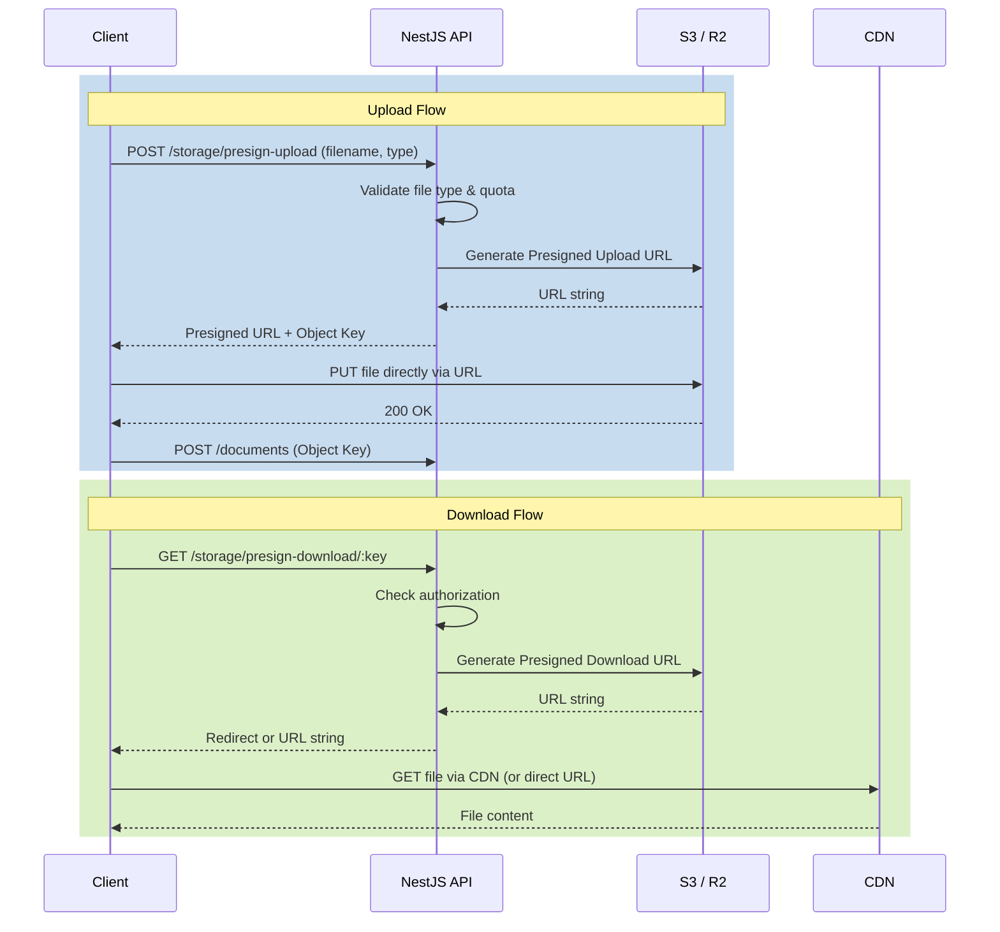
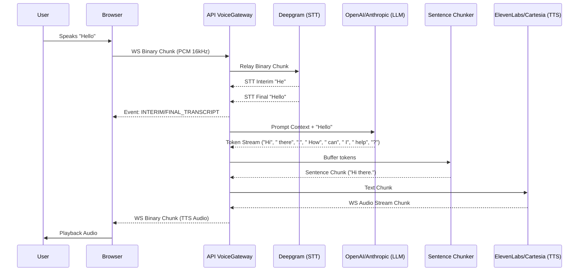
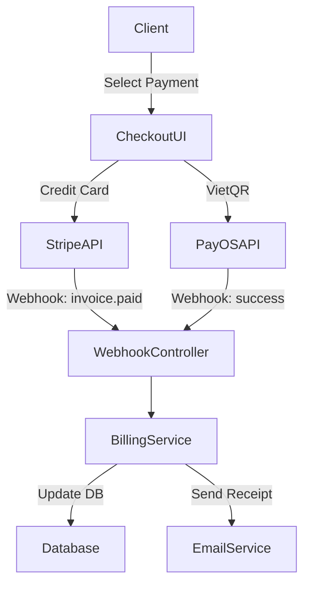
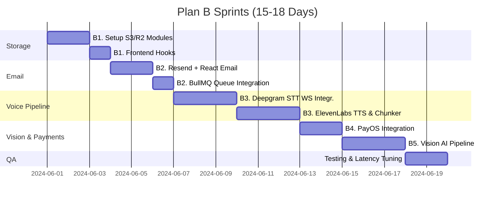

# Implementation Plan — Plan B: Real Cloud Integrations & Ultra-Low Latency Voice

> **Status**: Phase 2 Wave 1-4 features complete (14/14)  
> **Scope**: 5 Sprint Modules — Cloud Storage, Email, Voice Pipeline, Payments, Vision AI  
> **Estimated Effort**: ~15-18 days total  
> **Prerequisites**: Wave 4 completion (F010, F011, F012)

---

## Tổng quan & Mục tiêu

Kế hoạch "Plan B" tập trung vào việc chuyển đổi các mock integrations (giả lập) thành các dịch vụ đám mây thực thụ ở cấp độ production. Hệ thống sẽ được tích hợp với các provider hàng đầu thế giới để mang lại trải nghiệm độ trễ siêu thấp (ultra-low latency), xử lý đa phương thức (multimodal AI) và đảm bảo tính sẵn sàng cao, cũng như xử lý thanh toán thực tế và lưu trữ đáng tin cậy.

Mục tiêu chính:

1. **Cloud Storage**: Thay thế file system cục bộ bằng AWS S3 / Cloudflare R2 để lưu trữ an toàn, hỗ trợ presigned URL cho upload/download.
2. **Email System**: Xây dựng hệ thống gửi email qua Resend với hàng đợi (queue) và template React Email cho các sự kiện quan trọng.
3. **Voice Pipeline**: Tích hợp STT (Deepgram) và TTS (ElevenLabs/Cartesia) qua WebSocket với kiến trúc full-duplex, tối ưu độ trễ xuống dưới 500ms.
4. **Live Payments**: Nâng cấp Stripe lên Live Mode và bổ sung cổng thanh toán nội địa PayOS (VietQR) cho người dùng Việt Nam.
5. **Vision AI**: Đưa GPT-4o Vision / Gemini 2.0 Flash Vision vào phân tích biểu đồ System Design với JSON rubric feedback.

---

## B1 — Cloud Object Storage (AWS S3 / Cloudflare R2)

### B1.1 Kiến trúc Tổng quan

Quá trình upload và download sẽ thực hiện qua Presigned URLs để giảm tải băng thông cho API server.



**Bucket Partitioning Strategy:**

- `public/`: Hình ảnh công khai, avatar (truy cập qua CDN).
- `documents/`: CV người dùng (quyền riêng tư, presigned-url only).
- `system-design/`: Snapshot của các session (presigned-url only).
- `temp/`: File âm thanh ghi âm tạm thời (lifecycle rules xóa sau 1 ngày).

### B1.2 Database Schema Changes

Cập nhật `schema.prisma` để hỗ trợ hệ thống storage mới:

```prisma
// Thêm model FileStorage metadata
model FileAsset {
  id           String   @id @default(uuid())
  key          String   @unique // S3 Object Key
  bucket       String
  filename     String
  mimeType     String
  sizeBytes    Int
  url          String?  // Public CDN URL (if public)
  isPublic     Boolean  @default(false)

  userId       String
  user         User     @relation(fields: [userId], references: [id])

  createdAt    DateTime @default(now())
  updatedAt    DateTime @updatedAt

  // Relations to other entities that might use this asset
  userDocument UserDocument?
  snapshots    CanvasSnapshot[]
}

// Cập nhật UserDocument và CanvasSnapshot để trỏ tới FileAsset
model UserDocument {
  id          String   @id @default(uuid())
  // ... existing fields
  fileAssetId String?  @unique
  fileAsset   FileAsset? @relation(fields: [fileAssetId], references: [id])
}

model CanvasSnapshot {
  id             String   @id @default(uuid())
  // ... existing fields
  imageAssetId   String?
  imageAsset     FileAsset? @relation(fields: [imageAssetId], references: [id])
}
```

### B1.3 Backend Implementation

#### [NEW] Storage Provider Interface

Vị trí: `apps/api/src/modules/storage/interfaces/storage-provider.interface.ts`

```typescript
export interface StorageProvider {
  /**
   * Generates a URL for direct-to-cloud file upload
   */
  generatePresignedUploadUrl(
    key: string,
    mimeType: string,
    expiresInSeconds?: number,
  ): Promise<string>;

  /**
   * Generates a URL for downloading private objects
   */
  generatePresignedDownloadUrl(key: string, expiresInSeconds?: number): Promise<string>;

  /**
   * Deletes an object from the bucket
   */
  deleteObject(key: string): Promise<void>;

  /**
   * Gets metadata about an object
   */
  getObjectMetadata(
    key: string,
  ): Promise<{ size: number; contentType: string; lastModified: Date } | null>;
}
```

#### [NEW] S3 Storage Provider

Vị trí: `apps/api/src/modules/storage/providers/s3-storage.provider.ts`

```typescript
import { Injectable, Logger } from '@nestjs/common';
import { ConfigService } from '@nestjs/config';
import {
  S3Client,
  PutObjectCommand,
  GetObjectCommand,
  DeleteObjectCommand,
  HeadObjectCommand,
} from '@aws-sdk/client-s3';
import { getSignedUrl } from '@aws-sdk/s3-request-presigner';
import { StorageProvider } from '../interfaces/storage-provider.interface';

@Injectable()
export class S3StorageProvider implements StorageProvider {
  private readonly logger = new Logger(S3StorageProvider.name);
  private readonly client: S3Client;
  private readonly bucket: string;

  constructor(private configService: ConfigService) {
    this.bucket = this.configService.get<string>('storage.awsS3Bucket');
    this.client = new S3Client({
      region: this.configService.get<string>('storage.awsRegion'),
      credentials: {
        accessKeyId: this.configService.get<string>('storage.awsAccessKeyId'),
        secretAccessKey: this.configService.get<string>('storage.awsSecretAccessKey'),
      },
    });
  }

  async generatePresignedUploadUrl(
    key: string,
    mimeType: string,
    expiresInSeconds = 3600,
  ): Promise<string> {
    const command = new PutObjectCommand({
      Bucket: this.bucket,
      Key: key,
      ContentType: mimeType,
    });
    return getSignedUrl(this.client, command, { expiresIn: expiresInSeconds });
  }

  async generatePresignedDownloadUrl(key: string, expiresInSeconds = 3600): Promise<string> {
    const command = new GetObjectCommand({ Bucket: this.bucket, Key: key });
    return getSignedUrl(this.client, command, { expiresIn: expiresInSeconds });
  }

  async deleteObject(key: string): Promise<void> {
    const command = new DeleteObjectCommand({ Bucket: this.bucket, Key: key });
    await this.client.send(command);
  }

  async getObjectMetadata(key: string) {
    try {
      const command = new HeadObjectCommand({ Bucket: this.bucket, Key: key });
      const response = await this.client.send(command);
      return {
        size: response.ContentLength || 0,
        contentType: response.ContentType || 'application/octet-stream',
        lastModified: response.LastModified || new Date(),
      };
    } catch (error) {
      if (error.name === 'NotFound') return null;
      throw error;
    }
  }
}
```

#### [NEW] R2 Storage Provider

Vị trí: `apps/api/src/modules/storage/providers/r2-storage.provider.ts`
_(Tương tự S3 nhưng endpoint trỏ về Cloudflare R2 endpoint URL)._

#### [NEW] Storage Service

Vị trí: `apps/api/src/modules/storage/storage.service.ts`

```typescript
import { Injectable, Inject } from '@nestjs/common';
import { StorageProvider } from './interfaces/storage-provider.interface';
import { PrismaService } from '../platform/prisma/prisma.service';
import { v4 as uuidv4 } from 'uuid';
import * as path from 'path';

@Injectable()
export class StorageService {
  constructor(
    @Inject('STORAGE_PROVIDER') private readonly provider: StorageProvider,
    private readonly prisma: PrismaService,
  ) {}

  async createUploadIntent(
    userId: string,
    filename: string,
    mimeType: string,
    category: 'public' | 'documents' | 'temp',
  ) {
    const extension = path.extname(filename);
    const key = `${category}/${userId}/${uuidv4()}${extension}`;

    const url = await this.provider.generatePresignedUploadUrl(key, mimeType);

    return { uploadUrl: url, key, filename };
  }

  async confirmUpload(
    userId: string,
    key: string,
    filename: string,
    mimeType: string,
    isPublic: boolean,
  ) {
    const metadata = await this.provider.getObjectMetadata(key);
    if (!metadata) throw new Error('File not found in storage');

    return this.prisma.fileAsset.create({
      data: {
        key,
        bucket: 'default', // from config
        filename,
        mimeType,
        sizeBytes: metadata.size,
        userId,
        isPublic,
      },
    });
  }
}
```

### B1.4 Configuration & Environment Variables

Thêm vào `apps/api/src/modules/platform/config/configuration.ts`:

```typescript
export default () => ({
  // ... existing configs
  storage: {
    provider: process.env.STORAGE_PROVIDER || 'mock',
    awsAccessKeyId: process.env.AWS_ACCESS_KEY_ID,
    awsSecretAccessKey: process.env.AWS_SECRET_ACCESS_KEY,
    awsRegion: process.env.AWS_REGION || 'ap-southeast-1',
    awsS3Bucket: process.env.AWS_S3_BUCKET,
    r2Endpoint: process.env.R2_ENDPOINT,
    r2AccessKeyId: process.env.R2_ACCESS_KEY_ID,
    r2SecretAccessKey: process.env.R2_SECRET_ACCESS_KEY,
    r2Bucket: process.env.R2_BUCKET,
  },
});
```

### B1.5 Frontend Integration

Tạo custom hook để upload an toàn qua Presigned URL.
Vị trí: `apps/web/src/hooks/useCloudUpload.ts`

```typescript
import { useState } from 'react';
import { useMutation } from '@tanstack/react-query';
import { api } from '@/lib/api';

export function useCloudUpload() {
  const [progress, setProgress] = useState(0);

  const uploadMutation = useMutation({
    mutationFn: async ({ file, category }: { file: File; category: string }) => {
      // 1. Get presigned URL
      const { data: intent } = await api.post('/storage/presign-upload', {
        filename: file.name,
        mimeType: file.type,
        category,
      });

      // 2. Upload directly to S3/R2 via XMLHttpRequest to track progress
      await new Promise((resolve, reject) => {
        const xhr = new XMLHttpRequest();
        xhr.upload.onprogress = e => {
          if (e.lengthComputable) {
            setProgress(Math.round((e.loaded / e.total) * 100));
          }
        };
        xhr.onload = () => {
          if (xhr.status >= 200 && xhr.status < 300) resolve(xhr.response);
          else reject(new Error('Upload failed'));
        };
        xhr.onerror = () => reject(new Error('Network error'));
        xhr.open('PUT', intent.uploadUrl, true);
        xhr.setRequestHeader('Content-Type', file.type);
        xhr.send(file);
      });

      // 3. Confirm upload with API
      const { data: asset } = await api.post('/storage/confirm', {
        key: intent.key,
        filename: file.name,
        mimeType: file.type,
      });

      return asset;
    },
  });

  return { ...uploadMutation, progress };
}
```

---

## B2 — Transactional Email System (Resend + React Email)

### B2.1 Kiến trúc Tổng quan

```mermaid
graph TD
    A[Business Event (e.g. signup, payment)] -->|Emit| B(Email Service)
    B -->|Enqueue Job| C[(BullMQ Redis Queue)]
    C -->|Process Async| D(Email Processor)
    D -->|Render| E[React Email Templates]
    E -->|HTML & Text| F[Email Provider Router]
    F -->|Provider = resend| G[Resend API]
    F -->|Provider = mock| H[Console Logger]
```

### B2.2 Backend Implementation

#### [NEW] Email Provider Interface

Vị trí: `apps/api/src/modules/email/interfaces/email-provider.interface.ts`

```typescript
export interface EmailSendOptions {
  to: string | string[];
  subject: string;
  html: string;
  text?: string;
  from?: string;
  replyTo?: string;
  attachments?: Array<{ filename: string; content: Buffer | string }>;
}

export interface EmailProvider {
  sendEmail(options: EmailSendOptions): Promise<{ id: string; provider: string }>;
}
```

#### [NEW] Resend Email Provider

Vị trí: `apps/api/src/modules/email/providers/resend-email.provider.ts`

```typescript
import { Injectable, Logger } from '@nestjs/common';
import { ConfigService } from '@nestjs/config';
import { Resend } from 'resend';
import { EmailProvider, EmailSendOptions } from '../interfaces/email-provider.interface';

@Injectable()
export class ResendEmailProvider implements EmailProvider {
  private readonly resend: Resend;
  private readonly defaultFrom: string;

  constructor(private configService: ConfigService) {
    this.resend = new Resend(this.configService.get<string>('email.resendApiKey'));
    this.defaultFrom = this.configService.get<string>(
      'email.defaultFrom',
      'AI Interview <noreply@ai-interview.com>',
    );
  }

  async sendEmail(options: EmailSendOptions) {
    const { data, error } = await this.resend.emails.send({
      from: options.from || this.defaultFrom,
      to: options.to,
      subject: options.subject,
      html: options.html,
      text: options.text,
      reply_to: options.replyTo,
      attachments: options.attachments,
    });

    if (error) {
      throw new Error(`Resend Error: ${error.message}`);
    }

    return { id: data?.id || 'unknown', provider: 'resend' };
  }
}
```

#### [NEW] Email Templates (React Email)

Sử dụng package `@react-email/components`.
Vị trí: `apps/api/src/modules/email/templates/WelcomeEmail.tsx`

```tsx
import * as React from 'react';
import { Html, Head, Body, Container, Text, Button, Section } from '@react-email/components';

interface WelcomeEmailProps {
  userName: string;
  loginUrl: string;
}

export const WelcomeEmail = ({ userName, loginUrl }: WelcomeEmailProps) => {
  return (
    <Html>
      <Head />
      <Body style={{ fontFamily: 'sans-serif', backgroundColor: '#f9fafb' }}>
        <Container style={{ margin: '0 auto', padding: '20px', backgroundColor: '#ffffff' }}>
          <Text style={{ fontSize: '24px', fontWeight: 'bold' }}>
            Welcome to AI Interview Practice!
          </Text>
          <Text>Hi {userName},</Text>
          <Text>Get ready to ace your next technical interview.</Text>
          <Section style={{ textAlign: 'center', margin: '30px 0' }}>
            <Button
              href={loginUrl}
              style={{
                backgroundColor: '#2563eb',
                color: '#fff',
                padding: '12px 24px',
                borderRadius: '4px',
              }}
            >
              Start Practicing
            </Button>
          </Section>
        </Container>
      </Body>
    </Html>
  );
};
```

#### [NEW] Email Queue Processor

Vị trí: `apps/api/src/modules/email/email.processor.ts`

```typescript
import { Processor, WorkerHost } from '@nestjs/bullmq';
import { Job } from 'bullmq';
import { Inject, Logger } from '@nestjs/common';
import { EmailProvider } from './interfaces/email-provider.interface';
import { render } from '@react-email/render';
import { WelcomeEmail } from './templates/WelcomeEmail';

@Processor('email')
export class EmailProcessor extends WorkerHost {
  private readonly logger = new Logger(EmailProcessor.name);

  constructor(@Inject('EMAIL_PROVIDER') private readonly emailProvider: EmailProvider) {
    super();
  }

  async process(job: Job<any, any, string>): Promise<any> {
    this.logger.debug(`Processing email job ${job.id} of type ${job.name}`);

    let html = '';
    let subject = '';

    switch (job.name) {
      case 'welcome':
        html = render(WelcomeEmail({ userName: job.data.userName, loginUrl: job.data.loginUrl }));
        subject = 'Welcome to AI Interview Practice';
        break;
      // ... handle other templates
      default:
        throw new Error(`Unknown email job type: ${job.name}`);
    }

    await this.emailProvider.sendEmail({
      to: job.data.email,
      subject,
      html,
    });
  }
}
```

---

## B3 — Ultra-Low Latency Voice Pipeline (Deepgram + ElevenLabs)

### B3.1 Kiến trúc Tổng quan



### B3.2 Backend Implementation

#### [NEW] Deepgram STT Provider

Vị trí: `apps/api/src/modules/voice-gateway/providers/deepgram-stt.provider.ts`

```typescript
import { Injectable, Logger } from '@nestjs/common';
import { ConfigService } from '@nestjs/config';
import { createClient, LiveClient } from '@deepgram/sdk';
import { Subject } from 'rxjs';
import { TranscriptEvent } from '../interfaces/voice-provider.interface';

@Injectable()
export class DeepgramSttProvider {
  private readonly deepgram;

  constructor(private configService: ConfigService) {
    this.deepgram = createClient(this.configService.get<string>('ai.deepgramApiKey'));
  }

  createSttStream(sampleRate = 16000): { stream: LiveClient; events: Subject<TranscriptEvent> } {
    const events = new Subject<TranscriptEvent>();
    const connection = this.deepgram.listen.live({
      model: 'nova-2',
      language: 'en-US',
      smart_format: true,
      encoding: 'linear16',
      sample_rate: sampleRate,
      interim_results: true,
    });

    connection.on('Results', data => {
      const transcript = data.channel.alternatives[0].transcript;
      if (!transcript) return;

      events.next({
        text: transcript,
        isFinal: data.is_final,
        confidence: data.channel.alternatives[0].confidence,
      });
    });

    return { stream: connection, events };
  }
}
```

#### [NEW] ElevenLabs TTS Provider

Vị trí: `apps/api/src/modules/voice-gateway/providers/elevenlabs-tts.provider.ts`

```typescript
import { Injectable, Logger } from '@nestjs/common';
import { ConfigService } from '@nestjs/config';
import * as WebSocket from 'ws';
import { Subject } from 'rxjs';

@Injectable()
export class ElevenLabsTtsProvider {
  constructor(private configService: ConfigService) {}

  createStreamingSession(voiceId: string = 'Rachel'): {
    sendText: (text: string) => void;
    audioStream: Subject<Buffer>;
    close: () => void;
  } {
    const apiKey = this.configService.get<string>('ai.elevenlabsApiKey');
    const model = 'eleven_turbo_v2_5';
    // Input streaming WS URL
    const wsUrl = `wss://api.elevenlabs.io/v1/text-to-speech/${voiceId}/stream-input?model_id=${model}`;

    const ws = new WebSocket(wsUrl, {
      headers: { 'xi-api-key': apiKey },
    });
    const audioStream = new Subject<Buffer>();

    ws.on('open', () => {
      // Send initial configuration
      ws.send(
        JSON.stringify({
          text: ' ',
          voice_settings: { stability: 0.5, similarity_boost: 0.75 },
          xi_api_key: apiKey,
        }),
      );
    });

    ws.on('message', (data: string) => {
      const response = JSON.parse(data);
      if (response.audio) {
        audioStream.next(Buffer.from(response.audio, 'base64'));
      }
      if (response.isFinal) {
        audioStream.complete();
      }
    });

    return {
      sendText: (text: string) => {
        if (ws.readyState === WebSocket.OPEN) {
          ws.send(JSON.stringify({ text, try_trigger_generation: true }));
        }
      },
      audioStream,
      close: () => {
        if (ws.readyState === WebSocket.OPEN) {
          ws.send(JSON.stringify({ text: '' })); // End of stream signal
          ws.close();
        }
      },
    };
  }
}
```

#### [NEW] Sentence Chunker Service

Vị trí: `apps/api/src/modules/voice-gateway/services/sentence-chunker.service.ts`

```typescript
import { Injectable } from '@nestjs/common';
import { Subject } from 'rxjs';

@Injectable()
export class SentenceChunkerService {
  /**
   * Listens to an incoming stream of tokens and emits full sentences.
   * Crucial for ElevenLabs TTS which needs chunks of text with natural boundaries.
   */
  createChunker(tokenStream: AsyncIterable<string>, onSentence: (sentence: string) => void) {
    let buffer = '';
    // Regex matches common sentence enders: . ! ? followed by space or newline
    const sentenceBoundaryRegex = /([.?!])\s+/;

    return async () => {
      for await (const token of tokenStream) {
        buffer += token;
        const match = buffer.match(sentenceBoundaryRegex);
        if (match) {
          const index = match.index! + match[1].length;
          const sentence = buffer.substring(0, index).trim();
          if (sentence) onSentence(sentence);
          buffer = buffer.substring(index).trimLeft();
        }
      }
      // Flush remainder
      if (buffer.trim()) {
        onSentence(buffer.trim());
      }
    };
  }
}
```

### B3.3 Frontend Modifications

Sử dụng `AudioWorkletNode` thay vì `ScriptProcessorNode` đã lỗi thời.
Vị trí: `apps/web/src/hooks/useVoiceStreaming.ts`

```typescript
// Trong file public/worklets/recorderWorkletProcessor.js
class RecorderProcessor extends AudioWorkletProcessor {
  process(inputs, outputs, parameters) {
    const input = inputs[0];
    if (input.length > 0) {
      const channelData = input[0];
      // Convert Float32Array to Int16Array for backend
      const int16Data = new Int16Array(channelData.length);
      for (let i = 0; i < channelData.length; i++) {
        const s = Math.max(-1, Math.min(1, channelData[i]));
        int16Data[i] = s < 0 ? s * 0x8000 : s * 0x7fff;
      }
      this.port.postMessage(int16Data.buffer, [int16Data.buffer]);
    }
    return true;
  }
}
registerProcessor('recorder-worklet', RecorderProcessor);
```

---

## B4 — Live Payment Gateway (Stripe Live + PayOS)

### B4.1 Kiến trúc Tổng quan



### B4.2 Backend Implementation

#### [NEW] PayOS Provider

Vị trí: `apps/api/src/modules/billing/providers/payos.provider.ts`

```typescript
import { Injectable, Logger } from '@nestjs/common';
import { ConfigService } from '@nestjs/config';
import PayOS from '@payos/node';

@Injectable()
export class PayosProvider {
  private readonly payos: PayOS;

  constructor(private configService: ConfigService) {
    this.payos = new PayOS(
      this.configService.get<string>('billing.payosClientId'),
      this.configService.get<string>('billing.payosApiKey'),
      this.configService.get<string>('billing.payosChecksumKey'),
    );
  }

  async createPaymentLink(
    orderCode: number,
    amount: number,
    description: string,
    returnUrl: string,
    cancelUrl: string,
  ) {
    const body = {
      orderCode,
      amount,
      description,
      returnUrl,
      cancelUrl,
    };
    return this.payos.createPaymentLink(body);
  }

  verifyWebhookData(webhookBody: any): any {
    return this.payos.verifyPaymentWebhookData(webhookBody);
  }
}
```

---

## B5 — Whiteboard Multimodal Vision AI

### B5.1 Kiến trúc Tổng quan

1. User vẽ System Design trên Excalidraw canvas.
2. Khi kết thúc, Frontend export base64 hình ảnh.
3. Upload lên S3 (`/system-design/` prefix) để tiết kiệm payload, hoặc gửi thẳng Base64 nếu file nhỏ.
4. Gửi yêu cầu chấm điểm đến `SystemDesignController`.
5. `SystemDesignService` gọi `VisionProvider` (GPT-4o hoặc Gemini 2.0 Flash) kèm Rubric prompt.
6. Trả về điểm (1-5 cho 5 tiêu chí) và JSON annotations.

### B5.2 Backend Implementation

#### [NEW] Vision AI Provider Interface

Vị trí: `apps/api/src/modules/system-design/interfaces/vision-provider.interface.ts`

```typescript
export interface DesignEvaluationResult {
  scores: {
    requirements: number;
    highLevelArchitecture: number;
    componentDetail: number;
    scalability: number;
    dataModel: number;
  };
  feedback: string;
  annotations: Array<{ x: number; y: number; width: number; height: number; comment: string }>;
}

export interface VisionProvider {
  evaluateDiagram(
    imageUrl: string | Buffer,
    promptContext: string,
  ): Promise<DesignEvaluationResult>;
}
```

#### [NEW] GPT-4o Vision Provider

Vị trí: `apps/api/src/modules/system-design/providers/openai-vision.provider.ts`

```typescript
import { Injectable } from '@nestjs/common';
import OpenAI from 'openai';
import { ConfigService } from '@nestjs/config';
import { VisionProvider, DesignEvaluationResult } from '../interfaces/vision-provider.interface';

@Injectable()
export class OpenAiVisionProvider implements VisionProvider {
  private readonly openai: OpenAI;

  constructor(private configService: ConfigService) {
    this.openai = new OpenAI({ apiKey: this.configService.get<string>('ai.openaiApiKey') });
  }

  async evaluateDiagram(imageUrl: string, promptContext: string): Promise<DesignEvaluationResult> {
    const response = await this.openai.chat.completions.create({
      model: 'gpt-4o',
      messages: [
        {
          role: 'system',
          content:
            'You are an Expert System Design Interviewer. Evaluate the architecture diagram based on the context. Return JSON exactly matching the schema.',
        },
        {
          role: 'user',
          content: [
            { type: 'text', text: promptContext },
            { type: 'image_url', image_url: { url: imageUrl, detail: 'high' } },
          ],
        },
      ],
      response_format: { type: 'json_object' },
    });

    const content = response.choices[0].message.content;
    return JSON.parse(content) as DesignEvaluationResult;
  }
}
```

---

## Tổng hợp Dependencies Mới

| Gói                                                      | Phiên bản      | Mục đích                             |
| -------------------------------------------------------- | -------------- | ------------------------------------ |
| **Backend**                                              |                |                                      |
| `@aws-sdk/client-s3`                                     | ^3.500.0       | Tương tác với AWS S3 / Cloudflare R2 |
| `@aws-sdk/s3-request-presigner`                          | ^3.500.0       | Tạo URL upload/download bảo mật      |
| `resend`                                                 | ^3.2.0         | Gửi Transactional Email              |
| `@nestjs/bullmq`                                         | ^10.1.0        | Xử lý Email Queue                    |
| `bullmq`                                                 | ^5.0.0         | Hàng đợi background                  |
| `@react-email/components`                                | ^0.0.17        | Thiết kế Email template bằng React   |
| `@react-email/render`                                    | ^0.0.13        | Render React Email sang HTML/Text    |
| `@deepgram/sdk`                                          | ^3.0.0         | Giao tiếp WebSocket STT độ trễ thấp  |
| `@payos/node`                                            | ^1.0.6         | Cổng thanh toán nội địa VietQR       |
| **Frontend**                                             |                |                                      |
| `lucide-react`                                           | (Bổ sung icon) | Cập nhật UI thanh toán và player     |
| (Không cần thêm package voice vì dùng Web Audio API gốc) |                |                                      |

---

## Tổng hợp Environment Variables

| Biến môi trường         | Phân loại | Mô tả                        | Bắt buộc             | Mặc định         |
| ----------------------- | --------- | ---------------------------- | -------------------- | ---------------- |
| `STORAGE_PROVIDER`      | Storage   | Chọn `s3`, `r2`, hoặc `mock` | Không                | `mock`           |
| `AWS_ACCESS_KEY_ID`     | Storage   | Key truy cập S3              | Có (nếu dùng s3)     |                  |
| `AWS_SECRET_ACCESS_KEY` | Storage   | Secret truy cập S3           | Có (nếu dùng s3)     |                  |
| `AWS_S3_BUCKET`         | Storage   | Tên bucket S3                | Có (nếu dùng s3)     |                  |
| `AWS_REGION`            | Storage   | Vùng AWS S3                  | Có (nếu dùng s3)     | `ap-southeast-1` |
| `RESEND_API_KEY`        | Email     | Key API cho Resend           | Có (nếu dùng resend) |                  |
| `EMAIL_DEFAULT_FROM`    | Email     | Email gửi mặc định           | Không                | `noreply@...`    |
| `DEEPGRAM_API_KEY`      | Voice     | Key dùng cho Live STT        | Có (nếu bật voice)   |                  |
| `ELEVENLABS_API_KEY`    | Voice     | Key dùng cho Live TTS        | Có (nếu bật voice)   |                  |
| `CARTESIA_API_KEY`      | Voice     | Alternative TTS              | Không                |                  |
| `PAYOS_CLIENT_ID`       | Billing   | PayOS Client                 | Có (nếu dùng payos)  |                  |
| `PAYOS_API_KEY`         | Billing   | PayOS Secret Key             | Có (nếu dùng payos)  |                  |
| `PAYOS_CHECKSUM_KEY`    | Billing   | PayOS Signature Key          | Có (nếu dùng payos)  |                  |

---

## Verification Plan

### Automated Tests

1. **Storage Unit Tests:** Mock S3Client để đảm bảo logic tạo URL và route bucket chính xác.
2. **Email Integration Tests:** Verify BullMQ worker nhận job và parse biến vào React Email chính xác.
3. **Billing Webhooks:** Gọi trực tiếp vào webhook handler với signature hợp lệ (mocked) để verify logic update Database và Invoice.
4. **Voice Gateway Tests:** Unit test cho `SentenceChunkerService` với các đoạn text token stream ngẫu nhiên.

### Manual Verification

1. Dùng Postman tạo Presigned URL và dùng cURL PUT một file mp3, xác nhận trên S3 Console.
2. Gọi API trigger Welcome Email, kiểm tra Inbox của tài khoản test.
3. Mở Voice Sandbox trên Frontend, nói "Hello", kiểm tra log latency trên Terminal của NestJS. Yêu cầu TTFB (Time to First Byte) của âm thanh trả về < 800ms.
4. Quét QR code test trên môi trường staging của PayOS.

### Performance Benchmarks

- Upload 25MB audio phải xử lý xong presigned URL dưới 100ms.
- STT (Deepgram) interim delay: mục tiêu < 300ms.
- LLM Token stream tới TTS chunk buffer: mục tiêu < 500ms tổng thể cho câu đầu tiên.

---

## Lộ trình Triển khai


