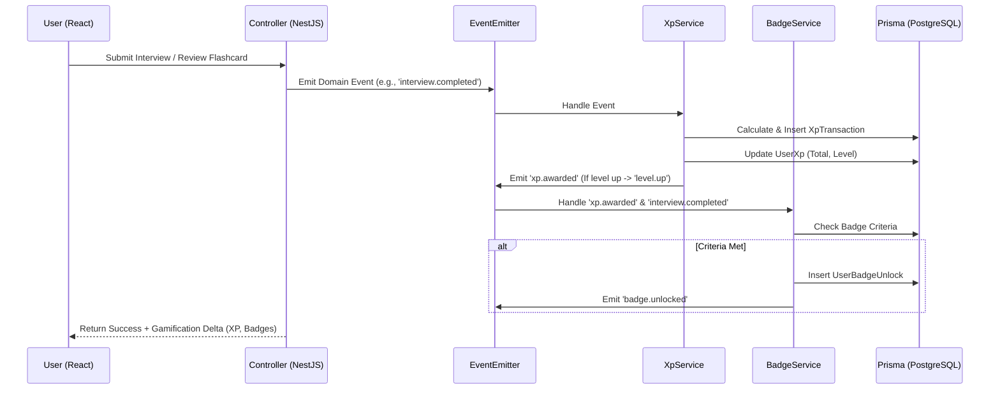
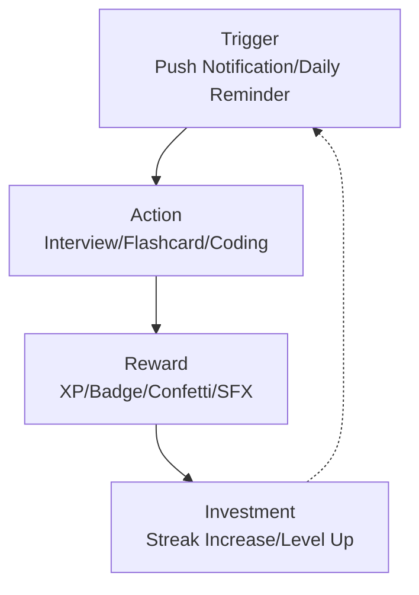
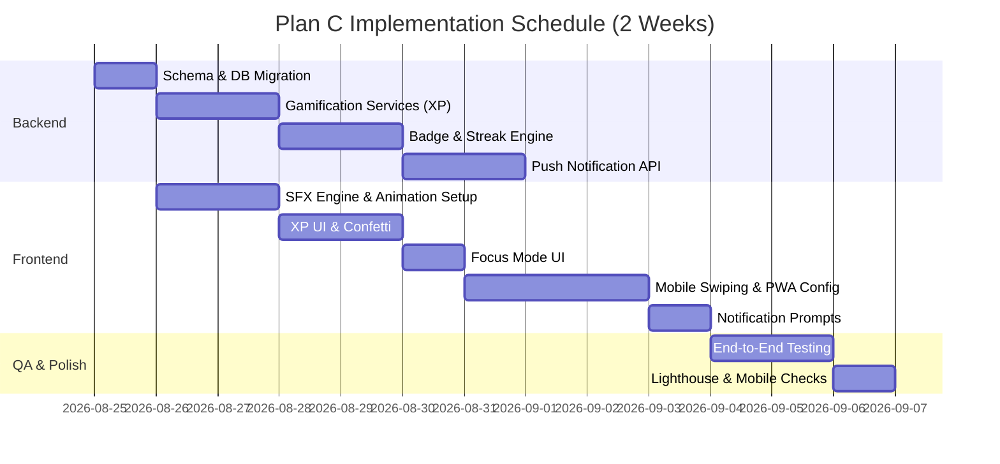

# Implementation Plan — Plan C: Gamification, UI/UX Sensory Polish & PWA

> **Status**: Phase 2 Wave 1-4 features complete (14/14)  
> **Scope**: 5 Sprint Modules — Gamification Engine, SFX & Animations, Focus Mode, PWA, Push Notifications  
> **Estimated Effort**: ~12-15 days total  
> **Prerequisites**: Wave 2 completion (specifically F005 Flashcards streak system)

---

## Tổng quan & Mục tiêu

Kế hoạch này (Plan C) tập trung vào việc chuyển đổi nền tảng AI Interview Practice từ một công cụ hữu ích thành một sản phẩm có tính gây nghiện cao (habit-forming) và đạt chuẩn AAA SaaS.

Mục tiêu cốt lõi:

1. **Gamification (Trò chơi hóa)**: Xây dựng Habit Loop (Vòng lặp thói quen) thông qua hệ thống XP, Cấp độ (Levels), Huy hiệu (Badges) và Chuỗi ngày học (Streaks).
2. **Sensory Polish (Hoàn thiện trải nghiệm giác quan)**: Bổ sung hiệu ứng âm thanh (SFX) và hoạt ảnh (Animations) mượt mà để tạo cảm giác thỏa mãn khi người dùng hoàn thành nhiệm vụ.
3. **Focus Mode (Chế độ tập trung)**: Tối ưu hóa không gian phòng phỏng vấn, giảm thiểu xao nhãng.
4. **Progressive Web App (PWA)**: Hỗ trợ cài đặt ứng dụng trên thiết bị di động, review flashcard offline và tối ưu hóa UI cho màn hình cảm ứng.
5. **Push Notifications (Thông báo đẩy)**: Giữ chân người dùng thông qua nhắc nhở học tập và cảnh báo mất streak.

---

## C1 — Gamification Engine (XP, Leveling, Badges & Enhanced Streaks)

### C1.1 Kiến trúc Tổng quan

**Gamification Event Pipeline**



**Habit Loop Diagram**



### C1.2 Database Schema Changes

Thêm các models mới vào `schema.prisma`.

```prisma
// -----------------------------------------
// GAMIFICATION MODELS
// -----------------------------------------

model UserXp {
  id          String   @id @default(uuid()) @db.Uuid
  userId      String   @unique @map("user_id") @db.Uuid
  totalXp     Int      @default(0) @map("total_xp")
  currentLevel Int     @default(1) @map("current_level")
  dailyXp     Int      @default(0) @map("daily_xp") // Reset at midnight UTC
  lastEarnedAt DateTime? @map("last_earned_at") @db.Timestamptz

  user        User     @relation(fields: [userId], references: [id], onDelete: Cascade)

  @@map("user_xp")
}

enum XpSource {
  INTERVIEW_COMPLETE
  FLASHCARD_REVIEW
  CODING_SUBMIT
  STAR_COMPLETE
  STREAK_BONUS
  BADGE_UNLOCK
  DAILY_LOGIN
}

model XpTransaction {
  id          String   @id @default(uuid()) @db.Uuid
  userId      String   @map("user_id") @db.Uuid
  amount      Int
  source      XpSource
  description String?
  createdAt   DateTime @default(now()) @map("created_at") @db.Timestamptz

  user        User     @relation(fields: [userId], references: [id], onDelete: Cascade)

  @@index([userId, createdAt])
  @@map("xp_transactions")
}

model UserLevel {
  level       Int      @id
  xpThreshold Int      @map("xp_threshold")
  title       String
  titleVi     String   @map("title_vi")
  iconUrl     String?  @map("icon_url")

  @@map("user_levels")
}

model BadgeDefinition {
  id            String   @id @default(uuid()) @db.Uuid
  slug          String   @unique
  name          String
  nameVi        String   @map("name_vi")
  description   String
  descriptionVi String   @map("description_vi")
  iconUrl       String   @map("icon_url")
  category      String   // 'INTERVIEW', 'CODING', 'STREAK', 'LEARNING'
  criteria      Json     // Flexible criteria engine (e.g., { "metric": "total_interviews", "threshold": 10 })
  xpReward      Int      @default(0) @map("xp_reward")
  isSecret      Boolean  @default(false) @map("is_secret")

  unlocks       UserBadgeUnlock[]

  @@map("badge_definitions")
}

model UserBadgeUnlock {
  id        String   @id @default(uuid()) @db.Uuid
  userId    String   @map("user_id") @db.Uuid
  badgeId   String   @map("badge_id") @db.Uuid
  unlockedAt DateTime @default(now()) @map("unlocked_at") @db.Timestamptz

  user      User            @relation(fields: [userId], references: [id], onDelete: Cascade)
  badge     BadgeDefinition @relation(fields: [badgeId], references: [id], onDelete: Cascade)

  @@unique([userId, badgeId])
  @@map("user_badge_unlocks")
}

// -----------------------------------------
// MODIFIED EXISTING MODELS
// -----------------------------------------

model UserStreak {
  id                   String    @id @default(uuid()) @db.Uuid
  userId               String    @unique @map("user_id") @db.Uuid
  currentStreak        Int       @default(0) @map("current_streak")
  longestStreak        Int       @default(0) @map("longest_streak")
  lastActiveDate       DateTime? @map("last_active_date") @db.Date
  totalReviews         Int       @default(0) @map("total_reviews")

  // NEW FIELDS FOR PLAN C
  streakFreezeCount    Int       @default(0) @map("streak_freeze_count")
  streakFreezeUsedToday Boolean  @default(false) @map("streak_freeze_used_today")
  freezeLastUsedAt     DateTime? @map("freeze_last_used_at") @db.Timestamptz

  user                 User      @relation(fields: [userId], references: [id], onDelete: Cascade)
  @@map("user_streaks")
}
```

### C1.3 XP Reward Matrix

| Action                   | XP Earned | Source Enum          | Constraints                   |
| ------------------------ | --------- | -------------------- | ----------------------------- |
| Daily Login              | +10 XP    | `DAILY_LOGIN`        | Once per day                  |
| Review Flashcard         | +2 XP     | `FLASHCARD_REVIEW`   | Max 200 XP/day                |
| Complete Voice Interview | +50 XP    | `INTERVIEW_COMPLETE` | Scaling by score (>80% = +20) |
| Submit Code Pass Tests   | +30 XP    | `CODING_SUBMIT`      | -                             |
| STAR Story Evaluated     | +20 XP    | `STAR_COMPLETE`      | -                             |
| Maintain 7-day Streak    | +100 XP   | `STREAK_BONUS`       | Weekly                        |
| Unlock Tier 1 Badge      | +50 XP    | `BADGE_UNLOCK`       | One-time per badge            |

**Level Progression Formula**
`XP = 100 * (Level^1.5)`

- Level 1: 0 XP (Newcomer)
- Level 2: 282 XP (Beginner)
- Level 3: 519 XP (Learner)
- Level 10: 3162 XP (Adept)
- Level 50: 35355 XP (Master)

### C1.4 Badge Definitions

Catalog of system badges to be seeded:

| Slug              | Name (EN/VI)                     | Category    | Criteria JSON                                                               |
| ----------------- | -------------------------------- | ----------- | --------------------------------------------------------------------------- |
| `first-blood`     | First Blood / Khởi đầu           | `INTERVIEW` | `{ "metric": "total_interviews", "op": "gte", "value": 1 }`                 |
| `streak-7`        | 7-Day Scholar / Học giả 7 ngày   | `STREAK`    | `{ "metric": "current_streak", "op": "gte", "value": 7 }`                   |
| `streak-30`       | Unstoppable / Không thể cản bước | `STREAK`    | `{ "metric": "current_streak", "op": "gte", "value": 30 }`                  |
| `sys-design-guru` | Architect / Kiến trúc sư         | `INTERVIEW` | `{ "metric": "sys_design_score", "op": "gte", "value": 90 }`                |
| `flashcard-1000`  | Memory Master / Bậc thầy ghi nhớ | `LEARNING`  | `{ "metric": "total_flashcard_reviews", "op": "gte", "value": 1000 }`       |
| `night-owl`       | Night Owl / Cú đêm (Secret)      | `LEARNING`  | `{ "metric": "time_of_day", "op": "between", "value": ["00:00", "04:00"] }` |

### C1.5 Backend Implementation

**Module Structure**

```typescript
// apps/api/src/modules/gamification/gamification.module.ts
import { Module } from '@nestjs/common';
import { XpService } from './xp.service';
import { BadgeService } from './badge.service';
import { StreakService } from './streak.service';
import { GamificationController } from './gamification.controller';
import { GamificationEventListener } from './gamification.listener';

@Module({
  controllers: [GamificationController],
  providers: [XpService, BadgeService, StreakService, GamificationEventListener],
  exports: [XpService, StreakService],
})
export class GamificationModule {}
```

**XP Service**

```typescript
// apps/api/src/modules/gamification/xp.service.ts
import { Injectable, Logger } from '@nestjs/common';
import { PrismaService } from '../prisma/prisma.service';
import { EventEmitter2 } from '@nestjs/event-emitter';
import { XpSource } from '@prisma/client';

@Injectable()
export class XpService {
  private readonly logger = new Logger(XpService.name);

  constructor(
    private readonly prisma: PrismaService,
    private readonly eventEmitter: EventEmitter2,
  ) {}

  async awardXp(userId: string, amount: number, source: XpSource, description?: string) {
    return this.prisma.$transaction(async tx => {
      // 1. Create Transaction
      const transaction = await tx.xpTransaction.create({
        data: { userId, amount, source, description },
      });

      // 2. Update Total XP
      const userXp = await tx.userXp.upsert({
        where: { userId },
        create: { userId, totalXp: amount, dailyXp: amount, currentLevel: 1 },
        update: {
          totalXp: { increment: amount },
          dailyXp: { increment: amount },
          lastEarnedAt: new Date(),
        },
      });

      // 3. Check Level Up
      const newLevel = this.calculateLevel(userXp.totalXp);
      let isLevelUp = false;

      if (newLevel > userXp.currentLevel) {
        isLevelUp = true;
        await tx.userXp.update({
          where: { userId },
          data: { currentLevel: newLevel },
        });

        this.eventEmitter.emit('gamification.level_up', {
          userId,
          oldLevel: userXp.currentLevel,
          newLevel,
        });
      }

      this.eventEmitter.emit('gamification.xp_awarded', {
        userId,
        amount,
        source,
        totalXp: userXp.totalXp,
        isLevelUp,
      });

      return { transaction, userXp, isLevelUp };
    });
  }

  calculateLevel(xp: number): number {
    // Inverse of 100 * (Level^1.5) -> (XP/100)^(2/3)
    return Math.floor(Math.pow(xp / 100, 2 / 3)) || 1;
  }
}
```

**Badge Service Listener Example**

```typescript
// apps/api/src/modules/gamification/gamification.listener.ts
import { Injectable } from '@nestjs/common';
import { OnEvent } from '@nestjs/event-emitter';
import { BadgeService } from './badge.service';

@Injectable()
export class GamificationEventListener {
  constructor(private badgeService: BadgeService) {}

  @OnEvent('interview.completed')
  async handleInterviewCompleted(payload: { userId: string; score: number; type: string }) {
    await this.badgeService.checkAndUnlockBadges(payload.userId, {
      trigger: 'INTERVIEW',
      data: payload,
    });
  }
}
```

### C1.6 Frontend Implementation

#### Gamification Store (Zustand)

```typescript
// apps/web/src/stores/gamification.store.ts
import { create } from 'zustand';

interface GamificationState {
  xp: number;
  level: number;
  xpToNextLevel: number;
  badges: Badge[];
  streak: { current: number; longest: number; freezes: number };
  recentEvents: GamificationEvent[];

  // Actions
  addXpLocally: (amount: number, reason: string) => void;
  showLevelUpModal: (level: number) => void;
  setGamificationData: (data: Partial<GamificationState>) => void;
}

export const useGamificationStore = create<GamificationState>(set => ({
  xp: 0,
  level: 1,
  xpToNextLevel: 100,
  badges: [],
  streak: { current: 0, longest: 0, freezes: 0 },
  recentEvents: [],

  addXpLocally: (amount, reason) =>
    set(state => ({
      xp: state.xp + amount,
      recentEvents: [...state.recentEvents, { amount, reason, id: Date.now() }],
    })),
  // ...
}));
```

#### React Components

- **XpBar.tsx**: Nằm trên Navbar. Hiển thị progress bar dạng gradient `brand-400` sang `brand-600`.
- **XpPopup.tsx**: Component portal/floating, render text "+20 XP" nổi lên tại vị trí chuột click (sử dụng Framer Motion `AnimatePresence`).
- **StreakWidget.tsx**: Card hiển thị biểu tượng 🔥. Nếu user có streak freeze, hiển thị khiên băng 🧊 bảo vệ.

---

## C2 — Sound Effects & Micro-Interactions (SFX Engine, Confetti, Animations)

### C2.1 SFX Engine Architecture

Web Audio API cho phép xử lý độ trễ thấp (<10ms) cho các sự kiện UI. Chúngra sẽ sử dụng file audio sprite duy nhất `sfx-sprite.mp3` kèm JSON mapping để tối ưu network requests.

### C2.2 Frontend Implementation

#### SFX Engine Setup

```typescript
// apps/web/src/lib/sfx-engine.ts
import { Howl } from 'howler';

const sfxSprite = new Howl({
  src: ['/sfx/ui-sprite.mp3', '/sfx/ui-sprite.webm'],
  sprite: {
    click: [0, 150],
    success: [200, 800],
    error: [1100, 500],
    level_up: [1700, 1500],
    coin: [3300, 400],
    card_flip: [3800, 300],
  },
  volume: 0.5,
});

export const playSFX = (soundId: keyof (typeof sfxSprite)['_sprite']) => {
  const isMuted = localStorage.getItem('ai-interview-sfx-muted') === 'true';
  if (!isMuted) {
    sfxSprite.play(soundId);
  }
};
```

#### Confetti Component

```tsx
// apps/web/src/components/effects/ConfettiCelebration.tsx
import React, { useEffect } from 'react';
import confetti from 'canvas-confetti';

interface Props {
  trigger: boolean;
  type?: 'win' | 'levelup' | 'streak';
}

export const ConfettiCelebration: React.FC<Props> = ({ trigger, type = 'win' }) => {
  useEffect(() => {
    if (trigger) {
      if (type === 'levelup') {
        const duration = 3000;
        const end = Date.now() + duration;

        const frame = () => {
          confetti({
            particleCount: 5,
            angle: 60,
            spread: 55,
            origin: { x: 0 },
            colors: ['#10b981', '#3b82f6', '#fbbf24'],
          });
          confetti({
            particleCount: 5,
            angle: 120,
            spread: 55,
            origin: { x: 1 },
            colors: ['#10b981', '#3b82f6', '#fbbf24'],
          });
          if (Date.now() < end) requestAnimationFrame(frame);
        };
        frame();
      } else {
        confetti({ particleCount: 100, spread: 70, origin: { y: 0.6 } });
      }
    }
  }, [trigger, type]);

  return null;
};
```

#### Counter Animation (Framer Motion)

```tsx
// apps/web/src/components/effects/CounterAnimation.tsx
import { animate, motion, useMotionValue, useTransform } from 'framer-motion';
import { useEffect } from 'react';

export const CounterAnimation = ({ from = 0, to, duration = 1 }) => {
  const count = useMotionValue(from);
  const rounded = useTransform(count, latest => Math.round(latest));

  useEffect(() => {
    const animation = animate(count, to, { duration, ease: 'easeOut' });
    return animation.stop;
  }, [to]);

  return <motion.span>{rounded}</motion.span>;
};
```

---

## C3 — Focus Mode & Interview Room Polish

### C3.1 Focus Mode Overview

Chế độ tập trung (Focus Mode) loại bỏ các yếu tố UI dư thừa (Navbar, Sidebar) để tối đa hóa không gian màn hình, đặc biệt quan trọng cho Coding & System Design.

### C3.2 Implementation

#### Focus Mode Store

```typescript
// apps/web/src/stores/focus-mode.store.ts
export const useFocusModeStore = create<{
  isFocusMode: boolean;
  toggleFocusMode: () => void;
}>(set => ({
  isFocusMode: false,
  toggleFocusMode: () => set(state => ({ isFocusMode: !state.isFocusMode })),
}));
```

#### Component Modifications

Trong `apps/web/src/layouts/DashboardLayout.tsx`:

```tsx
const { isFocusMode } = useFocusModeStore();

return (
  <div className="min-h-screen bg-slate-50">
    {!isFocusMode && <Navbar />}
    <main
      className={cn(
        'transition-all duration-300',
        isFocusMode
          ? 'p-0 h-screen w-screen absolute top-0 left-0 z-50 bg-white'
          : 'container mx-auto p-4',
      )}
    >
      {children}
    </main>
    {isFocusMode && <FocusModeExitBtn />}
  </div>
);
```

---

## C4 — Progressive Web App (PWA) & Mobile Optimization

### C4.1 PWA Setup

Cài đặt `vite-plugin-pwa` trong frontend.

```typescript
// apps/web/vite.config.ts
import { VitePWA } from 'vite-plugin-pwa';

export default defineConfig({
  plugins: [
    react(),
    VitePWA({
      registerType: 'autoUpdate',
      includeAssets: [
        'favicon.ico',
        'apple-touch-icon.png',
        'masked-icon.svg',
        'sfx/ui-sprite.mp3',
      ],
      manifest: {
        name: 'AI Interview Practice',
        short_name: 'AI Interview',
        description: 'Ace your next tech interview with AI',
        theme_color: '#10b981', // brand-500
        background_color: '#ffffff',
        display: 'standalone',
        icons: [
          { src: 'pwa-192x192.png', sizes: '192x192', type: 'image/png' },
          { src: 'pwa-512x512.png', sizes: '512x512', type: 'image/png' },
          { src: 'pwa-512x512.png', sizes: '512x512', type: 'image/png', purpose: 'any maskable' },
        ],
      },
      workbox: {
        runtimeCaching: [
          {
            urlPattern: /^https:\/\/fonts\.googleapis\.com\/.*/i,
            handler: 'CacheFirst',
            options: {
              cacheName: 'google-fonts-cache',
              expiration: { maxEntries: 10, maxAgeSeconds: 60 * 60 * 24 * 365 },
            },
          },
          {
            urlPattern: /\/api\/v1\/flashcards\/.*/i,
            handler: 'NetworkFirst', // Allow offline flashcard review
            options: { cacheName: 'api-flashcards-cache' },
          },
        ],
      },
    }),
  ],
});
```

### C4.2 Mobile-First Gesture (Tinder Swipe cho Flashcards)

Tạo component `SwipeCard.tsx` bằng `framer-motion` `useDrag` cho phép người dùng mobile vuốt trái (Again) / phải (Good) khi học Flashcard.

```tsx
// apps/web/src/components/mobile/SwipeCard.tsx
import { motion, useMotionValue, useTransform } from 'framer-motion';

export const SwipeCard = ({ card, onSwipeLeft, onSwipeRight }) => {
  const x = useMotionValue(0);
  const rotate = useTransform(x, [-200, 200], [-10, 10]);
  const opacity = useTransform(x, [-200, 0, 200], [0.5, 1, 0.5]);

  const handleDragEnd = (e, info) => {
    if (info.offset.x > 100) onSwipeRight();
    else if (info.offset.x < -100) onSwipeLeft();
  };

  return (
    <motion.div
      drag="x"
      dragConstraints={{ left: 0, right: 0 }}
      onDragEnd={handleDragEnd}
      style={{ x, rotate, opacity }}
      className="w-full h-96 bg-white rounded-2xl shadow-xl flex items-center justify-center p-8 absolute"
    >
      <h3 className="text-2xl font-bold text-center">{card.front}</h3>
    </motion.div>
  );
};
```

---

## C5 — Web Push Notifications

### C5.1 Notification System Architecture

Sử dụng thư viện `web-push` phía Node.js và VAPID keys để gửi thông báo đến trình duyệt qua Push API, ngay cả khi web app đã bị đóng.

### C5.2 Database Changes

```prisma
model PushSubscription {
  id        String   @id @default(uuid()) @db.Uuid
  userId    String   @map("user_id") @db.Uuid
  endpoint  String   @unique
  p256dh    String
  auth      String
  device    String?  // 'Mobile', 'Desktop'
  createdAt DateTime @default(now()) @map("created_at")

  user      User     @relation(fields: [userId], references: [id], onDelete: Cascade)
  @@map("push_subscriptions")
}

model NotificationPreference {
  userId          String  @id @map("user_id") @db.Uuid
  dailyReminder   Boolean @default(true) @map("daily_reminder")
  streakWarning   Boolean @default(true) @map("streak_warning")
  newFeatures     Boolean @default(false) @map("new_features")
  reminderTime    String  @default("19:00") @map("reminder_time") // Local user time

  user            User    @relation(fields: [userId], references: [id], onDelete: Cascade)
  @@map("notification_preferences")
}
```

### C5.3 Backend Push Service

```typescript
// apps/api/src/modules/notification/push.service.ts
import { Injectable, Logger } from '@nestjs/common';
import * as webpush from 'web-push';
import { PrismaService } from '../prisma/prisma.service';

@Injectable()
export class PushService {
  constructor(private prisma: PrismaService) {
    webpush.setVapidDetails(
      'mailto:admin@ai-interview.com',
      process.env.VAPID_PUBLIC_KEY,
      process.env.VAPID_PRIVATE_KEY,
    );
  }

  async sendToUser(userId: string, payload: any) {
    const subs = await this.prisma.pushSubscription.findMany({ where: { userId } });

    const sendPromises = subs.map(sub =>
      webpush
        .sendNotification(
          {
            endpoint: sub.endpoint,
            keys: { p256dh: sub.p256dh, auth: sub.auth },
          },
          JSON.stringify(payload),
        )
        .catch(err => {
          if (err.statusCode === 410) {
            // Subscription expired/unsubscribed
            return this.prisma.pushSubscription.delete({ where: { id: sub.id } });
          }
        }),
    );

    await Promise.all(sendPromises);
  }
}
```

### C5.4 Service Worker Setup cho Push

Trong file `apps/web/public/sw.js` (hoặc inject qua Vite PWA):

```javascript
self.addEventListener('push', function (event) {
  const data = event.data.json();

  const options = {
    body: data.body,
    icon: '/pwa-192x192.png',
    badge: '/masked-icon.png',
    data: data.url,
  };

  event.waitUntil(self.registration.showNotification(data.title, options));
});

self.addEventListener('notificationclick', function (event) {
  event.notification.close();
  if (event.notification.data) {
    event.waitUntil(clients.openWindow(event.notification.data));
  }
});
```

---

## Tổng hợp Dependencies Mới

Thêm các package sau vào dự án:

**Frontend (`apps/web/package.json`)**:

- `framer-motion` (^11.0.0): Animations & Gestures
- `canvas-confetti` (^1.9.2): Hiệu ứng pháo giấy
- `howler` (^2.2.4): Xử lý Web Audio API
- `vite-plugin-pwa` (^0.19.0): Cấu hình PWA

**Backend (`apps/api/package.json`)**:

- `web-push` (^3.6.7): Gửi thông báo đẩy qua VAPID
- `@nestjs/schedule`: Cho Cron jobs (nếu chưa có)

---

## Tổng hợp Environment Variables

Bổ sung vào `.env`:

```env
# VAPID Keys cho Web Push Notifications (Tạo qua npx web-push generate-vapid-keys)
VAPID_PUBLIC_KEY=BExamplePublicKeyBase64EncodedString...
VAPID_PRIVATE_KEY=ExamplePrivateKeyString...
NEXT_PUBLIC_VAPID_PUBLIC_KEY=${VAPID_PUBLIC_KEY}

# Gamification Tuning
XP_MULTIPLIER=1.0
```

---

## i18n Translation Additions

Cập nhật `apps/web/src/stores/i18n.store.ts`:

**EN (`en.json` equivalent):**

```json
{
  "gamification": {
    "level": "Level {{level}}",
    "xpEarned": "+{{amount}} XP",
    "levelUp": "Level Up!",
    "badges": "Badges",
    "streakFreeze": "Streak Freeze",
    "freezeActive": "Freeze Active",
    "leaderboard": "Leaderboard"
  },
  "settings": {
    "sfxMute": "Mute Sound Effects",
    "pushNotifications": "Push Notifications",
    "dailyReminders": "Daily Practice Reminders"
  },
  "pwa": {
    "install": "Install App",
    "offlineMode": "You are offline. Reviewing cached flashcards."
  }
}
```

**VI (`vi.json` equivalent):**

```json
{
  "gamification": {
    "level": "Cấp {{level}}",
    "xpEarned": "+{{amount}} XP",
    "levelUp": "Lên Cấp!",
    "badges": "Huy hiệu",
    "streakFreeze": "Bảo vệ Chuỗi",
    "freezeActive": "Đang bảo vệ",
    "leaderboard": "Bảng xếp hạng"
  },
  "settings": {
    "sfxMute": "Tắt âm thanh",
    "pushNotifications": "Thông báo",
    "dailyReminders": "Nhắc nhở học tập hàng ngày"
  },
  "pwa": {
    "install": "Cài đặt Ứng dụng",
    "offlineMode": "Không có mạng. Đang học thẻ từ bộ nhớ đệm."
  }
}
```

---

## Verification Plan

### Automated Tests

1. **Gamification Logic**: Viết unit test cho `XpService.calculateLevel()` và logic cấp phát XP.
2. **Event Hooks**: Đảm bảo event `interview.completed` trigger `BadgeService`.
3. **PWA Check**: Cypress test giả lập offline mode.

### Manual Verification

1. Hoàn thành 1 bài phỏng vấn -> Xác nhận XP pop-up nổi lên và nghe tiếng "ting" (SFX).
2. Tắt/Bật mạng di động -> Xác nhận thanh Offline Indicator xuất hiện nhưng Flashcards (cache) vẫn học được.
3. Vào trình duyệt di động -> Chờ prompt "Install App" hiện ra, click tải xuống và mở app ngoài homescreen.

### Lighthouse Audit Targets

- Performance: > 90
- Accessibility: > 95
- Best Practices: > 95
- **PWA**: Hạng mục PWA phải pass toàn bộ (installable, service worker registered, apple-touch-icon).

---

## Lộ trình Triển khai (Gantt Chart)


