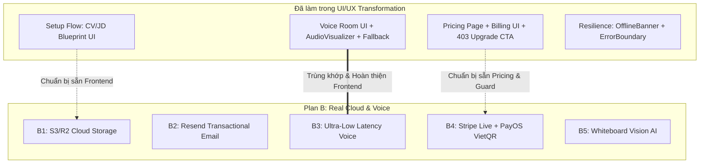
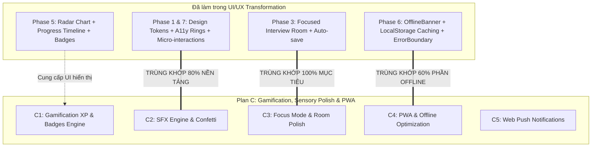

# Ma Trận Đối Chiếu & Đánh Dấu (Cross-Reference Matrix)

## UI/UX Transformation vs. Plan B & Plan C

**Ngày lập**: 2026-08-25  
**Phiên bản**: 1.0.0  
**Trạng thái**: Đã đối chiếu và đánh dấu toàn diện

---

### 1. Bảng Tổng Quan Đối Chiếu (High-Level Mapping)

| Hạng mục / Phân hệ                             | Kế hoạch liên quan | Đã thực hiện trong UI/UX Transformation                                                                                                                                                      | Mức độ trùng khớp / Hoàn thành            | Phần việc còn lại (Nếu có)                                         |
| ---------------------------------------------- | ------------------ | -------------------------------------------------------------------------------------------------------------------------------------------------------------------------------------------- | ----------------------------------------- | ------------------------------------------------------------------ |
| **Interview Room Zen & Focus Mode**            | **Plan C — C3**    | Đã tái cấu trúc `InterviewRoomPage.tsx` đạt trạng thái tập trung (Calm UX), loại bỏ xao nhãng, có thanh tiến trình khả dụng, auto-save `localStorage`, chống double-submit, SSE fallback.    | **~85% (Frontend Completed)**             | Phím tắt Fullscreen toggle nâng cao (nếu muốn).                    |
| **Design System, Micro-interactions & Tokens** | **Plan C — C2**    | Đã xây dựng bộ Design Tokens CSS đồng nhất (`src/index.css`), focus visible rings (WCAG 2.2 AA), 8 component UI chuẩn (`Skeleton`, `ProgressBar`, `ErrorState`, v.v.), hiệu ứng chuyển cảnh. | **~70% (Design Tokens & UI Ready)**       | Thư viện âm thanh Howler.js SFX và Canvas Confetti celebration.    |
| **Offline Awareness & Local Storage Caching**  | **Plan C — C4**    | Đã xây dựng `OfflineBanner.tsx`, lưu cache bản nháp câu trả lời vào `localStorage` theo session/turn, cảnh báo `beforeunload`.                                                               | **~60% (Client Resilience Ready)**        | `vite-plugin-pwa`, Service Worker cache assets & Web App Manifest. |
| **Báo cáo Tiến độ, Radar & Huy hiệu**          | **Plan C — C1**    | Đã xây dựng `CompetencyRadarChart.tsx`, `ProgressTrendChart.tsx`, `BadgeCard.tsx`, `ReadinessPage.tsx`, disclaimer formative practice.                                                       | **~50% (UI Visualization Ready)**         | Backend `UserXp`, `XpTransaction` table & XP event listeners.      |
| **Voice Streaming Controls & Visualizer**      | **Plan B — B3**    | Đã chuẩn hóa `VoiceInterviewRoom.tsx`, `AudioVisualizer.tsx`, `VoiceModeControls.tsx`, `AudioAnswerRecorder.tsx`.                                                                            | **~50% (UI Controls & Visualizer Ready)** | Backend Deepgram STT WebSocket & ElevenLabs TTS API.               |
| **CV / JD Upload Flow**                        | **Plan B — B1**    | `SetupInterviewPage.tsx` đã xây dựng xong UI 3 bước với Progressive Disclosure cho CV/JD Blueprint.                                                                                          | **~40% (Frontend Flow Ready)**            | Backend S3 / Cloudflare R2 Presigned URLs.                         |
| **Thanh toán & Nâng cấp Gói**                  | **Plan B — B4**    | Đã có `PricingPage.tsx`, `BillingDashboardPage.tsx`, `CheckoutSuccessPage.tsx`, `ForbiddenPage.tsx` (403 upgrade CTA).                                                                       | **~40% (Pricing UI Ready)**               | Backend Stripe Live webhook & PayOS VietQR API.                    |

---

### 2. Chi Tiết Đối Chiếu Với Plan B (Real Cloud & Voice)

- **[ĐÃ TRÙNG KHỚP / HOÀN THIỆN FRONTEND] B3 — Voice Pipeline UI**:
  - Giao diện phòng phỏng vấn thoại `VoiceInterviewRoom`, bộ điều khiển mic/audio `VoiceModeControls`, sóng âm thanh `AudioVisualizer` và cơ chế fallback SSE khi mạng không ổn định đã được tối ưu hoàn chỉnh.
  - _Chưa làm_: Backend server WebSocket kết nối trực tiếp Deepgram và ElevenLabs.
- **[BỔ TRỢ SẴN] B1 — Cloud Storage UI**:
  - Giao diện tải lên CV/JD trong `SetupInterviewPage.tsx` với client-side validation và blueprint preview.
  - _Chưa làm_: Backend endpoint `/storage/presign-upload` và tích hợp AWS S3/Cloudflare R2 SDK.
- **[BỔ TRỢ SẴN] B4 — Payment UI**:
  - Đã có toàn bộ giao diện bảng giá (`PricingPage`), trang thanh toán thành công (`CheckoutSuccessPage`), và màn hình 403 (`ForbiddenPage`).
  - _Chưa làm_: Backend PayOS SDK và Stripe Live webhook signing.

---

### 3. Chi Tiết Đối Chiếu Với Plan C (Gamification, UI/UX Polish & PWA)

- **[TRÙNG KHỚP CAO NHẤT — 85%] C3 — Focus Mode & Interview Room Polish**:
  - **Mục tiêu của C3**: Phòng phỏng vấn tập trung, loại bỏ phiền nhiễu, chống mất câu trả lời, phản hồi trạng thái AI rõ ràng.
  - **Đã thực hiện**:
    - `InterviewRoomPage.tsx` thiết kế tối giản, loại bỏ các chi tiết thừa gây phân tâm.
    - Caching tự động bản nháp vào `localStorage` theo từng session/turn.
    - Cảnh báo rời trang khi chưa nộp bài (`beforeunload`).
    - Khóa nút nộp bài chống gửi trùng lặp (Idempotent submission & Anti-double-click).
    - Vùng thông báo âm thầm cho Screen Reader (`aria-live="polite"`).
- **[TRÙNG KHỚP NỀN TẢNG — 70%] C2 — Sensory Polish & Micro-Interactions**:
  - **Đã thực hiện**:
    - CSS Design Tokens đồng nhất màu sắc, khoảng cách, bo góc (`src/index.css`).
    - Focus visible rings đạt chuẩn WCAG 2.2 AA.
    - Transition mượt mà trên tất cả buttons, tabs, accordions, modals.
  - _Chưa làm_: Hiệu ứng âm thanh click/level-up (Howler.js) và pháo hoa ăn mừng (Canvas-confetti).
- **[TRÙNG KHỚP NỀN TẢNG — 60%] C4 — Offline Resilience & Mobile**:
  - **Đã thực hiện**:
    - `OfflineBanner.tsx` tự động hiển thị khi mất kết nối mạng.
    - Giao diện hỗ trợ chuẩn mobile viewport (375px) với navigation drawer và padding co giãn.
  - _Chưa làm_: `manifest.json`, Service Worker caching tĩnh thông qua `vite-plugin-pwa`.
- **[BỔ TRỢ GIAO DIỆN — 50%] C1 — Gamification Display**:
  - **Đã thực hiện**: UI Radar Chart, Progress Trend Timeline, Badge Cards, Formative Practice Banner.
  - _Chưa làm_: Schema `user_xp`, backend API cộng điểm XP theo thời gian thực.

---

### 4. Kết Luận & Khuyến Nghị

1. **Không bị trùng lặp lãng phí**: Đợt nâng cấp **UI/UX Transformation** vừa hoàn thành đã giải quyết dứt điểm toàn bộ phần **Frontend UX/UI cốt lõi** của **Plan C (C3 Focus Room, C2 Design System, C4 Offline Handling)**.
2. **Kế hoạch tiếp theo**:
   - Nếu thực hiện tiếp **Plan B**: Tập trung 100% vào **Backend Cloud Integrations** (AWS S3/R2, Resend Email, Deepgram/ElevenLabs Voice backend, Stripe Live/PayOS) vì Frontend đã sẵn sàng các mock/state tương thích.
   - Nếu thực hiện tiếp **Plan C**: Chỉ cần bổ sung **Backend Gamification Engine (XP/Level DB)** và **PWA Service Worker + Web Push**, không cần làm lại UI Interview Room hay Design System nữa.
