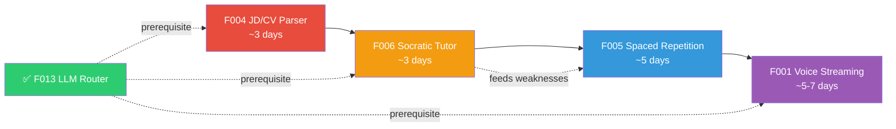
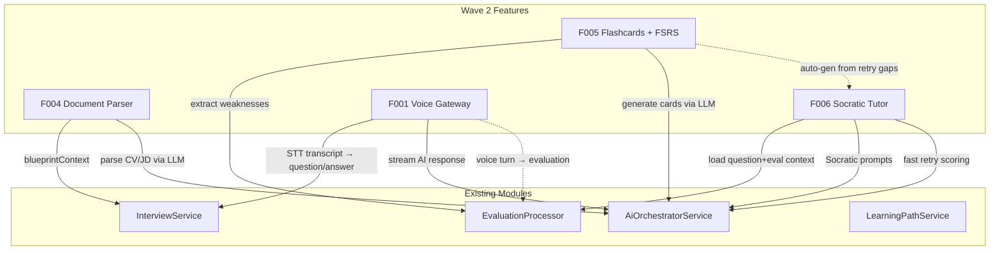

# Implementation Plan — Wave 2 (Improved): Intelligent Preparation & Real-Time Interaction

> **Wave 1 Status**: ✅ 4/14 features completed & verified (F013, F002, F007, F014) — 187 tests green  
> **Wave 2 Scope**: F004, F006, F005, F001 — 4 features, ~16–18 days estimated  
> **Execution Order**: F004 → F006 → F005 → F001 (respects dependency graph: F006 → F005)

---

## User Review Required

> [!IMPORTANT]
> **Key Architectural Decisions in This Wave**:
>
> 1. **F004**: PII masking layer before AI context injection (phone, email, address scrubbed). File retention 30-day TTL with hard delete. In-memory parsing only — no persistent local disk writes.
> 2. **F006**: SSE streaming for tutor chat responses (reuses existing Nginx SSE buffering-off config). Max 20 turns per tutor session to contain token costs.
> 3. **F005**: Pure TypeScript FSRS v4 engine (no external library dependency) — Difficulty, Stability, Retrievability computation. BullMQ queue for daily reminder notifications.
> 4. **F001**: NestJS WebSocket Gateway (`@nestjs/websockets` + `ws`) with binary Opus audio streaming. Mock voice provider for offline CI. Real providers (Deepgram STT, ElevenLabs TTS) behind decision gate.

> [!WARNING]
> **New Dependencies Requiring ADRs**:
>
> - `ADR-0007`: File parsing strategy — `pdf-parse` + `mammoth` for text extraction (F004)
> - `ADR-0008`: WebSocket gateway architecture — `ws` library vs Socket.io for voice streaming (F001)

---

## Open Questions

> [!NOTE]
> No blocking questions. All features use Mock-First providers for dev/CI. Real provider integrations (STT/TTS API keys, S3 file storage) are behind decision gates and not required for implementation.

---

## Implementation Order Rationale



1. **F004 first** — Independent, enriches interview context for all subsequent features
2. **F006 second** — Uses Evaluation module data; its weakness detection feeds F005's auto-card generation
3. **F005 third** — Consumes F006 retry data + Evaluation weaknesses to auto-generate flashcards
4. **F001 last** — Largest scope, most complex (WebSocket + audio pipeline), independent of F004-F006

---

## Milestone 1: F004 — JD & Resume Parsing for Tailored Interview (~3 days)

### 1.1 Database Schema

> Follows existing conventions: `@db.Uuid`, `@map("snake_case")`, `@@map("table_name")`, `@@index`

```prisma
// ---- F004: JD & Resume Parsing ----

model UserDocument {
  id            String        @id @default(uuid()) @db.Uuid
  userId        String        @map("user_id") @db.Uuid
  fileName      String        @map("file_name") @db.VarChar(255)
  fileType      String        @map("file_type") @db.VarChar(10) // pdf, docx, text
  rawText       String        @map("raw_text") @db.Text
  status        String        @default("PARSED") @db.VarChar(20) // UPLOADED, PARSING, PARSED, FAILED
  expiresAt     DateTime      @map("expires_at") // 30-day TTL
  createdAt     DateTime      @default(now()) @map("created_at")

  user          User          @relation(fields: [userId], references: [id], onDelete: Cascade)
  parsedProfile ParsedProfile?

  @@index([userId, createdAt(sort: Desc)])
  @@index([expiresAt])
  @@map("user_documents")
}

model ParsedProfile {
  id            String       @id @default(uuid()) @db.Uuid
  documentId    String       @unique @map("document_id") @db.Uuid
  fullName      String?      @map("full_name") @db.VarChar(200) // PII — masked in AI context
  targetRole    String?      @map("target_role") @db.VarChar(200)
  seniorityLevel String?     @map("seniority_level") @db.VarChar(50)
  skills        Json         // string[]
  experience    Json         // ParsedExperience[]
  education     Json         // string[]
  rawSummary    String?      @map("raw_summary") @db.Text
  createdAt     DateTime     @default(now()) @map("created_at")

  document      UserDocument @relation(fields: [documentId], references: [id], onDelete: Cascade)
  blueprints    InterviewBlueprint[]

  @@map("parsed_profiles")
}

model JdAnalysis {
  id               String   @id @default(uuid()) @db.Uuid
  userId           String   @map("user_id") @db.Uuid
  rawJdText        String   @map("raw_jd_text") @db.Text
  roleTitle        String?  @map("role_title") @db.VarChar(200)
  requiredSkills   Json     @map("required_skills")  // string[]
  preferredSkills  Json     @map("preferred_skills") // string[]
  responsibilities Json     // string[]
  seniorityLevel   String?  @map("seniority_level") @db.VarChar(50)
  companyContext   String?  @map("company_context") @db.Text
  createdAt        DateTime @default(now()) @map("created_at")

  blueprints       InterviewBlueprint[]

  @@index([userId, createdAt(sort: Desc)])
  @@map("jd_analyses")
}

model InterviewBlueprint {
  id              String        @id @default(uuid()) @db.Uuid
  parsedProfileId String        @map("parsed_profile_id") @db.Uuid
  jdAnalysisId    String        @map("jd_analysis_id") @db.Uuid
  interviewId     String?       @unique @map("interview_id") @db.Uuid // linked when session starts
  matchedSkills   Json          @map("matched_skills")  // string[]
  gapSkills       Json          @map("gap_skills")      // string[]
  matchPercentage Float         @default(0) @map("match_percentage")
  topics          Json          // BlueprintTopic[] — {topic, weight, reason, sampleQuestions, cvReference}
  recommendations Json          // string[]
  targetRole      String        @map("target_role") @db.VarChar(200)
  targetLevel     String        @map("target_level") @db.VarChar(50)
  createdAt       DateTime      @default(now()) @map("created_at")

  parsedProfile   ParsedProfile @relation(fields: [parsedProfileId], references: [id], onDelete: Cascade)
  jdAnalysis      JdAnalysis    @relation(fields: [jdAnalysisId], references: [id], onDelete: Cascade)

  @@index([parsedProfileId])
  @@index([jdAnalysisId])
  @@map("interview_blueprints")
}
```

**User model addition**: Add `documents UserDocument[]` relation to existing `User` model.

### 1.2 Contracts (`packages/contracts`)

#### [NEW] `packages/contracts/src/schemas/document-parser.ts`

- `ParsedExperienceSchema` — company, role, duration, responsibilities, projects
- `ParsedProjectSchema` — name, role, technologies, description, highlights
- `ParsedProfileDtoSchema` — skills[], experience[], education[], rawSummary
- `JdAnalysisDtoSchema` — roleTitle, requiredSkills[], preferredSkills[], responsibilities[], seniorityLevel, companyContext
- `BlueprintTopicSchema` — topic, weight (0-100), reason, sampleQuestions[], cvReference
- `InterviewBlueprintDtoSchema` — matchedSkills[], gapSkills[], matchPercentage, topics[], recommendations[]
- `ParseCvRequestSchema` — fileName, fileType (`pdf | docx | text`), rawText (min 10 chars)
- `AnalyzeJdRequestSchema` — jdText (min 20 chars), roleTitle?
- `GenerateBlueprintRequestSchema` — parsedProfileId, jdAnalysisId

#### [MODIFY] `packages/contracts/src/index.ts`

- Add `export * from './schemas/document-parser'`

### 1.3 Backend Module (`apps/api/src/modules/document-parser/`)

```
document-parser/
├── document-parser.module.ts
├── document-parser.controller.ts        # REST endpoints
├── services/
│   ├── text-extractor.service.ts        # pdf-parse + mammoth + PII masking
│   ├── cv-analyzer.service.ts           # LLM-based CV entity extraction
│   ├── jd-analyzer.service.ts           # LLM-based JD parsing
│   └── blueprint-generator.service.ts   # Gap analysis + blueprint creation
├── dto/
│   └── document-parser.dto.ts           # NestJS DTO wrappers
└── document-parser.service.spec.ts      # Unit tests
```

**Key Implementation Details**:

| Component                   | Responsibility                | Details                                                                                                       |
| --------------------------- | ----------------------------- | ------------------------------------------------------------------------------------------------------------- |
| `TextExtractorService`      | File → raw text               | `pdf-parse` for PDF, `mammoth` for DOCX. Max 5MB. PII regex masking (phone, email, address) before returning. |
| `CvAnalyzerService`         | Raw text → structured profile | Calls `AiOrchestratorService` with JSON-mode prompt. Validates output against `ParsedProfileDtoSchema`.       |
| `JdAnalyzerService`         | JD text → structured analysis | Calls `AiOrchestratorService`. Extracts required vs preferred skills, seniority, company culture context.     |
| `BlueprintGeneratorService` | Profile + JD → interview plan | Computes skill overlap & gaps. Generates weighted topic list with CV-referenced sample questions.             |

**API Endpoints**:

| Method   | Path                            | Auth | Description                                                           |
| -------- | ------------------------------- | ---- | --------------------------------------------------------------------- |
| `POST`   | `/documents/parse-cv`           | JWT  | Upload raw text or file → extract & parse CV → return `ParsedProfile` |
| `POST`   | `/documents/analyze-jd`         | JWT  | Submit JD text → parse → return `JdAnalysis`                          |
| `POST`   | `/documents/generate-blueprint` | JWT  | Combine profile + JD → gap analysis + blueprint                       |
| `GET`    | `/documents/my-profiles`        | JWT  | List user's parsed profiles                                           |
| `GET`    | `/documents/my-blueprints`      | JWT  | List user's blueprints                                                |
| `DELETE` | `/documents/:id`                | JWT  | Delete document + cascade parsed data                                 |

**Integration with Interview Module**:

- [MODIFY] `InterviewService.createSession()` — Accept optional `blueprintId` parameter. When provided, load blueprint topics and inject them into the question generation prompt context.
- [MODIFY] Question generation prompt template — Add `{{blueprintContext}}` variable for tailored questions referencing CV projects.

### 1.4 Frontend Components

| Component            | Path                                                   | Description                                                                                    |
| -------------------- | ------------------------------------------------------ | ---------------------------------------------------------------------------------------------- |
| `CvUploadZone`       | `apps/web/src/components/setup/CvUploadZone.tsx`       | Drag-and-drop with format validation (PDF/DOCX/TXT, max 5MB), progress indicator, text preview |
| `JdInputCard`        | `apps/web/src/components/setup/JdInputCard.tsx`        | Tabbed: paste text or enter URL. Min 100-word validation                                       |
| `GapAnalysisPreview` | `apps/web/src/components/setup/GapAnalysisPreview.tsx` | Radar chart (matched vs gap skills), topic weight bars, editable focus areas                   |
| `useDocumentParser`  | `apps/web/src/hooks/useDocumentParser.ts`              | TanStack Query mutations for parse/analyze/blueprint + queries for listing                     |

**[MODIFY]** `SetupInterviewPage.tsx` — Add "Tailored Interview" tab/toggle alongside existing mode selectors. When active, show `CvUploadZone` + `JdInputCard` → `GapAnalysisPreview` → proceed to interview with `blueprintId`.

### 1.5 Feature Flag & Config

- `FEATURE_JD_RESUME_PARSER` → `features.jdResumeParser` (default: `false`)
- Rate limit: 10 document parses per user per day

---

## Milestone 2: F006 — Socratic AI Tutor & Instant Question Retry (~3 days)

### 2.1 Database Schema

```prisma
// ---- F006: Socratic AI Tutor ----

enum TutorRole {
  USER
  AI_TUTOR
  SYSTEM
}

model TutorSession {
  id           String         @id @default(uuid()) @db.Uuid
  userId       String         @map("user_id") @db.Uuid
  interviewId  String         @map("interview_id") @db.Uuid
  turnNumber   Int            @map("turn_number") // which interview turn this tutor session targets
  turnCount    Int            @default(0) @map("turn_count") // messages exchanged (max 20)
  createdAt    DateTime       @default(now()) @map("created_at")
  updatedAt    DateTime       @updatedAt @map("updated_at")

  messages     TutorMessage[]

  @@unique([userId, interviewId, turnNumber])
  @@index([userId])
  @@map("tutor_sessions")
}

model TutorMessage {
  id         String       @id @default(uuid()) @db.Uuid
  sessionId  String       @map("session_id") @db.Uuid
  role       TutorRole
  content    String       @db.Text
  references Json?        // documentation links, concept map nodes
  createdAt  DateTime     @default(now()) @map("created_at")

  session    TutorSession @relation(fields: [sessionId], references: [id], onDelete: Cascade)

  @@index([sessionId, createdAt])
  @@map("tutor_messages")
}

model QuestionRetry {
  id             String   @id @default(uuid()) @db.Uuid
  userId         String   @map("user_id") @db.Uuid
  interviewId    String   @map("interview_id") @db.Uuid
  turnNumber     Int      @map("turn_number")
  originalAnswer String   @map("original_answer") @db.Text
  retryAnswer    String   @map("retry_answer") @db.Text
  originalScore  Float    @map("original_score")
  retryScore     Float    @map("retry_score")
  improvement    Float    @default(0) // retryScore - originalScore
  feedback       Json     // AI structured feedback for retry
  createdAt      DateTime @default(now()) @map("created_at")

  @@unique([userId, interviewId, turnNumber]) // one retry per turn
  @@index([userId])
  @@map("question_retries")
}
```

### 2.2 Contracts (`packages/contracts`)

#### [NEW] `packages/contracts/src/schemas/tutor.ts`

- `TutorSessionDtoSchema` — id, interviewId, turnNumber, turnCount, messages[]
- `TutorMessageDtoSchema` — id, role (`USER | AI_TUTOR | SYSTEM`), content, references?, createdAt
- `AskTutorRequestSchema` — message (max 1000 chars)
- `CreateTutorSessionRequestSchema` — interviewId, turnNumber
- `QuestionRetryRequestSchema` — interviewId, turnNumber, retryAnswer (min 10 chars)
- `QuestionRetryResponseSchema` — retryId, originalScore, retryScore, improvement, feedback

### 2.3 Backend Module (`apps/api/src/modules/tutor/`)

```
tutor/
├── tutor.module.ts
├── tutor.controller.ts
├── tutor.service.ts
├── prompts/
│   └── socratic-system-prompt.ts    # Socratic method system prompt template
├── dto/
│   └── tutor.dto.ts
└── tutor.service.spec.ts
```

**Key Implementation Details**:

| Method | Path                       | Auth | Response Type                 | Description                                                                                                               |
| ------ | -------------------------- | ---- | ----------------------------- | ------------------------------------------------------------------------------------------------------------------------- |
| `POST` | `/tutor/sessions`          | JWT  | JSON                          | Create/resume tutor session for a specific interview turn. Pre-loads context: question, answer, evaluation, model answer. |
| `POST` | `/tutor/sessions/:id/chat` | JWT  | **SSE** (`text/event-stream`) | Send user message, stream AI Socratic response. Max 20 turns.                                                             |
| `GET`  | `/tutor/sessions/:id`      | JWT  | JSON                          | Get session with full message history                                                                                     |
| `POST` | `/tutor/retry`             | JWT  | JSON                          | Submit retry answer → fast evaluation → return score comparison                                                           |
| `POST` | `/tutor/sessions/:id/rate` | JWT  | JSON                          | Thumbs up/down feedback on tutor quality                                                                                  |

**Socratic Prompting Strategy**:

```
Role: You are a patient senior software engineer mentoring a junior developer.
Rules:
1. NEVER give direct code or direct answers initially.
2. Ask probing questions that guide the learner to discover the gap themselves.
3. Point out edge cases they missed (e.g., "What happens if the input is null?").
4. Use progressive hint levels:
   - Level 1 (Conceptual): "What principle does this relate to?"
   - Level 2 (Directional): "Consider how X pattern handles this..."
   - Level 3 (Pseudo-code): Only after 3+ failed attempts, provide pseudo-code outline.
5. Always reference official documentation when applicable.
```

**SSE Streaming**: Reuses existing Nginx `proxy_buffering off` config. Response format:

```
data: {"type":"token","content":"What"}
data: {"type":"token","content":" happens"}
data: {"type":"done","references":[{"title":"MDN Array.prototype.map","url":"..."}]}
```

**Instant Retry Flow**:

1. Load original question + expected points from `InterviewTurn`
2. Use lightweight/fast AI model via `AiOrchestratorService` (same rubric as standard evaluation)
3. Compare `retryScore` vs `originalScore`, compute `improvement`
4. Persist `QuestionRetry` record

### 2.4 Frontend Components

| Component             | Path                                                    | Description                                                                                                                              |
| --------------------- | ------------------------------------------------------- | ---------------------------------------------------------------------------------------------------------------------------------------- |
| `SocraticTutorDrawer` | `apps/web/src/components/tutor/SocraticTutorDrawer.tsx` | Slide-over chat drawer (Tailwind + CSS transition). Markdown rendering with `react-markdown`. Code blocks with syntax highlighting.      |
| `InstantRetryModal`   | `apps/web/src/components/tutor/InstantRetryModal.tsx`   | Modal with text area for retry answer. Side-by-side comparison: Original (red) → Retry (green) → Model Answer (blue). Score delta badge. |
| `TutorRatingButtons`  | `apps/web/src/components/tutor/TutorRatingButtons.tsx`  | Thumbs up/down with optional text feedback                                                                                               |
| `useTutor`            | `apps/web/src/hooks/useTutor.ts`                        | SSE stream consumer via `EventSource` or `fetch` with `ReadableStream`. Mutations for session create, retry submit.                      |

**[MODIFY]** `ResultDetailPage.tsx` — Add per-turn action buttons: "🧑‍🏫 Ask AI Tutor" and "🔄 Retry This Question". Wire to drawer/modal.

### 2.5 Feature Flag

- `FEATURE_SOCRATIC_TUTOR` → `features.socraticTutor` (default: `false`)

---

## Milestone 3: F005 — Spaced Repetition Drills & Smart Flashcards (~5 days)

### 3.1 Database Schema

```prisma
// ---- F005: Spaced Repetition Flashcards ----

enum CardType {
  CONCEPT
  CODE_SNIPPET
  SCENARIO
  MCQ
}

enum CardState {
  NEW
  LEARNING
  REVIEW
  RELEARNING
}

model FlashcardDeck {
  id          String      @id @default(uuid()) @db.Uuid
  userId      String      @map("user_id") @db.Uuid
  name        String      @db.VarChar(200)
  description String?     @db.Text
  tags        String[]
  cardCount   Int         @default(0) @map("card_count")
  dueCount    Int         @default(0) @map("due_count") // denormalized for list perf
  createdAt   DateTime    @default(now()) @map("created_at")
  updatedAt   DateTime    @updatedAt @map("updated_at")

  flashcards  Flashcard[]

  @@index([userId])
  @@map("flashcard_decks")
}

model Flashcard {
  id            String        @id @default(uuid()) @db.Uuid
  deckId        String        @map("deck_id") @db.Uuid
  type          CardType      @default(CONCEPT)
  frontContent  String        @map("front_content") @db.Text
  backContent   String        @map("back_content") @db.Text
  metadata      Json?         // { sourceInterviewId, sourceTurnNumber, aiGenerated }

  // FSRS v4 State
  due           DateTime      @default(now())
  stability     Float         @default(0)     // S: memory stability
  difficulty    Float         @default(0)     // D: intrinsic difficulty (1-10)
  elapsedDays   Int           @default(0) @map("elapsed_days")
  scheduledDays Int           @default(0) @map("scheduled_days")
  reps          Int           @default(0)     // number of successful reviews
  lapses        Int           @default(0)     // number of "Again" ratings
  state         CardState     @default(NEW)
  lastReview    DateTime?     @map("last_review")

  createdAt     DateTime      @default(now()) @map("created_at")
  updatedAt     DateTime      @updatedAt @map("updated_at")

  deck          FlashcardDeck @relation(fields: [deckId], references: [id], onDelete: Cascade)
  reviewLogs    ReviewLog[]

  @@index([deckId, due])
  @@index([deckId, state])
  @@map("flashcards")
}

model ReviewLog {
  id            String    @id @default(uuid()) @db.Uuid
  flashcardId   String    @map("flashcard_id") @db.Uuid
  rating        Int       // 1: Again, 2: Hard, 3: Good, 4: Easy
  state         CardState // state BEFORE review
  due           DateTime  // scheduled due AFTER review
  stability     Float     // S after review
  difficulty    Float     // D after review
  elapsedDays   Int       @map("elapsed_days")
  lastElapsed   Int       @map("last_elapsed")
  scheduledDays Int       @map("scheduled_days")
  reviewedAt    DateTime  @default(now()) @map("reviewed_at")
  durationMs    Int       @map("duration_ms") // time spent on card

  flashcard     Flashcard @relation(fields: [flashcardId], references: [id], onDelete: Cascade)

  @@index([flashcardId, reviewedAt(sort: Desc)])
  @@index([reviewedAt])
  @@map("review_logs")
}

model UserStreak {
  id             String   @id @default(uuid()) @db.Uuid
  userId         String   @unique @map("user_id") @db.Uuid
  currentStreak  Int      @default(0) @map("current_streak")
  longestStreak  Int      @default(0) @map("longest_streak")
  lastReviewDate DateTime? @map("last_review_date") @db.Date
  totalReviews   Int      @default(0) @map("total_reviews")
  updatedAt      DateTime @updatedAt @map("updated_at")

  @@map("user_streaks")
}
```

### 3.2 Contracts (`packages/contracts`)

#### [NEW] `packages/contracts/src/schemas/flashcard.ts`

- `FlashcardDeckDtoSchema` — id, name, description, tags[], cardCount, dueCount
- `FlashcardDtoSchema` — id, type, frontContent, backContent, metadata, FSRS state fields (due, stability, difficulty, state, reps, lapses)
- `ReviewLogDtoSchema` — id, rating, state, scheduled fields, durationMs
- `ReviewCardRequestSchema` — rating (1-4), durationMs
- `CreateFlashcardRequestSchema` — deckId, type, frontContent, backContent
- `CreateDeckRequestSchema` — name, description?, tags[]
- `AutoGenerateRequestSchema` — interviewId (generate cards from weaknesses)
- `FSRSRatingEnum` — `AGAIN = 1, HARD = 2, GOOD = 3, EASY = 4`
- `UserStreakDtoSchema` — currentStreak, longestStreak, lastReviewDate, totalReviews
- `FlashcardStatsDtoSchema` — totalCards, dueToday, newCards, learningCards, reviewCards, streakData, heatmapData[]

### 3.3 Backend Module (`apps/api/src/modules/flashcards/`)

```
flashcards/
├── flashcard.module.ts
├── flashcard.controller.ts
├── flashcard.service.ts           # Deck/Card CRUD, review queue, auto-generation
├── fsrs/
│   ├── fsrs-engine.ts             # Pure TypeScript FSRS v4 algorithm
│   └── fsrs-engine.spec.ts        # Unit tests with known test vectors
├── dto/
│   └── flashcard.dto.ts
└── flashcard.service.spec.ts
```

**FSRS v4 Algorithm Core** (`fsrs-engine.ts`):

The FSRS engine is a pure function module with no external dependencies:

```typescript
// Core FSRS v4 parameters (default w[] weights from open-source FSRS)
interface FSRSCard {
  due: Date;
  stability: number; // S
  difficulty: number; // D (1-10)
  elapsedDays: number;
  scheduledDays: number;
  reps: number;
  lapses: number;
  state: CardState; // NEW | LEARNING | REVIEW | RELEARNING
  lastReview: Date | null;
}

interface FSRSScheduleResult {
  card: FSRSCard; // Updated card state
  log: ReviewLogEntry; // Log entry for persistence
}

// Key functions:
// - scheduleCard(card, rating, now): Compute next review date + updated state
// - getRetrievability(card, now): Current recall probability R = e^(-t/S)
// - initDifficulty(rating): D₀ = clamp(w₄ - e^(w₅ × (rating - 1)) + 1, 1, 10)
// - updateDifficulty(D, rating): D' = clamp(w₇ × D₀(4) + (1 - w₇) × (D - w₆ × (rating - 3)), 1, 10)
// - updateStability(S, D, R, rating): Different formulas for success vs lapse
```

**API Endpoints**:

| Method   | Path                          | Auth | Description                                               |
| -------- | ----------------------------- | ---- | --------------------------------------------------------- |
| `GET`    | `/flashcards/decks`           | JWT  | List user's decks with due counts                         |
| `POST`   | `/flashcards/decks`           | JWT  | Create new deck                                           |
| `PUT`    | `/flashcards/decks/:id`       | JWT  | Update deck name/description/tags                         |
| `DELETE` | `/flashcards/decks/:id`       | JWT  | Delete deck + cascade cards                               |
| `GET`    | `/flashcards/decks/:id/cards` | JWT  | List cards in deck (paginated)                            |
| `POST`   | `/flashcards/decks/:id/cards` | JWT  | Create manual card                                        |
| `GET`    | `/flashcards/due`             | JWT  | Get due cards across all decks (limit 50)                 |
| `POST`   | `/flashcards/:id/review`      | JWT  | Submit review rating → FSRS reschedule → update streak    |
| `POST`   | `/flashcards/auto-generate`   | JWT  | AI-generate cards from interview weaknesses               |
| `GET`    | `/flashcards/stats`           | JWT  | Stats: due today, streak, heatmap data, mastery breakdown |

**Auto-Generation Pipeline** (integration with Evaluation module):

1. Load `Evaluation` records for given `interviewId`
2. Extract `improvements` array (weakness descriptions)
3. Call `AiOrchestratorService` with prompt: "Generate flashcards for these knowledge gaps: [weaknesses]"
4. Validate output against `FlashcardDtoSchema[]`
5. Create cards in default deck (auto-create "From Interview [date]" deck)
6. Each card's `metadata` stores `{ sourceInterviewId, sourceTurnNumber, aiGenerated: true }`

### 3.4 Frontend Components

| Component             | Path                                                       | Description                                                                                                                                |
| --------------------- | ---------------------------------------------------------- | ------------------------------------------------------------------------------------------------------------------------------------------ |
| `FlashcardDecksPage`  | `apps/web/src/features/flashcards/FlashcardDecksPage.tsx`  | Deck grid with due count badges, streak counter, heatmap calendar                                                                          |
| `FlashcardReviewPage` | `apps/web/src/features/flashcards/FlashcardReviewPage.tsx` | Full-screen review mode: flip card animation (CSS 3D transform), 4 rating buttons, progress bar, keyboard shortcuts (Space=flip, 1-4=rate) |
| `FlashcardItem`       | `apps/web/src/components/flashcards/FlashcardItem.tsx`     | Single card with front/back flip, markdown rendering for code snippets                                                                     |
| `StreakHeatmap`       | `apps/web/src/components/flashcards/StreakHeatmap.tsx`     | GitHub-style contribution heatmap for review activity                                                                                      |
| `CreateCardModal`     | `apps/web/src/components/flashcards/CreateCardModal.tsx`   | Manual card creation form with type selector and markdown preview                                                                          |
| `useFlashcards`       | `apps/web/src/hooks/useFlashcards.ts`                      | TanStack Query hooks: decks, due cards, review mutation, stats, auto-generate                                                              |

**[MODIFY]** `App.tsx` — Add routes: `/flashcards`, `/flashcards/:deckId`, `/flashcards/review`  
**[MODIFY]** `Navbar.tsx` — Add "📚 Flashcards" nav link with due count badge  
**[MODIFY]** `ResultDetailPage.tsx` — Add "Generate Flashcards" action button that calls auto-generate endpoint

### 3.5 Feature Flag & BullMQ

- `FEATURE_SPACED_REPETITION` → `features.spacedRepetition` (default: `false`)
- New BullMQ queue: `flashcard-generation` for async AI card generation
- Future: `flashcard-reminder` queue for daily email digest (stub only in this wave)

---

## Milestone 4: F001 — Full-Duplex Live Voice Streaming Interview (~5-7 days)

### 4.1 Database Schema

```prisma
// ---- F001: Voice Streaming ----

enum VoiceSessionStatus {
  CONNECTING
  ACTIVE
  COMPLETED
  FAILED
}

enum SpeakerRole {
  USER
  AI
}

model VoiceSession {
  id           String             @id @default(uuid()) @db.Uuid
  interviewId  String             @unique @map("interview_id") @db.Uuid
  status       VoiceSessionStatus @default(CONNECTING)
  startedAt    DateTime           @default(now()) @map("started_at")
  endedAt      DateTime?          @map("ended_at")
  audioUrl     String?            @map("audio_url") @db.Text // S3 URL for recording
  totalDuration Int?              @map("total_duration") // seconds
  createdAt    DateTime           @default(now()) @map("created_at")

  transcripts  VoiceTranscript[]
  metrics      VoiceSessionMetric?

  @@map("voice_sessions")
}

model VoiceTranscript {
  id             String       @id @default(uuid()) @db.Uuid
  voiceSessionId String       @map("voice_session_id") @db.Uuid
  speaker        SpeakerRole
  text           String       @db.Text
  startTimeMs    Int          @map("start_time_ms")
  endTimeMs      Int          @map("end_time_ms")
  isFinal        Boolean      @default(true) @map("is_final")
  turnNumber     Int?         @map("turn_number")
  createdAt      DateTime     @default(now()) @map("created_at")

  voiceSession   VoiceSession @relation(fields: [voiceSessionId], references: [id], onDelete: Cascade)

  @@index([voiceSessionId, startTimeMs])
  @@map("voice_transcripts")
}

model VoiceSessionMetric {
  id             String       @id @default(uuid()) @db.Uuid
  voiceSessionId String       @unique @map("voice_session_id") @db.Uuid
  avgLatencyMs   Int          @map("avg_latency_ms")
  p95LatencyMs   Int          @map("p95_latency_ms")
  packetLossRate Float        @map("packet_loss_rate")
  interruptions  Int          @default(0)
  totalChunks    Int          @default(0) @map("total_chunks")

  voiceSession   VoiceSession @relation(fields: [voiceSessionId], references: [id], onDelete: Cascade)

  @@map("voice_session_metrics")
}
```

### 4.2 Contracts (`packages/contracts`)

#### [NEW] `packages/contracts/src/schemas/voice-streaming.ts`

```typescript
// Voice event types for WebSocket protocol
export const VoiceEventType = {
  // Client → Server
  CONNECT: 'voice:connect',
  AUDIO_CHUNK: 'voice:audio_chunk',
  INTERRUPT: 'voice:interrupt',
  MUTE_TOGGLE: 'voice:mute_toggle',
  DISCONNECT: 'voice:disconnect',

  // Server → Client
  CONNECTED: 'voice:connected',
  INTERIM_TRANSCRIPT: 'voice:interim_transcript',
  FINAL_TRANSCRIPT: 'voice:final_transcript',
  AI_AUDIO_CHUNK: 'voice:ai_audio_chunk',
  AI_SPEAKING_START: 'voice:ai_speaking_start',
  AI_SPEAKING_END: 'voice:ai_speaking_end',
  CONNECTION_QUALITY: 'voice:connection_quality',
  ERROR: 'voice:error',
  FALLBACK_TO_TEXT: 'voice:fallback_to_text',
} as const;
```

- `VoiceConnectPayloadSchema` — interviewId, sampleRate, codec
- `TranscriptUpdateSchema` — text, isFinal, speaker, startTimeMs, endTimeMs
- `ConnectionQualitySchema` — latencyMs, jitter, packetLoss, quality (`EXCELLENT | GOOD | FAIR | POOR`)
- `VoiceSessionDtoSchema` — id, interviewId, status, transcripts[], metrics

### 4.3 Backend Module (`apps/api/src/modules/voice-gateway/`)

```
voice-gateway/
├── voice-gateway.module.ts
├── gateways/
│   └── voice-streaming.gateway.ts     # @WebSocketGateway — handles binary audio
├── services/
│   ├── voice-session-manager.service.ts  # Session lifecycle, turn detection, context management
│   ├── vad-engine.service.ts             # Voice Activity Detection (energy-based threshold)
│   └── voice-pipeline.service.ts         # STT→AI→TTS pipeline orchestrator
├── providers/
│   ├── voice-provider.interface.ts       # VoiceProvider abstraction
│   ├── mock-voice.provider.ts            # Deterministic mock (echoes transcript, fixed TTS)
│   ├── deepgram-stt.provider.ts          # Deepgram streaming STT (behind decision gate)
│   └── elevenlabs-tts.provider.ts        # ElevenLabs streaming TTS (behind decision gate)
├── dto/
│   └── voice-gateway.dto.ts
└── voice-gateway.service.spec.ts
```

**WebSocket Gateway Design**:

```typescript
@WebSocketGateway({
  namespace: '/voice',
  cors: { origin: '*' },
  transports: ['websocket'],
})
export class VoiceStreamingGateway implements OnGatewayConnection, OnGatewayDisconnect {
  // Authentication via JWT in handshake query/headers
  // Binary frame handling for Opus audio chunks
  // Per-connection session state (Map<socketId, VoiceSessionState>)

  @SubscribeMessage('voice:audio_chunk')
  handleAudioChunk(client: Socket, data: ArrayBuffer): void { ... }

  @SubscribeMessage('voice:interrupt')
  handleInterrupt(client: Socket): void { ... }
}
```

**Voice Pipeline Flow**:

1. Client connects WebSocket → JWT auth → create `VoiceSession`
2. Client streams binary Opus audio chunks → VAD filters silence
3. Active speech → forwarded to STT provider (streaming)
4. STT emits interim/final transcripts → forwarded to client + buffered
5. On final transcript (sentence boundary) → send to `AiOrchestratorService`
6. AI streams text response → forwarded to TTS provider
7. TTS streams audio chunks → forwarded to client for playback
8. **Interruption**: Client sends `interrupt` → immediately stop TTS playback → truncate AI context

**Mock Voice Provider**:

- `streamSTT()`: Returns deterministic transcript from hardcoded test phrases (delays 200ms per word)
- `streamTTS()`: Returns silent Opus frames with correct timing (for CI/offline testing)
- No external API keys required

**Graceful Degradation**:

- If latency > 2000ms for 3 consecutive chunks → emit `FALLBACK_TO_TEXT` event
- Client auto-switches to standard text interview mode
- Existing text-mode interview flow takes over seamlessly

### 4.4 Frontend Components

| Component             | Path                                                        | Description                                                                                                                                         |
| --------------------- | ----------------------------------------------------------- | --------------------------------------------------------------------------------------------------------------------------------------------------- |
| `VoiceInterviewRoom`  | `apps/web/src/components/interview/VoiceInterviewRoom.tsx`  | Full voice UI overlay: waveform visualizer (Web Audio API `AnalyserNode`), live transcript bubbles, mute/unmute, network indicator                  |
| `AudioVisualizer`     | `apps/web/src/components/interview/AudioVisualizer.tsx`     | Canvas-based real-time waveform (reuses existing pattern from MVP audio)                                                                            |
| `NetworkQualityBadge` | `apps/web/src/components/interview/NetworkQualityBadge.tsx` | Color-coded latency/quality indicator (🟢🟡🟠🔴)                                                                                                    |
| `MicPermissionPrompt` | `apps/web/src/components/interview/MicPermissionPrompt.tsx` | Guided microphone permission request with browser-specific instructions                                                                             |
| `useVoiceStreaming`   | `apps/web/src/hooks/useVoiceStreaming.ts`                   | WebSocket client: MediaStream recorder (Opus), playback via `AudioContext`, VAD-based interruption detection, reconnection with exponential backoff |

**[MODIFY]** `InterviewRoomPage.tsx`:

- Add voice mode detection: when `sessionMode === 'VOICE_LIVE'` (or feature flag + user toggle), render `VoiceInterviewRoom` instead of text area
- Fallback toggle: "Switch to Text Mode" button always visible
- Mode selector in setup: "🎤 Live Voice Interview" option

**[MODIFY]** `SessionMode` enum in Prisma + contracts:

- Add `VOICE_LIVE` to `SessionMode` enum (alongside existing `STANDARD`, `FOCUSED_REMEDIATION`, `QUICK_PRACTICE`, `CODING`, `BEHAVIORAL`)

### 4.5 Feature Flag & Config

- `FEATURE_VOICE_STREAMING` → `features.voiceStreaming` (default: `false`)
- `VOICE_STT_PROVIDER` → `voice.sttProvider` (`mock | deepgram | whisper`)
- `VOICE_TTS_PROVIDER` → `voice.ttsProvider` (`mock | elevenlabs | openai`)

### 4.6 ADR-0008: WebSocket Gateway Architecture

- **Decision**: Use `ws` library via `@nestjs/websockets` (not Socket.io) for lower overhead with binary audio frames
- **Rationale**: Socket.io adds ~30KB client bundle + protocol overhead unsuitable for real-time audio. Raw `ws` provides direct binary frame control needed for Opus streaming.
- **Trade-off**: Lose auto-reconnection (implement manually via exponential backoff in client hook)

---

## Cross-Feature Integration Map



---

## Verification Plan

### Per-Feature Test Strategy

| Feature | Unit Tests                                                                                           | Integration Points                                    | Key Assertions                                                                                          |
| ------- | ---------------------------------------------------------------------------------------------------- | ----------------------------------------------------- | ------------------------------------------------------------------------------------------------------- |
| F004    | TextExtractor (PDF/DOCX/PII masking), CvAnalyzer, JdAnalyzer, BlueprintGenerator                     | `AiOrchestratorService` mock, Prisma, Controller      | Parse accuracy, PII stripped from AI context, 5MB limit enforcement, blueprint topic weights sum to 100 |
| F006    | TutorService (context loading, turn limit), SSE streaming                                            | `AiOrchestratorService` mock, Evaluation data, Prisma | Socratic prompt never contains direct answers, max 20 turns, retry score comparison accuracy            |
| F005    | **FSRS engine** (known test vectors for all 4 ratings × 4 states), FlashcardService (CRUD, auto-gen) | `AiOrchestratorService` mock, Evaluation data, Prisma | FSRS scheduling determinism, streak tracking, due queue ordering                                        |
| F001    | VAD threshold detection, WebSocket lifecycle, Mock provider                                          | WebSocket test client, `AiOrchestratorService` mock   | Binary frame handling, interruption stops TTS, graceful degradation trigger                             |

### Automated Test Commands

```bash
# Per-module
pnpm --filter contracts test
pnpm --filter api test -- --testPathPattern="document-parser|tutor|flashcard|voice-gateway"
pnpm --filter web test

# Full monorepo verification
pnpm lint
pnpm --filter contracts build
pnpm --filter api test
pnpm --filter web test
pnpm --filter api build
pnpm --filter web build
```

### Risk Mitigation

| Risk                                 | Impact                 | Mitigation                                                                             |
| ------------------------------------ | ---------------------- | -------------------------------------------------------------------------------------- |
| PDF parsing fails on complex layouts | F004 degraded accuracy | Fallback to raw text paste; error message guides manual entry                          |
| SSE connection drops mid-tutor-chat  | F006 lost context      | Message history persisted in DB; client auto-resumes from last message                 |
| FSRS produces unreasonable intervals | F005 bad UX            | Clamp max interval to 365 days; unit tests with known vectors from FSRS research paper |
| WebSocket binary frame corruption    | F001 audio artifacts   | Opus codec self-corrects; client-side CRC check; fallback to text mode                 |
| AI provider latency > 10s            | All features           | Circuit breaker + MockProvider fallback already in place from MVP                      |

### Documentation Updates

- Update `PROJECT-STATUS.md`: Mark F004, F006, F005, F001 as ✅ (8/14 Phase 2)
- Update `FEATURE-ROADMAP-INDEX.md`: Status icons
- Create `ADR-0007` (file parsing) and `ADR-0008` (WebSocket gateway)
- Update `walkthrough.md` with Wave 2 summary
