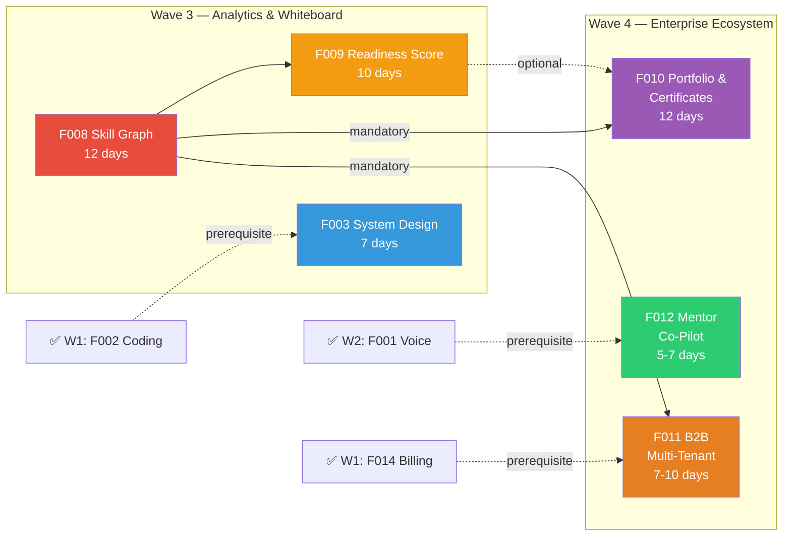
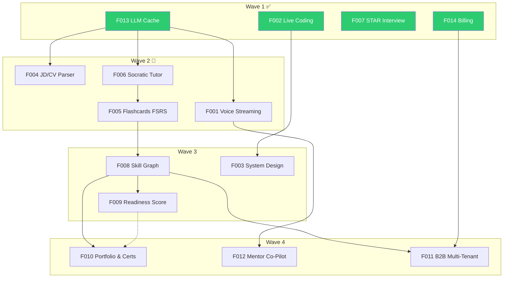

# Implementation Plan — Wave 3 & Wave 4: Analytics Engine, Enterprise & Ecosystem

> **Wave 1**: ✅ F013, F002, F007, F014 (completed, 187 tests)  
> **Wave 2**: F004, F006, F005, F001 (plan approved, pending execution)  
> **Wave 3 Scope**: F008 → F009 → F003 — ~31 days estimated  
> **Wave 4 Scope**: F010, F012, F011 — ~24–29 days estimated  
> **Total remaining**: 6 features → complete Phase 2 (14/14)

---

## Wave Grouping Rationale



**Wave 3**: F008 and F009 form a strict dependency chain (F009 requires F008's weighted skill scores). F003 is independent but placed here due to P3 priority. F008 → F009 run sequentially; F003 can be parallelized.

**Wave 4**: F010 requires F008+F009 (badges from skill scores, tier from readiness). F012 requires F001 (voice gateway). F011 requires F008+F014 (cohort analytics + billing). All 3 can be parallelized after Wave 3.

---

## User Review Required

> [!IMPORTANT]
> **Key Architectural Decisions**:
> 1. **F008**: PostgreSQL **Materialized View** for percentile aggregation (`REFRESH MATERIALIZED VIEW CONCURRENTLY`), **exponential decay** scoring ($\lambda = 0.01$), BullMQ nightly batch job
> 2. **F009**: Composite readiness formula $R = \sum w_i \cdot \min(S_i / T_i, 1.0)$ with 95% confidence interval, tier classification (Big Tech / Competitive / Growing)
> 3. **F003**: **Excalidraw** embedded whiteboard + **Multimodal AI vision** (GPT-4o / Gemini Pro Vision mock) for diagram analysis — requires ADR-0009
> 4. **F010**: **HMAC-SHA256** certificate signing + QR code verification, Puppeteer PDF generation — requires ADR-0010
> 5. **F012**: **WebRTC** via LiveKit/mediasoup (mock provider) for live mentor 1-on-1 rooms — requires ADR-0011
> 6. **F011**: **Row-Level Security (RLS)** via Prisma Client Extension + PostgreSQL policies for tenant data isolation — requires ADR-0012

> [!WARNING]
> **Decision Gates** (mock providers used, real integrations deferred):
> - **F003**: Whiteboard library choice (Excalidraw vs Tldraw), Object storage (S3 vs R2)
> - **F010**: PDF engine (Puppeteer vs @react-pdf/renderer), file storage
> - **F012**: Media server (LiveKit vs mediasoup vs simple WebRTC)
> - **F011**: SSO provider (SAML 2.0 / OIDC strategy)

---

# WAVE 3 — Analytics Engine & System Design

---

## Milestone 1: F008 — Skill Graph & Candidate Benchmark Percentile (~12 days)

### 1.1 Database Schema

```prisma
// ---- F008: Skill Graph & Benchmark ----

model SkillNode {
  id             String          @id @default(uuid()) @db.Uuid
  parentId       String?         @map("parent_id") @db.Uuid
  competencyArea CompetencyArea? @map("competency_area")
  slug           String          @unique @db.VarChar(100)
  name           String          @db.VarChar(200)
  nameVi         String?         @map("name_vi") @db.VarChar(200)
  description    String?         @db.Text
  level          Int             @default(1) // 1=area, 2=sub-competency, 3=topic
  weight         Float           @default(1.0)
  isActive       Boolean         @default(true) @map("is_active")
  order          Int             @default(0)
  createdAt      DateTime        @default(now()) @map("created_at")
  updatedAt      DateTime        @updatedAt @map("updated_at")

  parent         SkillNode?      @relation("SkillHierarchy", fields: [parentId], references: [id])
  children       SkillNode[]     @relation("SkillHierarchy")
  skillScores    SkillScore[]

  @@index([parentId])
  @@index([competencyArea])
  @@index([level, isActive])
  @@map("skill_nodes")
}

model SkillScore {
  id              String    @id @default(uuid()) @db.Uuid
  userId          String    @map("user_id") @db.Uuid
  skillNodeId     String    @map("skill_node_id") @db.Uuid
  rawScore        Float     @map("raw_score")
  weightedScore   Float     @map("weighted_score")    // exponential decay weighted
  evidenceCount   Int       @map("evidence_count")
  lastEvaluatedAt DateTime  @map("last_evaluated_at")
  rubricVersion   String    @map("rubric_version") @db.VarChar(50)
  calculatedAt    DateTime  @default(now()) @map("calculated_at")

  user            User      @relation(fields: [userId], references: [id], onDelete: Cascade)
  skillNode       SkillNode @relation(fields: [skillNodeId], references: [id], onDelete: Cascade)

  @@unique([userId, skillNodeId])
  @@index([userId])
  @@index([skillNodeId])
  @@index([weightedScore])
  @@map("skill_scores")
}

model BenchmarkSnapshot {
  id             String          @id @default(uuid()) @db.Uuid
  skillNodeId    String          @map("skill_node_id") @db.Uuid
  jobRoleSlug    String?         @map("job_role_slug") @db.VarChar(50)
  senioritySlug  String?         @map("seniority_slug") @db.VarChar(50)
  cohortSize     Int             @map("cohort_size")
  p25            Float
  p50            Float
  p75            Float
  p90            Float
  mean           Float
  stdDev         Float           @map("std_dev")
  calculatedAt   DateTime        @default(now()) @map("calculated_at")

  @@unique([skillNodeId, jobRoleSlug, senioritySlug])
  @@index([skillNodeId])
  @@map("benchmark_snapshots")
}
```

**Materialized View** (raw SQL in migration):
```sql
CREATE MATERIALIZED VIEW IF NOT EXISTS mv_skill_percentiles AS
SELECT
  ss.skill_node_id, jr.slug AS job_role_slug, sl.slug AS seniority_slug,
  COUNT(DISTINCT ss.user_id) AS cohort_size,
  PERCENTILE_CONT(0.25) WITHIN GROUP (ORDER BY ss.weighted_score) AS p25,
  PERCENTILE_CONT(0.50) WITHIN GROUP (ORDER BY ss.weighted_score) AS p50,
  PERCENTILE_CONT(0.75) WITHIN GROUP (ORDER BY ss.weighted_score) AS p75,
  PERCENTILE_CONT(0.90) WITHIN GROUP (ORDER BY ss.weighted_score) AS p90,
  AVG(ss.weighted_score) AS mean,
  STDDEV(ss.weighted_score) AS std_dev
FROM skill_scores ss
JOIN users u ON u.id = ss.user_id
LEFT JOIN interview_sessions is2 ON is2.user_id = u.id
LEFT JOIN job_roles jr ON jr.id = is2.job_role_id
LEFT JOIN seniority_levels sl ON sl.id = is2.seniority_level_id
WHERE ss.evidence_count >= 3
GROUP BY ss.skill_node_id, jr.slug, sl.slug
HAVING COUNT(DISTINCT ss.user_id) >= 30;
```

**Seed data**: 5 areas × 4 sub-competencies × 5 topics = **105 skill nodes**.

### 1.2 Backend Module (`apps/api/src/modules/skill-graph/`)

```
skill-graph/
├── skill-graph.module.ts
├── skill-graph.controller.ts
├── services/
│   ├── skill-aggregation.service.ts      # Exponential decay weighted scoring
│   ├── percentile.service.ts             # Benchmark percentile from materialized view
│   ├── gap-analysis.service.ts           # Target role gap detection + recommendations
│   └── batch-aggregation.processor.ts    # BullMQ nightly batch job
├── dto/
│   └── skill-graph.dto.ts
└── skill-graph.service.spec.ts
```

**Exponential Decay Algorithm**:
$$S_{\text{weighted}} = \frac{\sum_{i=1}^{n} s_i \cdot e^{-\lambda \cdot \Delta t_i}}{\sum_{i=1}^{n} e^{-\lambda \cdot \Delta t_i}}$$

| API Endpoint | Method | Description |
|---|---|---|
| `/profile/skills/graph` | `GET` | Full 3-tier skill graph with weighted scores |
| `/profile/skills/benchmark` | `GET` | Percentile ranking (filtered by role+level) |
| `/profile/skills/progress` | `GET` | Time-series trend data (7d/30d/90d/180d/365d) |
| `/profile/skills/gaps` | `GET` | Gap analysis with top-3 improvement suggestions |
| `/admin/skills/nodes` | `GET/POST/PUT` | Admin CRUD for skill taxonomy tree |
| `/admin/benchmarks/overview` | `GET` | Aggregated cohort benchmark overview |

**BullMQ Queue**: `skill-aggregation` — nightly cron (00:00 UTC) + `REFRESH MATERIALIZED VIEW CONCURRENTLY`.

### 1.3 Frontend Components

| Component | Description |
|---|---|
| `SkillGraphPage` | Main dashboard: radar overlay, tree view, trend, heatmap, gap cards |
| `CompetencyRadarOverlay` | Enhanced radar with user vs target role overlay (extends existing SVG component) |
| `SkillTreeView` | Collapsible 3-tier tree showing score per node |
| `ProgressTrendChart` | Recharts time-series line chart |
| `HeatmapCalendar` | GitHub contribution-style practice heatmap |
| `PercentileBadge` | "Top 15% Senior Backend" badge component |
| `GapAnalysisCard` | Prioritized gap with action link to Focused Remediation |
| `useSkillGraph` | TanStack Query hooks for all skill graph endpoints |

**Routes**: `/skills` (main), `/skills/benchmark`, `/skills/progress`  
**Feature Flag**: `FEATURE_SKILL_GRAPH` → `features.skillGraph`

---

## Milestone 2: F009 — AI Interview Readiness Score & Offer Predictor (~10 days)

### 2.1 Database Schema

```prisma
// ---- F009: Readiness Score ----

model ReadinessWeightProfile {
  id             String         @id @default(uuid()) @db.Uuid
  jobRoleSlug    String         @map("job_role_slug") @db.VarChar(50)
  competencyArea CompetencyArea @map("competency_area")
  weight         Float          // Sum per role = 1.0
  isActive       Boolean        @default(true) @map("is_active")
  createdAt      DateTime       @default(now()) @map("created_at")
  updatedAt      DateTime       @updatedAt @map("updated_at")

  @@unique([jobRoleSlug, competencyArea])
  @@map("readiness_weight_profiles")
}

model TierDefinition {
  id                 String   @id @default(uuid()) @db.Uuid
  slug               String   @unique @db.VarChar(50) // tier-1, tier-2, tier-3
  name               String   @db.VarChar(100)
  nameVi             String   @map("name_vi") @db.VarChar(100)
  minReadinessScore  Float    @map("min_readiness_score")
  minCompetencyScore Float    @map("min_competency_score")
  order              Int      @default(0)
  isActive           Boolean  @default(true) @map("is_active")
  createdAt          DateTime @default(now()) @map("created_at")
  updatedAt          DateTime @updatedAt @map("updated_at")

  @@map("tier_definitions")
}

model ReadinessSnapshot {
  id               String   @id @default(uuid()) @db.Uuid
  userId           String   @map("user_id") @db.Uuid
  jobRoleSlug      String   @map("job_role_slug") @db.VarChar(50)
  readinessScore   Float    @map("readiness_score") // 0.0 - 1.0
  tierSlug         String   @map("tier_slug") @db.VarChar(50)
  confidenceLow    Float    @map("confidence_low")
  confidenceHigh   Float    @map("confidence_high")
  competencyScores Json     @map("competency_scores") // { area: score }
  velocityData     Json?    @map("velocity_data")     // { area: velocity }
  evidenceCount    Int      @map("evidence_count")
  snapshotDate     DateTime @default(now()) @map("snapshot_date")

  user             User     @relation(fields: [userId], references: [id], onDelete: Cascade)

  @@index([userId, jobRoleSlug, snapshotDate(sort: Desc)])
  @@map("readiness_snapshots")
}

model ReadinessMilestone {
  id              String   @id @default(uuid()) @db.Uuid
  userId          String   @map("user_id") @db.Uuid
  jobRoleSlug     String   @map("job_role_slug") @db.VarChar(50)
  milestoneType   String   @map("milestone_type") @db.VarChar(20) // "25%", "50%", etc.
  achievedAt      DateTime @default(now()) @map("achieved_at")
  readinessScore  Float    @map("readiness_score")

  user            User     @relation(fields: [userId], references: [id], onDelete: Cascade)

  @@unique([userId, jobRoleSlug, milestoneType])
  @@index([userId])
  @@map("readiness_milestones")
}
```

**Seed data**: Default weight profiles for 5 roles (Backend, Frontend, Fullstack, DevOps, QA) × 5 competency areas + 4 tier definitions.

### 2.2 Backend Module (`apps/api/src/modules/readiness/`)

```
readiness/
├── readiness.module.ts
├── readiness.controller.ts
├── services/
│   ├── readiness.service.ts             # Core R = Σ(wᵢ × min(Sᵢ/Tᵢ, 1.0))
│   ├── velocity.service.ts             # Δscore/week + time-to-target prediction
│   ├── tier-classification.service.ts  # Tier boundary matching
│   └── weight-profile.service.ts       # Role weight profile CRUD
├── dto/
│   └── readiness.dto.ts
└── readiness.service.spec.ts
```

**Core Formulas**:

| Formula | Expression | Purpose |
|---|---|---|
| Readiness Score | $R = \sum_{i=1}^{k} w_i \cdot \min(S_i / T_i, 1.0) \times 100\%$ | Composite readiness index |
| Confidence Interval | $CI = R \pm 1.96 \cdot \frac{\sigma}{\sqrt{n}}$ | 95% CI based on evidence count |
| Velocity | $V_i = (S_i(t) - S_i(t - \Delta t)) / \Delta t$ | Score improvement rate per week |
| Time to Target | $T_{\text{est}} = (T_i - S_i) / V_i$ | Weeks remaining to target |
| Action Priority | $\text{Priority}_i = (T_i - S_i) \times w_i$ | Impact-weighted gap ranking |

| API Endpoint | Method | Description |
|---|---|---|
| `/profile/readiness` | `GET` | Score, tier, CI, breakdown, velocity, roadmap |
| `/profile/readiness/history` | `GET` | Historical snapshots (30d/90d/180d/365d) |
| `/profile/readiness/compare` | `GET` | Multi-role comparison (e.g. backend vs fullstack) |
| `/admin/readiness/weight-profiles` | `GET/POST/PUT` | Admin weight profile management |
| `/admin/readiness/tiers` | `GET/PUT` | Admin tier threshold management |

### 2.3 Frontend Components

| Component | Description |
|---|---|
| `ReadinessPage` | Main dashboard with gauge, breakdown, roadmap, trend |
| `ReadinessGauge` | Animated circular progress (0-100%) with color zones |
| `TierBadge` | Color-coded tier classification badge |
| `CompetencyBreakdownTable` | Per-competency fulfillment bars with target overlay |
| `VelocityIndicator` | ↑ Improving / → Stable / ↓ Declining badge |
| `TimeEstimateCard` | "~9 weeks to Big Tech Ready" projection card |
| `RoadmapActionList` | Top-3 prioritized actions with impact stars |
| `MilestoneTimeline` | ✅25% ✅50% ⬜75% ⬜85% ⬜100% progress tracker |
| `RoleComparisonChart` | Bar chart comparing readiness across target roles |
| `useReadiness` | TanStack Query hooks |

**Routes**: `/readiness`  
**Feature Flag**: `FEATURE_READINESS_SCORE` → `features.readinessScore`  
**Mandatory Disclaimer**: _"Chỉ số dựa trên kết quả luyện tập, không phải đánh giá tuyển dụng chính thức."_

---

## Milestone 3: F003 — System Design Interactive Whiteboard (~7 days)

### 3.1 Database Schema

```prisma
// ---- F003: System Design Whiteboard ----

model SystemDesignSession {
  id             String             @id @default(uuid()) @db.Uuid
  interviewId    String             @unique @map("interview_id") @db.Uuid
  initialPrompt  String?            @map("initial_prompt") @db.Text
  finalCanvasUrl String?            @map("final_canvas_url") @db.Text
  createdAt      DateTime           @default(now()) @map("created_at")
  updatedAt      DateTime           @updatedAt @map("updated_at")

  snapshots      CanvasSnapshot[]
  evaluation     DesignEvaluation?

  @@map("system_design_sessions")
}

model CanvasSnapshot {
  id              String              @id @default(uuid()) @db.Uuid
  sessionId       String              @map("session_id") @db.Uuid
  imageUrl        String              @map("image_url") @db.Text // S3/R2 URL
  canvasStateJson Json?               @map("canvas_state_json")  // Raw Excalidraw state
  elapsedSeconds  Int                 @map("elapsed_seconds")
  aiAnalysis      Json?               @map("ai_analysis")        // Multimodal analysis result
  createdAt       DateTime            @default(now()) @map("created_at")

  session         SystemDesignSession @relation(fields: [sessionId], references: [id], onDelete: Cascade)

  @@index([sessionId, elapsedSeconds])
  @@map("canvas_snapshots")
}

model DesignEvaluation {
  id                   String              @id @default(uuid()) @db.Uuid
  sessionId            String              @unique @map("session_id") @db.Uuid
  requirementsScore    Float?              @map("requirements_score")   // 0-10
  highLevelScore       Float?              @map("high_level_score")     // 0-10
  componentDetailScore Float?              @map("component_detail_score") // 0-10
  scalabilityScore     Float?              @map("scalability_score")    // 0-10
  dataModelScore       Float?              @map("data_model_score")     // 0-10
  overallScore         Float?              @map("overall_score")
  feedback             String?             @db.Text
  createdAt            DateTime            @default(now()) @map("created_at")

  session              SystemDesignSession @relation(fields: [sessionId], references: [id], onDelete: Cascade)

  @@map("design_evaluations")
}
```

### 3.2 Backend Module (`apps/api/src/modules/system-design/`)

```
system-design/
├── system-design.module.ts
├── system-design.controller.ts
├── services/
│   ├── canvas.service.ts                 # Snapshot persistence, image upload
│   ├── design-analyzer.service.ts        # Multimodal AI vision analysis
│   └── design-evaluation.service.ts      # 5-dimension rubric scoring
├── providers/
│   ├── multimodal-provider.interface.ts  # VisionProvider abstraction
│   ├── mock-vision.provider.ts           # Deterministic mock analysis
│   └── openai-vision.provider.ts         # GPT-4o multimodal (behind gate)
├── dto/
│   └── system-design.dto.ts
└── system-design.service.spec.ts
```

| API Endpoint | Method | Description |
|---|---|---|
| `/interviews/:id/canvas/init` | `POST` | Initialize whiteboard session with design prompt |
| `/interviews/:id/canvas/snapshot` | `POST` | Upload canvas snapshot (base64 image + state JSON) |
| `/interviews/:id/canvas/analyze` | `POST` | Trigger multimodal AI analysis of latest snapshot |
| `/interviews/:id/canvas/history` | `GET` | Get all snapshots for time-lapse playback |
| `/interviews/:id/canvas/evaluate` | `POST` | Final 5-dimension design evaluation |
| `/interviews/:id/canvas/export` | `GET` | Export diagram as PNG/SVG/JSON |

**SessionMode extension**: Add `SYSTEM_DESIGN` to `SessionMode` enum.

### 3.3 Frontend Components

| Component | Description |
|---|---|
| `WhiteboardRoom` | Full Excalidraw embedded canvas with component palette |
| `ComponentPalette` | Draggable: Load Balancer, API Gateway, CDN, Queue, Cache, DB, Microservice |
| `DesignFeedbackPanel` | AI analysis chat panel (SSE streaming) |
| `CanvasTimelapse` | Replay slider showing design progression over time |
| `DesignEvaluationReport` | 5-axis spider chart for design rubric |
| `useSystemDesign` | TanStack Query hooks + snapshot timer |

**[MODIFY]** `InterviewRoomPage.tsx` — Add `SYSTEM_DESIGN` mode rendering `WhiteboardRoom` (split-pane: canvas left, chat right)  
**Feature Flag**: `FEATURE_SYSTEM_DESIGN` → `features.systemDesign`  
**ADR-0009**: Whiteboard library (Excalidraw vs Tldraw) + Object storage strategy

---

# WAVE 4 — Enterprise Ecosystem

---

## Milestone 4: F010 — Verified Public Portfolio & Shareable Certificate (~12 days)

### 4.1 Database Schema

```prisma
// ---- F010: Portfolio & Certificates ----

enum BadgeLevel {
  BRONZE    // score ≥ 5.0, 3+ evaluations
  SILVER    // score ≥ 6.5, 5+ evaluations
  GOLD      // score ≥ 8.0, 8+ evaluations
  PLATINUM  // score ≥ 9.0, 12+ evaluations
}

enum CertificateStatus {
  GENERATING
  ISSUED
  REVOKED
  EXPIRED
}

model PublicPortfolio {
  id               String   @id @default(uuid()) @db.Uuid
  userId           String   @unique @map("user_id") @db.Uuid
  username         String   @unique @db.VarChar(30)
  isPublic         Boolean  @default(false) @map("is_public")
  displayName      String?  @map("display_name") @db.VarChar(100)
  showRealName     Boolean  @default(true) @map("show_real_name")
  showBio          Boolean  @default(true) @map("show_bio")
  showSkills       Boolean  @default(true) @map("show_skills")
  showBadges       Boolean  @default(true) @map("show_badges")
  showCertificates Boolean  @default(true) @map("show_certificates")
  showHistory      Boolean  @default(false) @map("show_history")
  customBio        String?  @map("custom_bio") @db.Text
  ogImageUrl       String?  @map("og_image_url") @db.VarChar(500)
  viewCount        Int      @default(0) @map("view_count")
  createdAt        DateTime @default(now()) @map("created_at")
  updatedAt        DateTime @updatedAt @map("updated_at")

  user             User     @relation(fields: [userId], references: [id], onDelete: Cascade)

  @@index([username])
  @@map("public_portfolios")
}

model UserBadge {
  id             String         @id @default(uuid()) @db.Uuid
  userId         String         @map("user_id") @db.Uuid
  competencyArea CompetencyArea @map("competency_area")
  level          BadgeLevel
  score          Float
  evidenceCount  Int            @map("evidence_count")
  earnedAt       DateTime       @default(now()) @map("earned_at")

  user           User           @relation(fields: [userId], references: [id], onDelete: Cascade)

  @@unique([userId, competencyArea, level])
  @@index([userId])
  @@map("user_badges")
}

model Certificate {
  id             String            @id @default(uuid()) @db.Uuid
  userId         String            @map("user_id") @db.Uuid
  competencyArea CompetencyArea?   @map("competency_area")
  type           String            @db.VarChar(20) // COMPETENCY, OVERALL, TIER
  score          Float
  tierSlug       String?           @map("tier_slug") @db.VarChar(50)
  status         CertificateStatus @default(GENERATING)
  signatureHash  String            @map("signature_hash") @db.VarChar(128)
  fileUrl        String?           @map("file_url") @db.VarChar(500)
  qrCodeUrl      String?           @map("qr_code_url") @db.VarChar(500)
  issuedAt       DateTime?         @map("issued_at")
  expiresAt      DateTime?         @map("expires_at") // 1 year default
  revokedAt      DateTime?         @map("revoked_at")
  revokeReason   String?           @map("revoke_reason") @db.VarChar(255)
  downloadCount  Int               @default(0) @map("download_count")
  verifyCount    Int               @default(0) @map("verify_count")
  createdAt      DateTime          @default(now()) @map("created_at")

  user           User              @relation(fields: [userId], references: [id], onDelete: Cascade)

  @@index([userId])
  @@index([status])
  @@map("certificates")
}
```

### 4.2 Backend Module (`apps/api/src/modules/portfolio/`)

```
portfolio/
├── portfolio.module.ts
├── controllers/
│   ├── portfolio.controller.ts         # Authenticated portfolio settings
│   ├── public-portfolio.controller.ts  # Public /u/:username (no auth)
│   ├── certificate.controller.ts       # Generate/download/revoke
│   └── verification.controller.ts      # Public /verify/:id (no auth)
├── services/
│   ├── portfolio.service.ts
│   ├── badge.service.ts               # Badge unlock logic (score thresholds + evidence count)
│   ├── certificate.service.ts         # Generation pipeline
│   ├── signature.service.ts           # HMAC-SHA256 signing + verification
│   ├── pdf-generator.service.ts       # Puppeteer/react-pdf rendering
│   └── qr-code.service.ts            # QR code PNG generation
├── dto/
│   └── portfolio.dto.ts
└── portfolio.service.spec.ts
```

**HMAC Certificate Signing**:
```typescript
const payload = `${certId}:${userId}:${competency}:${score}:${issuedAt}`;
const signature = crypto.createHmac('sha256', CERTIFICATE_SECRET).update(payload).digest('hex');
```

| API Endpoint | Auth | Description |
|---|---|---|
| `GET /public/portfolio/:username` | None | Public portfolio page data |
| `PUT /portfolio/settings` | JWT | Update portfolio settings |
| `GET /profile/badges` | JWT | User's earned badges with progress |
| `POST /certificates/generate` | JWT | Generate certificate (requires Gold+) |
| `GET /certificates/:id/download` | JWT/Signed | Download PDF |
| `DELETE /certificates/:id` | JWT | Revoke certificate |
| `GET /public/verify/:certId` | None | Verify certificate integrity |

**Feature Flag**: `FEATURE_PORTFOLIO_CERTIFICATES` → `features.portfolioCertificates`  
**ADR-0010**: PDF generation strategy + file storage

---

## Milestone 5: F012 — Human-in-the-Loop Mentor Co-Pilot (~5-7 days)

### 5.1 Database Schema

```prisma
// ---- F012: Mentor Co-Pilot ----

enum LiveSessionStatus {
  SCHEDULED
  IN_PROGRESS
  COMPLETED
  CANCELED
}

model MentorProfile {
  id             String               @id @default(uuid()) @db.Uuid
  userId         String               @unique @map("user_id") @db.Uuid
  expertiseAreas String[]             @map("expertise_areas")
  rating         Float                @default(0.0)
  totalSessions  Int                  @default(0) @map("total_sessions")
  bio            String?              @db.Text
  isActive       Boolean              @default(true) @map("is_active")
  createdAt      DateTime             @default(now()) @map("created_at")
  updatedAt      DateTime             @updatedAt @map("updated_at")

  user           User                 @relation(fields: [userId], references: [id], onDelete: Cascade)
  availabilities MentorAvailability[]
  sessions       LiveSession[]

  @@map("mentor_profiles")
}

model MentorAvailability {
  id        String        @id @default(uuid()) @db.Uuid
  mentorId  String        @map("mentor_id") @db.Uuid
  dayOfWeek Int           @map("day_of_week") // 0=Sun, 6=Sat
  startTime String        @map("start_time") @db.VarChar(5) // HH:mm
  endTime   String        @map("end_time") @db.VarChar(5)
  isActive  Boolean       @default(true) @map("is_active")

  mentor    MentorProfile @relation(fields: [mentorId], references: [id], onDelete: Cascade)

  @@index([mentorId])
  @@map("mentor_availabilities")
}

model LiveSession {
  id             String            @id @default(uuid()) @db.Uuid
  mentorId       String            @map("mentor_id") @db.Uuid
  candidateId    String            @map("candidate_id") @db.Uuid
  scheduledAt    DateTime          @map("scheduled_at")
  status         LiveSessionStatus @default(SCHEDULED)
  roomToken      String?           @map("room_token") @db.VarChar(500)
  transcriptUrl  String?           @map("transcript_url") @db.Text
  aiNotesJson    Json?             @map("ai_notes_json")
  mentorNotes    String?           @map("mentor_notes") @db.Text
  candidateRating Int?             @map("candidate_rating") // 1-5
  startedAt      DateTime?         @map("started_at")
  endedAt        DateTime?         @map("ended_at")
  createdAt      DateTime          @default(now()) @map("created_at")
  updatedAt      DateTime          @updatedAt @map("updated_at")

  mentor         MentorProfile     @relation(fields: [mentorId], references: [id], onDelete: Cascade)

  @@index([mentorId, scheduledAt])
  @@index([candidateId])
  @@index([status])
  @@map("live_sessions")
}
```

### 5.2 Backend Module (`apps/api/src/modules/mentor/`)

```
mentor/
├── mentor.module.ts
├── controllers/
│   ├── mentor.controller.ts          # Mentor profile + availability
│   ├── booking.controller.ts         # Session booking
│   └── live-session.controller.ts    # Room tokens, notes, score overrides
├── services/
│   ├── mentor.service.ts
│   ├── booking.service.ts            # Collision-safe slot booking
│   ├── live-session.service.ts       # Room lifecycle, AI copilot hints
│   └── copilot-hint.service.ts       # Real-time AI question suggestions via SSE
├── providers/
│   ├── media-provider.interface.ts   # MediaProvider abstraction
│   └── mock-media.provider.ts        # Mock room tokens (no real WebRTC)
├── dto/
│   └── mentor.dto.ts
└── mentor.service.spec.ts
```

| API Endpoint | Auth | Description |
|---|---|---|
| `POST /mentor/profile` | JWT | Create/update mentor profile |
| `POST /mentor/availability` | JWT (Mentor) | Set recurring availability slots |
| `GET /mentor/availability/:mentorId` | JWT | Query available slots |
| `POST /sessions/book` | JWT (Candidate) | Book live session |
| `POST /sessions/:id/join` | JWT | Get ephemeral room token |
| `POST /sessions/:id/notes` | JWT (Mentor) | Save mentor notes |
| `POST /evaluations/:id/override` | JWT (Mentor) | Override AI score with justification |
| `POST /sessions/:id/rate` | JWT (Candidate) | Rate mentor (1-5) |

**Feature Flag**: `FEATURE_MENTOR_COPILOT` → `features.mentorCopilot`  
**ADR-0011**: Media server selection (LiveKit vs mediasoup vs mock)

---

## Milestone 6: F011 — B2B Multi-Tenant Dashboard (~7-10 days)

### 6.1 Database Schema

```prisma
// ---- F011: B2B Multi-Tenant ----

enum TenantRole {
  TENANT_ADMIN
  INSTRUCTOR
  STUDENT
}

enum AssignmentStatus {
  DRAFT
  PUBLISHED
  CLOSED
}

model Tenant {
  id              String           @id @default(uuid()) @db.Uuid
  name            String           @db.VarChar(200)
  domain          String?          @unique @db.VarChar(200) // subdomain or custom domain
  slug            String           @unique @db.VarChar(50)
  brandingConfig  Json?            @map("branding_config") // { logo, primaryColor, accentColor }
  subscriptionId  String?          @map("subscription_id") @db.Uuid
  isActive        Boolean          @default(true) @map("is_active")
  createdAt       DateTime         @default(now()) @map("created_at")
  updatedAt       DateTime         @updatedAt @map("updated_at")

  members         TenantMember[]
  cohorts         Cohort[]
  questionBanks   TenantQuestionBank[]
  apiKeys         TenantApiKey[]

  @@map("tenants")
}

model TenantMember {
  id       String       @id @default(uuid()) @db.Uuid
  tenantId String       @map("tenant_id") @db.Uuid
  userId   String       @map("user_id") @db.Uuid
  role     TenantRole   @default(STUDENT)
  joinedAt DateTime     @default(now()) @map("joined_at")

  tenant   Tenant       @relation(fields: [tenantId], references: [id], onDelete: Cascade)
  cohorts  CohortMember[]

  @@unique([tenantId, userId])
  @@index([userId])
  @@map("tenant_members")
}

model Cohort {
  id          String         @id @default(uuid()) @db.Uuid
  tenantId    String         @map("tenant_id") @db.Uuid
  name        String         @db.VarChar(200)
  description String?        @db.Text
  isActive    Boolean        @default(true) @map("is_active")
  createdAt   DateTime       @default(now()) @map("created_at")
  updatedAt   DateTime       @updatedAt @map("updated_at")

  tenant      Tenant         @relation(fields: [tenantId], references: [id], onDelete: Cascade)
  members     CohortMember[]
  assignments Assignment[]

  @@index([tenantId])
  @@map("cohorts")
}

model CohortMember {
  id             String       @id @default(uuid()) @db.Uuid
  cohortId       String       @map("cohort_id") @db.Uuid
  tenantMemberId String       @map("tenant_member_id") @db.Uuid
  enrolledAt     DateTime     @default(now()) @map("enrolled_at")

  cohort         Cohort       @relation(fields: [cohortId], references: [id], onDelete: Cascade)
  tenantMember   TenantMember @relation(fields: [tenantMemberId], references: [id], onDelete: Cascade)

  @@unique([cohortId, tenantMemberId])
  @@map("cohort_members")
}

model Assignment {
  id              String           @id @default(uuid()) @db.Uuid
  cohortId        String           @map("cohort_id") @db.Uuid
  title           String           @db.VarChar(200)
  description     String?          @db.Text
  status          AssignmentStatus @default(DRAFT)
  deadline        DateTime?
  config          Json             // { sessionMode, difficulty, questionBankId, rubricId }
  createdAt       DateTime         @default(now()) @map("created_at")
  updatedAt       DateTime         @updatedAt @map("updated_at")

  cohort          Cohort           @relation(fields: [cohortId], references: [id], onDelete: Cascade)

  @@index([cohortId])
  @@map("assignments")
}

model TenantQuestionBank {
  id       String   @id @default(uuid()) @db.Uuid
  tenantId String   @map("tenant_id") @db.Uuid
  name     String   @db.VarChar(200)
  questions Json    // Array of custom questions
  createdAt DateTime @default(now()) @map("created_at")

  tenant   Tenant   @relation(fields: [tenantId], references: [id], onDelete: Cascade)

  @@index([tenantId])
  @@map("tenant_question_banks")
}

model TenantApiKey {
  id        String   @id @default(uuid()) @db.Uuid
  tenantId  String   @map("tenant_id") @db.Uuid
  keyHash   String   @unique @map("key_hash") @db.VarChar(255) // bcrypt hashed
  name      String   @db.VarChar(100)
  lastUsed  DateTime? @map("last_used")
  isActive  Boolean  @default(true) @map("is_active")
  createdAt DateTime @default(now()) @map("created_at")

  tenant    Tenant   @relation(fields: [tenantId], references: [id], onDelete: Cascade)

  @@index([tenantId])
  @@map("tenant_api_keys")
}
```

### 6.2 Backend Module (`apps/api/src/modules/b2b/`)

```
b2b/
├── b2b.module.ts
├── middleware/
│   └── tenant-context.middleware.ts    # Extract tenantId, set Prisma RLS context
├── guards/
│   └── tenant-role.guard.ts           # RBAC: TENANT_ADMIN, INSTRUCTOR, STUDENT
├── controllers/
│   ├── tenant.controller.ts           # Tenant CRUD (SuperAdmin)
│   ├── cohort.controller.ts           # Cohort management
│   ├── assignment.controller.ts       # Assignment lifecycle
│   └── cohort-analytics.controller.ts # Aggregated cohort dashboards
├── services/
│   ├── tenant.service.ts
│   ├── cohort.service.ts              # Roster management, bulk CSV import
│   ├── assignment.service.ts          # Assignment dispatch + scoring
│   ├── cohort-analytics.service.ts    # Average scores, skill heatmaps, completion rates
│   └── tenant-branding.service.ts     # Logo, theme, custom domain
├── dto/
│   └── b2b.dto.ts
└── b2b.service.spec.ts
```

**Row-Level Security** (Prisma Client Extension):
```typescript
// TenantContextMiddleware sets tenantId on request
// Prisma Extension auto-injects WHERE tenantId filter on all queries
prisma.$extends({
  query: {
    $allOperations({ args, query }) {
      if (tenantId) args.where = { ...args.where, tenantId };
      return query(args);
    }
  }
});
```

| API Endpoint | Auth | Description |
|---|---|---|
| `POST /tenants` | SuperAdmin | Create tenant |
| `GET /b2b/cohorts` | Tenant Admin/Instructor | List cohorts |
| `POST /b2b/cohorts` | Tenant Admin | Create cohort |
| `POST /b2b/cohorts/:id/members` | Tenant Admin/Instructor | Add members (CSV bulk) |
| `POST /b2b/assignments` | Instructor | Create assignment |
| `GET /b2b/analytics/cohort/:id` | Tenant Admin/Instructor | Cohort performance |
| `POST /b2b/evaluations/:id/override` | Instructor | Score override |
| `POST /b2b/api-keys` | Tenant Admin | Issue API key |

**Feature Flag**: `FEATURE_B2B_MULTI_TENANT` → `features.b2bMultiTenant`  
**ADR-0012**: Multi-tenancy isolation strategy (shared DB + RLS vs schema-per-tenant)

---

## Cross-Wave Integration Map (Waves 1-4)



---

## Verification Plan

### Per-Feature Test Highlights

| Feature | Critical Test Assertions |
|---|---|
| F008 | Exponential decay produces expected weights for known $\Delta t$ values; percentile hidden when cohort < 30; materialized view refresh < 30s |
| F009 | Readiness capped at 100%; CI widens with low evidence; velocity=0 shows "unable to forecast"; tier boundaries are exact |
| F003 | Mock vision provider returns deterministic analysis; canvas snapshot auto-saves; 5-axis design rubric sums correctly |
| F010 | HMAC signature tamper detection works; Gold badge required for cert gen; QR verification returns correct status; PDF < 2MB |
| F012 | Booking prevents slot collision; mock media provider returns valid token; mentor score override has audit trail |
| F011 | RLS prevents cross-tenant data access (E2E with 2 tenants); bulk CSV import handles duplicates; cohort analytics < 2s for 10K students |

### Test Commands
```bash
pnpm --filter contracts test
pnpm --filter api test
pnpm --filter web test
pnpm lint
pnpm --filter contracts build
pnpm --filter api build
pnpm --filter web build
```

### Documentation Deliverables
- `PROJECT-STATUS.md` → 14/14 features ✅
- `FEATURE-ROADMAP-INDEX.md` → All status icons updated
- ADRs: 0009 (whiteboard), 0010 (PDF/storage), 0011 (media server), 0012 (multi-tenancy)
- `walkthrough.md` → Wave 3 + Wave 4 summary

### Effort Summary

| Wave | Features | Estimated Days | New ADRs |
|---|---|---|---|
| Wave 3 | F008, F009, F003 | ~29 days | ADR-0009 |
| Wave 4 | F010, F012, F011 | ~24-29 days | ADR-0010, 0011, 0012 |
| **Total** | **6 features** | **~53-58 days** | **4 ADRs** |
