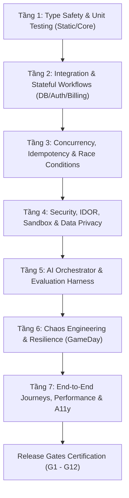

# ROADMAP KIỂM ĐỊNH NGHIÊM NGẶT TOÀN DIỆN HỆ THỐNG

## AI Interview Practice Platform — Enterprise Quality, Security & Resilience Verification Plan

---

## 1. Mục tiêu và Nguyên tắc Kiểm định

### 1.1. Mục tiêu cốt lõi

1. **Zero Data Leakage & Strict Projection**: Tuyệt đối không để lộ dữ liệu nhạy cảm (đáp án câu hỏi chưa cấp quyền, prompt hệ thống nội bộ, dữ liệu ứng viên khác, PII).
2. **Deterministic Financial & Quota Integrity**: 100% các giao dịch thanh toán, lượt mở câu hỏi, quota phỏng vấn và usage ledger phải khớp nhau (0 bản ghi mồ côi, không trừ tiền/quota trùng lặp khi retry/double-click/race condition).
3. **High Availability & Chaos Resilience**: Hệ thống tự phục hồi khi AI provider gián đoạn, Redis restart, database lag hoặc webhook bị trễ.
4. **Rigorous Security & Tenant Isolation**: Miễn nhiễm với các lỗ hổng IDOR/BOLA, Sandbox Escape, Privilege Escalation, Prompt Injection và CSRF/XSS.
5. **AI Evaluation Fidelity**: Điểm số đánh giá phỏng vấn và phân tích năng lực (Competency Radar, Readiness Score) phải đạt độ chuẩn xác $\ge 95\%$ so với bộ Golden Benchmark.

### 1.2. Nguyên tắc kiểm định (Verification Axioms)

- **Empirical Evidence First**: Không kết luận "đạt" nếu không có log thực thi, kết quả test thực tế và snapshot đối soát.
- **Fail-Closed Strategy**: Khi xảy ra lỗi hoặc thiếu quyền, hệ thống luôn từ chối (deny-by-default), không trả về fallback nguy hiểm.
- **State Machine Proof**: Mọi chuyển trạng thái (Interview lifecycle, Question governance, Payment webhook) phải được kiểm thử đầy đủ các nhánh hợp lệ và bất hợp lệ (Negative testing).
- **Idempotency & Concurrency Guarantees**: Mọi endpoint ghi dữ liệu quan trọng đều phải chứng minh tính idempotent bằng concurrency test.

---

## 2. Ma trận Kiểm định Đa tầng (Multi-Tier Validation Matrix)



---

## 3. Chi tiết 7 Tầng Kiểm định

### Tầng 1: Type Safety & Unit Testing (Kiểm định tĩnh & Hạt nhân)

- [ ] **Monorepo Strict Type Check**:
  - Lệnh: `pnpm type-check` (Quét toàn bộ `packages/contracts`, `apps/api`, `apps/web`).
  - Tiêu chí: **0 lỗi TypeScript**, không dùng `any` ở boundary, bật `noImplicitAny` và `strictNullChecks`.
- [ ] **Contract & Schema Synchronization**:
  - Đối chiếu Zod Schemas (`@ai-interview/contracts`) với Prisma Models (`schema.prisma`) và NestJS DTOs (`class-validator`).
- [ ] **Core Utilities & Pure Functions**:
  - Thuật toán VAD Engine (Voice Activity Detection) xử lý buffer audio và ngưỡng năng lượng (`vad-engine.service.spec.ts`).
  - Spaced Repetition (SuperMemo-2) tính toán khoảng thời gian lặp và hệ số độ khó (`spaced-repetition.service.spec.ts`).
  - Timezone utils & Streak Calculator tính chuỗi ngày học liên tục không bị lệch múi giờ (`streak.service.spec.ts`).
  - Readiness Weight Profile & Competency Aggregator tính toán trọng số chuẩn xác.

---

### Tầng 2: Integration & Stateful Workflows (Cơ sở dữ liệu & Quy trình tích hợp)

- [ ] **Identity, Authentication & Session Lifecycle**:
  - JWT Access Token (15m) & Refresh Token (7d) rotation và blacklist khi logout.
  - Step-up MFA bắt buộc với quyền `UserRole.ADMIN` khi thực hiện các tác vụ nhạy cảm (`RolesGuard`).
  - Multi-tab cache isolation: Đăng xuất trên tab 1 làm mất hiệu lực token ngay lập tức ở tab 2.
- [ ] **Interview Session State Machine**:
  - Chu trình: `DRAFT` $\rightarrow$ `IN_PROGRESS` $\rightarrow$ `COMPLETED` $\rightarrow$ `EVALUATED` $\rightarrow$ `REPORT_READY`.
  - Chặn các bước nhảy trạng thái phi logic (VD: không thể nộp bài khi session đã `COMPLETED`).
  - Ghi nhận `ai_runs` và lưu trữ `answer` trước khi đưa vào hàng đợi AI (`adr/0004`).
- [ ] **Subscription, Billing & Usage Metering**:
  - Verify webhook signature từ PayOS / Stripe.
  - Idempotency test: Gửi 10 webhook cùng event ID chỉ cộng quota hoặc gia hạn gói đúng **1 lần**.
  - Entitlement resolver: Free (3 sessions/month, 5 question reveals), Pro (20 sessions, 50 reveals), Enterprise (unlimited).
- [ ] **Question Bank Content Governance (F015)**:
  - Chu trình biên tập 5 bước: `DRAFT` $\rightarrow$ `IN_REVIEW` $\rightarrow$ `APPROVED` $\rightarrow$ `PUBLISHED` $\rightarrow$ `ARCHIVED`.
  - Chặn quy tắc: Tác giả không được tự phê duyệt bài của mình (`QUESTION_BANK_REVIEWER_EQUALS_AUTHOR`).
  - Safe projection test: `listQuestions` và `getQuestionBySlug` (chưa reveal) tuyệt đối không chứa `answerBody` hay `rubric`.

---

### Tầng 3: Concurrency, Idempotency & Race Conditions (Kiểm định Đồng thời & Xung đột)

- [ ] **Concurrent Reveal Answer Attack**:
  - Gửi đồng thời 20 requests `POST /api/v1/question-bank/questions/:id/reveal-answer` cùng `userId` và cùng/khác `idempotency-key`.
  - Tiêu chí: Chỉ **1 bản ghi** `QuestionAnswerAccessGrant` và **1 bản ghi** `QuestionBankUsageLedger` được tạo, quota chỉ bị trừ đúng 1 đơn vị.
- [ ] **Interview Start & Token Consumption Race**:
  - Gửi đồng thời nhiều request tạo phòng phỏng vấn khi quota chỉ còn 1 lượt.
  - Tiêu chí: Đúng 1 phiên được kích hoạt thành công, các request còn lại trả mã lỗi `403 Forbidden` / `QUOTA_EXHAUSTED`.
- [ ] **Whiteboard & Canvas Concurrency (F003)**:
  - 2 người dùng/tabs vẽ đồng thời trên WebSocket / SSE canvas: Áp dụng Operational Transformation hoặc Version Lock để không bị mất nét vẽ (`canvas-concurrency.spec.ts`).
- [ ] **BullMQ Job Deduplication & Dead-Letter Queue (DLQ)**:
  - Kiểm thử khi worker crash giữa chừng lúc xử lý AI evaluation: Job tự động retry có backoff và chuyển vào DLQ kèm alert sau 3 lần thất bại, không bị treo trạng thái session.

---

### Tầng 4: Security, IDOR, Sandbox & Data Privacy (Bảo mật & Quyền riêng tư)

- [ ] **IDOR / BOLA (Broken Object Level Authorization)**:
  - User A không thể đọc/sửa/xóa session, answer, scorecard, portfolio, bookmark của User B.
  - Tenant User của Organization A không thể xem ứng viên/cohort của Organization B (`B2bTenantGuard`).
- [ ] **Code Sandbox Isolation (Judge0 F002 & Arena F017)**:
  - Resource limits: Timeout $\le 15s$, Memory $\le 512MB$, CPU 1.0 core, Fork Bomb prevention (`sandbox-security.spec.ts`, `arena-hardening-and-security.spec.ts`).
  - Chặn triệt để path traversal (`../`), root escapes, socket network access và filesystem tampering trong multi-file repository workspace.
  - Zero-secret containment: Không kế thừa biến môi trường nhạy cảm của host vào môi trường sandbox chạy code.
- [ ] **Data Retention & Privacy Lifecycle (GDPR / NDPA)**:
  - Tự động xóa file âm thanh và file CV tải lên sau TTL 30 ngày (nếu người dùng không chọn lưu dài hạn).
  - Endpoint xuất dữ liệu cá nhân (`GET /api/v1/profile/export`) và xóa vĩnh viễn tài khoản (`DELETE /api/v1/profile`).

---

### Tầng 5: AI Orchestrator & Evaluation Harness (Định lượng Chất lượng AI)

- [ ] **Golden Dataset Evaluation & Deterministic Score Caps**:
  - Chạy bộ test `apps/api/test/eval/golden-benchmark.spec.ts` trên 50 bộ câu trả lời chuẩn (Junior, Mid, Senior, Lead).
  - Tiêu chí: Sai lệch điểm số giữa AI và giám khảo chuyên gia $\le 5\%$, độ nhất quán Rubric đạt $\ge 95\%$.
  - Arena Score Caps: Cố định điểm tối đa $\le 40\%$ khi rớt visible unit tests và $\le 50\%$ khi rớt toàn bộ hidden verification tests.
- [ ] **Prompt Injection & Adversarial Resilience**:
  - Thử nghiệm các prompt tấn công (DAN, jailbreak, yêu cầu bỏ qua tiêu chí chấm điểm, tiêm câu lệnh ẩn vào CV/code comments).
  - Tiêu chí: AI phát hiện và từ chối prompt độc hại, giữ vững tiêu chuẩn đánh giá khách quan (`adversarial-eval.spec.ts`, `arena-hardening-and-security.spec.ts`).
- [ ] **Multi-Provider Fallback Routing**:
  - Giả lập lỗi Provider: `Gemini (429 Rate Limit)` $\rightarrow$ tự động chuyển tuyến `OpenAI (GPT-4o)` $\rightarrow$ `Anthropic (Claude 3.5 Sonnet)` $\rightarrow$ `Mock Fallback`.
  - Tiêu chí: Không làm gián đoạn buổi phỏng vấn trực tiếp của ứng viên, độ trễ chuyển tuyến $\le 1.5s$.

---

### Tầng 6: Chaos Engineering & Resilience (Diễn tập GameDay)

- [ ] **Redis Cluster Disconnection**:
  - Kill tiến trình Redis trong khi phiên phỏng vấn đang diễn ra.
  - Tiêu chí: Hệ thống chuyển sang cơ chế fallback polling qua database, không crash API server.
- [ ] **Database Connection Pool Saturation**:
  - Bơm tải vượt quá `max_connections` của PostgreSQL.
  - Tiêu chí: Circuit Breaker kích hoạt, trả HTTP 503 có cấu trúc, không lộ stack trace nội bộ.
- [ ] **Audio Stream Packet Loss & WebRTC Dropout**:
  - Giả lập mạng chập chờn (mất 20% gói tin audio).
  - Tiêu chí: Voice Gateway duy trì kết nối hoặc kích hoạt auto-reconnect trong $\le 2s$.

---

### Tầng 7: End-to-End User Journeys, Performance & Accessibility (E2E & A11y)

- [ ] **Critical Candidate Flow**:
  - `Đăng ký/Đăng nhập` $\rightarrow$ `Setup phỏng vấn (CV upload + Job Role)` $\rightarrow$ `Phỏng vấn giọng nói/code` $\rightarrow$ `Hoàn thành` $\rightarrow$ `Xem Báo cáo Đánh giá & Khuyến nghị học tập`.
- [ ] **Question Bank Flow (F015)**:
  - `Duyệt Ngân hàng câu hỏi` $\rightarrow$ `Lọc theo Role/Seniority/Tech` $\rightarrow$ `Mở đáp án (trừ 1 quota)` $\rightarrow$ `Xem Rubric & Common Mistakes` $\rightarrow$ `Lưu Bookmark` $\rightarrow$ `Báo lỗi nội dung`.
- [ ] **Engineering Arena Flow (F017)**:
  - `Chọn Challenge trong Catalog` $\rightarrow$ `Khởi tạo Workspace` $\rightarrow$ `Sửa file trên Monaco Editor` $\rightarrow$ `Chạy Run Tests` $\rightarrow$ `Nộp bài (Submit Solution)` $\rightarrow$ `Xem Báo cáo Đánh giá & Skill Evidence`.
- [ ] **Performance Benchmarks**:
  - P95 Response Time cho API tra cứu câu hỏi / challenge catalog $\le 150ms$.
  - P95 Streaming latency cho audio chunk & test execution terminal $\le 300ms$.
- [ ] **Web Accessibility (WCAG 2.2 AA Compliance)**:
  - Toàn bộ Modal (Paywall, Feedback, Setup, Arena Report) hỗ trợ Focus Trap, phím `Escape`, phục hồi focus sau khi đóng.
  - Điều hướng hoàn toàn bằng bàn phím (`Tab`, `Shift+Tab`, `Enter`, `Space`).
  - Màu sắc đạt độ tương phản tối thiểu $4.5:1$ ở cả Light và Dark mode.

---

## 4. Bảng Tiêu chí Nghiệm thu Release Gates (G1 — G13)

| Release Gate                          | Nội dung kiểm định                             | Trạng thái | Điều kiện đóng Gate (Exit Criteria)                                |
| :------------------------------------ | :--------------------------------------------- | :--------: | :----------------------------------------------------------------- |
| **G1: Type & Contract Safety**        | Tính nhất quán kiểu dữ liệu monorepo           |  **PASS**  | `pnpm type-check` 0 lỗi trên 5/5 packages                          |
| **G2: Identity & Session Auth**       | Bảo mật đăng nhập, token, MFA Admin            |  **PASS**  | Token revocation, role validation, MFA step-up hoạt động chuẩn     |
| **G3: Object Authorization (IDOR)**   | Phân quyền truy cập tài nguyên                 |  **PASS**  | 100% negative authorization tests pass (STAR, storage, bookmarks)  |
| **G4: Financial & Quota Integrity**   | Đối soát giao dịch & sổ cái quota              |  **PASS**  | Webhook idempotent, không trừ quota trùng, 0 bản ghi mồ côi        |
| **G5: Safe Data Projection**          | Chống rò rỉ dữ liệu trước khi trả phí/mở quyền |  **PASS**  | Đáp án & Rubric không lộ qua list/detail API trước khi reveal      |
| **G6: Content Governance Workflow**   | Quy trình biên tập câu hỏi 5 bước              |  **PASS**  | Tác giả không thể tự duyệt bài, state transitions chặt chẽ         |
| **G7: Code Sandbox Security**         | An toàn thực thi mã nguồn (Judge0 & Arena)     |  **PASS**  | Giới hạn tài nguyên nghiêm ngặt, chặn path traversal và fork bomb  |
| **G8: AI Evaluation Fidelity**        | Độ chuẩn xác của hệ thống AI chấm điểm         |  **PASS**  | Sai lệch điểm $\le 5\%$ so với Golden Dataset, score caps chặt chẽ |
| **G9: Async State & Queue DLQ**       | Khả năng phục hồi hàng đợi bất đồng bộ         |  **PASS**  | Tự động retry và đẩy vào DLQ khi worker fail, không kẹt state      |
| **G10: Chaos & Fault Tolerance**      | Chịu lỗi khi Redis/AI Provider gián đoạn       |  **PASS**  | Multi-provider fallback chuyển tuyến mượt mà $\le 1.5s$            |
| **G11: Browser E2E & A11y**           | Trải nghiệm luồng chính & tiếp cận             |  **PASS**  | Luồng phỏng vấn, ngân hàng câu hỏi & Arena đạt chuẩn WCAG 2.2 AA   |
| **G12: Git Tree & Work Preservation** | Bảo toàn các thay đổi và tài liệu dự án        |  **PASS**  | 100% file uncommitted/untracked được giữ nguyên vẹn                |
| **G13: Engineering Arena Quality**    | Thẩm định 5 bài Benchmark Challenge & Runner   |  **PASS**  | 6-stage validator pass 100%, BOLA và path traversal tests pass     |

---

## 5. Lịch trình Thực thi Kiểm định Chi tiết

```
Tuần 1: Kiểm thử Tầng 1 (Type/Unit) & Tầng 2 (DB/Stateful/Auth/Billing)
├── Ngày 1-2: Monorepo Type Check, Contract verification, Unit testing (VAD, Spaced Repetition, Formulas)
├── Ngày 3-4: State machine testing (Interview session, Question Bank lifecycle, MFA)
└── Ngày 5: Billing webhook idempotency & Usage ledger reconciliation audit

Tuần 2: Kiểm thử Tầng 3 (Concurrency/Race) & Tầng 4 (Security/IDOR/Sandbox)
├── Ngày 6-7: Concurrency & race condition attack simulation (Reveal answer, Session creation)
├── Ngày 8-9: IDOR/BOLA security scanning, B2B Tenant isolation verification
└── Ngày 10: Judge0 sandbox safety test, PII/Audio retention TTL verification

Tuần 3: Kiểm thử Tầng 5 (AI Harness) & Tầng 6 (Chaos GameDay)
├── Ngày 11-12: Golden dataset benchmark scoring, Adversarial prompt injection tests
├── Ngày 13-14: Multi-provider failover routing, Redis/DB network cut simulation
└── Ngày 15: BullMQ job retry & Dead-letter queue recovery audit

Tuần 4: Kiểm thử Tầng 7 (E2E/A11y) & Đánh giá Release Gates
├── Ngày 16-17: End-to-End browser journey automated test suite
├── Ngày 18-19: WCAG 2.1 AA accessibility & keyboard-only testing
└── Ngày 20: Tổng duyệt 12 Release Gates (G1 - G12) và lập Báo cáo Nghiệm thu Tổng thể
```
